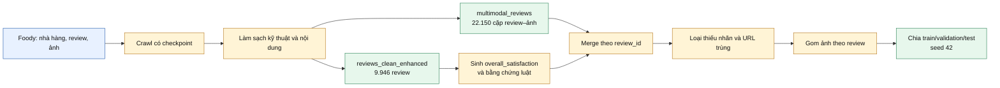
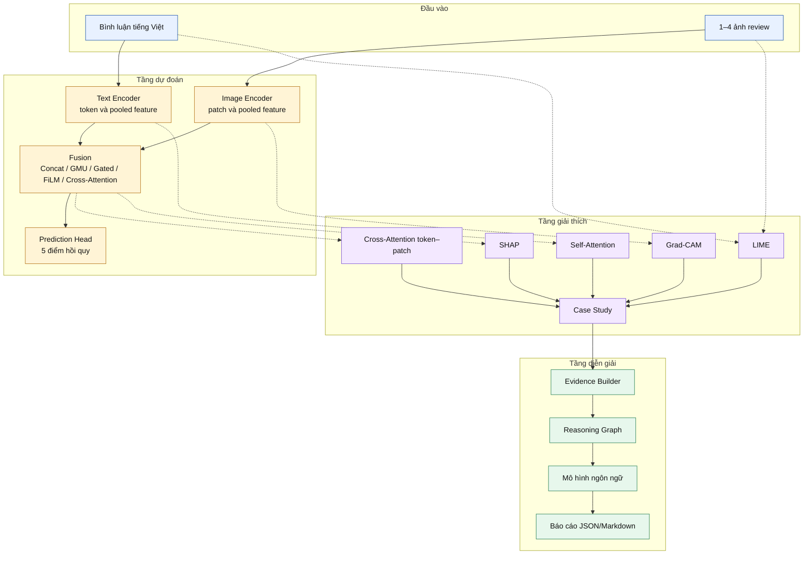
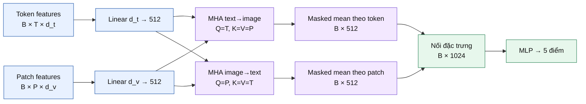
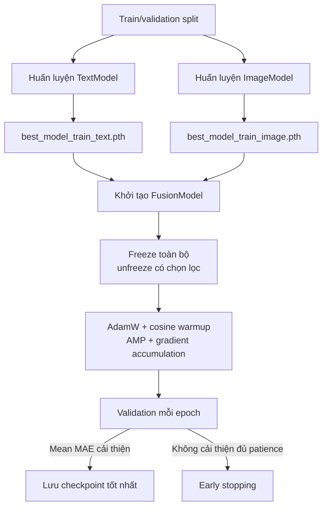
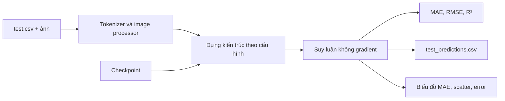
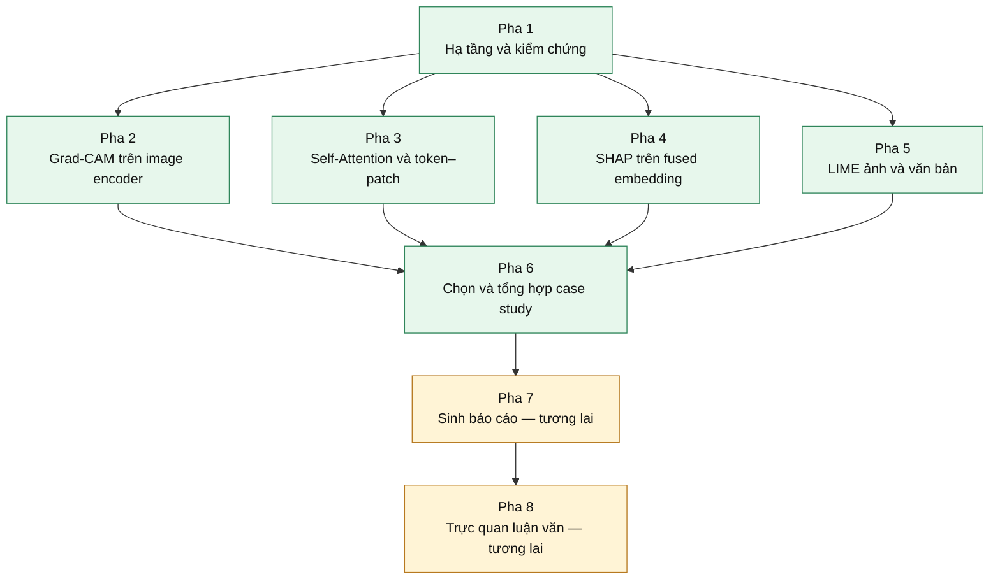
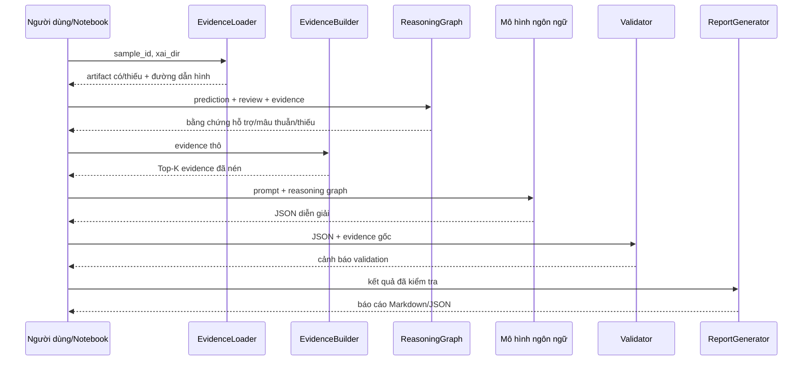
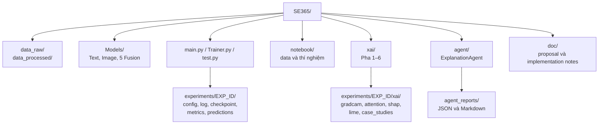

**ĐẠI HỌC QUỐC GIA THÀNH PHỐ HỒ CHÍ MINH**  
**TRƯỜNG ĐẠI HỌC CÔNG NGHỆ THÔNG TIN**  
**KHOA CÔNG NGHỆ PHẦN MỀM**

 

**MÔN HỌC: SE365 — SÂU ỨNG DỤNG TRONG PHÁT TRIỂN PHẦN MỀM**

 

# BÁO CÁO TIẾN ĐỘ ĐỒ ÁN

## HỆ THỐNG HỌC SÂU ĐA PHƯƠNG THỨC CÓ KHẢ NĂNG GIẢI THÍCH CHO ĐÁNH GIÁ CHẤT LƯỢNG TRẢI NGHIỆM ĂN UỐNG TỪ ẢNH VÀ VĂN BẢN

 

| Thông tin | Nội dung |
|---|---|
| Nhóm thực hiện | **Nhóm 24** |
| Giảng viên hướng dẫn | TS. Đỗ Trọng Hợp; ThS. Nguyễn Ngọc Quí |
| Sinh viên 1 | **TODO: Họ tên — MSSV** |
| Sinh viên 2 | **TODO: Họ tên — MSSV** |
| Sinh viên 3 | **TODO: Họ tên — MSSV (nếu có)** |
| Phiên bản báo cáo | Báo cáo tiến độ |

 

**Thành phố Hồ Chí Minh, tháng 06 năm 2026**

---

# TÓM TẮT TIẾN ĐỘ

Bảng 0.1 khái quát trạng thái dự án tại thời điểm lập báo cáo. “Hoàn thành” trong bảng được hiểu là đã có mã nguồn hoặc dữ liệu tương ứng trong repository; trạng thái thực nghiệm được tách riêng vì một số notebook chưa lưu output và các checkpoint không được cam kết vào repository.

**Bảng 0.1. Tóm tắt tiến độ theo nhóm công việc.**

| Nhóm công việc | Kết quả đã hoàn thành | Công việc tiếp theo | Trạng thái |
|---|---|---|---|
| Dữ liệu | Thu thập 300 nhà hàng, làm sạch 9.946 review hợp lệ, liên kết 22.150 ảnh với 6.082 review có ảnh; xây dựng nhãn `overall_satisfaction` có bằng chứng luật | Đóng băng phiên bản dữ liệu cuối, tạo split chuẩn và kiểm tra rò rỉ theo nhà hàng/người dùng | Hoàn thành nền tảng |
| Mô hình | Triển khai nhánh văn bản, nhánh ảnh, năm cơ chế fusion, năm mục tiêu hồi quy và năm lựa chọn hàm mất mát | Tái huấn luyện cấu hình token–patch Cross-Attention và đánh giá nhiều seed | Hoàn thành mã nguồn; cần tái lập |
| Thực nghiệm | Có 12 tệp metrics validation cho các ablation backbone, fusion và loss | Bổ sung baseline đơn phương thức, test khóa, khoảng tin cậy và kiểm định thống kê | Hoàn thành một phần |
| XAI | Đã triển khai Pha 1–6: hạ tầng, Grad-CAM, self-/cross-attention, SHAP, LIME và case study | Chạy lại trên checkpoint hiện hành; thực hiện Pha 7 và Pha 8 | Hoàn thành mã nguồn Pha 1–6 |
| AI Agent | Đã triển khai pipeline nạp bằng chứng, reasoning graph, gọi mô hình ngôn ngữ, kiểm định schema và sinh báo cáo | Chạy demo có kiểm soát, đánh giá con người, caching và chế độ ngoại tuyến | Hoàn thành mã nguồn |
| Báo cáo | Đã tổng hợp kiến trúc, dữ liệu, tiến độ và giới hạn dựa trên code hiện hành | Bổ sung kết quả test/XAI sau khi tái lập | Đang hoàn thiện |

# TÓM TẮT

Đề tài nghiên cứu bài toán dự đoán đồng thời chất lượng món ăn, mức độ phù hợp về giá, không gian, dịch vụ và mức hài lòng tổng thể từ bình luận tiếng Việt cùng tối đa bốn ảnh của một review nhà hàng. Dự án xây dựng pipeline dữ liệu Foody gồm thu thập, làm sạch, liên kết ảnh–văn bản và sinh nhãn `overall_satisfaction` bằng hệ luật có lưu bằng chứng. Mô hình sử dụng hai encoder tiền huấn luyện cho văn bản và hình ảnh, sau đó khảo sát các cơ chế nối đặc trưng, GMU, gated cross-modal, FiLM và Cross-Attention hai chiều ở mức token–patch.

Repository hiện chứa 9.946 review hợp lệ, 22.150 ảnh và 6.082 review có ít nhất một ảnh. Mã nguồn huấn luyện hỗ trợ hồi quy năm đầu ra, AdamW, cosine warmup, AMP, tích lũy gradient, early stopping và các lựa chọn MSE, Huber, SmoothL1, Log-Cosh, cùng homoscedastic uncertainty weighting. Mười hai tệp metrics validation đã được lưu cho các thí nghiệm ablation. Giá trị thấp nhất quan sát được là mean MAE 1,1079, nhưng chênh lệch giữa các cấu hình fusion/loss tốt nhất rất nhỏ và chưa có đánh giá nhiều seed hoặc kiểm định thống kê.

Về khả năng giải thích, Pha 1–6 đã được triển khai ở mức mã nguồn, bao gồm Grad-CAM, attention của PhoBERT, Cross-Attention token–patch, SHAP ở fused embedding, LIME cho ảnh/văn bản và lựa chọn case study. AI Agent cũng đã được xây dựng để tổng hợp bằng chứng XAI thành báo cáo tiếng Việt có cấu trúc và kiểm định đầu ra. Tuy nhiên, notebook XAI và AI Agent trong repository chưa lưu output thực thi; do đó báo cáo không đưa ra quan sát định tính giả định. Công việc tiếp theo là tái huấn luyện sau thay đổi kiến trúc Cross-Attention, chạy test khóa, sinh artifact XAI, hoàn thành Pha 7–8 và tổ chức đánh giá con người.

**Từ khóa:** học sâu đa phương thức, hồi quy đa mục tiêu, đánh giá nhà hàng tiếng Việt, Cross-Attention, Explainable AI, AI Agent.

---

# MỤC LỤC

- [Tóm tắt tiến độ](#tóm-tắt-tiến-độ)
- [Tóm tắt](#tóm-tắt)
- [Danh mục bảng](#danh-mục-bảng)
- [Danh mục hình](#danh-mục-hình)
- [Chương 1. Tổng quan đề tài](#chương-1-tổng-quan-đề-tài)
  - [1.1. Bối cảnh và động lực nghiên cứu](#11-bối-cảnh-và-động-lực-nghiên-cứu)
  - [1.2. Thách thức nghiên cứu](#12-thách-thức-nghiên-cứu)
  - [1.3. Khoảng trống nghiên cứu](#13-khoảng-trống-nghiên-cứu)
  - [1.4. Mục tiêu và câu hỏi nghiên cứu](#14-mục-tiêu-và-câu-hỏi-nghiên-cứu)
  - [1.5. Đóng góp và phạm vi](#15-đóng-góp-và-phạm-vi)
  - [1.6. Cấu trúc báo cáo](#16-cấu-trúc-báo-cáo)
- [Chương 2. Công trình nghiên cứu liên quan](#chương-2-công-trình-nghiên-cứu-liên-quan)
  - [2.1. Học đa phương thức](#21-học-đa-phương-thức)
  - [2.2. Mô hình thị giác–ngôn ngữ](#22-mô-hình-thị-giácngôn-ngữ)
  - [2.3. Explainable AI](#23-explainable-ai)
  - [2.4. AI Agent cho diễn giải](#24-ai-agent-cho-diễn-giải)
  - [2.5. Phân tích review tiếng Việt](#25-phân-tích-review-tiếng-việt)
  - [2.6. Tổng hợp khoảng trống](#26-tổng-hợp-khoảng-trống)
- [Chương 3. Định nghĩa bài toán và bộ dữ liệu](#chương-3-định-nghĩa-bài-toán-và-bộ-dữ-liệu)
  - [3.1. Định nghĩa hình thức](#31-định-nghĩa-hình-thức)
  - [3.2. Lược đồ dữ liệu](#32-lược-đồ-dữ-liệu)
  - [3.3. Xây dựng và làm sạch dữ liệu](#33-xây-dựng-và-làm-sạch-dữ-liệu)
  - [3.4. Sinh nhãn hài lòng tổng thể](#34-sinh-nhãn-hài-lòng-tổng-thể)
  - [3.5. Thống kê dữ liệu](#35-thống-kê-dữ-liệu)
  - [3.6. Chia tập dữ liệu](#36-chia-tập-dữ-liệu)
- [Chương 4. Phương pháp đề xuất](#chương-4-phương-pháp-đề-xuất)
  - [4.1. Kiến trúc tổng thể](#41-kiến-trúc-tổng-thể)
  - [4.2. Nhánh văn bản](#42-nhánh-văn-bản)
  - [4.3. Nhánh hình ảnh](#43-nhánh-hình-ảnh)
  - [4.4. Các cơ chế fusion](#44-các-cơ-chế-fusion)
  - [4.5. Cross-Attention token–patch](#45-cross-attention-tokenpatch)
  - [4.6. Đầu dự đoán và hàm mất mát](#46-đầu-dự-đoán-và-hàm-mất-mát)
  - [4.7. Huấn luyện và suy luận](#47-huấn-luyện-và-suy-luận)
  - [4.8. Pipeline XAI](#48-pipeline-xai)
  - [4.9. Pipeline AI Agent](#49-pipeline-ai-agent)
  - [4.10. Tổ chức mã nguồn và artifact](#410-tổ-chức-mã-nguồn-và-artifact)
- [Chương 5. Thực nghiệm](#chương-5-thực-nghiệm)
  - [5.1. Thiết lập dữ liệu và môi trường](#51-thiết-lập-dữ-liệu-và-môi-trường)
  - [5.2. Siêu tham số](#52-siêu-tham-số)
  - [5.3. Baseline và thiết kế ablation](#53-baseline-và-thiết-kế-ablation)
  - [5.4. Độ đo đánh giá](#54-độ-đo-đánh-giá)
  - [5.5. Chiến lược tái lập](#55-chiến-lược-tái-lập)
- [Chương 6. Kết quả và bàn luận](#chương-6-kết-quả-và-bàn-luận)
  - [6.1. Phạm vi kết quả có thể xác nhận](#61-phạm-vi-kết-quả-có-thể-xác-nhận)
  - [6.2. Kết quả validation đã lưu](#62-kết-quả-validation-đã-lưu)
  - [6.3. Bàn luận sơ bộ](#63-bàn-luận-sơ-bộ)
  - [6.4. Phân tích lỗi và case study](#64-phân-tích-lỗi-và-case-study)
  - [6.5. Quan sát XAI và AI Agent](#65-quan-sát-xai-và-ai-agent)
  - [6.6. Hạn chế](#66-hạn-chế)
- [Chương 7. Kết luận và hướng phát triển](#chương-7-kết-luận-và-hướng-phát-triển)
  - [7.1. Kết luận](#71-kết-luận)
  - [7.2. Kế hoạch phát triển](#72-kế-hoạch-phát-triển)
  - [7.3. Tiêu chí hoàn thành](#73-tiêu-chí-hoàn-thành)
- [Tài liệu tham khảo](#tài-liệu-tham-khảo)

# DANH MỤC BẢNG

- [Bảng 0.1. Tóm tắt tiến độ theo nhóm công việc](#tóm-tắt-tiến-độ)
- [Bảng 1.1. Mục tiêu và tiêu chí kiểm chứng](#14-mục-tiêu-và-câu-hỏi-nghiên-cứu)
- [Bảng 1.2. Phân định đóng góp hiện tại và tương lai](#15-đóng-góp-và-phạm-vi)
- [Bảng 2.1. Vai trò và giới hạn của các nhóm phương pháp](#26-tổng-hợp-khoảng-trống)
- [Bảng 3.1. Lược đồ một mẫu huấn luyện](#32-lược-đồ-dữ-liệu)
- [Bảng 3.2. Thống kê bộ dữ liệu hiện có](#35-thống-kê-dữ-liệu)
- [Bảng 3.3. Thống kê năm nhãn](#35-thống-kê-dữ-liệu)
- [Bảng 3.4. Trạng thái chia tập](#36-chia-tập-dữ-liệu)
- [Bảng 4.1. So sánh các cơ chế fusion đã triển khai](#44-các-cơ-chế-fusion)
- [Bảng 4.2. Các hàm mất mát đã triển khai](#46-đầu-dự-đoán-và-hàm-mất-mát)
- [Bảng 4.3. Trạng thái các pha XAI](#48-pipeline-xai)
- [Bảng 4.4. Các module AI Agent](#49-pipeline-ai-agent)
- [Bảng 5.1. Môi trường thực nghiệm có bằng chứng](#51-thiết-lập-dữ-liệu-và-môi-trường)
- [Bảng 5.2. Siêu tham số chính](#52-siêu-tham-số)
- [Bảng 5.3. Ma trận thí nghiệm](#53-baseline-và-thiết-kế-ablation)
- [Bảng 6.1. Metrics validation đã lưu](#62-kết-quả-validation-đã-lưu)
- [Bảng 6.2. Phạm vi diễn giải kết quả](#63-bàn-luận-sơ-bộ)
- [Bảng 7.1. Lộ trình công việc tiếp theo](#72-kế-hoạch-phát-triển)

# DANH MỤC HÌNH

- [Hình 3.1. Quy trình xây dựng bộ dữ liệu](#33-xây-dựng-và-làm-sạch-dữ-liệu)
- [Hình 4.1. Kiến trúc tổng thể của hệ thống](#41-kiến-trúc-tổng-thể)
- [Hình 4.2. Luồng Cross-Attention hai chiều token–patch](#45-cross-attention-tokenpatch)
- [Hình 4.3. Pipeline huấn luyện tuần tự](#47-huấn-luyện-và-suy-luận)
- [Hình 4.4. Pipeline suy luận](#47-huấn-luyện-và-suy-luận)
- [Hình 4.5. Pipeline XAI nhiều mức](#48-pipeline-xai)
- [Hình 4.6. Pipeline AI Agent dựa trên bằng chứng](#49-pipeline-ai-agent)
- [Hình 4.7. Tổ chức mã nguồn và artifact](#410-tổ-chức-mã-nguồn-và-artifact)

---

# CHƯƠNG 1. TỔNG QUAN ĐỀ TÀI

## 1.1. Bối cảnh và động lực nghiên cứu

Review nhà hàng là dữ liệu đa phương thức tự nhiên: người dùng diễn đạt đánh giá bằng văn bản, đồng thời cung cấp ảnh món ăn, không gian hoặc hóa đơn. Văn bản thể hiện cảm nhận và quan hệ nhân quả ở mức ngôn ngữ; hình ảnh bổ sung bằng chứng trực quan nhưng không nhất thiết phản ánh mọi khía cạnh. Việc chỉ dùng một phương thức vì vậy có thể bỏ qua tín hiệu bổ trợ hoặc mâu thuẫn giữa hai nguồn.

Đề tài hướng đến một hệ thống không chỉ dự đoán điểm mà còn cho phép truy vết căn cứ của dự đoán. Động lực này dẫn đến ba yêu cầu đồng thời: biểu diễn tốt tiếng Việt phi chuẩn; học tương tác ảnh–văn bản thay vì chỉ nối hai vector; và cung cấp giải thích ở nhiều mức, từ vùng ảnh, token, liên kết token–patch đến đóng góp phương thức và diễn giải ngôn ngữ tự nhiên.

## 1.2. Thách thức nghiên cứu

Thứ nhất, review tiếng Việt trên mạng xã hội thường chứa từ viết tắt, không dấu, emoji và cấu trúc không chuẩn. Thứ hai, một review có thể kèm nhiều ảnh với mức liên quan khác nhau; ảnh món ăn có thể hữu ích cho `food_score` nhưng ít thông tin trực tiếp về `service_score` hoặc `price_score`. Thứ ba, năm mục tiêu hồi quy có phân phối và độ khó khác nhau. Thứ tư, các phương pháp XAI hậu nghiệm chỉ cung cấp bằng chứng xấp xỉ; attention không tự động đồng nghĩa với quan hệ nhân quả. Cuối cùng, việc tái lập bị chi phối bởi checkpoint lớn, ảnh tải ngoài repository và phiên bản thư viện chưa được khóa.

## 1.3. Khoảng trống nghiên cứu

Trong phạm vi tài liệu đã xác minh trong repository, các nghiên cứu liên quan cung cấp nền tảng riêng lẻ cho encoder tiếng Việt, backbone thị giác, fusion và XAI. Khoảng trống mà đề tài xử lý ở mức hệ thống là sự thiếu một pipeline thống nhất cho review nhà hàng tiếng Việt, trong đó năm điểm chất lượng được dự đoán từ nhiều ảnh và văn bản, Cross-Attention được thực hiện đúng ở mức token–patch, và nhiều phương pháp XAI được tổng hợp bởi một lớp reasoning trước khi sinh diễn giải tự nhiên.

Đề tài không khẳng định đây là hệ thống đầu tiên hoặc đạt trạng thái tốt nhất hiện nay, vì repository chưa có khảo sát hệ thống đủ rộng để chứng minh hai nhận định đó. Đóng góp được giới hạn ở thiết kế, dữ liệu, mã nguồn và thực nghiệm nội bộ hiện có.

## 1.4. Mục tiêu và câu hỏi nghiên cứu

Các mục tiêu trong Bảng 1.1 liên kết trực tiếp với artifact có thể kiểm tra, qua đó tránh đánh giá dựa trên mô tả định tính chung.

**Bảng 1.1. Mục tiêu và tiêu chí kiểm chứng.**

| Mã | Mục tiêu | Tiêu chí kiểm chứng |
|---|---|---|
| M1 | Xây dựng dữ liệu review nhà hàng đa phương thức tiếng Việt | CSV/JSON sạch, liên kết review–ảnh và thống kê có thể tái tính |
| M2 | Dự đoán đồng thời năm điểm trên thang 0–10 | MAE, RMSE và \(R^2\) theo từng mục tiêu |
| M3 | Khảo sát backbone, fusion và loss | Ablation chỉ thay đổi thành phần cần khảo sát |
| M4 | Giải thích dự đoán ở nhiều mức | Artifact Grad-CAM, attention, Cross-Attention, SHAP, LIME và case study |
| M5 | Sinh diễn giải tự nhiên có căn cứ | JSON đúng schema, dẫn bằng chứng XAI, nêu thiếu hụt và độ tin cậy |
| M6 | Bảo đảm khả năng tái lập | Seed, cấu hình, checkpoint, predictions và log theo từng thí nghiệm |

Từ đó, báo cáo đặt ra bốn câu hỏi nghiên cứu:

- **RQ1:** Việc kết hợp ảnh và văn bản cải thiện sai số so với baseline đơn phương thức ở mức nào?
- **RQ2:** Backbone, cơ chế fusion và hàm mất mát nào phù hợp nhất với năm mục tiêu?
- **RQ3:** Các phương pháp XAI có cung cấp bằng chứng bổ sung và nhất quán cho từng dự đoán hay không?
- **RQ4:** AI Agent có thể chuyển bằng chứng XAI thành diễn giải dễ hiểu mà không đưa ra khẳng định vượt quá dữ liệu hay không?

## 1.5. Đóng góp và phạm vi

Bảng 1.2 phân biệt rõ phần đã có trong repository với phần chưa được chứng minh bằng thực nghiệm hoàn chỉnh.

**Bảng 1.2. Phân định đóng góp hiện tại và tương lai.**

| Nhóm | Đóng góp hiện tại | Chưa thuộc đóng góp đã xác nhận |
|---|---|---|
| Dữ liệu | Pipeline thu thập/làm sạch; 9.946 review; 22.150 ảnh; nhãn tổng thể có bằng chứng luật | Dataset benchmark công khai, kiểm định chất lượng gán nhãn bởi chuyên gia |
| Mô hình | Năm đầu ra; nhiều backbone; năm cơ chế fusion; Cross-Attention token–patch | Ưu thế có ý nghĩa thống kê trên nhiều seed |
| XAI | Mã nguồn Pha 1–6 và quy ước artifact thống nhất | Kết luận định tính từ artifact sau migration |
| AI Agent | Evidence loader, reasoning graph, prompt, schema validator và report generator | Đánh giá con người, đo hallucination và triển khai sản xuất |
| Thực nghiệm | 12 bộ metrics validation được lưu | Test khóa cuối cùng, cross-validation và kiểm định thống kê |

Phạm vi dữ liệu là review nhà hàng/quán ăn từ Foody. Bài toán là hồi quy, không phải phân loại cảm xúc. Hệ thống hiện chưa xử lý video, âm thanh, dữ liệu thời gian thực hoặc khuyến nghị cá nhân hóa. Việc sử dụng OpenAI API nằm ở lớp diễn giải sau dự đoán và không tham gia huấn luyện mô hình hồi quy.

## 1.6. Cấu trúc báo cáo

Chương 2 tổng hợp các hướng nghiên cứu liên quan. Chương 3 định nghĩa bài toán và dữ liệu. Chương 4 trình bày kiến trúc mô hình, XAI và AI Agent. Chương 5 mô tả thiết kế thực nghiệm. Chương 6 báo cáo các kết quả có thể xác nhận và các giới hạn diễn giải. Chương 7 kết luận và xác lập lộ trình hoàn thiện.

---

# CHƯƠNG 2. CÔNG TRÌNH NGHIÊN CỨU LIÊN QUAN

## 2.1. Học đa phương thức

Học đa phương thức tìm cách kết hợp các nguồn có cấu trúc biểu diễn khác nhau. Với review nhà hàng, early fusion trên dữ liệu thô khó thực hiện vì token văn bản và pixel ảnh không cùng không gian; late fusion trên đầu ra lại hạn chế tương tác. Dự án lựa chọn intermediate fusion: mỗi encoder tạo đặc trưng riêng, sau đó một module có thể học quan hệ giữa hai nhánh.

Khảo sát về Multimodal Aspect-Based Sentiment Analysis của Ye và cộng sự [3] cho thấy nhu cầu phân tích theo khía cạnh thay vì chỉ dự đoán một nhãn cảm xúc tổng quát. Dù đề tài sử dụng hồi quy điểm thay cho phân loại cảm xúc, quan điểm tách khía cạnh phù hợp với năm mục tiêu `food`, `price`, `atmos`, `service` và `overall`.

## 2.2. Mô hình thị giác–ngôn ngữ

Swin Transformer xây dựng biểu diễn phân cấp bằng cửa sổ dịch chuyển [1], phù hợp với việc giữ cấu trúc patch cho Cross-Attention và Grad-CAM. Ở phía văn bản, PhoBERT được tiền huấn luyện chuyên biệt cho tiếng Việt [2], vì vậy là ứng viên phù hợp cho review nội địa. Repository còn khảo sát XLM-RoBERTa, ViSoBERT, EfficientNet-B3 và SigLIP; tuy nhiên báo cáo không suy rộng chất lượng các mô hình này ngoài metrics nội bộ.

Cross-Attention cho phép token văn bản truy vấn patch ảnh và ngược lại. Điểm quan trọng về phương pháp là attention phải hoạt động trên chuỗi có nhiều phần tử. Phiên bản cũ của dự án dùng một vector cho mỗi phương thức, khiến softmax trên một khóa luôn bằng 1. Phiên bản hiện hành đã sửa thành ma trận \(T \times P\), trong đó \(T\) là số token và \(P\) là số patch.

## 2.3. Explainable AI

XAI đa phương thức cần trả lời nhiều câu hỏi khác nhau; không có một phương pháp đơn lẻ bao phủ đầy đủ [4]. Grad-CAM định vị vùng ảnh liên quan thông qua gradient [6]. SHAP phân bổ đóng góp đặc trưng dựa trên khuôn khổ Shapley [7]. LIME xấp xỉ hành vi cục bộ bằng mô hình đơn giản trên các mẫu nhiễu [8]. Attention cung cấp quan sát về quan hệ token hoặc token–patch, nhưng cần được diễn giải thận trọng vì attention không mặc nhiên là lời giải thích nhân quả [9].

Do đó, dự án dùng chiến lược bổ sung chéo: Grad-CAM trả lời “mô hình nhìn vùng nào”; self-attention trả lời “token nào liên hệ mạnh”; Cross-Attention trả lời “token liên kết với patch nào”; SHAP ước lượng đóng góp text-origin và image-origin; LIME kiểm tra độ nhạy cục bộ khi che vùng hoặc loại từ.

## 2.4. AI Agent cho diễn giải

Một mô hình ngôn ngữ có thể chuyển số liệu XAI thành văn bản dễ đọc, nhưng cũng có nguy cơ tạo quan hệ nhân quả không tồn tại. Thiết kế của dự án không chuyển toàn bộ artifact thô trực tiếp cho mô hình ngôn ngữ. Thay vào đó, evidence loader lọc dữ liệu, evidence builder nén Top-K, reasoning graph xếp hạng và phát hiện mâu thuẫn, sau đó prompt mới yêu cầu diễn đạt. Validator kiểm tra đủ năm mục tiêu, schema, mức điểm, độ đầy đủ bằng chứng và cảnh báo SHAP.

**TODO học thuật:** Repository chưa có danh mục tài liệu tham khảo đã kiểm chứng riêng cho “AI Agent for Explainability”. Bản báo cáo cuối cần bổ sung công trình nền tảng và nghiên cứu đánh giá faithfulness của diễn giải do mô hình ngôn ngữ sinh ra.

## 2.5. Phân tích review tiếng Việt

PhoBERT cung cấp nền tảng biểu diễn tiếng Việt [2], nhưng review nhà hàng còn có đặc trưng mạng xã hội như viết tắt, không dấu, emoji và code-mixing. ViSoBERT được đưa vào ablation nhằm kiểm tra giả thuyết rằng encoder hướng mạng xã hội phù hợp hơn. Dữ liệu của đề tài đồng thời giữ `comment_clean`, metadata làm sạch và bằng chứng luật, tạo điều kiện truy vết từ câu gốc đến nhãn tổng thể.

Nhãn `overall_satisfaction` không được gán thủ công độc lập mà được suy ra từ trung bình bốn điểm khía cạnh và điều chỉnh dựa trên tín hiệu ngôn ngữ. Đây là lựa chọn kỹ thuật có tính giải thích, nhưng cũng tạo phụ thuộc giữa nhãn tổng thể và bốn nhãn thành phần. Hạn chế này phải được xem xét khi diễn giải hiệu năng.

## 2.6. Tổng hợp khoảng trống

Bảng 2.1 chỉ ra rằng mỗi nhóm phương pháp giải quyết một phần của bài toán, còn khoảng trống nằm ở việc tích hợp chúng thành quy trình có thể kiểm toán.

**Bảng 2.1. Vai trò và giới hạn của các nhóm phương pháp.**

| Nhóm phương pháp | Vai trò trong đề tài | Giới hạn cần kiểm soát |
|---|---|---|
| Encoder tiền huấn luyện | Trích đặc trưng ảnh và tiếng Việt | Domain shift và chi phí fine-tuning |
| Intermediate fusion | Học thông tin bổ trợ giữa hai nhánh | Có thể thiên lệch sang một phương thức |
| Cross-Attention | Mô hình hóa liên kết token–patch | Không phải bằng chứng nhân quả; chi phí \(O(TP)\) |
| Grad-CAM/attention | Giải thích không gian và token | Độ phân giải thô; attention có thể không faithful |
| SHAP/LIME | Đóng góp và độ nhạy cục bộ | Phụ thuộc background/perturbation; tốn tính toán |
| AI Agent | Tổng hợp bằng chứng thành ngôn ngữ tự nhiên | Nguy cơ hallucination; cần human evaluation |

Khoảng trống thực nghiệm còn lại của chính dự án là thiếu test khóa sau migration, thiếu nhiều seed, thiếu artifact XAI đã chạy và thiếu đánh giá con người cho AI Agent. Đây là các mục tiêu của giai đoạn tiếp theo, không được trình bày như đóng góp đã hoàn thành.

---

# CHƯƠNG 3. ĐỊNH NGHĨA BÀI TOÁN VÀ BỘ DỮ LIỆU

## 3.1. Định nghĩa hình thức

Mỗi mẫu là:

\[
x_i = \left(t_i, I_i\right), \qquad
I_i = \{v_{i1},\ldots,v_{in_i}\}, \quad 1 \le n_i \le 4,
\]

trong đó \(t_i\) là bình luận đã làm sạch và \(I_i\) là tập tối đa bốn ảnh được dataset loader sử dụng. Nhãn là vector năm chiều:

\[
\mathbf{y}_i =
\left[
y_i^{food},
y_i^{price},
y_i^{atmos},
y_i^{service},
y_i^{overall}
\right]^\top \in [0,10]^5.
\]

Mô hình \(f_\theta\) học ánh xạ:

\[
\hat{\mathbf{y}}_i=f_\theta(t_i,I_i), \qquad
f_\theta:\mathcal{T}\times\mathcal{V}^{\le 4}\rightarrow\mathbb{R}^5.
\]

Đây là hồi quy đa mục tiêu. Code hiện không ép đầu ra qua sigmoid hoặc clamp; vì vậy \(\hat{\mathbf{y}}\) có thể nằm ngoài \([0,10]\) dù nhãn thuộc khoảng này.

## 3.2. Lược đồ dữ liệu

Bảng 3.1 mô tả các trường thực sự được `MultimodalDataset` đọc khi huấn luyện.

**Bảng 3.1. Lược đồ một mẫu huấn luyện.**

| Trường | Kiểu/biểu diễn | Vai trò |
|---|---|---|
| `review_id` | Số nguyên | Định danh và gom nhiều ảnh theo review |
| `comment_clean` | Chuỗi | Đầu vào văn bản |
| `image_url` | Danh sách chuỗi được serialize trong CSV | Đầu vào ảnh |
| `food_score` | Số thực 0–10 | Nhãn chất lượng món ăn |
| `price_score` | Số thực 0–10 | Nhãn giá |
| `atmosphere_score` | Số thực 0–10 | Nhãn không gian |
| `service_score` | Số thực 0–10 | Nhãn dịch vụ |
| `overall_satisfaction` | Số thực 0–10 | Nhãn hài lòng tổng thể |

Ảnh cục bộ được đặt tên bằng MD5 của URL với đuôi `.jpg`. Nếu không có file cục bộ, loader thử tải URL trong 5 giây; khi lỗi, ảnh đen \(224\times224\) được dùng làm fallback. Mỗi mẫu được pad đến bốn ảnh, kèm `num_images` để loại ảnh đệm khỏi phép trung bình.

## 3.3. Xây dựng và làm sạch dữ liệu

Quy trình trong Hình 3.1 được đối chiếu từ notebook crawl/clean, notebook sinh nhãn và `preprocess_data.py`.

**Hình 3.1. Quy trình xây dựng bộ dữ liệu.**

Như Hình 3.1 thể hiện, dữ liệu ảnh–văn bản và dữ liệu nhãn được hình thành qua hai nhánh rồi hợp nhất bằng `review_id`. Trước khi gom nhóm, pipeline loại dòng thiếu các trường bắt buộc và URL ảnh trùng. Việc gom nhóm ngăn một review nhiều ảnh bị xem như nhiều mẫu văn bản độc lập.

## 3.4. Sinh nhãn hài lòng tổng thể

Điểm cơ sở là trung bình bốn khía cạnh:

\[
\bar{y}_i=\frac{
y_i^{food}+y_i^{price}+y_i^{atmos}+y_i^{service}
}{4}.
\]

Hệ luật tiếng Việt tạo điều chỉnh \(\Delta_i\) từ 14 nhóm tín hiệu tích cực/tiêu cực và lưu các luật kích hoạt cùng đoạn bằng chứng. Nhãn cuối:

\[
y_i^{overall}=\operatorname{clip}\left(\bar{y}_i+\Delta_i,0,10\right).
\]

Trong 9.946 review, 3.263 review có điều chỉnh khác 0; gồm 2.058 điều chỉnh dương và 1.205 điều chỉnh âm. Cách tạo nhãn này tăng khả năng truy vết nhưng không thay thế đánh giá liên chủ thể của người gán nhãn. Nó cũng khiến `overall_satisfaction` phụ thuộc trực tiếp vào bốn điểm khía cạnh.

## 3.5. Thống kê dữ liệu

Các giá trị trong Bảng 3.2 được tái tính trực tiếp từ các CSV đã cam kết trong repository.

**Bảng 3.2. Thống kê bộ dữ liệu hiện có.**

| Chỉ số | Giá trị |
|---|---:|
| Nhà hàng đã thu thập | 300 |
| Review hợp lệ sau làm sạch | 9.946 |
| Nhà hàng xuất hiện trong review hợp lệ | 298 |
| Review có ít nhất một ảnh | 6.082 |
| Tỷ lệ review có ảnh | 61,15% |
| Ảnh/cặp review–ảnh | 22.150 |
| Nhà hàng trong tập đa phương thức | 268 |
| Review có điều chỉnh nhãn tổng thể | 3.263 |

Nguồn đa phương thức có từ 1 đến 10 ảnh cho mỗi review; dataset loader chỉ sử dụng tối đa bốn ảnh. Bảng 3.3 mô tả năm nhãn trên toàn bộ `reviews_clean_enhanced.csv`. Có ba review thiếu đồng thời bốn điểm khía cạnh; chúng bị loại khi tạo tập đa phương thức huấn luyện.

**Bảng 3.3. Thống kê năm nhãn trên dữ liệu review hợp lệ.**

| Nhãn | Nhỏ nhất | Lớn nhất | Trung bình | Độ lệch chuẩn |
|---|---:|---:|---:|---:|
| `food_score` | 0 | 10 | 6,9126 | 2,9054 |
| `price_score` | 0 | 10 | 6,6640 | 2,6262 |
| `atmosphere_score` | 0 | 10 | 6,6176 | 2,4696 |
| `service_score` | 0 | 10 | 6,5579 | 2,8540 |
| `overall_satisfaction` | 0 | 10 | 6,7133 | 2,6165 |

## 3.6. Chia tập dữ liệu

`preprocess_data.py` hiện tạo 6.080 review đa phương thức đủ nhãn, xáo trộn với seed 42 rồi chia 80%/10%/10%. Nếu chạy đúng trên artifact hiện tại, số lượng kỳ vọng là 4.864/608/608. Tuy nhiên, thư mục `data/text/` không được cam kết; các metrics lịch sử có thể được tạo từ phiên bản split 5.000 mẫu trước đây. Bảng 3.4 vì vậy tách logic hiện hành khỏi artifact đã đóng băng.

**Bảng 3.4. Trạng thái chia tập.**

| Thành phần | Logic hiện hành | Artifact trong repository |
|---|---|---|
| Train | 80%, kỳ vọng 4.864 review | Chưa có `data/text/train.csv` |
| Validation | 10%, kỳ vọng 608 review | Chưa có `data/text/val.csv` |
| Test | 10%, kỳ vọng 608 review | Chưa có `data/text/test.csv` |
| Seed | 42 | Có trong code |
| Stratification | Không | Chưa triển khai |
| Group split theo nhà hàng/người dùng | Không | Chưa triển khai |

Việc chia ngẫu nhiên theo review có thể để review của cùng nhà hàng hoặc người dùng xuất hiện ở nhiều tập. Giai đoạn tiếp theo cần group split và lưu checksum/snapshot để tránh rò rỉ ngữ cảnh và sai lệch giữa các lần chạy.

---

# CHƯƠNG 4. PHƯƠNG PHÁP ĐỀ XUẤT

## 4.1. Kiến trúc tổng thể

Hình 4.1 trình bày ba tầng: dự đoán, giải thích và diễn giải. Cấu hình tham chiếu trong `xai/config.py` là PhoBERT + Swin-B + Cross-Attention, nhưng code huấn luyện cho phép thay backbone và fusion qua tham số dòng lệnh.

**Hình 4.1. Kiến trúc tổng thể của hệ thống.**

Hình 4.1 cũng cho thấy AI Agent là tầng hậu xử lý: agent không thay đổi dự đoán và không được dùng để lấp bằng chứng XAI còn thiếu.

## 4.2. Nhánh văn bản

`TextModel` dùng `AutoModel.from_pretrained`. Với chuỗi token \(T_i\), encoder sinh hidden state:

\[
H_i^t = E_t(T_i)\in\mathbb{R}^{L\times d_t}.
\]

Đối với nhánh đơn phương thức, `pooler_output` được dùng nếu có; nếu không, vector token đầu được lấy làm \(\mathbf{h}_i^t\). Head đơn phương thức gồm `Linear(d_t,256)`, ReLU, Dropout 0,2 và `Linear(256,5)`. Khi dùng Cross-Attention, `return_tokens=True` trả cả \(H_i^t\) và padding mask, nhờ đó không làm mất cấu trúc chuỗi.

## 4.3. Nhánh hình ảnh

`ImageModel` dùng `timm.create_model(..., num_classes=0)`. Trong baseline, mỗi ảnh được encode thành vector và trung bình có mask:

\[
\mathbf{h}_i^v=
\frac{1}{n_i}\sum_{j=1}^{n_i}E_v(v_{ij}).
\]

Head đơn phương thức có cấu trúc tương tự nhánh văn bản. Đối với Cross-Attention, `forward_features()` chuẩn hóa output 3D/4D của ViT, SigLIP, ConvNeXt, Swin hoặc EfficientNet thành:

\[
H_i^v\in\mathbb{R}^{P\times d_v}.
\]

Patch ở cùng vị trí được trung bình trên các ảnh thật; ảnh đệm bị loại bằng `num_images`. Với Swin-B và đầu vào \(224\times224\), tài liệu triển khai ghi nhận lưới cuối \(7\times7\), tức \(P=49\).

## 4.4. Các cơ chế fusion

Code hiện có năm cơ chế trong Bảng 4.1. Tất cả đóng băng hai backbone trước, sau đó có thể mở khóa có chọn lọc các layer/block cuối bằng helper dùng chung.

**Bảng 4.1. So sánh các cơ chế fusion đã triển khai.**

| Cơ chế | Phép kết hợp chính | Đặc điểm |
|---|---|---|
| Concat | \([\mathbf{h}^t;\mathbf{h}^v]\) | Baseline đơn giản, ít giả định |
| GMU | \(g\odot\tilde{h}^t+(1-g)\odot\tilde{h}^v\) | Học cổng cân bằng hai phương thức |
| Gated Cross-Modal | Mỗi nhánh được điều kiện hóa bởi nhánh kia rồi gated | Tương tác hai chiều ở mức vector |
| FiLM | \(\gamma(\mathbf{h}^t)\odot\mathbf{h}^v+\beta(\mathbf{h}^t)\) | Văn bản điều biến đặc trưng ảnh |
| Cross-Attention | Attention hai chiều giữa token và patch | Giữ tương tác chi tiết \(T\times P\) |

Concat, GMU, Gated Cross-Modal và FiLM dùng vector pooled. Cross-Attention dùng chuỗi token/patch và được trình bày riêng ở Mục 4.5.

## 4.5. Cross-Attention token–patch

Hai phép chiếu đưa token và patch về cùng chiều 512:

\[
Q_t=H^tW_t,\qquad Q_v=H^vW_v.
\]

Attention từ văn bản sang ảnh và từ ảnh sang văn bản:

\[
Z_{t\rightarrow v}
=\operatorname{MHA}(Q_t,Q_v,Q_v),
\qquad
Z_{v\rightarrow t}
=\operatorname{MHA}(Q_v,Q_t,Q_t).
\]

Padding mask văn bản và patch mask ảnh được truyền vào `key_padding_mask`. Hai chuỗi đầu ra được masked-mean pooling rồi nối:

\[
\mathbf{z}=
\left[
\operatorname{MaskedMean}(Z_{t\rightarrow v});
\operatorname{MaskedMean}(Z_{v\rightarrow t})
\right]\in\mathbb{R}^{1024}.
\]

Luồng này được minh họa trong Hình 4.2.

**Hình 4.2. Luồng Cross-Attention hai chiều token–patch.**

Khác với phiên bản một vector, trọng số hiện có dạng \([B,H,T,P]\) trước khi trung bình head và không còn đồng nhất bằng 1. Thay đổi này làm cho Cross-Attention có giá trị trực quan hóa, nhưng đồng thời yêu cầu huấn luyện và sinh lại toàn bộ artifact phụ thuộc checkpoint.

## 4.6. Đầu dự đoán và hàm mất mát

Đối với Cross-Attention, prediction head là:

\[
1024\rightarrow512\rightarrow256\rightarrow5,
\]

với ReLU và Dropout 0,2. Năm lựa chọn hàm mất mát đã được triển khai như Bảng 4.2.

**Bảng 4.2. Các hàm mất mát đã triển khai.**

| Hàm | Biểu thức tóm tắt | Mục đích |
|---|---|---|
| MSE | \(\frac{1}{5N}\sum_{i,k}(\hat y_{ik}-y_{ik})^2\) | Baseline, phạt mạnh sai số lớn |
| Huber | Bậc hai gần 0, tuyến tính khi sai số lớn | Giảm ảnh hưởng outlier |
| SmoothL1 | Smooth L1 theo từng sai số | Một biến thể robust có chuyển tiếp trơn |
| Log-Cosh | \(\frac{1}{5N}\sum\log\cosh(\hat y-y)\) | Trơn và bền vững hơn MSE |
| Uncertainty-weighted | \(\frac{1}{2}e^{-s_k}L_k+\frac{1}{2}s_k\) | Học trọng số cho từng mục tiêu [5] |

Code dùng dạng ổn định số của Log-Cosh:

\[
\log\cosh(x)=|x|-\log 2+\operatorname{softplus}(-2|x|).
\]

Tài liệu cũ từng đề xuất joint loss với hệ số \(\alpha\) riêng cho `overall`, nhưng hàm này chưa được triển khai; báo cáo không mô tả nó như phương pháp hiện hành.

## 4.7. Huấn luyện và suy luận

Hình 4.3 thể hiện chiến lược tuần tự: huấn luyện nhánh văn bản và ảnh, nạp hai checkpoint tốt nhất, sau đó huấn luyện fusion.

**Hình 4.3. Pipeline huấn luyện tuần tự.**

Trainer dùng AdamW, gradient clipping 1,0, cosine schedule có warmup, AMP tùy chọn và chọn checkpoint theo `mean_mae`. Sau huấn luyện, code lưu `metrics.json` và `predictions.csv`.

Khi suy luận, Hình 4.4 cho thấy `test.py` dựng lại đúng kiến trúc từ tham số, nạp checkpoint, dự đoán năm điểm và xuất metrics, predictions cùng ba nhóm biểu đồ.

**Hình 4.4. Pipeline suy luận.**

## 4.8. Pipeline XAI

Hình 4.5 biểu diễn sáu pha XAI đã có mã nguồn. Các phương pháp hoạt động ở những attachment point khác nhau nên không thể thay thế lẫn nhau.

**Hình 4.5. Pipeline XAI nhiều mức.**

Bảng 4.3 tách trạng thái triển khai khỏi trạng thái chạy artifact.

**Bảng 4.3. Trạng thái các pha XAI.**

| Pha | Nội dung | Trạng thái mã nguồn | Artifact thực thi trong repository |
|---|---|---|---|
| 1 | Load model, tiền xử lý, kiểm chứng shape và attention | Đã triển khai | Chưa có output notebook |
| 2 | Grad-CAM theo năm target; chẩn đoán similarity | Đã triển khai | Chưa có heatmap cam kết |
| 3 | PhoBERT self-attention và Cross-Attention token–patch | Đã triển khai | Chưa có heatmap/NPZ cam kết |
| 4 | SHAP tại fused embedding; ablation text/image-origin | Đã triển khai | Chưa có SHAP artifact cam kết |
| 5 | LIME ảnh và văn bản | Đã triển khai | Chưa có LIME artifact cam kết |
| 6 | Chọn bảy loại case; ghép hình; sinh metadata | Đã triển khai | Chưa có case study cam kết |
| 7 | Sinh báo cáo XAI tự động | Mới có proposal | Công việc tương lai |
| 8 | Chuẩn hóa hình luận văn | Mới có proposal | Công việc tương lai |

## 4.9. Pipeline AI Agent

AI Agent nhận predictions và artifact XAI, không nhận ảnh thô trong chế độ mặc định. Luồng xử lý trong Hình 4.6 đặt reasoning graph trước mô hình ngôn ngữ để giảm việc suy diễn tự do.

**Hình 4.6. Pipeline AI Agent dựa trên bằng chứng.**

Các module chính được tóm tắt ở Bảng 4.4.

**Bảng 4.4. Các module AI Agent.**

| Module | Trách nhiệm |
|---|---|
| `evidence_loader.py` | Nạp JSON/PNG của năm nhóm XAI, lọc token nhiễu và ghi nhận thiếu hụt |
| `evidence_builder.py` | Nén Top-K attention, token–patch, SHAP và LIME |
| `reasoning.py` | Xếp hạng bằng chứng, phát hiện xung đột, tạo agreement matrix |
| `prompt_builder.py` | Ràng buộc ngôn ngữ, grounding và cấu trúc đầu ra |
| `openai_client.py` | Gọi API, retry và parse JSON |
| `output_schema.py` | Định nghĩa schema và ánh xạ mức điểm |
| `validator.py` | Kiểm tra đủ target, schema, evidence và hạn chế |
| `report_generator.py` | Sinh hai phần: góc nhìn người dùng và phân tích kỹ thuật |

Agent hiện cấu hình `gpt-4o` cho batch/report/vision, temperature 0,3. Đây là lựa chọn triển khai trong code, không phải kết luận so sánh mô hình. API key chỉ được đọc từ biến môi trường, `.env` hoặc Colab secret.

## 4.10. Tổ chức mã nguồn và artifact

Hình 4.7 trình bày các khu vực chính của repository và quan hệ đầu ra dự kiến.

**Hình 4.7. Tổ chức mã nguồn và artifact.**

Như Hình 4.7 cho thấy, code và dữ liệu xử lý đã hiện diện, trong khi `experiments/`, checkpoint, split cuối và phần lớn artifact XAI được thiết kế để lưu ngoài repository. Điều này giải thích vì sao mức “đã triển khai” không đồng nhất với “đã có kết quả chạy kèm theo”.

---

# CHƯƠNG 5. THỰC NGHIỆM

## 5.1. Thiết lập dữ liệu và môi trường

Các notebook thí nghiệm khai báo accelerator A100; notebook tái huấn luyện Cross-Attention thật có cấu hình T4. Tuy nhiên, metadata notebook không chứng minh mọi metrics đã được sinh trên đúng phần cứng đó. Bảng 5.1 chỉ ghi những gì có thể xác nhận từ repository.

**Bảng 5.1. Môi trường thực nghiệm có bằng chứng.**

| Thành phần | Giá trị có thể xác nhận | Ghi chú |
|---|---|---|
| Nền tảng | Google Colab/Kaggle theo notebook | Artifact runtime không được lưu đầy đủ |
| GPU | A100 trong metadata phần lớn notebook; T4 ở notebook migration | **TODO:** xác nhận GPU của từng metrics |
| Python | **TODO** | Không khóa phiên bản |
| PyTorch | Có trong `requirements.txt` | Không khóa phiên bản |
| Transformers | Có trong `requirements.txt` | Không khóa phiên bản |
| timm | Có trong `requirements.txt` | Không khóa phiên bản |
| SHAP/LIME/scikit-image | Cài bổ sung trong notebook XAI | Không nằm đầy đủ trong requirements gốc |
| OpenAI/jsonschema/python-dotenv | Cài trong notebook Agent | Không nằm trong requirements gốc |

Tập split thực tế dùng để sinh 12 metrics chưa được cam kết. Vì vậy, báo cáo gọi chúng là kết quả validation lịch sử, không đồng nhất chúng với split 4.864/608/608 kỳ vọng từ code hiện hành.

## 5.2. Siêu tham số

Bảng 5.2 tổng hợp cấu hình mặc định trong code và cấu hình thường dùng trong notebook ablation.

**Bảng 5.2. Siêu tham số chính.**

| Siêu tham số | Mặc định trong code | Cấu hình notebook phổ biến |
|---|---:|---:|
| Độ dài văn bản tối đa | 256 | 256 |
| Số ảnh tối đa/review | 4 | 4 |
| Batch size | 16 | 16 |
| Epoch | 5 | 15 cho fusion; 20 cho pretrain nhánh |
| Learning rate | \(1\times10^{-5}\) | \(1\times10^{-5}\) |
| Weight decay | \(1\times10^{-2}\) | \(1\times10^{-2}\) |
| Gradient accumulation | 1 | 2 |
| Effective batch phổ biến | 16 | 32 |
| Warmup ratio | 0,1 | 0,1 |
| Patience | 3 | 5 |
| Gradient clipping | 1,0 | 1,0 |
| Seed | 42 | 42; notebook ổn định bổ sung seed 123 |
| AMP | Tắt nếu không truyền cờ | Bật trong cấu hình GPU |
| Số head Cross-Attention | 8 | 8 |
| Hidden dimension fusion | 512 | 512 |

## 5.3. Baseline và thiết kế ablation

Ma trận trong Bảng 5.3 thay đổi tuần tự backbone ảnh, backbone văn bản, fusion và loss. Cách thiết kế greedy này tiết kiệm tài nguyên nhưng có thể bỏ qua tương tác giữa các lựa chọn không được ghép cùng nhau.

**Bảng 5.3. Ma trận thí nghiệm.**

| Giai đoạn | Thành phần thay đổi | Cấu hình có metrics trong repository |
|---|---|---|
| Baseline | Text-only, image-only, concat multimodal | Notebook có; metrics JSON baseline chưa cam kết |
| Image backbone | Swin-B, EfficientNet-B3, SigLIP; giữ XLM-R + concat + MSE | 020B, 020D, 020E |
| Text backbone | PhoBERT, ViSoBERT; giữ image tốt nhất | 030B, 030D |
| Fusion | GMU, Gated Cross-Modal, FiLM, Cross-Attention | 040B, 040C, 041A, 041B |
| Loss | Huber, Log-Cosh, uncertainty weighting | 050B, 050C, 051D |
| Kết hợp đầy đủ | Các tổ hợp thay thế và test khóa | Notebook có; metrics tổng hợp chưa cam kết đầy đủ |
| Stability | Seed 123 và nhiều seed | Notebook có TODO; chưa có metrics |

Để trả lời RQ1, baseline đơn phương thức là bắt buộc. Hiện repository thiếu JSON metrics tương ứng, nên chưa thể kết luận định lượng lợi ích của multimodal fusion.

## 5.4. Độ đo đánh giá

Với \(N\) mẫu cho mục tiêu \(k\):

\[
\operatorname{MAE}_k=
\frac{1}{N}\sum_{i=1}^{N}|y_{ik}-\hat y_{ik}|,
\]

\[
\operatorname{RMSE}_k=
\sqrt{\frac{1}{N}\sum_{i=1}^{N}(y_{ik}-\hat y_{ik})^2},
\]

\[
R_k^2=
1-\frac{\sum_i(y_{ik}-\hat y_{ik})^2}
{\sum_i(y_{ik}-\bar y_k)^2+\epsilon}.
\]

`mean_mae` là trung bình MAE của cả năm mục tiêu; `aspect_mae` là trung bình bốn khía cạnh không gồm `overall`; `overall_mae` là MAE riêng của nhãn tổng thể. Vì đây là hồi quy liên tục, Accuracy/F1/AUC không phù hợp trừ khi định nghĩa thêm phép rời rạc hóa; code hiện không thực hiện điều đó.

## 5.5. Chiến lược tái lập

Code đã có seed cho Python, NumPy, PyTorch và DataLoader worker; tắt cuDNN benchmark và bật deterministic khi CUDA khả dụng. Mỗi thí nghiệm được thiết kế lưu config, log, checkpoint tốt nhất, metrics và predictions. Trainer hỗ trợ resume, AMP và thư mục theo `exp_id`.

Các điểm chưa hoàn chỉnh gồm: requirements chưa khóa phiên bản; split và checkpoint không có trong repository; notebook XAI không lưu output; thí nghiệm nhiều seed chưa chạy; và tên model/processor phụ thuộc dịch vụ tải model ngoài. Bản tái lập cuối cần:

1. Khóa môi trường bằng file phiên bản cụ thể và ghi CUDA/cuDNN.
2. Lưu checksum cho CSV split và danh sách MD5 ảnh.
3. Group split theo nhà hàng hoặc người dùng; ghi rõ lựa chọn.
4. Chạy ít nhất ba đến năm seed cho cấu hình cuối.
5. Công bố mean, độ lệch chuẩn và khoảng tin cậy.
6. Chỉ mở test set sau khi chốt cấu hình bằng validation.

---

# CHƯƠNG 6. KẾT QUẢ VÀ BÀN LUẬN

## 6.1. Phạm vi kết quả có thể xác nhận

Repository có 12 tệp `metrics_EXP_*.json`, mỗi tệp chứa loss, MAE, RMSE và \(R^2\) validation cho năm mục tiêu. Không có checkpoint, predictions tương ứng hoặc test metrics của cấu hình cuối được cam kết. Ngoài ra, các metrics Cross-Attention có khả năng được sinh trước migration từ attention một vector sang token–patch; do đó chúng là bằng chứng tiến độ, không phải kết quả cuối của kiến trúc hiện hành.

## 6.2. Kết quả validation đã lưu

Bảng 6.1 báo cáo nguyên giá trị từ các tệp metrics, làm tròn bốn chữ số. Các thí nghiệm 020–030 đánh giá backbone với concat; 040 đánh giá fusion; 050 đánh giá loss trên cấu hình fusion được chọn.

**Bảng 6.1. Metrics validation đã lưu trong repository.**

| Thí nghiệm | Mean MAE | Food MAE | Price MAE | Atmos MAE | Service MAE | Overall MAE | Overall RMSE | Overall \(R^2\) |
|---|---:|---:|---:|---:|---:|---:|---:|---:|
| EXP_020B Swin-B + XLM-R + Concat + MSE | 1,2169 | 1,2371 | 1,2639 | 1,2249 | 1,2920 | 1,0667 | 1,4447 | 0,4874 |
| EXP_020D EfficientNet-B3 + XLM-R + Concat + MSE | 1,2800 | 1,3174 | 1,3356 | 1,2705 | 1,3469 | 1,1296 | 1,5320 | 0,4236 |
| EXP_020E SigLIP + XLM-R + Concat + MSE | 1,2296 | 1,2522 | 1,2804 | 1,2357 | 1,3095 | 1,0703 | 1,4669 | 0,4715 |
| EXP_030B Swin-B + PhoBERT + Concat + MSE | 1,1145 | 1,1134 | 1,1711 | 1,1767 | 1,1814 | 0,9300 | 1,2406 | 0,6220 |
| EXP_030D Swin-B + ViSoBERT + Concat + MSE | 1,2328 | 1,2576 | 1,2736 | 1,2459 | 1,2945 | 1,0923 | 1,4843 | 0,4589 |
| EXP_040B GMU + MSE | 1,1160 | 1,1136 | 1,1756 | 1,1813 | 1,1808 | 0,9289 | 1,2364 | 0,6246 |
| EXP_040C Gated Cross-Modal + MSE | 1,1082 | 1,0963 | 1,1713 | 1,1765 | 1,1772 | 0,9198 | 1,2259 | 0,6309 |
| EXP_041A FiLM + MSE | 1,1195 | 1,1238 | 1,1783 | 1,1789 | 1,1890 | 0,9278 | 1,2415 | 0,6215 |
| EXP_041B Cross-Attention + MSE | **1,1079** | 1,1024 | 1,1728 | 1,1743 | 1,1756 | **0,9143** | 1,2215 | 0,6335 |
| EXP_050B Cross-Attention + Huber | 1,1085 | 1,1097 | **1,1685** | **1,1734** | 1,1779 | 0,9131 | 1,2261 | 0,6308 |
| EXP_050C Cross-Attention + Log-Cosh | 1,1080 | 1,1066 | 1,1694 | 1,1739 | **1,1770** | **0,9130** | 1,2254 | 0,6312 |
| EXP_051D Cross-Attention + uncertainty weighting | 1,1080 | **1,1024** | 1,1727 | 1,1742 | 1,1764 | 0,9144 | **1,2213** | **0,6337** |

Giá trị mean MAE thấp nhất là 1,1079 ở EXP_041B. Tuy nhiên, khoảng cách giữa EXP_041B, EXP_050C và EXP_051D nhỏ hơn 0,0002; khoảng cách giữa Cross-Attention và Gated Cross-Modal cũng chỉ khoảng 0,0003. Không có nhiều seed nên không thể xem thứ hạng này là khác biệt có ý nghĩa thống kê.

## 6.3. Bàn luận sơ bộ

Kết quả backbone cho thấy thay XLM-R bằng PhoBERT trong cấu hình đang xét đi kèm mức giảm mean MAE từ 1,2169 xuống 1,1145. Đây là quan sát nội bộ phù hợp với giả thuyết encoder tiếng Việt hữu ích, nhưng không cô lập hoàn toàn mọi yếu tố nếu checkpoint hoặc run khác nhau.

Trong ablation fusion, Gated Cross-Modal và Cross-Attention có kết quả gần nhau. Điều này gợi ý rằng độ phức tạp bổ sung chưa cho lợi thế rõ ràng trên một run. Các loss bền vững cũng không cải thiện mean MAE đáng kể so với MSE, dù từng target có thay đổi nhỏ. Bảng 6.2 quy định mức kết luận được phép rút ra.

**Bảng 6.2. Phạm vi diễn giải kết quả.**

| Nhận định | Trạng thái |
|---|---|
| Có metrics validation cho 12 cấu hình | Được xác nhận |
| PhoBERT tốt hơn ViSoBERT trong các run đã lưu | Được xác nhận trong phạm vi run |
| EXP_041B có mean MAE nhỏ nhất trong 12 JSON | Được xác nhận |
| Cross-Attention vượt trội có ý nghĩa thống kê | Chưa được chứng minh |
| Multimodal tốt hơn text-only/image-only | Chưa thể kết luận vì thiếu metrics baseline |
| Kết quả áp dụng cho kiến trúc token–patch sau migration | Cần chạy lại |
| Kết quả là test khóa cuối cùng | Không; đây là validation metrics |

## 6.4. Phân tích lỗi và case study

`test.py` và `Trainer.py` có khả năng lưu prediction theo mẫu, nhưng repository hiện không chứa `predictions.csv` tương ứng với 12 metrics. Vì vậy, báo cáo không tạo ví dụ review dự đoán sai, không suy đoán nguyên nhân và không chèn hình placeholder như thể đã quan sát artifact.

Sau khi tái lập, phân tích lỗi cần phân tầng theo: mức sai số; số ảnh; độ dài review; mức điểm thật; khía cạnh được nhắc/không được nhắc trong văn bản; độ phù hợp ảnh–văn bản; và nhà hàng/người dùng chưa thấy. Case study Pha 6 đã hỗ trợ bảy loại: đúng, sai số cao, xung đột, text-dominant, image-dominant, khó và đồng thuận. Việc chọn mẫu chỉ được thực hiện khi artifact XAI thực sự tồn tại.

## 6.5. Quan sát XAI và AI Agent

Mã nguồn XAI cho phép đưa ra nhận xét về năng lực hệ thống, không cho phép đưa ra nhận xét về một mẫu cụ thể khi chưa có artifact:

- Grad-CAM có thể tạo heatmap theo năm target và đo cosine similarity của gradient. Feature map Swin-B \(7\times7\) làm giới hạn độ phân giải.
- PhoBERT self-attention có cơ chế chuyển từ SDPA sang eager để lấy attention. Cross-Attention có thể tạo heatmap Top-K token–patch, overlay và đồ thị hai phía.
- SHAP tách 1.024 chiều fused embedding thành 512 chiều text-origin và 512 chiều image-origin. Do Cross-Attention đã trộn thông tin, hai khối không phải “văn bản thuần” và “ảnh thuần”.
- LIME perturb ảnh và văn bản trong khi giữ phương thức còn lại cố định; hiện chỉ giải thích ảnh đầu tiên của review nhiều ảnh.
- Case study có cache-first orchestration và xử lý graceful khi thiếu artifact.

AI Agent đã có schema, reasoning graph và validation, nhưng notebook demo không có execution output. Chưa có bằng chứng thực nghiệm về độ chính xác diễn giải, tỷ lệ hallucination, độ nhất quán giữa người đánh giá hoặc chi phí API. Do đó, trạng thái chính xác là “đã triển khai mã nguồn, chưa hoàn thành đánh giá”.

## 6.6. Hạn chế

Các hạn chế hiện tại gồm:

1. Split cuối, checkpoint và predictions không được cam kết, làm giảm khả năng tái lập độc lập.
2. Metrics Cross-Attention lịch sử chưa chắc tương ứng kiến trúc token–patch hiện hành.
3. Thực nghiệm chưa có nhiều seed, khoảng tin cậy, kiểm định thống kê hoặc cross-validation.
4. Chưa có metrics đơn phương thức trong cùng bộ artifact để trả lời RQ1.
5. Nhãn `overall_satisfaction` phụ thuộc hệ luật và bốn điểm khía cạnh; chưa có human validation độc lập.
6. Group split theo nhà hàng/người dùng và stratification chưa được triển khai.
7. Requirements chưa khóa phiên bản; preprocessing có thể thay đổi theo phiên bản model hub/timm.
8. XAI là hậu nghiệm và không chứng minh quan hệ nhân quả.
9. LIME ảnh chỉ xử lý ảnh đầu; Grad-CAM có độ phân giải thấp; SHAP phụ thuộc background.
10. `xai/config.py` khai báo khoảng điểm 1–10 trong khi dữ liệu thực tế chứa giá trị 0; quy ước này cần được thống nhất.
11. Phép trung bình patch theo cùng tọa độ giữa nhiều ảnh giả định các patch vị trí tương ứng có thể gộp được, dù nội dung ảnh có thể khác nhau.
12. AI Agent phụ thuộc API bên ngoài và chưa được human evaluation.

---

# CHƯƠNG 7. KẾT LUẬN VÀ HƯỚNG PHÁT TRIỂN

## 7.1. Kết luận

Dự án đã hoàn thành nền tảng dữ liệu, kiến trúc huấn luyện đa mục tiêu, tập cơ chế fusion, năm lựa chọn loss, XAI Pha 1–6 và AI Agent ở mức mã nguồn. Dữ liệu hiện có 9.946 review hợp lệ, 22.150 ảnh và 6.082 review có ảnh. Mười hai tệp metrics validation cho thấy các cấu hình tốt nhất đạt mean MAE xấp xỉ 1,108 trong run đã lưu.

Kết quả này đủ để xác nhận tiến độ kỹ thuật nhưng chưa đủ để khẳng định mô hình cuối. Nguyên nhân là thiếu test khóa, nhiều seed và artifact sau migration Cross-Attention. Điểm mạnh của dự án hiện nằm ở độ bao phủ end-to-end và khả năng kiểm toán thiết kế; điểm yếu nằm ở đóng gói artifact thực nghiệm và xác nhận định lượng/định tính.

## 7.2. Kế hoạch phát triển

Bảng 7.1 ưu tiên các công việc tạo bằng chứng trước các công việc trình bày.

**Bảng 7.1. Lộ trình công việc tiếp theo.**

| Ưu tiên | Công việc | Đầu ra bắt buộc |
|---:|---|---|
| 1 | Đóng băng dữ liệu và group split | CSV train/val/test, checksum, data card |
| 2 | Khóa môi trường | Requirements có phiên bản, thông tin Python/CUDA/cuDNN |
| 3 | Tái huấn luyện token–patch Cross-Attention | Config, log, checkpoint, metrics, predictions |
| 4 | Chạy baseline và nhiều seed | Mean ± SD, khoảng tin cậy, so sánh công bằng |
| 5 | Đánh giá test khóa | `test_metrics.json`, predictions và biểu đồ |
| 6 | Chạy XAI Pha 1–6 | Artifact đủ năm phương pháp và case study |
| 7 | Hoàn thành XAI Pha 7 | Báo cáo XAI tự động từ artifact hiện hành |
| 8 | Hoàn thành XAI Pha 8 | Hình/bảng luận văn thống nhất, 300 DPI |
| 9 | Cải tiến AI Agent | Cache, streaming, offline fallback, RAG có kiểm soát |
| 10 | Human evaluation | Rubric faithfulness, clarity, usefulness; nhiều người chấm |
| 11 | Triển khai | API inference, giám sát drift, bảo mật và quản lý chi phí |

Pha 7 cần sinh báo cáo trực tiếp từ artifact và ghi rõ phương pháp thiếu. Pha 8 cần chuẩn hóa caption, font, màu, DPI và sơ đồ kiến trúc token–patch. Đối với AI Agent, ưu tiên là chế độ template ngoại tuyến khi không có API, caching theo hash của sample/artifact, và kiểm tra mọi câu diễn giải có dẫn về evidence item.

Triển khai sản phẩm chỉ nên thực hiện sau khi có test khóa và human evaluation. API cần tách model server, XAI worker và report service; không gửi dữ liệu nhạy cảm cho dịch vụ bên ngoài nếu chưa có chính sách phù hợp.

## 7.3. Tiêu chí hoàn thành

Đề tài được xem là hoàn thành ở mức báo cáo cuối khi đáp ứng đồng thời:

- Có snapshot dữ liệu và split tái lập được.
- Có baseline text-only, image-only và multimodal trên cùng protocol.
- Có ít nhất ba seed cho cấu hình cuối và đánh giá test khóa một lần.
- Có predictions theo mẫu để thực hiện error analysis.
- Có artifact XAI sau migration cho tập case study được chọn minh bạch.
- Có báo cáo Pha 7 và hình Pha 8 sinh từ artifact thật.
- Có human evaluation cho diễn giải AI Agent.
- Mọi bảng/hình và kết luận đều truy vết được đến file nguồn; phần chưa hoàn thành được đánh dấu TODO thay vì ước đoán.

---

# TÀI LIỆU THAM KHẢO

[1] Z. Liu, Y. Lin, Y. Cao, H. Hu, Y. Wei, Z. Zhang, S. Lin, và B. Guo, “Swin Transformer: Hierarchical Vision Transformer using Shifted Windows,” 2021. arXiv:2103.14030.

[2] D. Q. Nguyen và A. T. Nguyen, “PhoBERT: Pre-trained language models for Vietnamese,” 2020. arXiv:2003.00744.

[3] F. Ye và cộng sự, “Multimodal Aspect-Based Sentiment Analysis: A Survey of Tasks,” *Information Fusion*, 2024, bài số 102552.

[4] M. Asif và cộng sự, “Multimodal Explainable Artificial Intelligence: A Comprehensive Review of Methodological Advances and Future Research Directions,” 2024. arXiv:2402.05154.

[5] A. Kendall, Y. Gal, và R. Cipolla, “Multi-Task Learning Using Uncertainty to Weigh Losses for Scene Geometry and Semantics,” 2018. arXiv:1705.07115.

[6] R. R. Selvaraju và cộng sự, “Grad-CAM: Visual Explanations from Deep Networks via Gradient-Based Localization,” *Proceedings of ICCV*, 2017.

[7] S. M. Lundberg và S.-I. Lee, “A Unified Approach to Interpreting Model Predictions,” *Advances in Neural Information Processing Systems*, 2017.

[8] M. T. Ribeiro, S. Singh, và C. Guestrin, “Why Should I Trust You?: Explaining the Predictions of Any Classifier,” *Proceedings of KDD*, 2016.

[9] S. Jain và B. C. Wallace, “Attention is not Explanation,” *Proceedings of NAACL-HLT*, 2019.

> **Ghi chú kiểm chứng:** Danh mục trên chỉ sử dụng các công trình đã được nêu trong `doc/REFERENCE.md` hoặc tài liệu XAI của repository. **TODO:** Trước khi nộp bản cuối, chuẩn hóa toàn bộ mục theo một chuẩn trích dẫn thống nhất và đối chiếu DOI/trang xuất bản từ nguồn học thuật chính thức.
