<div align="center">

**ĐẠI HỌC QUỐC GIA THÀNH PHỐ HỒ CHÍ MINH**  
**TRƯỜNG ĐẠI HỌC CÔNG NGHỆ THÔNG TIN**  
**KHOA CÔNG NGHỆ PHẦN MỀM**

<br>

**MÔN HỌC: SE365 — SÂU ỨNG DỤNG TRONG PHÁT TRIỂN PHẦN MỀM**

<br>

# BÁO CÁO TIẾN ĐỘ ĐỒ ÁN

## HỆ THỐNG HỌC SÂU ĐA PHƯƠNG THỨC CÓ KHẢ NĂNG GIẢI THÍCH CHO ĐÁNH GIÁ CHẤT LƯỢNG TRẢI NGHIỆM ĂN UỐNG TỪ ẢNH VÀ VĂN BẢN

<br>

| Thông tin | Nội dung |
|---|---|
| Nhóm thực hiện | **Nhóm 24** |
| Giảng viên hướng dẫn | TS. Đỗ Trọng Hợp; ThS. Nguyễn Ngọc Quí |
| Sinh viên 1 | **TODO: Họ tên — MSSV** |
| Sinh viên 2 | **TODO: Họ tên — MSSV** |
| Sinh viên 3 | **TODO: Họ tên — MSSV (nếu có)** |
| Phiên bản báo cáo | Báo cáo tiến độ |

<br>

**Thành phố Hồ Chí Minh, tháng 06 năm 2026**

</div>

---

# TÓM TẮT TIẾN ĐỘ

Bảng 0.1 khái quát trạng thái dự án tại thời điểm lập báo cáo. “Hoàn thành mã nguồn” biểu thị module đã được triển khai và có interface xác định; “hoàn thành thực nghiệm” chỉ được sử dụng khi đã có đầy đủ cấu hình, checkpoint, prediction và metric có thể truy vết.

**Bảng 0.1. Tóm tắt tiến độ theo nhóm công việc.**

| Nhóm công việc | Kết quả đã hoàn thành | Công việc tiếp theo | Trạng thái |
|---|---|---|---|
| Dữ liệu | Thu thập 300 nhà hàng, làm sạch 9.946 review hợp lệ, liên kết 22.150 ảnh với 6.082 review có ảnh; xây dựng nhãn Overall Satisfaction có bằng chứng luật | Đóng băng phiên bản dữ liệu cuối, tạo split chuẩn và kiểm tra rò rỉ theo nhà hàng/người dùng | Hoàn thành nền tảng |
| Mô hình | Triển khai Text Branch, Image Branch, năm Fusion Mechanism, năm mục tiêu hồi quy và năm lựa chọn Loss Function | Tái huấn luyện cấu hình token–patch Cross-Attention và đánh giá nhiều seed | Hoàn thành mã nguồn; cần tái lập |
| Thực nghiệm | Có 12 tệp metrics validation cho các ablation backbone, fusion và loss | Bổ sung baseline đơn phương thức, test khóa, khoảng tin cậy và kiểm định thống kê | Hoàn thành một phần |
| XAI | Đã triển khai Pha 1–6: hạ tầng, Grad-CAM, self-/cross-attention, SHAP, LIME và case study | Chạy lại trên checkpoint hiện hành; thực hiện Pha 7 và Pha 8 | Hoàn thành mã nguồn Pha 1–6 |
| AI Agent | Đã triển khai pipeline nạp bằng chứng, reasoning graph, gọi mô hình ngôn ngữ, kiểm định schema và sinh báo cáo | Chạy demo có kiểm soát, đánh giá con người, caching và chế độ ngoại tuyến | Hoàn thành mã nguồn |
| Báo cáo | Đã tổng hợp kiến trúc, dữ liệu, Experimental Methodology và giới hạn nghiên cứu | Bổ sung locked test, XAI case study và Human Evaluation | Đang hoàn thiện |

# TÓM TẮT

Đề tài nghiên cứu Multi-output Regression cho review nhà hàng tiếng Việt, trong đó hệ thống nhận bình luận và tối đa bốn ảnh để dự đoán Food Score, Price Score, Atmosphere Score, Service Score và Overall Satisfaction. Data pipeline bao gồm thu thập, cleaning, liên kết ảnh–văn bản và xây dựng weak label tổng thể bằng hệ luật có lưu evidence. Bộ dữ liệu hiện có 9.946 review hợp lệ, 22.150 ảnh và 6.082 review có ít nhất một ảnh.

Kiến trúc sử dụng Pre-trained Text/Image Backbone và khảo sát năm Fusion Mechanism: Concatenation, GMU, Gated Cross-Modal, FiLM và bidirectional Cross-Attention ở mức token–patch. Experimental Methodology được tổ chức theo Controlled Sequential Ablation + Promising Combination Validation nhằm cân bằng khả năng quy kết ảnh hưởng của từng component với chi phí tính toán. Mười hai cấu hình validation đã được tổng hợp; mean MAE nhỏ nhất quan sát được là 1,1079. Chênh lệch giữa các Fusion Mechanism và Loss Function tốt nhất rất nhỏ, do đó chưa đủ cơ sở cho kết luận Statistical Significance trước khi thực hiện multi-seed và locked test.

Hệ thống Explainable AI bao gồm Grad-CAM, Self-Attention, Cross-Attention visualization, SHAP, LIME và case-study orchestration. AI Agent tiếp nhận evidence đã cấu trúc, xây Reasoning Graph, sinh Customer View/Technical View và kiểm tra output bằng schema/grounding validator. Pha 1–6 đã hoàn thành ở mức implementation; bước tiếp theo là retraining sau token–patch migration, tạo evidence package đầy đủ, hoàn thành XAI Pha 7–8 và Human Evaluation cho Agent.

**Từ khóa:** học sâu đa phương thức, hồi quy đa mục tiêu, đánh giá nhà hàng tiếng Việt, Cross-Attention, Explainable AI, AI Agent.

---

# MỤC LỤC

- [Tóm tắt tiến độ](#tóm-tắt-tiến-độ)
- [Tóm tắt](#tóm-tắt)
- [Danh mục bảng](#danh-mục-bảng)
- [Danh mục hình](#danh-mục-hình)
- [Chương 1. Tổng quan đề tài](#chương-1-tổng-quan-đề-tài)
  - [1.1. Bối cảnh nghiên cứu](#11-bối-cảnh-nghiên-cứu)
  - [1.2. Động lực nghiên cứu](#12-động-lực-nghiên-cứu)
  - [1.3. Phát biểu bài toán nghiên cứu](#13-phát-biểu-bài-toán-nghiên-cứu)
  - [1.4. Thách thức khoa học và kỹ thuật](#14-thách-thức-khoa-học-và-kỹ-thuật)
  - [1.5. Research Gap](#15-research-gap)
  - [1.6. Mục tiêu nghiên cứu](#16-mục-tiêu-nghiên-cứu)
  - [1.7. Câu hỏi nghiên cứu và giả thuyết](#17-câu-hỏi-nghiên-cứu-và-giả-thuyết)
  - [1.8. Đóng góp dự kiến và đã đạt được](#18-đóng-góp-dự-kiến-và-đóng-góp-đã-đạt-được)
  - [1.9. Phạm vi và đối tượng nghiên cứu](#19-phạm-vi-và-đối-tượng-nghiên-cứu)
  - [1.10. Traceability Matrix](#110-traceability-matrix)
  - [1.11. Cấu trúc báo cáo](#111-cấu-trúc-báo-cáo)
- [Chương 2. Công trình nghiên cứu liên quan](#chương-2-công-trình-nghiên-cứu-liên-quan)
  - [2.1. Phạm vi tổng quan](#21-phạm-vi-tổng-quan)
  - [2.2. Multimodal Learning và taxonomy của fusion](#22-multimodal-learning-và-taxonomy-của-fusion)
  - [2.3. Backbone thị giác](#23-backbone-thị-giác)
  - [2.4. Backbone ngôn ngữ cho review tiếng Việt](#24-backbone-ngôn-ngữ-cho-review-tiếng-việt)
  - [2.5. Multimodal Sentiment Analysis và Aspect-Based Analysis](#25-multimodal-sentiment-analysis-và-aspect-based-analysis)
  - [2.6. Attention và Cross-Attention](#26-attention-và-cross-attention)
  - [2.7. Explainable AI cho hệ thống đa phương thức](#27-explainable-ai-cho-hệ-thống-đa-phương-thức)
  - [2.8. LLM-based Explanation Generation và AI Agent](#28-llm-based-explanation-generation-và-ai-agent)
  - [2.9. Tổng hợp Research Gap](#29-tổng-hợp-research-gap)
- [Chương 3. Định nghĩa bài toán và bộ dữ liệu](#chương-3-định-nghĩa-bài-toán-và-bộ-dữ-liệu)
  - [3.1. Định nghĩa hình thức](#31-định-nghĩa-hình-thức)
  - [3.2. Lược đồ dữ liệu](#32-lược-đồ-dữ-liệu)
  - [3.3. Xây dựng và làm sạch dữ liệu](#33-xây-dựng-và-làm-sạch-dữ-liệu)
  - [3.4. Sinh nhãn hài lòng tổng thể](#34-sinh-nhãn-hài-lòng-tổng-thể)
  - [3.5. Thống kê dữ liệu](#35-thống-kê-dữ-liệu)
  - [3.6. Chia tập dữ liệu](#36-chia-tập-dữ-liệu)
  - [3.7. Đơn vị phân tích và quan hệ nhiều ảnh](#37-đơn-vị-phân-tích-và-quan-hệ-nhiều-ảnh)
  - [3.8. Kiểm soát chất lượng dữ liệu](#38-kiểm-soát-chất-lượng-dữ-liệu)
  - [3.9. Phân tích phân phối và mất cân bằng](#39-phân-tích-phân-phối-và-mất-cân-bằng)
  - [3.10. Data leakage và chiến lược split](#310-data-leakage-và-chiến-lược-split-đề-xuất)
  - [3.11. Đạo đức dữ liệu và quyền riêng tư](#311-đạo-đức-dữ-liệu-và-quyền-riêng-tư)
  - [3.12. Data card rút gọn](#312-data-card-rút-gọn)
- [Chương 4. Phương pháp đề xuất](#chương-4-phương-pháp-đề-xuất)
  - [4.1. Kiến trúc tổng thể](#41-kiến-trúc-tổng-thể)
  - [4.2. Text Branch](#42-text-branch)
  - [4.3. Image Branch](#43-image-branch)
  - [4.4. Các Fusion Mechanism](#44-các-fusion-mechanism)
  - [4.5. Cross-Attention token–patch](#45-cross-attention-tokenpatch)
  - [4.6. Prediction Head và Loss Function](#46-prediction-head-và-loss-function)
  - [4.7. Huấn luyện và suy luận](#47-huấn-luyện-và-suy-luận)
  - [4.8. Pipeline XAI](#48-pipeline-xai)
  - [4.9. Pipeline AI Agent](#49-pipeline-ai-agent)
  - [4.10. Tổ chức mã nguồn và artifact](#410-tổ-chức-mã-nguồn-và-artifact)
  - [4.11. System Demonstration end-to-end](#411-system-demonstration-end-to-end)
  - [4.12. Component interaction và sequence runtime](#412-component-interaction-và-sequence-runtime)
  - [4.13. Phân tích độ phức tạp](#413-phân-tích-độ-phức-tạp)
  - [4.14. Software Architecture quality attributes](#414-software-architecture-quality-attributes)
- [Chương 5. Thực nghiệm](#chương-5-thực-nghiệm)
  - [5.1. Mục tiêu của Experimental Methodology](#51-mục-tiêu-của-experimental-methodology)
  - [5.2. Biến độc lập, phụ thuộc và kiểm soát](#52-biến-độc-lập-biến-phụ-thuộc-và-biến-kiểm-soát)
  - [5.3. Baseline framework](#53-baseline-framework)
  - [5.4. Controlled Sequential Ablation](#54-controlled-sequential-ablation)
  - [5.5. Thiết kế từng phase](#55-thiết-kế-từng-phase)
  - [5.6. Promising Combination Validation](#56-promising-combination-validation)
  - [5.7. Fairness của so sánh](#57-fairness-của-so-sánh)
  - [5.8. Hyperparameters và môi trường](#58-hyperparameters-và-môi-trường)
  - [5.9. Evaluation metrics](#59-evaluation-metrics)
  - [5.10. Statistical analysis](#510-statistical-analysis)
  - [5.11. XAI evaluation protocol](#511-xai-evaluation-protocol)
  - [5.12. AI Agent evaluation protocol](#512-ai-agent-evaluation-protocol)
  - [5.13. Reproducibility strategy](#513-reproducibility-strategy)
  - [5.14. Threats to validity](#514-threats-to-validity)
- [Chương 6. Kết quả và bàn luận](#chương-6-kết-quả-và-bàn-luận)
  - [6.1. Nguyên tắc trình bày kết quả](#61-nguyên-tắc-trình-bày-kết-quả)
  - [6.2. Confirmed findings](#62-confirmed-findings-từ-controlled-sequential-ablation)
  - [6.3. Observation theo phase](#63-observation-theo-phase)
  - [6.4. Research Question status](#64-interpretation-và-research-question-status)
  - [6.5. Phân tích mức cải thiện](#65-phân-tích-mức-cải-thiện)
  - [6.6. Kết quả kỹ thuật của XAI](#66-kết-quả-kỹ-thuật-của-xai)
  - [6.7. Kết quả kỹ thuật của AI Agent](#67-kết-quả-kỹ-thuật-của-ai-agent)
  - [6.8. Error analysis protocol](#68-error-analysis-protocol)
  - [6.9. Limitations](#69-limitations-của-kết-quả-hiện-tại)
  - [6.10. Kết luận chương](#610-kết-luận-chương)
- [Chương 7. Kết luận và hướng phát triển](#chương-7-kết-luận-và-hướng-phát-triển)
  - [7.1. Kết luận](#71-kết-luận)
  - [7.2. Kế hoạch phát triển](#72-kế-hoạch-phát-triển)
  - [7.3. Tiêu chí hoàn thành](#73-tiêu-chí-hoàn-thành)
  - [7.4. XAI Pha 7](#74-kế-hoạch-xai-pha-7--automated-report-generation)
  - [7.5. XAI Pha 8](#75-kế-hoạch-xai-pha-8--thesis-visualization)
  - [7.6. AI Agent improvement roadmap](#76-ai-agent-improvement-roadmap)
  - [7.7. Deployment architecture](#77-deployment-architecture)
  - [7.8. Human Evaluation](#78-human-evaluation)
  - [7.9. Kết luận hướng phát triển](#79-kết-luận-hướng-phát-triển)
- [Tài liệu tham khảo](#tài-liệu-tham-khảo)
- [Phụ lục A. Thuật ngữ và ký hiệu](#phụ-lục-a-thuật-ngữ-và-ký-hiệu)
- [Phụ lục B. Danh mục thí nghiệm](#phụ-lục-b-danh-mục-thí-nghiệm)
- [Phụ lục C. Artifact contract](#phụ-lục-c-artifact-contract)
- [Phụ lục D. Test plan và self-review](#phụ-lục-d-test-plan-và-self-review-checklist)

# DANH MỤC BẢNG

- Bảng 0.1. Tóm tắt tiến độ theo nhóm công việc.
- Bảng 1.1. Mục tiêu nghiên cứu và tiêu chí đánh giá.
- Bảng 1.2. Phân định đóng góp theo trạng thái tiến độ.
- Bảng 1.3. Traceability Matrix từ Research Question đến bằng chứng.
- Bảng 2.1–2.4. So sánh backbone, XAI method và Research Gap.
- Bảng 3.1–3.6. Schema, thống kê, chất lượng và data card.
- Bảng 4.1–4.5. Fusion, Loss Function, XAI, AI Agent và quality attributes.
- Bảng 5.1–5.4. Biến thực nghiệm, controlled phase, Hyperparameters và environment.
- Bảng 6.1–6.3. Validation results, RQ status và XAI capability.
- Bảng 7.1–7.2. Roadmap và deliverable Pha 7.
- Bảng A.1–D.1. Thuật ngữ, experiment registry, artifact contract và test plan.

# DANH MỤC HÌNH

- Hình 1.1. Chuỗi giá trị nghiên cứu của đề tài.
- Hình 3.1. Quy trình xây dựng bộ dữ liệu.
- Hình 4.1. Kiến trúc tổng thể của hệ thống.
- Hình 4.2. Luồng Cross-Attention hai chiều token–patch.
- Hình 4.3. Pipeline huấn luyện tuần tự.
- Hình 4.4. Pipeline suy luận.
- Hình 4.5. Pipeline XAI nhiều mức.
- Hình 4.6. Quy trình tạo Grad-CAM target-specific.
- Hình 4.7. Pipeline AI Agent dựa trên bằng chứng.
- Hình 4.8. Tổ chức mã nguồn và artifact.
- Hình 4.9. Workflow demonstration từ review đến hai lớp báo cáo.
- Hình 4.10. Sequence prediction–XAI–AI Agent.
- Hình 5.1. Luồng phase của Controlled Sequential Ablation.
- Hình 5.2. Decision process chọn winner.
- Hình 5.3. Promising Combination Validation.
- Hình 7.1. Kiến trúc triển khai đề xuất.

---

# CHƯƠNG 1. TỔNG QUAN ĐỀ TÀI

## 1.1. Bối cảnh nghiên cứu

Các nền tảng đánh giá trực tuyến đã trở thành một nguồn thông tin quan trọng trong quá trình lựa chọn nhà hàng và dịch vụ ăn uống. Khác với biểu mẫu khảo sát truyền thống, một review trực tuyến thường không chỉ có điểm số mà còn bao gồm bình luận tự do, hình ảnh món ăn, hình ảnh không gian và nhiều loại metadata. Đây là một dạng dữ liệu **Multimodal** tự nhiên: văn bản mô tả trải nghiệm chủ quan, trong khi hình ảnh phản ánh một phần bằng chứng thị giác tại thời điểm người dùng ghi nhận trải nghiệm.

Hai phương thức mang tính bổ sung nhưng không đồng nhất. Văn bản có thể trực tiếp đề cập đến thái độ phục vụ, thời gian chờ, giá cả hoặc cảm giác hài lòng—những yếu tố khó suy ra chỉ từ ảnh. Ngược lại, ảnh có thể thể hiện cách trình bày món ăn, kích thước khẩu phần, độ sạch của bàn ăn hoặc đặc trưng không gian mà người viết không mô tả đầy đủ. Trong một số trường hợp, hai phương thức đồng thuận; trong các trường hợp khác, chúng cung cấp tín hiệu không cân bằng hoặc thậm chí mâu thuẫn. Vì vậy, một hệ thống chỉ dùng văn bản hoặc chỉ dùng ảnh có nguy cơ bỏ qua thông tin cần thiết để phản ánh toàn diện chất lượng trải nghiệm.

Đề tài tiếp cận bài toán này dưới dạng **Multi-output Regression**. Thay vì gán một nhãn cảm xúc rời rạc, hệ thống dự đoán đồng thời Food Score, Price Score, Atmosphere Score, Service Score và Overall Satisfaction trên thang điểm liên tục. Cách biểu diễn này phù hợp hơn với dữ liệu đánh giá nhà hàng, bởi một review có thể tích cực về món ăn nhưng tiêu cực về giá hoặc dịch vụ. Việc duy trì năm đầu ra riêng biệt tạo điều kiện phân tích các trade-off giữa khía cạnh và giúp phần Explainable AI có mục tiêu rõ ràng hơn.

## 1.2. Động lực nghiên cứu

Động lực thứ nhất là nhu cầu khai thác hiệu quả dữ liệu tiếng Việt do người dùng tạo. Review thực tế thường chứa chữ viết tắt, từ lóng, emoji, tiếng Việt không dấu, lỗi chính tả và code-mixing. Những đặc trưng này làm suy giảm hiệu quả của biểu diễn từ vựng truyền thống, đồng thời tạo ra khác biệt đáng kể giữa văn bản chuẩn và văn bản mạng xã hội. Các Pre-trained Language Model như XLM-R, PhoBERT và ViSoBERT cung cấp những inductive bias khác nhau; việc đánh giá chúng trong cùng một protocol vì thế có giá trị thực nghiệm rõ ràng.

Động lực thứ hai là nhu cầu mô hình hóa đúng quan hệ ảnh–văn bản. Concatenation tạo một Baseline dễ kiểm soát nhưng không biểu diễn trực tiếp quan hệ giữa từng token và từng vùng ảnh. Cross-Attention ở mức token–patch cho phép mỗi token truy vấn các patch thị giác và mỗi patch truy vấn ngược các token. Đây không chỉ là cải tiến về biểu diễn; ma trận attention \(T\times P\) còn tạo một attachment point tự nhiên cho phân tích liên kết giữa từ và vùng ảnh.

Động lực thứ ba là yêu cầu về tính minh bạch. Một điểm dự đoán có thể chính xác do mô hình học đúng tín hiệu, nhưng cũng có thể xuất phát từ shortcut như màu nền, watermark, độ dài bình luận hoặc phân phối điểm thiên lệch. Vì vậy, metric dự đoán chỉ trả lời “mô hình sai bao nhiêu”, chưa trả lời “mô hình dựa vào đâu”. Đề tài kết hợp Grad-CAM, Self-Attention, Cross-Attention, SHAP và LIME để quan sát hệ thống ở nhiều tầng, sau đó sử dụng AI Agent để chuyển bằng chứng kỹ thuật thành hai lớp báo cáo: **Customer View** và **Technical View**.

## 1.3. Phát biểu bài toán nghiên cứu

Với mỗi review \(i\), hệ thống nhận bình luận \(t_i\) và một tập ảnh \(I_i\), sau đó học hàm:

\[
f_\theta:(t_i,I_i)\mapsto
\left[
\hat y_i^{food},
\hat y_i^{price},
\hat y_i^{atmos},
\hat y_i^{service},
\hat y_i^{overall}
\right].
\]

Vấn đề nghiên cứu không chỉ là cực tiểu hóa sai số. Hệ thống cần đồng thời thỏa mãn bốn nhóm yêu cầu:

1. **Prediction quality:** dự đoán ổn định cho cả năm đầu ra.
2. **Modality utilization:** khai thác ảnh khi ảnh hữu ích mà không để nhiễu thị giác làm suy giảm tín hiệu văn bản.
3. **Experiment traceability:** mọi lựa chọn backbone, Fusion Mechanism và Loss Function phải được đánh giá trong một protocol có kiểm soát.
4. **Explanation grounding:** diễn giải phải liên kết với artifact XAI cụ thể và công khai giới hạn của bằng chứng.

Hình 1.1 khái quát chuỗi giá trị nghiên cứu từ dữ liệu đến diễn giải.

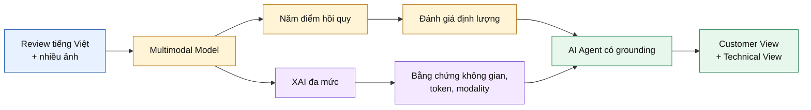

**Hình 1.1. Chuỗi giá trị nghiên cứu của đề tài.**

## 1.4. Thách thức khoa học và kỹ thuật

### 1.4.1. Tính không đồng nhất giữa các modality

Token văn bản và patch ảnh khác nhau về cấu trúc, mật độ thông tin và mức liên quan với target. Văn bản thường cung cấp tín hiệu trực tiếp cho Price Score hoặc Service Score, trong khi ảnh thường mạnh hơn ở Food Score và Atmosphere Score. Một Fusion Mechanism cố định có thể không thích ứng với sự thay đổi này theo từng sample.

### 1.4.2. Multi-image aggregation

Một review có thể có nhiều ảnh, nhưng không phải ảnh nào cũng liên quan ngang nhau. Mean pooling có ưu điểm đơn giản và ổn định, song giả định mỗi ảnh đóng góp tương đương. Việc trung bình patch tại cùng tọa độ giữa các ảnh còn có thể trộn những vùng không có tương ứng ngữ nghĩa. Đây là lý do multi-image attention pooling và image-quality filtering được xem là hướng phát triển quan trọng.

### 1.4.3. Văn bản tiếng Việt phi chuẩn

PhoBERT được tiền huấn luyện theo hướng tiếng Việt chuẩn và yêu cầu chú ý đến word segmentation; ViSoBERT hướng đến văn bản mạng xã hội; XLM-R cung cấp khả năng đa ngữ và code-mixing. Không có cơ sở để mặc định một encoder luôn tốt nhất cho mọi review. Sự phù hợp phải được kiểm định trong cùng dữ liệu, cùng split và cùng Fusion Mechanism.

### 1.4.4. Nhiễu nhãn và phụ thuộc giữa các target

Overall Satisfaction được xây dựng từ trung bình bốn khía cạnh kết hợp với rule-based adjustment dựa trên bình luận. Cách gán nhãn này có ưu điểm về auditability nhưng làm phát sinh phụ thuộc thống kê giữa target tổng thể và các target thành phần. Đồng thời, điểm người dùng vốn chứa chủ quan cá nhân, thiên lệch chọn mẫu và nhiễu. MSE có thể nhạy với outlier, trong khi Loss Function robust hoặc uncertainty weighting có thể thay đổi trade-off giữa các target.

### 1.4.5. Chi phí không gian tìm kiếm

Nếu khảo sát đồng thời nhiều Image Backbone, Text Backbone, Fusion Mechanism, Loss Function và random seed, số run tăng theo tích Descartes. Chỉ riêng 4 Image Backbone, 3 Text Backbone, 5 Fusion Mechanism, 4 Loss Function và 3 seed đã tạo \(4\times3\times5\times4\times3=720\) run, chưa kể Hyperparameter tuning. Exhaustive Search vượt quá ngân sách của một đồ án đại học; ngược lại, thử nghiệm ngẫu nhiên không có cấu trúc làm yếu khả năng quy kết nguyên nhân. Đề tài vì thế sử dụng **Controlled Sequential Ablation + Promising Combination Validation**.

### 1.4.6. Faithfulness của Explainable AI

Heatmap trực quan có thể hợp lý đối với người xem nhưng không nhất thiết faithful với cơ chế dự đoán. Grad-CAM có độ phân giải thô; attention không tự động là causal explanation; SHAP phụ thuộc background; LIME phụ thuộc perturbation và segmentation. Việc phối hợp nhiều phương pháp chỉ có giá trị khi mỗi phương pháp trả lời một câu hỏi khác nhau và khi disagreement được giữ lại để phân tích.

### 1.4.7. Hallucination trong diễn giải bằng LLM

LLM có khả năng tạo văn bản trôi chảy ngay cả khi bằng chứng thiếu hoặc mâu thuẫn. Nếu đưa artifact thô trực tiếp vào prompt và yêu cầu “giải thích”, mô hình có thể biến correlation thành causation hoặc mô tả vùng ảnh mà nó chưa quan sát. Thiết kế AI Agent phải tách Evidence Loading, Evidence Compression, Reasoning Graph, Prompt Construction và Output Validation để giảm rủi ro này.

## 1.5. Research Gap

Tổng quan tài liệu ở Chương 2 cho thấy bốn khoảng trống có liên quan trực tiếp đến đề tài.

Thứ nhất, phần lớn nghiên cứu Multimodal Sentiment Analysis phổ biến tập trung vào classification hoặc dữ liệu text–audio–video; số công trình xử lý **multi-output score regression** cho review nhà hàng tiếng Việt từ text và nhiều ảnh còn hạn chế. Các mô hình MABSA thường dự đoán polarity cho aspect được nêu, trong khi đề tài cần dự đoán năm điểm liên tục ngay cả khi một aspect không được đề cập trực tiếp.

Thứ hai, các nghiên cứu về Vietnamese NLP xác nhận giá trị của pretraining đơn ngữ và domain-specific, nhưng chưa trả lời encoder nào phù hợp nhất khi văn bản được fusion với ảnh trong bài toán hồi quy đa target. Đây là khoảng trống thực nghiệm chứ không phải khoảng trống về sự tồn tại của mô hình.

Thứ ba, nhiều pipeline Explainable AI trình bày từng kỹ thuật độc lập. Đề tài cần một kiến trúc giải thích tương ứng với các tầng của Multimodal Model: vùng ảnh, token, liên kết token–patch, fused representation và perturbation cục bộ. Giá trị nằm ở **cross-method triangulation**, không ở số lượng hình trực quan.

Thứ tư, việc dùng LLM để diễn đạt XAI đang phát triển nhanh, nhưng natural-language fluency không bảo đảm faithfulness. Khoảng trống kỹ thuật là xây dựng AI Agent không “tự suy luận” từ khoảng trống, mà chỉ verbalize một Reasoning Graph đã được tạo từ bằng chứng có cấu trúc.

## 1.6. Mục tiêu nghiên cứu

Mục tiêu tổng quát là xây dựng và đánh giá một hệ thống Multimodal Deep Learning có khả năng dự đoán đa khía cạnh và tạo diễn giải có căn cứ cho review nhà hàng tiếng Việt.

Các mục tiêu cụ thể được trình bày trong Bảng 1.1.

**Bảng 1.1. Mục tiêu nghiên cứu và tiêu chí đánh giá.**

| Mã | Mục tiêu | Tiêu chí đánh giá |
|---|---|---|
| O1 | Xây dựng bộ dữ liệu review–ảnh có khả năng truy vết | Thống kê nguồn, schema, quy trình cleaning, label evidence và split manifest |
| O2 | Thiết lập Baseline đơn phương thức và đa phương thức | Text-only, image-only và concat multimodal dùng cùng protocol |
| O3 | Đánh giá các thành phần mô hình theo Controlled Sequential Ablation | Mỗi pha chỉ thay đổi một nhóm biến; winner chọn theo rule định trước |
| O4 | Kiểm tra interaction effect bằng Promising Combination Validation | So sánh sequential winner với các tổ hợp có cơ sở |
| O5 | Xây dựng XAI đa mức, target-specific | Artifact Grad-CAM, Self-Attention, Cross-Attention, SHAP và LIME |
| O6 | Xây dựng AI Agent có grounding | Reasoning Graph, schema, validation warning, Customer/Technical View |
| O7 | Bảo đảm reproducibility và auditability | Seed, config, log, checkpoint, predictions và môi trường có phiên bản |

## 1.7. Câu hỏi nghiên cứu và giả thuyết

- **RQ1 — Giá trị của Multimodal Learning:** Việc kết hợp ảnh và văn bản có làm giảm sai số so với Text-only và Image-only Baseline hay không?  
  **H1:** Multimodal Model cải thiện mean MAE so với Image-only và không kém Text-only; lợi ích lớn nhất xuất hiện ở các sample có bằng chứng ảnh liên quan.

- **RQ2 — Lựa chọn thành phần:** Image Backbone, Text Backbone, Fusion Mechanism và Loss Function nào phù hợp nhất trong protocol có kiểm soát?  
  **H2:** PhoBERT hoặc ViSoBERT có lợi thế trên review tiếng Việt; adaptive fusion có khả năng vượt Concatenation khi ảnh nhiễu; robust loss làm giảm large-error tail.

- **RQ3 — Interaction effect:** Tổ hợp các winner tuần tự có phải cấu hình hoàn chỉnh tốt nhất hay không?  
  **H3:** Một số non-greedy combination có thể tốt hơn do synergy giữa encoder, fusion và loss; vì vậy cần Promising Combination Validation.

- **RQ4 — Khả năng giải thích:** Các phương pháp XAI có cung cấp bằng chứng bổ sung, target-specific và nhất quán hay không?  
  **H4:** Không có phương pháp đơn lẻ đủ bao phủ; agreement giữa gradient, perturbation và attribution giúp tăng độ tin cậy, còn disagreement giúp phát hiện shortcut hoặc instability.

- **RQ5 — Chất lượng AI Agent:** AI Agent có thể tạo diễn giải dễ hiểu nhưng vẫn grounded vào XAI evidence hay không?  
  **H5:** Reasoning-first pipeline và schema validation giảm claim không được hỗ trợ so với prompt trực tiếp, nhưng cần Human Evaluation để xác nhận.

## 1.8. Đóng góp dự kiến và đóng góp đã đạt được

Bảng 1.2 phân biệt phần đã đạt được với điều kiện cần để chuyển thành kết luận cuối.

**Bảng 1.2. Phân định đóng góp theo trạng thái tiến độ.**

| Nhóm | Đã đạt được ở giai đoạn báo cáo | Cần hoàn thiện để trở thành kết luận cuối |
|---|---|---|
| Data Engineering | Thu thập, cleaning, liên kết review–ảnh và rule-evidenced Overall Satisfaction | Frozen split, data card, group leakage audit và human label audit |
| Modeling | Multi-output Regression; năm Fusion Mechanism; token–patch Cross-Attention | Retraining sau migration; multi-seed và locked test |
| Experimental Methodology | Controlled Sequential Ablation; metrics của 12 cấu hình | Baseline đơn phương thức đồng bộ; statistical test và Confidence Interval |
| Explainable AI | Hạ tầng Pha 1–6 và artifact contract | Sinh artifact từ final checkpoint; faithfulness/stability test |
| AI Agent | Evidence aggregation, Reasoning Graph, prompt, schema và report generator | Human Evaluation, caching, offline fallback và deployment |

Đề tài không tuyên bố novelty ở từng backbone hoặc XAI method. Đóng góp chính nằm ở việc tích hợp chúng thành một quy trình có kiểm soát, phù hợp với dữ liệu review tiếng Việt và có traceability từ Research Question đến evidence.

## 1.9. Phạm vi và đối tượng nghiên cứu

Đối tượng nghiên cứu là review nhà hàng/quán ăn có bình luận và ít nhất một ảnh. Hệ thống tập trung vào năm điểm đánh giá liên tục, không thực hiện recommendation, ranking nhà hàng, fraud detection hoặc sentiment classification rời rạc. Ảnh được giới hạn tối đa bốn ảnh mỗi review trong training pipeline. Văn bản sử dụng bản đã cleaning, nhưng các trường gốc vẫn cần được giữ để audit.

Phần Explainable AI là post-hoc analysis cho mô hình đã huấn luyện. AI Agent là lớp hậu xử lý, không thay đổi prediction và không được dùng để “bù” bằng chứng thiếu. Hệ thống chưa xử lý streaming, online learning, audio/video hoặc deployment ở quy mô sản xuất.

## 1.10. Traceability Matrix

Bảng 1.3 liên kết Research Question với phương pháp, thí nghiệm, evidence và vị trí báo cáo. Đây là contract giúp ngăn việc đưa ra kết luận không có đường dẫn kiểm chứng.

**Bảng 1.3. Traceability Matrix từ Research Question đến bằng chứng.**

| Research Question | Method | Experiment/Analysis | Evidence | Expected Outcome | Section |
|---|---|---|---|---|---|
| RQ1: Multimodal có giá trị hơn unimodal? | Controlled Baseline comparison | EXP_010, EXP_011, EXP_012 | MAE, RMSE, \(R^2\), paired per-sample error | Định lượng phần tín hiệu bổ sung của ảnh | 5.4; 6.2 |
| RQ2a: Image Backbone nào phù hợp? | Controlled Sequential Ablation | EXP_020B/D/E và reference | Validation metrics, resource usage | Chọn visual encoder dưới điều kiện cố định | 5.4; 6.2 |
| RQ2b: Text Backbone nào phù hợp? | Controlled Sequential Ablation | EXP_030B/D và reference | Validation metrics, tokenization audit | Đánh giá domain-specific Vietnamese encoder | 5.4; 6.2 |
| RQ2c: Fusion Mechanism nào phù hợp? | Fusion ablation | EXP_040B/C, 041A/B | Metrics, gate/attention diagnostics | So sánh adaptive interaction với Concatenation | 5.4; 6.3 |
| RQ2d: Loss Function nào phù hợp? | Loss ablation | EXP_050B/C, 051D | Metrics, error-tail analysis | Đo robustness và target trade-off | 5.4; 6.3 |
| RQ3: Có interaction effect không? | Promising Combination Validation | EXP_060A–E | Combination leaderboard; multi-seed | Kiểm tra giới hạn của greedy winner | 5.5; 7.2 |
| RQ4: Mô hình dựa vào bằng chứng nào? | XAI triangulation | Grad-CAM, Attention, SHAP, LIME, case study | Heatmap, attribution, perturbation, agreement matrix | Giải thích target-specific và phát hiện shortcut | 4.10; 5.9; 6.5 |
| RQ5: Agent có diễn giải grounded không? | Reasoning-first Agent + Human Evaluation | Single-case, batch, evaluator rubric | Schema pass rate, unsupported-claim rate, clarity score | Đánh giá faithfulness và usefulness | 4.12; 5.10; 7.2 |

## 1.11. Cấu trúc báo cáo

Chương 2 xây dựng nền tảng học thuật và xác lập Research Gap. Chương 3 định nghĩa bài toán, đơn vị phân tích, quy trình tạo nhãn và đặc trưng dữ liệu. Chương 4 trình bày Methodology từ encoder, Fusion Mechanism, Loss Function đến XAI và AI Agent. Chương 5 mô tả Experimental Methodology, trong đó Controlled Sequential Ablation + Promising Combination Validation là trục chính. Chương 6 tách confirmed findings, observations, interpretations và limitations. Chương 7 tổng kết tiến độ và đưa ra roadmap hoàn thiện.

---

# CHƯƠNG 2. CÔNG TRÌNH NGHIÊN CỨU LIÊN QUAN

## 2.1. Phạm vi tổng quan

Chương này tổ chức tài liệu theo năm trục: Multimodal Learning; backbone thị giác và ngôn ngữ; Multimodal/Aspect-Based Sentiment Analysis; Explainable AI; và LLM-based Explanation Generation. Các công trình được dùng để hình thành giả thuyết và lựa chọn kỹ thuật, không được dùng để suy diễn rằng một mô hình chắc chắn tốt hơn trên dữ liệu của đề tài.

Sự khác biệt giữa task trong tài liệu và task của đề tài cần được giữ rõ. Nhiều công trình báo cáo Accuracy hoặc F1 cho classification, trong khi đề tài tối ưu MAE/RMSE cho Multi-output Regression. Kết quả trên ImageNet, XNLI hay MABSA benchmark chứng minh năng lực biểu diễn hoặc tính khả thi của kiến trúc, nhưng không thay thế experiment trên review nhà hàng tiếng Việt.

## 2.2. Multimodal Learning và taxonomy của fusion

Multimodal Learning nghiên cứu cách biểu diễn, căn chỉnh, kết hợp và suy luận từ nhiều nguồn dữ liệu. Trong bài toán ảnh–văn bản, ba chiến lược fusion cơ bản thường được phân biệt:

- **Early Fusion:** kết hợp đầu vào hoặc feature rất sớm. Cách này cho phép tương tác sâu nhưng khó áp dụng trực tiếp khi token và pixel khác cấu trúc.
- **Intermediate Fusion:** mỗi modality có encoder riêng; feature được kết hợp ở tầng trung gian. Đây là lựa chọn của đề tài vì cân bằng giữa modularity và interaction.
- **Late Fusion:** kết hợp prediction của các nhánh. Cách này đơn giản và dễ xử lý missing modality nhưng hạn chế học liên kết token–patch.

MulT của Tsai và cộng sự [10] cho thấy directional pairwise cross-modal attention có thể học quan hệ giữa các chuỗi không căn chỉnh. Dù MulT nghiên cứu text–audio–vision theo thời gian, nguyên lý “một modality truy vấn modality khác” cung cấp nền tảng cho bidirectional Cross-Attention của đề tài. Khác biệt quan trọng là ảnh nhà hàng được biểu diễn bằng spatial patch, còn văn bản bằng token; không có trục thời gian chung.

GMU của Arevalo và cộng sự [11] học multiplicative gate để điều chỉnh ảnh hưởng của từng modality trong hidden representation. Giá trị của GMU đối với review nhà hàng nằm ở khả năng giảm vai trò của ảnh khi ảnh không liên quan. Tuy nhiên, gate ở mức vector không trực tiếp mô hình hóa liên kết chi tiết giữa từ và vùng ảnh.

FiLM của Perez và cộng sự [12] sử dụng phép biến đổi affine theo feature:

\[
\operatorname{FiLM}(\mathbf{x}\mid\mathbf{z})
=\gamma(\mathbf{z})\odot\mathbf{x}+\beta(\mathbf{z}),
\]

trong đó conditioning signal \(\mathbf{z}\) điều chỉnh scale và shift của \(\mathbf{x}\). Trong đề tài, text feature sinh \(\gamma,\beta\) để điều biến image feature. FiLM hiệu quả về tham số và có trực giác rõ, nhưng bất đối xứng: văn bản điều khiển ảnh chứ không đồng thời học hai hướng như Cross-Attention.

## 2.3. Backbone thị giác

### 2.3.1. ConvNeXt

ConvNeXt được phát triển bằng cách hiện đại hóa ConvNet theo các design choice chịu ảnh hưởng của Vision Transformer, đồng thời duy trì inductive bias của convolution [13]. Kiến trúc này phù hợp làm Baseline thị giác vì feature extraction ổn định, hỗ trợ pretrained weight và tạo spatial feature map dùng được cho Grad-CAM. Trong đề tài, ConvNeXt còn đóng vai trò reference để kiểm tra liệu hierarchical Transformer có thực sự cần thiết.

### 2.3.2. EfficientNet

EfficientNet sử dụng compound scaling để cân bằng depth, width và input resolution [14]. EfficientNet-B3 được chọn như một ứng viên có trade-off tốt giữa chi phí và năng lực biểu diễn. So với Swin-B, mô hình nhỏ hơn có thể thuận lợi cho Colab và batch inference; ngược lại, feature patch cho Cross-Attention có thể ít tự nhiên hơn so với hierarchical Transformer.

### 2.3.3. Swin Transformer

Swin Transformer xây dựng feature hierarchy bằng shifted-window self-attention, giảm độ phức tạp theo kích thước ảnh và tạo kết nối qua cửa sổ [1]. Output không gian ở stage cuối phù hợp với hai mục tiêu: giữ patch sequence cho Cross-Attention và cung cấp target layer cho Grad-CAM. Với cấu hình Swin-B 224×224 trong đề tài, stage cuối tạo lưới 7×7 với 1.024 channel.

### 2.3.4. SigLIP

SigLIP thay softmax contrastive objective bằng pairwise sigmoid loss cho language–image pretraining [15]. Pretraining này tạo visual representation đã được căn chỉnh với ngôn ngữ ở quy mô lớn, nên SigLIP là ứng viên hợp lý cho dữ liệu ảnh–văn bản. Tuy nhiên, việc chỉ lấy visual encoder rồi fusion với một text encoder khác không bảo đảm giữ toàn bộ lợi thế alignment của pretraining gốc. Do đó, SigLIP được xem là hypothesis cần kiểm định chứ không phải winner mặc định.

Bảng 2.1 tổng hợp inductive bias, ưu điểm kỳ vọng và rủi ro của bốn Image Backbone.

**Bảng 2.1. So sánh các Image Backbone được khảo sát.**

| Backbone | Inductive bias | Ưu điểm kỳ vọng | Rủi ro/giới hạn | Vai trò thực nghiệm |
|---|---|---|---|---|
| ConvNeXt | Convolution hiện đại | Stable transfer; Grad-CAM thuận lợi | Không có native language alignment | Baseline ảnh |
| EfficientNet-B3 | Compound scaling | Hiệu quả tham số | Spatial representation phụ thuộc implementation | Candidate tiết kiệm |
| Swin-B | Hierarchical shifted-window attention | Patch hierarchy; XAI attachment rõ | Chi phí bộ nhớ cao | Candidate chính |
| SigLIP | Language–image pretraining | Semantic visual representation | Có thể mất lợi thế khi tách encoder | Candidate vision-language |

## 2.4. Backbone ngôn ngữ cho review tiếng Việt

### 2.4.1. XLM-R

XLM-R được pretrained bằng masked language modeling trên 100 ngôn ngữ và dữ liệu CommonCrawl quy mô lớn [16]. Điểm mạnh là multilingual transfer và khả năng xử lý code-mixing. Đối với review có xen tiếng Anh hoặc tên món nước ngoài, XLM-R là một Baseline hợp lý. Hạn chế là capacity phải phân bổ cho nhiều ngôn ngữ và pretraining không chuyên biệt cho tiếng Việt hoặc văn bản nhà hàng.

### 2.4.2. PhoBERT

PhoBERT là Pre-trained Language Model đơn ngữ tiếng Việt, được công bố với hai kích thước base và large [2]. Công trình gốc cho thấy lợi ích trên nhiều task tiếng Việt chuẩn. PhoBERT sử dụng preprocessing và subword convention phù hợp tiếng Việt, nhưng review mạng xã hội có thể khác domain pretraining. Khi dùng PhoBERT, tokenization audit và cách merge subword trong visualization là bắt buộc để tránh trình bày fragment như từ hoàn chỉnh.

### 2.4.3. ViSoBERT

ViSoBERT được pretrained cho Vietnamese social media text và được đánh giá trên emotion recognition, hate speech, sentiment analysis, spam review và hate-speech span [17]. Domain pretraining gần review trực tuyến tạo một giả thuyết mạnh rằng ViSoBERT xử lý slang và informal writing tốt. Tuy nhiên, task pretraining/downstream của ViSoBERT chủ yếu là classification; lợi thế đó cần được kiểm định lại trong Multi-output Regression và khi feature được fusion với ảnh. Bảng 2.2 đặt ba Text Backbone vào cùng một khung so sánh.

**Bảng 2.2. So sánh các Text Backbone chính.**

| Backbone | Phạm vi pretraining | Phù hợp kỳ vọng | Câu hỏi cần kiểm định |
|---|---|---|---|
| XLM-R | Đa ngữ, CommonCrawl | Code-mixing, Baseline tổng quát | Capacity dilution có ảnh hưởng tiếng Việt không? |
| PhoBERT | Đơn ngữ tiếng Việt | Ngữ nghĩa tiếng Việt chuẩn | Domain shift sang review phi chuẩn lớn đến đâu? |
| ViSoBERT | Social media tiếng Việt | Slang, informal text | Lợi thế classification có chuyển sang regression không? |

## 2.5. Multimodal Sentiment Analysis và Aspect-Based Analysis

Khảo sát MABSA của Zhao, Meng và Song [3] hệ thống hóa các task aspect extraction, sentiment classification và multimodal interaction, đồng thời cho thấy xu hướng chuyển từ sentiment tổng quát sang phân tích theo target/aspect.

VistaNet nghiên cứu review có ảnh và nhận định rằng ảnh thường đóng vai trò hỗ trợ, giúp định vị sentence/aspect quan trọng hơn là tự biểu đạt sentiment độc lập [18]. Quan sát này đặc biệt liên quan đến đề tài: Text Branch có thể là nguồn chính, còn Image Branch cung cấp evidence bổ trợ không đồng đều. Vì vậy, chỉ đánh giá score trung bình là chưa đủ; cần kiểm tra branch collapse và case-level contribution.

MIMN của Xu, Mao và Chen [19] là một trong những công trình sớm kết hợp aspect-level analysis với multimodal data. Hai interactive memory network học ảnh hưởng của aspect lên text và image, đồng thời học interaction giữa modality. Khác với MIMN, đề tài không trích xuất aspect term hoặc polarity; năm aspect được định nghĩa trước và output là score liên tục. Sự khác biệt này làm cho label dễ định nghĩa hơn nhưng cũng đặt câu hỏi: mô hình nên dự đoán thế nào khi review không đề cập một aspect?

Các nghiên cứu MABSA gần đây nhấn mạnh modality gap, target-specific visual focus và implicit aspect. Peng và cộng sự [20] chỉ ra việc nối feature đơn giản có thể không đủ để thu hẹp khoảng cách modality và việc visual focus có thể thay đổi theo target. Những nhận định này hỗ trợ quyết định so sánh Concatenation với adaptive fusion và sinh Grad-CAM riêng cho từng Prediction Head.

VistaNet và MIMN chủ yếu giải quyết classification. Đề tài kế thừa trực giác aspect-specific nhưng chuyển sang score regression, nhiều ảnh mỗi review và giải thích đa tầng. Đây là khác biệt thiết kế đáng kể, không phải phép lặp trực tiếp của MABSA.

## 2.6. Attention và Cross-Attention

Transformer định nghĩa scaled dot-product attention [21]:

\[
\operatorname{Attention}(Q,K,V)
=\operatorname{softmax}\left(\frac{QK^\top}{\sqrt{d_k}}\right)V.
\]

Self-Attention dùng \(Q,K,V\) từ cùng một sequence; Cross-Attention dùng query từ modality này và key/value từ modality khác. Trong bài toán hiện tại, text-to-image attention cho biết mỗi token tổng hợp thông tin từ patch nào; image-to-text attention cho biết mỗi patch tổng hợp thông tin từ token nào.

Một yêu cầu cấu trúc quan trọng là sequence length phải lớn hơn một để attention có lựa chọn có ý nghĩa. Nếu mỗi modality bị pool thành một vector rồi `unsqueeze(1)`, softmax trên một key luôn là 1; module khi đó không học alignment. Thiết kế token–patch khắc phục điểm này bằng ma trận \(T\times P\), padding mask và masked mean pooling.

Mặc dù attention map có giá trị diagnostic, Jain và Wallace [9] cho thấy attention weight có thể không tương quan với gradient importance và có thể tồn tại attention distribution khác nhau cho prediction tương tự. Wiegreffe và Pinter [22] lập luận rằng kết luận phụ thuộc định nghĩa explanation và đề xuất các diagnostic test. Do đó, báo cáo dùng cách diễn đạt cân bằng: attention là **interaction evidence**, không phải chứng minh causal contribution.

## 2.7. Explainable AI cho hệ thống đa phương thức

XAI đa phương thức cần xử lý đồng thời explanation trong từng modality và explanation của quá trình fusion; khảo sát của Rodis và cộng sự [4] cho thấy đây là không gian phương pháp rộng, trong đó một explanation duy nhất hiếm khi trả lời đầy đủ mọi câu hỏi.

### 2.7.1. Grad-CAM

Grad-CAM sử dụng gradient của target score đối với feature map để tạo coarse localization [6]. Với feature map \(A^k\) và target \(y^c\):

\[
\alpha_k^c=\frac{1}{Z}\sum_{u,v}
\frac{\partial y^c}{\partial A_{uv}^k},
\qquad
L_{\mathrm{GradCAM}}^c=
\operatorname{ReLU}\left(\sum_k\alpha_k^cA^k\right).
\]

Ưu điểm là không cần retraining và target-specific. Hạn chế là map cuối có độ phân giải thấp, phụ thuộc target layer và chỉ thể hiện vùng hỗ trợ sau ReLU. Trong đề tài, Grad-CAM trả lời câu hỏi “vùng nào của ảnh liên hệ với từng score”, không trả lời “ảnh đóng góp bao nhiêu phần trăm”.

### 2.7.2. SHAP

SHAP thống nhất một lớp additive feature attribution method dựa trên Shapley value [7]. Một explanation có dạng:

\[
f(x)\approx \phi_0+\sum_{j=1}^{M}\phi_j.
\]

Trong thiết kế Cross-Attention, SHAP được áp dụng lên fused vector 1.024 chiều trước Prediction Head. Nửa đầu là text-origin và nửa sau là image-origin; thuật ngữ “origin” quan trọng vì hai nửa đều đã chứa thông tin cross-modal. Tổng absolute SHAP trong mỗi segment cung cấp modality contribution tương đối, còn signed sum cung cấp hướng tác động. Hạn chế gồm background sensitivity, approximation error và việc latent dimension không có semantic meaning trực tiếp.

### 2.7.3. LIME

LIME học sparse local surrogate quanh sample cần giải thích [8]:

\[
\xi(x)=\arg\min_{g\in G}
\mathcal{L}(f,g,\pi_x)+\Omega(g).
\]

LIME Image perturb superpixel trong khi giữ text cố định; LIME Text loại/giữ từ trong khi giữ ảnh cố định. Cơ chế này gần với câu hỏi counterfactual cục bộ hơn attention, nhưng kết quả phụ thuộc sampling, kernel width, segmentation và seed. Vì chi phí nhiều forward pass, LIME phù hợp case study hơn đánh giá toàn bộ tập.

### 2.7.4. Sự bổ sung giữa các phương pháp

**Bảng 2.3. Phạm vi giải thích của các XAI method.**

| Method | Attachment point | Câu hỏi chính | Không được kết luận |
|---|---|---|---|
| Grad-CAM | Spatial feature map của Image Branch | Vùng ảnh nào hỗ trợ target? | Pixel nào “gây ra” prediction |
| Self-Attention | Attention matrix của Text Branch | Token tương tác với token nào? | Token có attention cao chắc chắn quan trọng |
| Cross-Attention | Token–patch attention | Từ nào liên kết vùng ảnh nào? | Liên kết là causal effect |
| SHAP | Fused embedding + Prediction Head | Modality-origin nào đóng góp mạnh? | Latent dimension tương ứng concept cụ thể |
| LIME | Full prediction function | Che vùng/bỏ từ làm output đổi thế nào cục bộ? | Pattern cục bộ đúng cho toàn bộ data |

Bảng 2.3 làm rõ câu hỏi và giới hạn của từng XAI method. Đề tài dùng triangulation: nếu Grad-CAM và LIME Image cùng nhấn mạnh vùng món ăn, đồng thời SHAP cho image-origin contribution cao, bằng chứng hội tụ mạnh hơn một heatmap đơn lẻ. Nếu các method không đồng thuận, disagreement được xem là kết quả cần phân tích, không bị loại bỏ.

## 2.8. LLM-based Explanation Generation và AI Agent

TalkToModel của Slack và cộng sự [23] cho phép người dùng truy vấn mô hình qua hội thoại tự nhiên; LLM chuyển câu hỏi thành executable operation và hệ thống tạo explanation từ kết quả thực thi. Công trình này minh họa một nguyên tắc quan trọng: LLM nên làm giao diện và orchestration, còn phép giải thích phải được thực thi bởi component có semantics rõ.

XplainLLM [24] nghiên cứu grounded explanation generation và cho thấy knowledge augmentation có thể giảm hallucination. Explingo [25] khảo sát việc chuyển SHAP explanation thành narrative dễ hiểu. Các hướng này ủng hộ việc dùng LLM như **verbalizer** của XAI evidence, đồng thời nhấn mạnh rằng output tự nhiên cần grounding và evaluation.

Thiết kế của đề tài khác self-explanation: LLM không dự đoán score và không giải thích nội tại chính nó. Agent nhận prediction từ Multimodal Model, nhận artifact từ các XAI method, xây Reasoning Graph xác định evidence hỗ trợ/mâu thuẫn/thiếu, rồi yêu cầu LLM diễn đạt. Validator sau cùng kiểm tra schema, target coverage, evidence completeness và confidence reasoning.

## 2.9. Tổng hợp Research Gap

**Bảng 2.4. Đối chiếu công trình liên quan với phạm vi đề tài.**

| Hướng nghiên cứu | Thành tựu tiêu biểu | Phần còn thiếu đối với bài toán | Cách đề tài đáp ứng |
|---|---|---|---|
| Vietnamese PLM | XLM-R, PhoBERT, ViSoBERT | Chưa xác định encoder tốt nhất cho image-text score regression | Controlled Text Backbone Ablation |
| Vision Backbone | ConvNeXt, EfficientNet, Swin, SigLIP | Benchmark gốc không phản ánh ảnh review nhiễu | Controlled Image Backbone Ablation |
| MSA/MABSA | VistaNet, MIMN, target-aware fusion | Chủ yếu classification; ít multi-output continuous score | Năm Regression Head và aspect-level metrics |
| Fusion | GMU, FiLM, Cross-Attention | Component synergy phụ thuộc task | Sequential Ablation + Combination Validation |
| XAI | Grad-CAM, SHAP, LIME, attention diagnostic | Method đơn lẻ không bao phủ toàn hệ thống | Architecture-aligned multi-method XAI |
| LLM explanation | TalkToModel, grounded explanation | Fluency không bảo đảm faithfulness | Evidence Builder + Reasoning Graph + Validator |

Bảng 2.4 tổng hợp quan hệ giữa thành tựu trước đây và phần còn thiếu đối với task. Research Gap trung tâm không phải thiếu một backbone mới. Khoảng trống nằm ở quy trình tích hợp có kiểm soát cho review nhà hàng tiếng Việt: nhiều ảnh, năm score liên tục, token–patch interaction, multi-level XAI và grounded natural-language reporting. Đề tài hướng tới lấp khoảng trống này ở cấp độ system design và experimental methodology; mức độ thành công cuối cùng phải được xác nhận bằng locked test, multi-seed analysis và Human Evaluation.

---

# CHƯƠNG 3. ĐỊNH NGHĨA BÀI TOÁN VÀ BỘ DỮ LIỆU

## 3.1. Định nghĩa hình thức

Mỗi mẫu là:

\[
x_i = \left(t_i, I_i\right), \qquad
I_i = \{v_{i1},\ldots,v_{in_i}\}, \quad 1 \le n_i \le 4,
\]

trong đó \(t_i\) là bình luận đã làm sạch và \(I_i\) là tập tối đa bốn ảnh được dataset loader sử dụng. Nhãn là vector năm chiều:

\[
\mathbf{y}_i =
\left[
y_i^{food},
y_i^{price},
y_i^{atmos},
y_i^{service},
y_i^{overall}
\right]^\top \in [0,10]^5.
\]

Mô hình \(f_\theta\) học ánh xạ:

\[
\hat{\mathbf{y}}_i=f_\theta(t_i,I_i), \qquad
f_\theta:\mathcal{T}\times\mathcal{V}^{\le 4}\rightarrow\mathbb{R}^5.
\]

Đây là hồi quy đa mục tiêu. Implementation không ép đầu ra qua sigmoid hoặc clamp; vì vậy \(\hat{\mathbf{y}}\) có thể nằm ngoài \([0,10]\) dù nhãn thuộc khoảng này.

## 3.2. Lược đồ dữ liệu

Bảng 3.1 mô tả các trường thực sự được `MultimodalDataset` đọc khi huấn luyện.

**Bảng 3.1. Lược đồ một mẫu huấn luyện.**

| Trường | Kiểu/biểu diễn | Vai trò |
|---|---|---|
| `review_id` | Số nguyên | Định danh và gom nhiều ảnh theo review |
| `comment_clean` | Chuỗi | Đầu vào văn bản |
| `image_url` | Danh sách chuỗi được serialize trong CSV | Đầu vào ảnh |
| `food_score` | Số thực 0–10 | Nhãn chất lượng món ăn |
| `price_score` | Số thực 0–10 | Nhãn giá |
| `atmosphere_score` | Số thực 0–10 | Nhãn không gian |
| `service_score` | Số thực 0–10 | Nhãn dịch vụ |
| `overall_satisfaction` | Số thực 0–10 | Nhãn hài lòng tổng thể |

Ảnh cục bộ được đặt tên bằng MD5 của URL với đuôi `.jpg`. Nếu không có file cục bộ, loader thử tải URL trong 5 giây; khi lỗi, ảnh đen \(224\times224\) được dùng làm fallback. Mỗi mẫu được pad đến bốn ảnh, kèm `num_images` để loại ảnh đệm khỏi phép trung bình.

## 3.3. Xây dựng và làm sạch dữ liệu

Quy trình trong Hình 3.1 được tổng hợp từ các bước thu thập, cleaning, sinh nhãn và script tạo split.

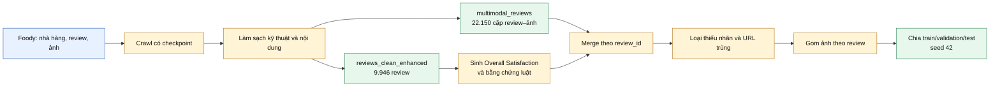

**Hình 3.1. Quy trình xây dựng bộ dữ liệu.**

Như Hình 3.1 thể hiện, dữ liệu ảnh–văn bản và dữ liệu nhãn được hình thành qua hai nhánh rồi hợp nhất bằng `review_id`. Trước khi gom nhóm, pipeline loại dòng thiếu các trường bắt buộc và URL ảnh trùng. Việc gom nhóm ngăn một review nhiều ảnh bị xem như nhiều mẫu văn bản độc lập.

## 3.4. Sinh nhãn hài lòng tổng thể

Điểm cơ sở là trung bình bốn khía cạnh:

\[
\bar{y}_i=\frac{
y_i^{food}+y_i^{price}+y_i^{atmos}+y_i^{service}
}{4}.
\]

Hệ luật tiếng Việt tạo điều chỉnh \(\Delta_i\) từ 14 nhóm tín hiệu tích cực/tiêu cực và lưu các luật kích hoạt cùng đoạn bằng chứng. Nhãn cuối:

\[
y_i^{overall}=\operatorname{clip}\left(\bar{y}_i+\Delta_i,0,10\right).
\]

Trong 9.946 review, 3.263 review có điều chỉnh khác 0; gồm 2.058 điều chỉnh dương và 1.205 điều chỉnh âm. Cách tạo nhãn này tăng khả năng truy vết nhưng không thay thế đánh giá liên chủ thể của người gán nhãn. Nó cũng khiến Overall Satisfaction phụ thuộc trực tiếp vào bốn điểm khía cạnh.

## 3.5. Thống kê dữ liệu

Các giá trị trong Bảng 3.2 được tái tính trực tiếp từ các CSV của phiên bản dữ liệu hiện hành.

**Bảng 3.2. Thống kê bộ dữ liệu hiện có.**

| Chỉ số | Giá trị |
|---|---:|
| Nhà hàng đã thu thập | 300 |
| Review hợp lệ sau làm sạch | 9.946 |
| Nhà hàng xuất hiện trong review hợp lệ | 298 |
| Review có ít nhất một ảnh | 6.082 |
| Tỷ lệ review có ảnh | 61,15% |
| Ảnh/cặp review–ảnh | 22.150 |
| Nhà hàng trong tập đa phương thức | 268 |
| Review có điều chỉnh nhãn tổng thể | 3.263 |

Nguồn đa phương thức có từ 1 đến 10 ảnh cho mỗi review; dataset loader chỉ sử dụng tối đa bốn ảnh. Bảng 3.3 mô tả năm nhãn trên toàn bộ `reviews_clean_enhanced.csv`. Có ba review thiếu đồng thời bốn điểm khía cạnh; chúng bị loại khi tạo tập đa phương thức huấn luyện.

**Bảng 3.3. Thống kê năm nhãn trên dữ liệu review hợp lệ.**

| Nhãn | Nhỏ nhất | Lớn nhất | Trung bình | Độ lệch chuẩn |
|---|---:|---:|---:|---:|
| `food_score` | 0 | 10 | 6,9126 | 2,9054 |
| `price_score` | 0 | 10 | 6,6640 | 2,6262 |
| `atmosphere_score` | 0 | 10 | 6,6176 | 2,4696 |
| `service_score` | 0 | 10 | 6,5579 | 2,8540 |
| `overall_satisfaction` | 0 | 10 | 6,7133 | 2,6165 |

Thống kê cho thấy nhãn hợp lệ thuộc miền \([0,10]\), trong khi cấu hình XAI hiện khai báo `SCORE_RANGE=(1,10)`. Trước khi sinh báo cáo giải thích chính thức, toàn bộ prediction, visualization và schema của AI Agent cần được thống nhất về \([0,10]\); nếu không, các trường hợp có điểm 0 có thể bị diễn giải sai hoặc bị validator loại nhầm.

## 3.6. Chia tập dữ liệu

`preprocess_data.py` hiện tạo 6.080 review đa phương thức đủ nhãn, xáo trộn với seed 42 rồi chia 80%/10%/10%. Nếu chạy đúng trên artifact hiện tại, số lượng kỳ vọng là 4.864/608/608. Tuy nhiên, thư mục `data/text/` không được cam kết; các metrics lịch sử có thể được tạo từ phiên bản split 5.000 mẫu trước đây. Bảng 3.4 vì vậy tách logic hiện hành khỏi artifact đã đóng băng.

**Bảng 3.4. Trạng thái chia tập.**

| Thành phần | Logic hiện hành | Artifact trong evidence package |
|---|---|---|
| Train | 80%, kỳ vọng 4.864 review | Chưa có `data/text/train.csv` |
| Validation | 10%, kỳ vọng 608 review | Chưa có `data/text/val.csv` |
| Test | 10%, kỳ vọng 608 review | Chưa có `data/text/test.csv` |
| Seed | 42 | Có trong code |
| Stratification | Không | Chưa triển khai |
| Group split theo nhà hàng/người dùng | Không | Chưa triển khai |

Việc chia ngẫu nhiên theo review có thể để review của cùng nhà hàng hoặc người dùng xuất hiện ở nhiều tập. Giai đoạn tiếp theo cần group split và lưu checksum/snapshot để tránh rò rỉ ngữ cảnh và sai lệch giữa các lần chạy.

## 3.7. Đơn vị phân tích và quan hệ nhiều ảnh

Đơn vị phân tích của mô hình là **review-level sample**, không phải image-level row. Phân biệt này quan trọng vì dữ liệu trung gian có một dòng cho mỗi cặp review–ảnh; nếu chia train/validation/test ở mức dòng ảnh, cùng một bình luận có thể xuất hiện ở nhiều split với các ảnh khác nhau, gây data leakage trực tiếp. Pipeline hiện gom tất cả URL theo `review_id` trước khi chia, qua đó mỗi review chỉ xuất hiện một lần trong tập huấn luyện cuối.

Đối với review có hơn bốn ảnh, loader chỉ dùng bốn ảnh đầu trong danh sách. Quy tắc này bảo đảm tensor batch có kích thước hữu hạn và kiểm soát VRAM, nhưng có thể tạo selection bias nếu thứ tự ảnh mang ý nghĩa. Chẳng hạn, ảnh đầu có thể là món chính còn ảnh sau là không gian hoặc hóa đơn. Một protocol hoàn chỉnh cần ghi rõ thứ tự URL, thử random sampling trong training hoặc xây attention pooling qua toàn bộ ảnh.

Khi review có ít hơn bốn ảnh, hệ thống thêm ảnh đen làm padding và truyền `num_images` để masked average bỏ qua các vị trí padding. Cơ chế này ngăn ảnh đen làm giảm trực tiếp feature trung bình. Tuy nhiên, trong trường hợp URL thật tải thất bại, ảnh đen fallback vẫn được tính là ảnh thật vì `num_images` phản ánh số URL, không phản ánh số ảnh decode thành công. Do đó, image failure manifest là cần thiết để phân biệt padding chủ động với download failure.

## 3.8. Kiểm soát chất lượng dữ liệu

Chất lượng của Multimodal Dataset cần được kiểm tra ở bốn lớp.

### 3.8.1. Referential integrity

Mọi `review_id` trong dữ liệu ảnh phải nối được với review sạch; mọi URL dùng để training phải ánh xạ đến đúng file MD5; mỗi sample phải có đủ năm target sau bước lọc. Các kiểm tra này có thể tự động hóa bằng assertion và xuất manifest.

### 3.8.2. Content validity

Cleaning pipeline đánh dấu quảng cáo/spam, bình luận quá ngắn và nội dung không hợp lệ. Tuy nhiên, rule-based cleaning có thể loại nhầm review ngắn nhưng giàu tín hiệu, ví dụ “món ngon, phục vụ tệ”. Vì vậy, báo cáo tỷ lệ loại và một tập mẫu audit thủ công nên được lưu cùng dataset version.

### 3.8.3. Label validity

Bốn aspect score đến từ nền tảng nguồn, còn Overall Satisfaction là weakly engineered label. Việc lưu `overall_rules_triggered` và `overall_evidence` tạo traceability cho từng điều chỉnh. Một bước validation hợp lý là lấy mẫu stratified theo adjustment dương, âm và bằng 0 để giảng viên hoặc annotator độc lập đánh giá:

- rule có thực sự được kích hoạt đúng ngữ cảnh hay không;
- adjustment có cùng hướng với cảm nhận tổng thể hay không;
- clipping ở 0/10 có làm mất thông tin mức độ hay không;
- negation, sarcasm và contrastive conjunction có bị xử lý sai hay không.

### 3.8.4. Multimodal relevance

Ảnh thuộc review không đồng nghĩa ảnh liên quan trực tiếp đến mọi aspect. Có thể phân loại ảnh thành món ăn, menu/hóa đơn, không gian, con người và ảnh không liên quan. Một relevance audit nhỏ cung cấp cơ sở giải thích vì sao Image-only Baseline có thể yếu và vì sao adaptive fusion cần thiết.

Các lớp kiểm tra này được hệ thống hóa trong Bảng 3.5.

**Bảng 3.5. Checklist kiểm soát chất lượng dữ liệu.**

| Lớp kiểm tra | Kiểm tra đề xuất | Rủi ro được giảm |
|---|---|---|
| Identity | Unique `review_id`; không trùng giữa split | Leakage |
| Image | Decode thành công; hash; kích thước; URL failure | Silent black-image substitution |
| Text | Empty, spam, độ dài, encoding, code-mixing | Input noise |
| Label | Missing, out-of-range, rule evidence, clipping | Label noise |
| Group | Nhà hàng/người dùng không giao nhau khi group split | Context leakage |
| Distribution | Histogram và quantile theo target/split | Distribution shift |
| Relevance | Audit loại ảnh và liên hệ aspect | Modality noise |

## 3.9. Phân tích phân phối và mất cân bằng

Giá trị trung bình của năm target nằm khoảng 6,56–6,91, cho thấy dữ liệu nghiêng về mức đánh giá khá. Độ lệch chuẩn 2,47–2,91 cho thấy vẫn có độ phân tán đáng kể, nhưng trung bình không đủ phản ánh density ở vùng 0, 5 hoặc 10. Bản thực nghiệm cuối cần bổ sung histogram, empirical cumulative distribution và số sample theo interval \([0,2),[2,4),\ldots,[8,10]\).

Mất cân bằng trong regression khác class imbalance. Nếu vùng điểm cao xuất hiện dày, mô hình tối ưu MSE có thể học prediction co về mean và hoạt động kém ở tail. Các cách xử lý gồm stratified binning cho split, sample weighting theo density, robust loss và error report theo score interval. Đề tài hiện ưu tiên giữ label liên tục và dùng error stratification thay vì biến bài toán thành classification.

Correlation matrix giữa năm target cũng cần được phân tích. Correlation cao giữa Overall Satisfaction và bốn aspect là một phần do công thức tạo nhãn; vì vậy \(R^2\) cao cho Overall Satisfaction không nhất thiết chứng minh mô hình hiểu cảm xúc tổng thể độc lập. Một baseline bổ sung có thể dự đoán Overall Satisfaction trực tiếp từ bốn aspect thật hoặc aspect dự đoán để đo mức thông tin mới mà text/image cung cấp.

## 3.10. Data leakage và chiến lược split đề xuất

Random review split có ưu điểm đơn giản và giữ kích thước tập, nhưng không mô phỏng hoàn toàn khả năng generalize sang nhà hàng mới. Hai review của cùng nhà hàng có thể chia sẻ không gian, menu, phong cách trình bày hoặc thậm chí ảnh tương tự. Nếu xuất hiện ở train và test, metric có thể phản ánh memorization ở cấp nhà hàng.

Ba protocol split có thể được xem xét:

1. **Random review split:** đo khả năng dự đoán review mới trong cùng domain, cho phép nhà hàng trùng.
2. **Group-by-restaurant split:** đo generalization sang nhà hàng chưa thấy; nghiêm ngặt hơn về visual context.
3. **Group-by-user split:** giảm khả năng học phong cách chấm điểm cá nhân; phù hợp nếu `user_id` đủ độ phủ.

Đối với báo cáo tiến độ, protocol hiện hành được mô tả trung thực. Đối với báo cáo cuối, group-by-restaurant là lựa chọn ưu tiên nếu số nhà hàng và phân phối sample cho phép. Nếu thay split, toàn bộ experiment phải chạy trên cùng frozen split; không được so sánh metrics giữa hai phiên bản như cùng một benchmark.

## 3.11. Đạo đức dữ liệu và quyền riêng tư

Dữ liệu review công khai vẫn có thể chứa tên người dùng, avatar, URL và nội dung nhận diện cá nhân. Những trường này không cần thiết cho task dự đoán và không nên đi vào model input hoặc báo cáo case study. Case study cần ẩn danh `user_id`, `user_name`, địa chỉ cụ thể và mọi thông tin nhạy cảm trong bình luận.

Việc dự đoán điểm tự động có thể khuếch đại bias của nền tảng: nhóm nhà hàng phổ biến có nhiều ảnh chất lượng cao hơn; người dùng tích cực có xu hướng đăng ảnh; điểm cực thấp hoặc cực cao có thể phản ánh động cơ đặc biệt. Hệ thống không nên được dùng để xếp hạng hoặc xử phạt nhà hàng nếu chưa có audit fairness và cơ chế khiếu nại. Phạm vi phù hợp ở giai đoạn nghiên cứu là hỗ trợ phân tích, không thay thế đánh giá của con người.

## 3.12. Data card rút gọn

Bảng 3.6 tóm tắt intended use, bias và giới hạn dữ liệu theo dạng data card.

**Bảng 3.6. Data card rút gọn của bộ dữ liệu.**

| Thành phần | Mô tả |
|---|---|
| Nguồn | Review nhà hàng/quán ăn và ảnh liên kết từ Foody |
| Ngôn ngữ chính | Tiếng Việt, có informal text và code-mixing |
| Đơn vị phân tích | Một review và danh sách ảnh |
| Task | Multi-output Regression cho năm score |
| Quy mô sạch | 9.946 review; 22.150 ảnh; 6.082 review có ảnh |
| Weak label | Overall Satisfaction từ aspect mean + rule adjustment |
| Known bias | Selection bias ở review có ảnh; thiên lệch điểm cao; restaurant/user overlap |
| Sensitive fields | User metadata, URL, nội dung review gốc |
| Recommended use | Nghiên cứu Multimodal Regression và XAI |
| Non-recommended use | Quyết định tự động ảnh hưởng trực tiếp đến nhà hàng/người dùng |

---

# CHƯƠNG 4. PHƯƠNG PHÁP ĐỀ XUẤT

## 4.1. Kiến trúc tổng thể

Hình 4.1 trình bày ba tầng: dự đoán, giải thích và diễn giải. Cấu hình tham chiếu trong `xai/config.py` là PhoBERT + Swin-B + Cross-Attention, nhưng code huấn luyện cho phép thay backbone và fusion qua tham số dòng lệnh.

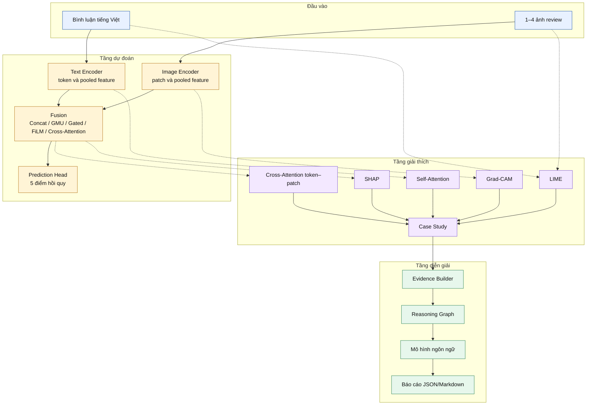

**Hình 4.1. Kiến trúc tổng thể của hệ thống.**

Hình 4.1 cũng cho thấy AI Agent là tầng hậu xử lý: agent không thay đổi dự đoán và không được dùng để lấp bằng chứng XAI còn thiếu.

## 4.2. Text Branch

`TextModel` dùng `AutoModel.from_pretrained`. Với chuỗi token \(T_i\), encoder sinh hidden state:

\[
H_i^t = E_t(T_i)\in\mathbb{R}^{L\times d_t}.
\]

Đối với nhánh đơn phương thức, `pooler_output` được dùng nếu có; nếu không, vector token đầu được lấy làm \(\mathbf{h}_i^t\). Head đơn phương thức gồm `Linear(d_t,256)`, ReLU, Dropout 0,2 và `Linear(256,5)`. Khi dùng Cross-Attention, `return_tokens=True` trả cả \(H_i^t\) và padding mask, nhờ đó không làm mất cấu trúc chuỗi.

### 4.2.1. Tokenization và attention mask

Văn bản được truncate/pad đến `max_length=256`. Tokenizer tương ứng với từng backbone chịu trách nhiệm ánh xạ chuỗi thành `input_ids`; `attention_mask` phân biệt token thật và padding. Việc sử dụng đúng tokenizer của checkpoint là điều kiện bắt buộc, vì token ID không có semantics chung giữa XLM-R, PhoBERT và ViSoBERT.

Trong visualization, subword cần được merge về đơn vị dễ đọc. XLM-R thường dùng marker bắt đầu từ mới, trong khi PhoBERT có convention khác và phụ thuộc word-segmented input. Nếu trình bày raw token mà không xử lý marker, một từ tiếng Việt có thể bị tách thành nhiều fragment, khiến attention bar khó diễn giải và AI Agent nhận evidence nhiễu.

### 4.2.2. Pooling strategy

First-token pooling là lựa chọn triển khai hiện tại:

\[
\mathbf{h}^t=H^t_{[:,0,:]}.
\]

Ưu điểm là đơn giản, nhất quán giữa batch và ít chi phí. Hạn chế là giả định token đầu tổng hợp đủ nội dung cho regression. Hai lựa chọn thay thế có cơ sở:

\[
\mathbf{h}_{mean}^t=
\frac{\sum_{\ell=1}^{L}m_\ell H_\ell^t}
{\sum_{\ell=1}^{L}m_\ell},
\]

và attention pooling:

\[
a_\ell=
\frac{\exp(\mathbf{w}^{\top}\tanh(WH_\ell^t))}
{\sum_j\exp(\mathbf{w}^{\top}\tanh(WH_j^t))},
\qquad
\mathbf{h}_{attn}^t=\sum_\ell a_\ell H_\ell^t.
\]

Mean pooling phân phối vai trò trên token thật; attention pooling học trọng số task-specific nhưng thêm tham số và có thể overfit. Pooling strategy nên được ablate độc lập sau khi chọn Text Backbone, không thay đổi cùng lúc với tokenizer hoặc Fusion Mechanism.

### 4.2.3. Fine-tuning strategy

Trong giai đoạn unimodal, toàn bộ Text Branch có thể được tối ưu. Khi huấn luyện fusion, hai branch được freeze mặc định rồi chỉ unfreeze \(n\) Transformer layer cuối nếu được cấu hình. Chiến lược này có ba mục đích: bảo toàn representation đã học, giảm VRAM và hạn chế catastrophic forgetting khi dataset nhỏ.

Freezing toàn bộ có thể làm encoder không thích ứng với signal của Fusion Mechanism. Ngược lại, unfreeze quá nhiều layer làm tăng variance và chi phí. Vì vậy, số layer unfreeze phải được cố định trong ablation fusion. Helper dùng chung tìm `encoder.layer` theo cấu trúc Hugging Face và phát warning nếu không nhận diện được backbone, tránh tình trạng yêu cầu unfreeze nhưng thực tế không có parameter nào thay đổi.

### 4.2.4. Ưu điểm và giới hạn

Text Branch tận dụng pretrained contextual representation, hỗ trợ informal context và negation tốt hơn bag-of-words. Tuy nhiên, first-token representation có thể bỏ sót long review; truncation có thể cắt aspect ở cuối; cleaning quá mức có thể loại emoji hoặc slang mang sentiment; và attention output của SDPA backend không luôn khả dụng cho XAI. XAI mode vì thế chuyển attention implementation sang eager khi cần lấy weight, nhưng không thay đổi training path.

## 4.3. Image Branch

`ImageModel` dùng `timm.create_model(..., num_classes=0)`. Trong baseline, mỗi ảnh được encode thành vector và trung bình có mask:

\[
\mathbf{h}_i^v=
\frac{1}{n_i}\sum_{j=1}^{n_i}E_v(v_{ij}).
\]

Prediction Head đơn phương thức có cấu trúc tương tự Text Branch. Đối với Cross-Attention, `forward_features()` chuẩn hóa output 3D/4D của ViT, SigLIP, ConvNeXt, Swin hoặc EfficientNet thành:

\[
H_i^v\in\mathbb{R}^{P\times d_v}.
\]

Patch ở cùng vị trí được trung bình trên các ảnh thật; ảnh đệm bị loại bằng `num_images`. Với Swin-B và đầu vào \(224\times224\), tài liệu triển khai ghi nhận lưới cuối \(7\times7\), tức \(P=49\).

### 4.3.1. Image preprocessing

Mỗi backbone yêu cầu resize, crop, normalization mean/std và interpolation phù hợp với pretraining. Hệ thống ưu tiên `AutoImageProcessor` nếu model name có cấu hình Hugging Face hợp lệ; nếu không, `TimmProcessor` lấy data config của chính backbone. Việc dùng processor của ConvNeXt cho Swin hoặc EfficientNet có thể tạo preprocessing mismatch, do đó processor là một controlled variable cần được ghi trong config.

Ảnh được chuyển RGB. File cục bộ được tìm bằng MD5 của URL; nếu thiếu, loader thử tải từ URL. Trong protocol tái lập, network fallback nên bị vô hiệu sau khi tạo frozen image cache để tránh cùng experiment đọc ảnh khác nhau theo thời gian.

### 4.3.2. Multi-image masked mean

Với \(n_i\) ảnh thật và \(N=4\) slot:

\[
\mathbf{h}_i^v=
\frac{\sum_{j=1}^{N}m_{ij}E_v(v_{ij})}
{\max(1,\sum_{j=1}^{N}m_{ij})},
\qquad
m_{ij}=\mathbb{1}[j\le n_i].
\]

Masked mean là permutation-invariant và không thêm tham số. Nó là Strong Baseline hợp lý khi chưa có supervision về ảnh quan trọng. Hạn chế là mọi ảnh thật có trọng số bằng nhau. Attention pooling qua ảnh có thể học:

\[
\alpha_{ij}=
\operatorname{softmax}_j\left(
\mathbf{w}^{\top}\tanh(W\mathbf{h}_{ij}^v)
\right),
\qquad
\mathbf{h}_i^v=\sum_j\alpha_{ij}\mathbf{h}_{ij}^v,
\]

nhưng cần regularization và kiểm tra gate collapse.

### 4.3.3. Patch extraction cho Cross-Attention

`forward_features()` chuẩn hóa hai loại output:

- token sequence \([B\!\times\!N,P,D]\) từ ViT/SigLIP;
- spatial map ở BCHW hoặc BHWC từ ConvNeXt, Swin và EfficientNet.

Spatial map được flatten thành patch sequence. Feature của cùng patch index được trung bình qua các ảnh thật để giữ sequence length cố định. Đây là compromise kỹ thuật: memory của Cross-Attention không tăng theo số ảnh, nhưng alignment theo index giữa hai ảnh khác nội dung không có bảo đảm ngữ nghĩa. Một thiết kế mạnh hơn có thể nối patch của mọi ảnh và dùng image-position embedding cùng patch mask; chi phí khi đó tăng từ \(TP\) lên \(TNP\).

### 4.3.4. Fine-tuning và target sensitivity

Image Branch có Prediction Head riêng trong giai đoạn image-only. Khi fusion, backbone được freeze rồi có thể unfreeze block cuối của ConvNeXt/Swin/EfficientNet. Grad-CAM hook đặt ở feature map cuối trước pooling; gradient đi từ một target cụ thể qua Shared Head và Fusion Mechanism về Image Branch. Vì năm target chỉ tách ở layer cuối, gradient map có thể tương tự nhau. Đây là đặc tính kiến trúc cần đo bằng cosine similarity, không nên tự động xem là lỗi implementation.

## 4.4. Các Fusion Mechanism

Implementation cung cấp năm cơ chế trong Bảng 4.1. Tất cả đóng băng hai backbone trước, sau đó có thể mở khóa có chọn lọc các layer/block cuối bằng helper dùng chung.

**Bảng 4.1. So sánh các Fusion Mechanism đã triển khai.**

| Cơ chế | Phép kết hợp chính | Đặc điểm |
|---|---|---|
| Concat | \([\mathbf{h}^t;\mathbf{h}^v]\) | Baseline đơn giản, ít giả định |
| GMU | \(g\odot\tilde{h}^t+(1-g)\odot\tilde{h}^v\) | Học cổng cân bằng hai phương thức |
| Gated Cross-Modal | Mỗi nhánh được điều kiện hóa bởi nhánh kia rồi gated | Tương tác hai chiều ở mức vector |
| FiLM | \(\gamma(\mathbf{h}^t)\odot\mathbf{h}^v+\beta(\mathbf{h}^t)\) | Văn bản điều biến đặc trưng ảnh |
| Cross-Attention | Attention hai chiều giữa token và patch | Giữ tương tác chi tiết \(T\times P\) |

Concat, GMU, Gated Cross-Modal và FiLM dùng vector pooled. Cross-Attention dùng chuỗi token/patch và được trình bày riêng ở Mục 4.5.

### 4.4.1. Concatenation + MLP

Concatenation tạo:

\[
\mathbf{z}_{concat}=[\mathbf{h}^t;\mathbf{h}^v],
\qquad
\hat{\mathbf{y}}=g_\phi(\mathbf{z}_{concat}).
\]

Ưu điểm lớn nhất của Concatenation là tính kiểm soát: không có gate hoặc alignment phụ, vì vậy mọi cải thiện của phương pháp nâng cao có thể so với một Baseline rõ ràng. Hạn chế là MLP chỉ học interaction sau khi hai modality đã bị pool; quan hệ token–patch bị mất.

### 4.4.2. Gated Multimodal Unit

GMU chiếu hai modality về cùng hidden dimension:

\[
\tilde{\mathbf{h}}^t=\tanh(W_t\mathbf{h}^t+b_t),\qquad
\tilde{\mathbf{h}}^v=\tanh(W_v\mathbf{h}^v+b_v),
\]

\[
\mathbf{g}=\sigma(W_g[\mathbf{h}^t;\mathbf{h}^v]+b_g),
\]

\[
\mathbf{z}_{gmu}
=\mathbf{g}\odot\tilde{\mathbf{h}}^t
+(1-\mathbf{g})\odot\tilde{\mathbf{h}}^v.
\]

Gate được học theo sample và theo hidden dimension, nên có thể giảm tác động của ảnh nhiễu. Nhược điểm là gate value không tự động là explanation: scale của projection và downstream head vẫn ảnh hưởng prediction. Gate statistics chỉ nên dùng cùng ablation và SHAP.

### 4.4.3. Gated Cross-Modal Fusion

Hai feature trước hết được điều kiện hóa chéo:

\[
\mathbf{h}^{t\prime}=\mathbf{h}^t+
\tanh(W_{v\rightarrow t}\mathbf{h}^v),
\]

\[
\mathbf{h}^{v\prime}=\mathbf{h}^v+
\tanh(W_{t\rightarrow v}\mathbf{h}^t).
\]

Sau đó một gate kết hợp hai projection. Residual connection giữ feature gốc trong khi thêm context từ modality còn lại. Cơ chế này biểu diễn interaction mạnh hơn GMU nhưng vẫn ở mức vector; nó phù hợp khi cần chi phí thấp hơn token–patch attention.

### 4.4.4. FiLM

Text Branch sinh \(\gamma,\beta\) để điều biến image feature:

\[
\gamma=W_\gamma\mathbf{h}^t+b_\gamma,\qquad
\beta=W_\beta\mathbf{h}^t+b_\beta,
\]

\[
\mathbf{h}^{v\prime}=\gamma\odot\mathbf{h}^v+\beta,
\qquad
\mathbf{z}_{film}=[\mathbf{h}^t;\mathbf{h}^{v\prime}].
\]

Implementation khởi tạo \(\gamma\approx1,\beta\approx0\), khiến FiLM bắt đầu gần identity transformation thay vì làm biến dạng Image Branch ngay từ epoch đầu. Điểm mạnh là conditioning hiệu quả; điểm yếu là hướng điều kiện hóa cố định và dimension của \(\gamma,\beta\) tăng theo image feature size.

### 4.4.5. Tiêu chí lựa chọn Fusion Mechanism

Fusion Mechanism không được chọn chỉ theo một mean MAE nhỏ hơn rất ít. Quyết định cần xét:

- cải thiện nhất quán trên nhiều target và seed;
- mức variance giữa run;
- chi phí huấn luyện/suy luận;
- khả năng xử lý missing/noisy image;
- dấu hiệu branch collapse;
- giá trị XAI bổ sung;
- độ phức tạp triển khai và rủi ro shape mismatch.

Cross-Attention có expressive capacity và XAI value cao nhất trong năm phương pháp, nhưng chỉ được ưu tiên nếu kết quả hoặc insight bổ sung biện minh cho chi phí.

## 4.5. Cross-Attention token–patch

Hai phép chiếu đưa token và patch về cùng chiều 512:

\[
Q_t=H^tW_t,\qquad Q_v=H^vW_v.
\]

Attention từ văn bản sang ảnh và từ ảnh sang văn bản:

\[
Z_{t\rightarrow v}
=\operatorname{MHA}(Q_t,Q_v,Q_v),
\qquad
Z_{v\rightarrow t}
=\operatorname{MHA}(Q_v,Q_t,Q_t).
\]

Padding mask văn bản và patch mask ảnh được truyền vào `key_padding_mask`. Hai chuỗi đầu ra được masked-mean pooling rồi nối:

\[
\mathbf{z}=
\left[
\operatorname{MaskedMean}(Z_{t\rightarrow v});
\operatorname{MaskedMean}(Z_{v\rightarrow t})
\right]\in\mathbb{R}^{1024}.
\]

Luồng này được minh họa trong Hình 4.2.

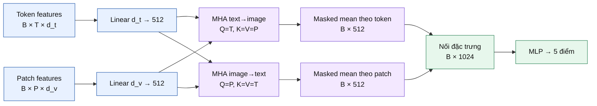

**Hình 4.2. Luồng Cross-Attention hai chiều token–patch.**

Khác với phiên bản một vector, trọng số hiện có dạng \([B,H,T,P]\) trước khi trung bình head và không còn đồng nhất bằng 1. Thay đổi này làm cho Cross-Attention có giá trị trực quan hóa, nhưng đồng thời yêu cầu huấn luyện và sinh lại toàn bộ artifact phụ thuộc checkpoint.

### 4.5.1. Multi-head formulation

Với head \(r\):

\[
\operatorname{head}_r=
\operatorname{softmax}\left(
\frac{QW_r^Q(KW_r^K)^\top}{\sqrt{d_h}}
+M
\right)VW_r^V,
\]

trong đó \(M\) chứa \(-\infty\) tại padding key. Output của \(H\) head được nối và chiếu:

\[
\operatorname{MHA}(Q,K,V)
=
[\operatorname{head}_1;\ldots;\operatorname{head}_H]W^O.
\]

Hệ thống dùng hidden size 512 và 8 head, tương ứng \(d_h=64\). Dropout 0,1 được áp dụng trong attention. Text-to-image output có shape \([B,T,512]\); image-to-text output có shape \([B,P,512]\).

### 4.5.2. Masked pooling

Text padding không được đưa vào trung bình:

\[
\operatorname{MaskedMean}(Z,m)=
\frac{\sum_{\ell}m_\ell Z_\ell}
{\max(1,\sum_{\ell}m_\ell)}.
\]

Patch mask hiện toàn True sau khi ảnh được aggregate, nhưng interface vẫn giữ mask để tương thích với thiết kế patch sequence thay đổi trong tương lai.

### 4.5.3. Ý nghĩa của hai nửa fused vector

Vector 1.024 chiều gồm:

- 512 chiều **text-origin**: bắt đầu từ text query nhưng đã tổng hợp image value;
- 512 chiều **image-origin**: bắt đầu từ image query nhưng đã tổng hợp text value.

Vì đã có cross-modal mixing, gọi hai segment là “text-only” và “image-only” là không chính xác. Phân tích SHAP theo segment đo nguồn khởi phát của representation, không phân rã thông tin thuần túy theo modality.

### 4.5.4. Lợi ích và rủi ro

Cross-Attention giữ interaction trước pooling, cho phép từ như “ngon” liên kết với patch món ăn hoặc “không gian” liên kết với vùng nội thất. Tuy nhiên, attention score cao có thể phản ánh normalization hoặc head specialization chứ không phải feature importance. Chi phí memory tăng theo \(BTP\), và việc dùng mean patch qua nhiều ảnh có thể làm alignment khó diễn giải. Vì vậy, Cross-Attention visualization được xem là evidence về association và phải kết hợp với target-specific Grad-CAM/SHAP/LIME.

## 4.6. Prediction Head và Loss Function

Đối với Cross-Attention, prediction head là:

\[
1024\rightarrow512\rightarrow256\rightarrow5,
\]

với ReLU và Dropout 0,2. Năm lựa chọn Loss Function đã được triển khai như Bảng 4.2.

**Bảng 4.2. Các Loss Function đã triển khai.**

| Hàm | Biểu thức tóm tắt | Mục đích |
|---|---|---|
| MSE | \(\frac{1}{5N}\sum_{i,k}(\hat y_{ik}-y_{ik})^2\) | Baseline, phạt mạnh sai số lớn |
| Huber | Bậc hai gần 0, tuyến tính khi sai số lớn | Giảm ảnh hưởng outlier |
| SmoothL1 | Smooth L1 theo từng sai số | Một biến thể robust có chuyển tiếp trơn |
| Log-Cosh | \(\frac{1}{5N}\sum\log\cosh(\hat y-y)\) | Trơn và bền vững hơn MSE |
| Uncertainty-weighted | \(\frac{1}{2}e^{-s_k}L_k+\frac{1}{2}s_k\) | Học trọng số cho từng mục tiêu [5] |

Code dùng dạng ổn định số của Log-Cosh:

\[
\log\cosh(x)=|x|-\log 2+\operatorname{softplus}(-2|x|).
\]

Tài liệu cũ từng đề xuất joint loss với hệ số \(\alpha\) riêng cho `overall`, nhưng hàm này chưa được triển khai; báo cáo không mô tả nó như phương pháp hiện hành.

### 4.6.1. Shared Prediction Head

Prediction Head dùng hidden representation chung rồi chiếu ra năm neuron:

\[
\mathbf{u}_1=\operatorname{ReLU}(W_1\mathbf{z}+b_1),\quad
\mathbf{u}_2=\operatorname{ReLU}(W_2\operatorname{Dropout}(\mathbf{u}_1)+b_2),
\]

\[
\hat{\mathbf{y}}=W_o\mathbf{u}_2+b_o\in\mathbb{R}^{5}.
\]

Thiết kế shared head khai thác correlation giữa các aspect nhưng cũng có thể làm explanation của năm target tương tự vì chỉ hàng cuối của \(W_o\) phân biệt output. Một thiết kế khác là shared trunk + target-specific sub-head, tạo capacity riêng cho mỗi aspect. Đề tài giữ shared head để kiểm soát số tham số; target-specific head có thể là ablation tương lai.

Output không bị clamp trong training hoặc inference. Điều này tránh gradient saturation do sigmoid nhưng cho phép prediction ngoài khoảng 0–10. Evaluation cần ghi tỷ lệ out-of-range; deployment có thể clamp ở presentation layer nhưng phải báo cả raw prediction để không che lỗi calibration.

### 4.6.2. MSE, Huber và SmoothL1

MSE tối ưu kỳ vọng có điều kiện dưới giả định Gaussian noise và phạt sai số lớn theo bình phương. Huber chuyển từ bậc hai sang tuyến tính sau threshold \(\delta\):

\[
L_\delta(e)=
\begin{cases}
\frac{1}{2}e^2,& |e|\le\delta,\\
\delta(|e|-\frac{1}{2}\delta),& |e|>\delta.
\end{cases}
\]

SmoothL1 có dạng gần Huber với scaling khác trong PyTorch. Cả hai giảm ảnh hưởng của outlier, nhưng nếu điểm cực đoan là tín hiệu thật thay vì label noise, robust loss có thể underfit tail.

### 4.6.3. Log-Cosh

Log-Cosh gần \(\frac{1}{2}e^2\) khi \(e\) nhỏ và gần \(|e|-\log2\) khi \(e\) lớn. Implementation sử dụng dạng ổn định số để tránh overflow trong AMP. Đây là lựa chọn hợp lý khi muốn gradient trơn hơn Huber. Tuy nhiên, việc loss value thấp hơn giữa hai loại loss không có ý nghĩa so sánh trực tiếp; model phải được chọn theo cùng evaluation metric như mean MAE.

### 4.6.4. Homoscedastic Uncertainty Weighting

Mỗi task \(k\) có learnable log variance \(s_k\):

\[
\mathcal{L}=
\frac{1}{K}\sum_{k=1}^{K}
\left[
\frac{1}{2}\exp(-s_k)L_k
+\frac{1}{2}s_k
\right].
\]

Khi task có residual lớn, mô hình có thể tăng uncertainty và giảm effective weight. Regularization term \(\frac{1}{2}s_k\) ngăn weight giảm vô hạn. Các \(s_k\) phải được thêm vào optimizer và lưu checkpoint. Khi báo cáo, cần vẽ weight history để phát hiện một target bị bỏ qua.

### 4.6.5. Nguyên tắc so sánh Loss Function

Loss Function là objective huấn luyện, không phải metric báo cáo. So sánh công bằng yêu cầu giữ architecture, optimizer, schedule, seed và split cố định. Cần đánh giá không chỉ mean MAE mà còn:

- per-target MAE/RMSE;
- quantile của absolute error;
- tỷ lệ lỗi lớn hơn 2 và 3 điểm;
- prediction range;
- learning curve và early-stopping epoch;
- trade-off giữa Overall Satisfaction và bốn aspect.

## 4.7. Huấn luyện và suy luận

Hình 4.3 thể hiện chiến lược tuần tự: huấn luyện Text Branch và Image Branch, nạp hai checkpoint tốt nhất, sau đó huấn luyện fusion.

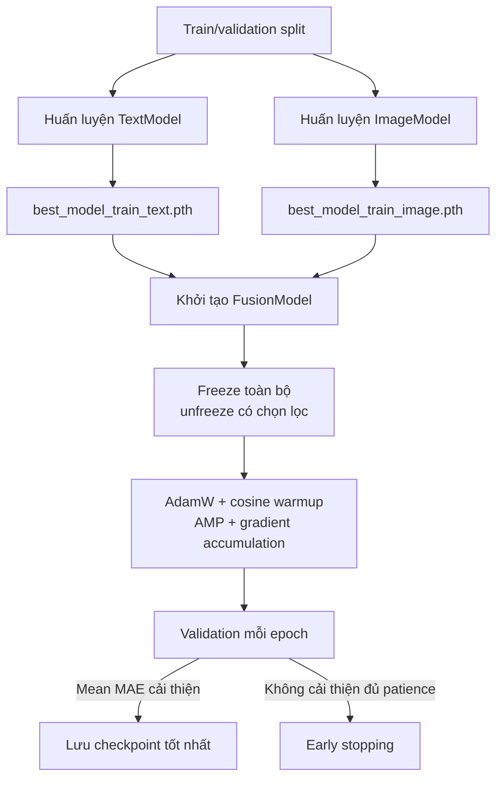

**Hình 4.3. Pipeline huấn luyện tuần tự.**

Trainer dùng AdamW, gradient clipping 1,0, cosine schedule có warmup, AMP tùy chọn và chọn checkpoint theo `mean_mae`. Sau huấn luyện, code lưu `metrics.json` và `predictions.csv`.

Khi suy luận, Hình 4.4 cho thấy `test.py` dựng lại đúng kiến trúc từ tham số, nạp checkpoint, dự đoán năm điểm và xuất metrics, predictions cùng ba nhóm biểu đồ.

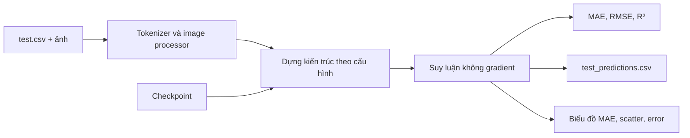

**Hình 4.4. Pipeline suy luận.**

### 4.7.1. Optimizer và scheduler

AdamW tối ưu các parameter có `requires_grad=True` với learning rate và weight decay cấu hình. Cosine schedule giảm learning rate theo chu kỳ cosine sau warmup:

\[
\eta_t=
\eta_{\max}\cdot
\frac{1}{2}
\left(1+\cos\frac{\pi(t-t_w)}{T-t_w}\right),
\quad t>t_w.
\]

Warmup 10% giúp giảm cập nhật quá lớn khi fine-tuning pretrained backbone. Gradient clipping với max norm 1,0 kiểm soát exploding gradient, đặc biệt ở Cross-Attention và uncertainty loss.

### 4.7.2. Gradient accumulation và AMP

Với micro-batch \(b\) và `grad_accum_steps=a`, effective batch là \(ab\). Loss được chia cho \(a\), backward trên từng micro-batch và optimizer step sau \(a\) lần. AMP giảm memory bằng mixed precision, trong khi GradScaler giảm underflow. Việc bật AMP phải được ghi trong config vì numerical difference có thể ảnh hưởng reproducibility.

### 4.7.3. Model selection và early stopping

Validation được thực hiện sau mỗi epoch trên toàn bộ sample. Checkpoint được chọn theo mean MAE năm target, không theo training loss. Khi metric không cải thiện trong `patience` epoch, training dừng. Primary criterion phải được xác định trước run; nếu đổi sang Overall MAE sau khi xem kết quả sẽ tạo researcher degree of freedom.

### 4.7.4. Checkpoint contract

Checkpoint đầy đủ chứa epoch, model state, optimizer state, scheduler state, best validation metric và arguments. Khi resume, cả optimizer/scheduler phải được phục hồi để learning-rate trajectory không bị reset. Checkpoint compatibility phụ thuộc architecture; migration từ vector attention sang token–patch giữ shape parameter chính nhưng thay semantics forward pass, do đó cần retraining thay vì chỉ tái sử dụng metric cũ.

### 4.7.5. Inference contract

Inference chạy `model.eval()` và `torch.no_grad()`, truyền đúng `num_images`, thu prediction của mọi batch rồi tính metric từ array hoàn chỉnh. Output gồm:

- `test_metrics.json`: aggregate metric;
- `test_predictions.csv`: true/pred/error theo sample;
- MAE bar chart;
- prediction-vs-ground-truth scatter;
- error distribution.

Prediction CSV là nguồn bắt buộc cho paired statistical test, error analysis, case selection và XAI sampling.

## 4.8. Pipeline XAI

Hình 4.5 biểu diễn sáu pha XAI đã có mã nguồn. Các phương pháp hoạt động ở những attachment point khác nhau nên không thể thay thế lẫn nhau.

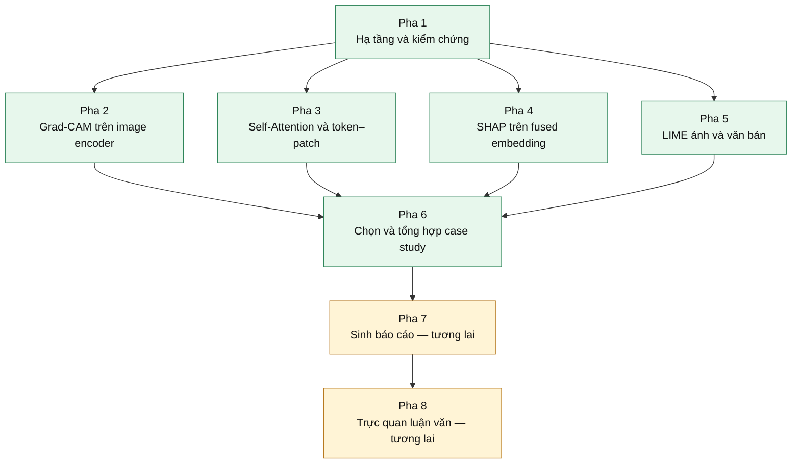

**Hình 4.5. Pipeline XAI nhiều mức.**

Bảng 4.3 tách trạng thái triển khai khỏi trạng thái chạy artifact.

**Bảng 4.3. Trạng thái các pha XAI.**

| Pha | Nội dung | Trạng thái mã nguồn | Evidence thực thi hiện có |
|---|---|---|---|
| 1 | Load model, tiền xử lý, kiểm chứng shape và attention | Đã triển khai | Chưa có execution output |
| 2 | Grad-CAM theo năm target; chẩn đoán similarity | Đã triển khai | Chưa có heatmap cam kết |
| 3 | PhoBERT self-attention và Cross-Attention token–patch | Đã triển khai | Chưa có heatmap/NPZ cam kết |
| 4 | SHAP tại fused embedding; ablation text/image-origin | Đã triển khai | Chưa có SHAP artifact cam kết |
| 5 | LIME ảnh và văn bản | Đã triển khai | Chưa có LIME artifact cam kết |
| 6 | Chọn bảy loại case; ghép hình; sinh metadata | Đã triển khai | Chưa có case study cam kết |
| 7 | Sinh báo cáo XAI tự động | Mới có proposal | Công việc tương lai |
| 8 | Chuẩn hóa hình luận văn | Mới có proposal | Công việc tương lai |

### 4.8.1. Nguyên tắc architecture-aligned XAI

Mỗi XAI method phải gắn vào tensor có semantics phù hợp. Grad-CAM cần spatial feature map; Self-Attention cần attention tensor; SHAP cần mapping từ fused representation đến scalar target; LIME cần full prediction function. Gắn đúng thư viện nhưng sai attachment point vẫn tạo hình hợp lệ về cú pháp nhưng vô nghĩa về khoa học.

Pipeline áp dụng bốn quy tắc:

1. Giải thích một target tại một thời điểm.
2. Giữ modality còn lại cố định khi perturb một modality.
3. Lưu raw values cùng hình ảnh.
4. Ghi metadata gồm model/checkpoint, layer, seed, sample ID và tham số explainer.

### 4.8.2. Grad-CAM workflow

`GradCAMExplainer` tìm target layer, đăng ký forward/backward hook, chạy full multimodal forward và backward từ một score. Activation được chuẩn hóa từ BHWC/BCHW/BNC/BCN về BCHW. Với multi-image input, hook thu activation cho \(B\times N\) ảnh và explainer cắt theo image index trong khi prediction vẫn dùng toàn bộ context.

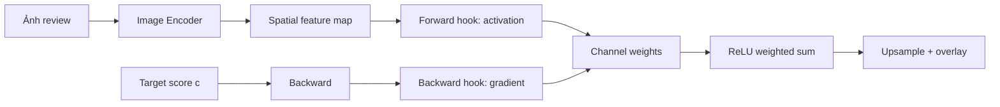

**Hình 4.6. Quy trình tạo Grad-CAM target-specific.**

Ngoài heatmap, hệ thống tính cosine similarity giữa gradient của năm target và correlation giữa raw CAM. Nếu similarity cao, kết luận phù hợp là Shared Head tạo gradient gần nhau; không nên chỉnh màu hoặc chọn sample chỉ để làm hình khác biệt hơn.

### 4.8.3. Self-Attention workflow

Text encoder được chạy với `output_attentions=True`. Mỗi layer cung cấp \([B,H,L,L]\). Các strategy gồm mean over heads, last-layer attention, last-four-layer mean và CLS-to-token importance. Special token và padding được loại khỏi biểu đồ dành cho người đọc; subword được merge có trọng số.

Attention sink ratio đo tỷ lệ attention rơi vào special token. Nếu ratio quá cao, word importance bar có thể gây hiểu lầm. Self-Attention là global đối với Text Branch và không target-specific; vì vậy nó được kết hợp với LIME Text hoặc gradient method khi cần giải thích một score cụ thể.

### 4.8.4. Cross-Attention workflow

Do forward chính bỏ qua attention weight trả về, explainer gọi trực tiếp hai `MultiheadAttention` module với cùng projected token/patch và mask. Artifact gồm:

- raw matrix `.npz`;
- Top-K token–patch pair JSON;
- heatmap Top-K;
- token-to-patch overlay;
- patch-to-token bar;
- bipartite graph;
- entropy và importance summary.

Full \(T\times P\) heatmap bị giới hạn khi \(T\) dài vì không đọc được. Top-K visualization giảm clutter nhưng có thể che long-tail pattern; raw matrix vẫn được lưu để phân tích định lượng.

### 4.8.5. SHAP workflow

Forward pre-hook ở `model.head` lấy fused embedding. `FusionHeadWrapper` chọn một output scalar. Background được lấy từ validation embedding; DeepExplainer tính attribution và additivity check:

\[
\left|
f(\mathbf{z})
-\left(\mathbb{E}[f(\mathbf{z})]+\sum_j\phi_j\right)
\right|<\epsilon.
\]

Modality-origin contribution:

\[
C_t=\sum_{j=1}^{512}|\phi_j|,
\qquad
C_v=\sum_{j=513}^{1024}|\phi_j|,
\]

\[
p_t=\frac{C_t}{C_t+C_v},\qquad p_v=1-p_t.
\]

Zero-ablation của từng segment được chạy như complementary check. Vì hai segment đã cross-attend, ablation thay đổi joint representation tại head input chứ không mô phỏng hoàn toàn việc thiếu modality từ đầu pipeline.

### 4.8.6. LIME workflow

LIME Image tạo superpixel bằng quickshift, sinh mask ngẫu nhiên, thay vùng tắt bằng baseline color, xử lý batch và đọc target score. LIME Text tách theo khoảng trắng, tạo câu perturb, tokenize lại và giữ image tensor cố định. Với regression, implementation ánh xạ score sang pseudo two-column output cho LIME interface; đây là heuristic và phải được ghi trong limitation.

Stability protocol đề xuất chạy ít nhất ba seed và đo overlap Top-K word/superpixel. Một explanation chỉ được dùng trong case study nếu local surrogate đạt fidelity chấp nhận được và pattern không thay đổi hoàn toàn giữa seed.

### 4.8.7. Case Study Selection

Pha 6 chọn sample theo bảy loại: correct, high-error, conflict, text-dominant, image-dominant, difficult và agreement. Selection score kết hợp prediction quality, visual richness, text richness, multimodal balance và explanation completeness. Candidate không có artifact bị loại; rare case được ưu tiên trước để tránh một sample xuất hiện ở nhiều loại.

Mỗi case phải hiển thị review đầy đủ, mọi ảnh, bảng ground truth–prediction–error, lý do chọn và trạng thái artifact. Combined figure không được tự bịa panel; nếu method thiếu, panel ghi trạng thái thiếu và metadata lưu warning.

### 4.8.8. Cross-method agreement

Agreement không được tính chỉ bằng cảm nhận “hai hình trông giống nhau”. Protocol có thể gồm:

- overlap giữa Grad-CAM hot region và LIME positive superpixel;
- overlap token sau normalize giữa Self-Attention Top-K và LIME Text Top-K;
- consistency giữa SHAP modality dominance và strength của evidence theo modality;
- relation giữa Cross-Attention top patch và Grad-CAM region;
- stability của từng method qua seed/background.

Kết quả agreement nên được báo theo target và sample. Disagreement có thể chỉ ra instability, target mismatch, modality interaction hoặc giới hạn của method; nó không tự động chứng minh mô hình sai.

## 4.9. Pipeline AI Agent

AI Agent nhận predictions và artifact XAI, không nhận ảnh thô trong chế độ mặc định. Luồng xử lý trong Hình 4.6 đặt reasoning graph trước mô hình ngôn ngữ để giảm việc suy diễn tự do.

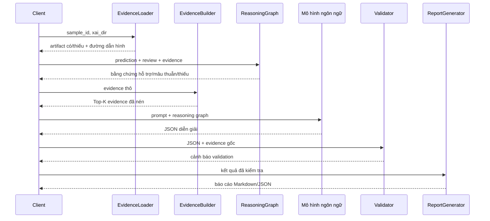

**Hình 4.7. Pipeline AI Agent dựa trên bằng chứng.**

Các module chính được tóm tắt ở Bảng 4.4.

**Bảng 4.4. Các module AI Agent.**

| Module | Trách nhiệm |
|---|---|
| `evidence_loader.py` | Nạp JSON/PNG của năm nhóm XAI, lọc token nhiễu và ghi nhận thiếu hụt |
| `evidence_builder.py` | Nén Top-K attention, token–patch, SHAP và LIME |
| `reasoning.py` | Xếp hạng bằng chứng, phát hiện xung đột, tạo agreement matrix |
| `prompt_builder.py` | Ràng buộc ngôn ngữ, grounding và cấu trúc đầu ra |
| `openai_client.py` | Gọi API, retry và parse JSON |
| `output_schema.py` | Định nghĩa schema và ánh xạ mức điểm |
| `validator.py` | Kiểm tra đủ target, schema, evidence và hạn chế |
| `report_generator.py` | Sinh hai phần: góc nhìn người dùng và phân tích kỹ thuật |

Agent hiện cấu hình `gpt-4o` cho batch/report/vision, temperature 0,3. Đây là lựa chọn triển khai trong code, không phải kết luận so sánh mô hình. API key chỉ được đọc từ biến môi trường, `.env` hoặc Colab secret.

### 4.9.1. Evidence loading và provenance

Evidence Loader chỉ đọc các filename đã định nghĩa cho Grad-CAM, Attention, Cross-Attention, SHAP, LIME và case study. Mỗi method thiếu được ghi vào `_missing`; lỗi parse không bị thay bằng giá trị suy đoán. Token đặc biệt, fragment quá ngắn và BPE noise được lọc trước khi tạo prompt. Đường dẫn PNG tồn tại được chèn vào `visual_artifacts`, cho phép report liên kết hình thật.

Provenance tối thiểu cho mỗi evidence item gồm sample ID, method, target, score/weight và artifact path. Phiên bản tương lai nên thêm checksum của checkpoint và artifact để ngăn report cũ trỏ đến kết quả mới.

### 4.9.2. Evidence compression

Raw XAI có kích thước lớn: attention matrix \(L\times L\), Cross-Attention \(T\times P\), SHAP 1.024 chiều và hàng trăm LIME perturbation. Evidence Builder nén thành Top-K:

- token và attention score;
- token–patch pair và tọa độ;
- SHAP percentage/signed sum theo target;
- LIME positive/negative word;
- Grad-CAM metadata.

Compression giảm token cost và tập trung prompt, nhưng tạo information bottleneck. Raw artifact phải được giữ để reviewer kiểm tra; Top-K không được xem là toàn bộ explanation.

### 4.9.3. Reasoning Graph

Reasoning Graph được xây trước LLM cho từng target:

\[
G_k=(E_k^+,E_k^-,E_k^{miss},S_k,K_k,H_k),
\]

trong đó \(E_k^+\) là supporting evidence, \(E_k^-\) là contradiction, \(E_k^{miss}\) là method thiếu, \(S_k\) là evidence strength, \(K_k\) là keyword match và \(H_k\) là interpretation hint.

Evidence được xếp hạng theo độ trực tiếp: review text kết hợp Attention/LIME; SHAP và Cross-Attention; LIME perturbation; Grad-CAM spatial evidence. Thứ hạng này là heuristic triển khai, không phải chân lý khoa học. Ưu điểm là LLM nhận cấu trúc rõ thay vì tự chọn quan hệ từ artifact rời rạc.

Agreement matrix biểu diễn strength của năm XAI method theo năm target. Nếu SHAP báo text-origin rất cao nhưng review không có keyword liên quan target, graph tạo contradiction. Nếu chỉ một method khả dụng, confidence bị giới hạn.

### 4.9.4. Prompt construction

System prompt quy định:

- không dùng ngôn ngữ suy đoán như “có thể mô hình đã…” khi không có evidence;
- không chuyển attention association thành causal claim;
- dùng đúng năm target;
- giữ thuật ngữ kỹ thuật chuẩn;
- tách Customer View và Technical View;
- không tạo khuyến nghị về chủ đề review không đề cập;
- không trả `null`;
- nêu rõ evidence thiếu.

User prompt chứa sample, prediction, optional ground truth, compressed evidence và Reasoning Graph. Structured JSON output giảm ambiguity so với free-form Markdown và cho phép validation tự động.

### 4.9.5. Schema validation và confidence

Validator kiểm tra JSON schema, đủ target, consistency giữa numeric score và qualitative level, required field, limitations, Customer View, agreement matrix và SHAP grounding. Warning không bị xóa; chúng được đưa vào Technical View.

Confidence không lấy trực tiếp từ probability của LLM. Rule hiện dựa vào số method khả dụng và agreement:

- **High:** 4–5 method có evidence và đồng thuận;
- **Medium:** 2–3 method hoặc có disagreement cần giải thích;
- **Low:** 0–1 method hoặc evidence mâu thuẫn/missing đáng kể.

Confidence này phản ánh độ đầy đủ của explanation evidence, không phải uncertainty của prediction.

### 4.9.6. Hallucination prevention

Pipeline dùng defense-in-depth:

1. Chỉ nạp file tồn tại.
2. Nén bằng rule deterministic.
3. Xây reasoning trước LLM.
4. Prompt cấm unsupported claim.
5. Structured output.
6. Validation sau generation.
7. Report hiển thị evidence completeness và limitation.

Các biện pháp này giảm nhưng không loại bỏ hallucination. Human review vẫn bắt buộc cho report dùng trong luận văn hoặc quyết định thực tế.

### 4.9.7. Hai lớp người đọc

Customer View diễn đạt ngắn gọn, tránh thuật ngữ như SHAP hoặc embedding, tập trung vào điểm mạnh/yếu được phản ánh trong review. Technical View giữ prediction, ground truth, evidence, modality contribution, agreement, limitation và artifact path. Tách hai lớp tránh việc cùng một đoạn vừa quá kỹ thuật với người dùng vừa quá đơn giản với giảng viên.

## 4.10. Tổ chức mã nguồn và artifact

Hình 4.8 trình bày các khu vực chính của mã nguồn và quan hệ đầu ra dự kiến.

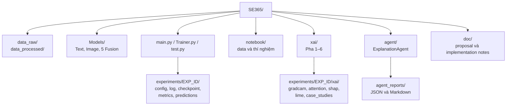

**Hình 4.8. Tổ chức mã nguồn và artifact.**

Như Hình 4.8 cho thấy, source module và dữ liệu xử lý đã hiện diện, trong khi checkpoint, frozen split và phần lớn XAI artifact được quản lý như runtime evidence. Điều này giải thích vì sao “đã triển khai” không đồng nhất với “đã nghiệm thu thực nghiệm”.

## 4.11. System Demonstration end-to-end

Mục này mô tả workflow hoàn chỉnh ở mức contract, không tạo một case giả định có score cụ thể. Hình 4.9 cho thấy dữ liệu đi qua sáu lớp và mỗi lớp tạo một nhóm output có thể kiểm tra.

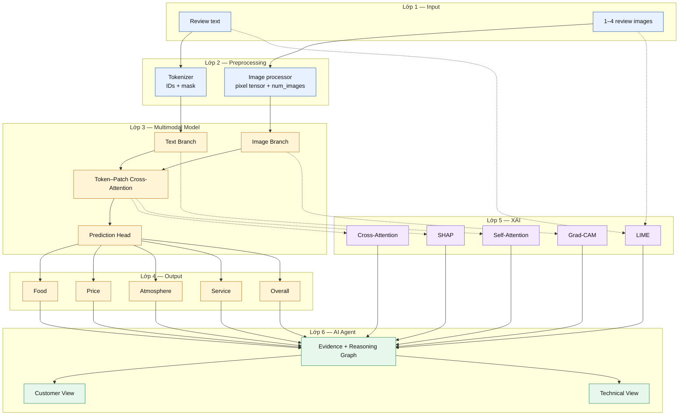

**Hình 4.9. Workflow demonstration hoàn chỉnh từ review đến hai lớp báo cáo.**

### 4.11.1. Input contract

Input hợp lệ gồm text không rỗng, danh sách URL/ảnh decode được, tối đa bốn ảnh được chọn, và optional ground truth. Mỗi sample có stable ID để liên kết prediction, artifact và report. Nếu không có ảnh hợp lệ, hệ thống hiện chưa có explicit missing-modality mode; đây là trường hợp phải reject hoặc xử lý bằng Text-only fallback.

### 4.11.2. Prediction contract

Prediction là vector năm số thực. Customer View có thể hiển thị score trong khoảng 0–10, nhưng raw output cần lưu riêng. Ground truth chỉ được dùng để đánh giá/error analysis, không được đưa vào Agent như evidence giải thích prediction trong kịch bản production; trong nghiên cứu, ground truth có thể xuất hiện ở Technical View để phân tích lỗi.

### 4.11.3. XAI contract

Mỗi artifact phải gắn sample ID và target nếu method target-specific. Grad-CAM và LIME Image cần chỉ rõ image index. Self-Attention/Cross-Attention cần token list đã merge và raw list để audit. SHAP cần background identifier và additivity error. LIME cần random seed, perturbation count và local fidelity.

### 4.11.4. Report contract

Customer View không được nói “mô hình nhìn vào vùng đỏ” hoặc “SHAP là 60%” vì người dùng không cần thuật ngữ đó. Technical View phải phân biệt prediction evidence với ground-truth error, ghi method thiếu, confidence reasoning và limitation. Report không được tạo score mới; mọi số điểm phải khớp prediction input.

## 4.12. Component interaction và sequence runtime

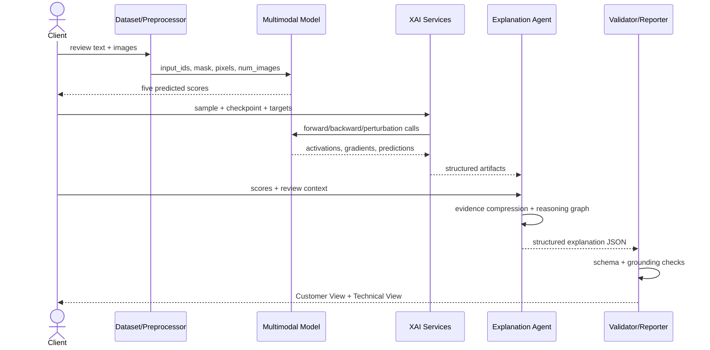

**Hình 4.10. Sequence tương tác giữa prediction, XAI và AI Agent.**

XAI có chi phí cao hơn inference thông thường và không nhất thiết chạy đồng bộ cho mọi request. Kiến trúc deployment hợp lý là prediction trả kết quả trước, còn XAI/report chạy asynchronous cho sample cần phân tích. Caching theo `(checkpoint_hash, sample_hash, method_config)` tránh chạy lại perturbation tốn kém.

## 4.13. Phân tích độ phức tạp

Gọi \(B\) là batch size, \(T\) số token, \(P\) số patch, \(D\) hidden size và \(H\) số head. Bỏ qua chi phí encoder:

- Concatenation + MLP: \(O(B(d_t+d_v)d_f)\).
- GMU/Gated/FiLM: cùng bậc tuyến tính theo feature dimension, thêm projection/gate.
- Bidirectional Cross-Attention: \(O(BTPD)\) cho attention score và weighted sum ở mỗi hướng.
- Attention memory: \(O(BHTP)\) nếu giữ per-head weight.

Với \(T=256,P=49,H=8\), một sample có \(256\times49=12.544\) liên kết mỗi hướng trước head dimension. Con số này vừa đủ cho GPU nhưng lớn hơn nhiều so với vector fusion. Nếu nối patch của bốn ảnh, \(P\) có thể tăng bốn lần.

Chi phí XAI:

- Grad-CAM: xấp xỉ một forward + một backward cho mỗi target/image context.
- Self-/Cross-Attention: một forward bổ sung và chi phí lưu matrix.
- SHAP DeepExplainer: phụ thuộc số background và sample.
- LIME: hàng trăm đến hàng nghìn forward cho mỗi modality/target.

Vì vậy, full XAI chỉ nên chạy trên case study có selection protocol, không chạy mặc định trên toàn bộ validation set.

## 4.14. Software Architecture quality attributes

Bảng 4.5 đối chiếu các quality attribute của kiến trúc với cơ chế đáp ứng và rủi ro còn lại.

**Bảng 4.5. Quality attributes và cơ chế đáp ứng.**

| Thuộc tính | Cơ chế thiết kế | Rủi ro còn lại |
|---|---|---|
| Modularity | Text/Image/Fusion/XAI/Agent tách module | Interface shape vẫn phụ thuộc backbone |
| Reproducibility | Seed, config, experiment directory, checkpoint | Dependency chưa pin hoàn toàn |
| Traceability | Stable sample ID và artifact naming | Thiếu hash/version trong metadata hiện tại |
| Extensibility | AutoModel, timm và fusion dispatch | New backbone cần kiểm tra preprocessing/output layout |
| Robustness | Masked image pooling, graceful missing artifact | Download fallback ảnh đen có thể im lặng |
| Explainability | Nhiều attachment point và raw artifact | Post-hoc method không bảo đảm causality |
| Security | API key từ environment/secret | Chưa có data-redaction layer trước external API |
| Maintainability | Shared unfreeze helper, config constants | Logic experiment còn phân tán giữa script và interactive workflow |

---

# CHƯƠNG 5. THỰC NGHIỆM

## 5.1. Mục tiêu của Experimental Methodology

Experimental Methodology được thiết kế để trả lời ba loại câu hỏi khác nhau:

1. **Contribution question:** ảnh có bổ sung tín hiệu ngoài văn bản hay không?
2. **Component question:** backbone, fusion và loss nào phù hợp dưới điều kiện kiểm soát?
3. **Interaction question:** các component tốt riêng lẻ có tạo thành cấu hình tốt khi kết hợp hay không?

Ba câu hỏi này không thể trả lời bằng một leaderboard duy nhất. Baseline comparison cần cô lập modality; ablation cần cô lập component; combination validation cần chủ động kiểm tra interaction effect. Vì vậy, đề tài sử dụng hai tầng: **Controlled Sequential Ablation** để giảm không gian tìm kiếm và tăng interpretability của từng bước; **Promising Combination Validation** để giảm bias do lựa chọn greedy.

## 5.2. Biến độc lập, biến phụ thuộc và biến kiểm soát

**Bảng 5.1. Phân loại biến trong thiết kế thực nghiệm.**

| Loại biến | Thành phần | Cách kiểm soát |
|---|---|---|
| Independent variable | Modality, Image Backbone, Text Backbone, Fusion Mechanism, Loss Function | Chỉ thay một nhóm trong mỗi phase |
| Dependent variable | MAE, RMSE, \(R^2\), large-error rate, runtime, memory | Cùng evaluation script |
| Controlled variable | Data split, seed, optimizer, scheduler, max length, max images | Frozen config theo phase |
| Nuisance variable | GPU type, library version, download failure, nondeterminism | Pin environment, manifest, repeated seed |
| Diagnostic variable | Gate statistics, SHAP contribution, attention entropy | Không dùng làm primary selection trừ khi tie |

Biến kiểm soát phải được ghi trong config thay vì chỉ xuất hiện trong interactive cell. Nếu batch size thay đổi vì VRAM, effective batch cần giữ gần nhau bằng gradient accumulation. Nếu image resolution bắt buộc thay đổi theo backbone, đó phải được ghi là một phần của treatment chứ không bị ẩn.

## 5.3. Baseline framework

Ba Baseline tối thiểu:

- **Text-only Baseline:** đo lượng thông tin có trong bình luận.
- **Image-only Baseline:** đo lượng thông tin có trong ảnh và multi-image pooling.
- **Multimodal Concatenation Baseline:** đo lợi ích của kết hợp đơn giản.

Baseline phải dùng cùng frozen split, target order, metric implementation và seed. Multimodal Model chỉ được xem là có lợi nếu:

1. mean MAE tốt hơn Text-only một khoảng có ý nghĩa thực tế hoặc;
2. dù mean tương đương, paired error analysis cho thấy ảnh cải thiện một subgroup quan trọng mà không gây suy giảm lớn ở subgroup khác.

Chỉ so sánh fusion nâng cao với Concatenation mà bỏ Text-only có thể dẫn đến kết luận sai: tất cả fusion đều có thể kém Text-only do ảnh nhiễu. Vì vậy, RQ1 chỉ được đóng khi đủ ba Baseline.

## 5.4. Controlled Sequential Ablation

### 5.4.1. Định nghĩa

Controlled Sequential Ablation là quy trình trong đó:

1. chọn cấu hình anchor;
2. thay một component trong khi cố định phần còn lại;
3. đánh giá các candidate theo rule định trước;
4. chọn winner và carry forward;
5. lặp lại với component kế tiếp.

Nếu cấu hình ở phase \(p\) là:

\[
C_p=(I_p,T_p,F_p,L_p),
\]

thì Image Ablation đánh giá:

\[
\{(I_j,T_0,F_0,L_0)\}_{j=1}^{m_I},
\]

chọn \(I^\star\), sau đó Text Ablation đánh giá:

\[
\{(I^\star,T_j,F_0,L_0)\}_{j=1}^{m_T}.
\]

Quy trình tiếp tục cho \(F^\star\) và \(L^\star\).

### 5.4.2. Vì sao không dùng random experiment

Các run ngẫu nhiên thường thay nhiều component đồng thời. Nếu cấu hình A tốt hơn B, không thể xác định cải thiện đến từ Image Backbone, Text Backbone, Fusion Mechanism hay interaction. Kết quả có thể hữu ích cho engineering search nhưng yếu khi viết scientific argument.

Controlled Ablation tạo local causal interpretation ở mức thiết kế: dưới các biến kiểm soát, thay component \(X\) đi cùng thay đổi metric \(Y\). Cần lưu ý đây vẫn không phải causal inference theo nghĩa thống kê đầy đủ, vì training stochastic và có thể có confound do preprocessing/parameter count. Repeated seed và fixed protocol làm kết luận mạnh hơn.

### 5.4.3. Vì sao không dùng Exhaustive Search

Full factorial search cho phép ước lượng mọi main effect và interaction, nhưng chi phí tăng theo tích số candidate. Với bốn Image Backbone, ba Text Backbone, năm Fusion Mechanism, bốn Loss Function và ba seed:

\[
N_{\mathrm{full}}=4\times3\times5\times4\times3=720.
\]

Nếu mỗi run 15 epoch và 2 phút/epoch trên A100, chỉ training time lý tưởng đã là 360 giờ, chưa tính pretraining branch, data transfer, failure và XAI. Controlled Sequential Ablation cần xấp xỉ:

\[
N_{\mathrm{seq}}=(4+3+5+4)+N_{\mathrm{baseline}}
\]

run ở seed đầu, giảm hơn một bậc độ lớn. Đổi lại, nó không ước lượng đầy đủ interaction effect—đó là lý do cần tầng thứ hai.

### 5.4.4. Phase transition

```mermaid
flowchart LR
    B["Phase 1<br/>3 Baseline"] --> I["Phase 2<br/>Image Backbone"]
    I -->|Chọn I*| T["Phase 3<br/>Text Backbone"]
    T -->|Chọn T*| F["Phase 4<br/>Fusion Mechanism"]
    F -->|Chọn F*| L["Phase 5<br/>Loss Function"]
    L -->|Sequential winner C*| P["Phase 6<br/>Promising Combinations"]
    P --> M["Phase 7<br/>Multi-seed + Locked Test"]
    M --> X["XAI + AI Agent Evaluation"]

    classDef baseline fill:#e8f1ff,stroke:#275dad,color:#111;
    classDef ablation fill:#fff4d6,stroke:#b7791f,color:#111;
    classDef validation fill:#e7f7ec,stroke:#2f855a,color:#111;
    class B baseline;
    class I,T,F,L ablation;
    class P,M,X validation;
```

**Hình 5.1. Luồng phase của Controlled Sequential Ablation.**

### 5.4.5. Winner selection rule

Primary criterion:

\[
S(C)=\frac{1}{5}\sum_{k=1}^{5}\operatorname{MAE}_k(C).
\]

Candidate có \(S\) thấp nhất được ưu tiên. Tie-break theo thứ tự:

1. Overall Satisfaction MAE;
2. average aspect MAE;
3. mean RMSE;
4. variance qua seed nếu có;
5. chi phí và độ phức tạp nếu performance practically equivalent.

“Practically equivalent” cần threshold trước, ví dụ \(\Delta\mathrm{MAE}<0,01\), sau đó xác nhận bằng Confidence Interval/paired test. Không nên gọi candidate thắng chỉ vì chênh lệch 0,0003 trên một seed.

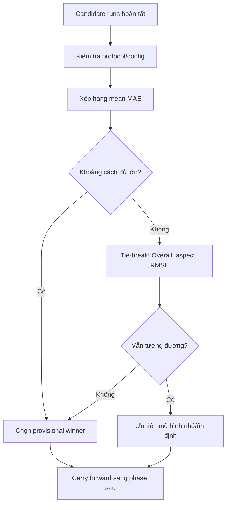

**Hình 5.2. Decision process chọn winner trong mỗi phase.**

## 5.5. Thiết kế từng phase

### 5.5.1. Phase 0 — Research infrastructure

Mục tiêu là khóa seed, data split, processor, metric, artifact và resume. Đây là engineering prerequisite, không phải model contribution. Smoke test phải chứng minh cùng config tạo metric gần nhau trong tolerance.

### 5.5.2. Phase 1 — Baseline

EXP_010 Text-only XLM-R, EXP_011 Image-only ConvNeXt và EXP_012 XLM-R + ConvNeXt + Concatenation tạo reference. MSE được giữ làm Loss Function anchor. Baseline cần huấn luyện theo cùng epoch budget và selection rule.

### 5.5.3. Phase 2 — Image Backbone

Giữ XLM-R, Concatenation và MSE; thay Swin-B, EfficientNet-B3, SigLIP và reference ConvNeXt. Nếu candidate cần processor/resolution khác, thay đổi này thuộc treatment và phải báo. Mục tiêu không chỉ tìm MAE thấp mà còn xem image-sensitive target, runtime và robustness.

### 5.5.4. Phase 3 — Text Backbone

Giữ Image Branch winner, Concatenation và MSE; thay XLM-R, PhoBERT và ViSoBERT. Tokenizer luôn đi cùng backbone. Một extension có thể ablate pooling và max length sau backbone, nhưng không thay hai yếu tố cùng lúc trong core comparison.

### 5.5.5. Phase 4 — Fusion Mechanism

Giữ hai branch winner và MSE; so sánh Concatenation, GMU, Gated Cross-Modal, FiLM và Cross-Attention. Hai branch được nạp pretrained weight giống nhau và có cùng unfreeze policy. Cross-Attention tăng sequence-level capacity nên cần ghi parameter count và peak VRAM.

### 5.5.6. Phase 5 — Loss Function

Giữ architecture winner; so sánh MSE, Huber, SmoothL1, Log-Cosh và uncertainty weighting. Evaluation luôn dùng MAE/RMSE, không so raw validation loss giữa hai loss family. Weight history và error tail là diagnostic bắt buộc cho uncertainty/robust loss.

Bảng 5.2 tóm tắt biến thay đổi, biến giữ cố định và evidence dùng để ra quyết định ở từng phase.

**Bảng 5.2. Controlled variables theo phase.**

| Phase | Biến thay đổi | Thành phần cố định chính | Evidence quyết định |
|---|---|---|---|
| Baseline | Modality | Split, target, optimizer | Per-sample metrics |
| Image | Image Backbone | XLM-R, Concat, MSE | MAE/RMSE/\(R^2\), runtime |
| Text | Text Backbone | Best image, Concat, MSE | Metrics, tokenization audit |
| Fusion | Fusion Mechanism | Best image/text, MSE | Metrics, resource, collapse diagnostic |
| Loss | Loss Function | Best architecture | Metrics, tail error, task trade-off |

## 5.6. Promising Combination Validation

### 5.6.1. Động lực

Sequential Ablation là greedy search. Winner của Image Backbone được chọn khi đi với XLM-R + Concatenation + MSE; nó có thể không còn tốt nhất khi đi với PhoBERT + Cross-Attention + Log-Cosh. Tương tự, FiLM có thể hợp với ConvNeXt hơn Swin; GMU có thể hợp với ViSoBERT khi ảnh nhiễu; SigLIP có thể cần fusion khác để tận dụng alignment.

Gọi performance là:

\[
Y=\mu+\alpha_I+\beta_T+\gamma_F+\delta_L
+(\alpha\beta)_{IT}+(\alpha\gamma)_{IF}+\cdots+\epsilon.
\]

Sequential Ablation chủ yếu quan sát main effect cục bộ dưới một context. Các interaction term có thể làm full configuration đảo thứ hạng.

### 5.6.2. Cách chọn promising combination

Không chọn tổ hợp tùy ý. Candidate phải có ít nhất một lý do:

- đứng top-2 ở phase;
- có kiến trúc bổ trợ về inductive bias;
- có chi phí thấp hơn đáng kể;
- cho per-target profile khác winner;
- literature gợi ý synergy;
- XAI diagnostic cho thấy modality balance tốt.

Tập tối thiểu gồm:

1. Sequential winner \((I^\star,T^\star,F^\star,L^\star)\).
2. Top alternative Image Backbone với \(T^\star,F^\star,L^\star\).
3. Top alternative Text Backbone với \(I^\star,F^\star,L^\star\).
4. Một fusion–loss pair có cơ sở, ví dụ GMU + uncertainty.
5. Official Concatenation Baseline để neo so sánh.

### 5.6.3. Validation flow

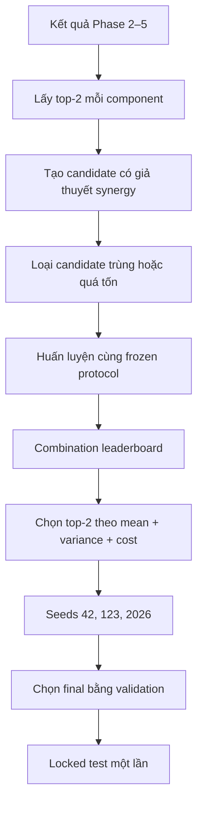

**Hình 5.3. Promising Combination Validation và final selection.**

### 5.6.4. Điểm mạnh và điểm yếu

Điểm mạnh:

- giảm nguy cơ bỏ lỡ synergy;
- chi phí thấp hơn full factorial;
- mỗi combination có hypothesis;
- tạo cơ sở chọn top candidate cho multi-seed.

Điểm yếu:

- không ước lượng mọi interaction;
- candidate selection vẫn có researcher judgment;
- có nguy cơ ưu tiên combination “thú vị”;
- nếu phase đầu noisy, promising pool có thể bỏ winner thật.

Giảm rủi ro bằng cách công bố rule tạo candidate trước khi chạy, giữ official Baseline, lưu cả negative result và không dùng test set để điều chỉnh pool.

## 5.7. Fairness của so sánh

Một comparison công bằng yêu cầu:

- cùng train/validation sample và image cache;
- cùng maximum epoch và early-stopping criterion;
- cùng primary metric;
- effective batch tương đương;
- cùng pretrained source và branch initialization khi ablate fusion;
- processor đúng nhưng được ghi như treatment;
- không tune riêng một candidate nhiều hơn candidate khác;
- không chọn epoch bằng test result;
- report parameter, runtime và peak memory.

Parameter count khác nhau là một phần của architecture choice. Nếu model lớn hơn tốt hơn rất ít, báo cáo cần trình bày performance–cost frontier thay vì chỉ xếp hạng MAE.

## 5.8. Hyperparameters và môi trường

Bảng 5.3 trình bày Hyperparameters chính cần được giữ nhất quán trong core comparison.

**Bảng 5.3. Hyperparameters chính của protocol hiện hành.**

| Hyperparameter | Giá trị phổ biến | Vai trò |
|---|---:|---|
| Max text length | 256 | Giới hạn context và attention memory |
| Max images | 4 | Giới hạn multi-image memory |
| Batch size | 16 | Micro-batch |
| Gradient accumulation | 2 | Effective batch 32 |
| Epoch branch/fusion | 20/15 | Upper training budget |
| Learning rate | \(1\times10^{-5}\) | Fine-tuning pretrained model |
| Weight decay | \(1\times10^{-2}\) | Regularization |
| Warmup ratio | 0,1 | Stabilize early update |
| Patience | 5 | Early stopping |
| Gradient clip | 1,0 | Gradient stability |
| Cross-Attention hidden/head | 512/8 | Interaction capacity |
| Seed | 42; final 42/123/2026 | Reproducibility/stability |

Phần lớn cấu hình thí nghiệm nhắm đến A100; cấu hình retraining token–patch có profile T4/L4 với fallback batch nhỏ hơn và accumulation lớn hơn. Hardware thực tế của mỗi run phải được lấy từ runtime log, không chỉ metadata cấu hình.

Bảng 5.4 quy định environment record tối thiểu cho final experiment.

**Bảng 5.4. Environment record bắt buộc cho final experiment.**

| Nhóm | Trường cần lưu |
|---|---|
| Runtime | OS, Python, CUDA, cuDNN |
| Framework | PyTorch, torchvision, transformers, timm |
| XAI | shap, lime, scikit-image, matplotlib, seaborn |
| Hardware | GPU name, VRAM, CPU, RAM |
| Model | Model ID, revision/commit, processor config |
| Data | Split hash, image manifest hash, rule version |

## 5.9. Evaluation metrics

Với \(N\) sample và target \(k\):

\[
\operatorname{MAE}_k=
\frac{1}{N}\sum_{i=1}^{N}|y_{ik}-\hat y_{ik}|,
\]

\[
\operatorname{RMSE}_k=
\sqrt{\frac{1}{N}\sum_{i=1}^{N}(y_{ik}-\hat y_{ik})^2},
\]

\[
R_k^2=
1-\frac{\sum_i(y_{ik}-\hat y_{ik})^2}
{\sum_i(y_{ik}-\bar y_k)^2}.
\]

Primary score:

\[
\operatorname{MeanMAE}
=\frac{1}{5}\sum_{k=1}^{5}\operatorname{MAE}_k.
\]

MAE dễ diễn giải theo đơn vị điểm; RMSE nhấn mạnh large error; \(R^2\) so sánh với mean predictor nhưng có thể âm. Loss không được dùng thay evaluation metric. Accuracy/F1/AUC không phù hợp nếu không định nghĩa một secondary discretized task.

Metric bổ sung đề xuất:

- median absolute error;
- 90th/95th percentile absolute error;
- large-error rate \(P(|e|>2)\), \(P(|e|>3)\);
- calibration curve theo predicted score bin;
- per-subgroup MAE theo số ảnh, độ dài text, true-score bin;
- inference latency và throughput.

## 5.10. Statistical analysis

### 5.10.1. Multi-seed summary

Với \(S\) seed:

\[
\bar m=\frac{1}{S}\sum_s m_s,\qquad
s_m=\sqrt{\frac{1}{S-1}\sum_s(m_s-\bar m)^2}.
\]

Report mean ± SD trên validation. Ba seed là minimum thực tế; năm seed tốt hơn nếu ngân sách cho phép.

### 5.10.2. Paired comparison

Hai model dự đoán cùng sample nên error là paired. Với:

\[
d_i=|e_i^{A}|-|e_i^{B}|,
\]

có thể dùng paired bootstrap Confidence Interval cho \(\bar d\), permutation test hoặc Wilcoxon signed-rank nếu phân phối không chuẩn. Test nên áp dụng cho mean per-sample MAE và từng target; multiple comparison cần correction hoặc diễn giải thận trọng.

### 5.10.3. Practical significance

Statistical significance không đồng nghĩa practical significance. Cần báo:

- absolute \(\Delta\)MAE;
- relative improvement;
- Confidence Interval;
- runtime/parameter difference;
- subgroup nơi improvement xuất hiện.

Một cải thiện 0,0003 trên một seed không đủ biện minh cho model phức tạp hơn.

## 5.11. XAI evaluation protocol

XAI evaluation gồm bốn lớp:

1. **Correctness:** hook đúng tensor, target index đúng, shape và mask đúng.
2. **Sanity:** randomization/gradient checks, SHAP additivity, LIME fidelity.
3. **Stability:** thay seed, background hoặc perturbation có làm explanation đổi mạnh không?
4. **Usefulness:** explanation giúp phát hiện shortcut hoặc hiểu failure case không?

Sample selection không chỉ lấy prediction đúng. Tập case cần correct, high-error, conflict, modality-dominant và difficult. Mọi target phải có đại diện. Người đánh giá không nên chỉ xem heatmap “đẹp”.

Metric gợi ý:

- Grad-CAM/LIME overlap;
- attention/LIME token Jaccard;
- explanation stability Top-K;
- deletion/insertion score;
- SHAP additivity error;
- cross-method agreement rate;
- branch-ablation consistency.

## 5.12. AI Agent evaluation protocol

Human Evaluation dùng ít nhất hai nhóm người đọc: người dùng không chuyên và reviewer kỹ thuật. Rubric 1–5:

- factual consistency với prediction;
- evidence grounding;
- clarity;
- completeness;
- uncertainty/limitation disclosure;
- actionability phù hợp;
- absence of unsupported causal claims.

Automated metric gồm schema pass rate, target coverage, numeric consistency, unsupported-evidence reference, missing-evidence disclosure và report generation failure rate. Inter-rater agreement có thể dùng Cohen’s kappa cho nhãn rời rạc hoặc ICC cho điểm liên tục.

So sánh tối thiểu:

- template-only;
- direct LLM prompt từ evidence block;
- reasoning-first Agent.

Ground truth cho faithfulness không phải “văn bản nghe hợp lý” mà là mức khớp với artifact có cấu trúc.

## 5.13. Reproducibility strategy

Mỗi experiment directory phải chứa:

```text
EXP_ID/
├── config.yaml
├── environment.txt
├── data_manifest.json
├── train.log
├── best_model_*.pth
├── metrics.json
├── predictions.csv
├── resource_usage.json
├── figures/
└── README.md
```

Seed được đặt cho Python, NumPy, PyTorch CPU/CUDA và DataLoader generator. `cudnn.deterministic=True`, `benchmark=False` khi phù hợp. Reproducibility không có nghĩa bitwise identity trên mọi GPU; tolerance và nguồn nondeterminism phải được ghi.

Model Hub revision nên được pin. Image download chỉ diễn ra ở data preparation; experiment đọc frozen cache. Split và image manifest có checksum. Resume phải phục hồi optimizer/scheduler. Mọi metric final phải có đường dẫn đến predictions nguồn.

## 5.14. Threats to validity

**Internal validity:** stochastic training, processor mismatch, checkpoint semantic mismatch sau migration, silent image failure.

**Construct validity:** Overall Satisfaction là weak label; MAE không đo đầy đủ usefulness; XAI visualization không đồng nghĩa faithfulness.

**External validity:** dữ liệu từ một nền tảng và một domain; generalization sang vùng địa lý, nền tảng hoặc thời gian khác chưa được kiểm chứng.

**Conclusion validity:** số seed nhỏ và nhiều comparison có thể tạo false discovery; chênh lệch rất nhỏ cần Confidence Interval.

**Ecological validity:** ảnh do người dùng đăng có selection bias; deployment có thể gặp review không ảnh hoặc ảnh chất lượng thấp hơn.

Thiết kế thực nghiệm không thể loại bỏ toàn bộ threat, nhưng phải làm chúng quan sát được và không vượt quá phạm vi kết luận.

---

# CHƯƠNG 6. KẾT QUẢ VÀ BÀN LUẬN

## 6.1. Nguyên tắc trình bày kết quả

Chương này tách bốn lớp phát biểu:

1. **Confirmed finding:** số liệu có artifact trực tiếp và phép tính có thể lặp lại.
2. **Observation:** pattern nhìn thấy trong số liệu nhưng chưa có kiểm định thống kê.
3. **Interpretation:** giả thuyết kỹ thuật có thể giải thích observation.
4. **Conclusion boundary:** điều chưa được phép khẳng định.

Cách tách này đặc biệt cần thiết vì kết quả hiện tại là validation metrics từ các run tiến độ. Final checkpoint sau token–patch migration, paired predictions, multi-seed summary và locked test chưa tạo thành một evidence package hoàn chỉnh. Vì vậy, số liệu được dùng để định hướng bước tiếp theo, không được trình bày như benchmark cuối.

## 6.2. Confirmed findings từ Controlled Sequential Ablation

Bảng 6.1 tổng hợp 12 cấu hình có metrics validation độc lập. Thí nghiệm 020 đánh giá Image Backbone với XLM-R + Concatenation + MSE; thí nghiệm 030 đánh giá Text Backbone; thí nghiệm 040–041 đánh giá Fusion Mechanism; thí nghiệm 050–051 đánh giá Loss Function.

**Bảng 6.1. Kết quả validation của 12 cấu hình ablation.**

| Thí nghiệm | Mean MAE | Food MAE | Price MAE | Atmos MAE | Service MAE | Overall MAE | Overall RMSE | Overall \(R^2\) |
|---|---:|---:|---:|---:|---:|---:|---:|---:|
| EXP_020B Swin-B + XLM-R + Concat + MSE | 1,2169 | 1,2371 | 1,2639 | 1,2249 | 1,2920 | 1,0667 | 1,4447 | 0,4874 |
| EXP_020D EfficientNet-B3 + XLM-R + Concat + MSE | 1,2800 | 1,3174 | 1,3356 | 1,2705 | 1,3469 | 1,1296 | 1,5320 | 0,4236 |
| EXP_020E SigLIP + XLM-R + Concat + MSE | 1,2296 | 1,2522 | 1,2804 | 1,2357 | 1,3095 | 1,0703 | 1,4669 | 0,4715 |
| EXP_030B Swin-B + PhoBERT + Concat + MSE | 1,1145 | 1,1134 | 1,1711 | 1,1767 | 1,1814 | 0,9300 | 1,2406 | 0,6220 |
| EXP_030D Swin-B + ViSoBERT + Concat + MSE | 1,2328 | 1,2576 | 1,2736 | 1,2459 | 1,2945 | 1,0923 | 1,4843 | 0,4589 |
| EXP_040B GMU + MSE | 1,1160 | 1,1136 | 1,1756 | 1,1813 | 1,1808 | 0,9289 | 1,2364 | 0,6246 |
| EXP_040C Gated Cross-Modal + MSE | 1,1082 | 1,0963 | 1,1713 | 1,1765 | 1,1772 | 0,9198 | 1,2259 | 0,6309 |
| EXP_041A FiLM + MSE | 1,1195 | 1,1238 | 1,1783 | 1,1789 | 1,1890 | 0,9278 | 1,2415 | 0,6215 |
| EXP_041B Cross-Attention + MSE | **1,1079** | 1,1024 | 1,1728 | 1,1743 | 1,1756 | **0,9143** | 1,2215 | 0,6335 |
| EXP_050B Cross-Attention + Huber | 1,1085 | 1,1097 | **1,1685** | **1,1734** | 1,1779 | 0,9131 | 1,2261 | 0,6308 |
| EXP_050C Cross-Attention + Log-Cosh | 1,1080 | 1,1066 | 1,1694 | 1,1739 | **1,1770** | **0,9130** | 1,2254 | 0,6312 |
| EXP_051D Cross-Attention + uncertainty weighting | 1,1080 | **1,1024** | 1,1727 | 1,1742 | 1,1764 | 0,9144 | **1,2213** | **0,6337** |

Các finding định lượng trực tiếp:

- Swin-B cho mean MAE 1,2169, tốt hơn SigLIP 1,2296 và EfficientNet-B3 1,2800 trong context XLM-R + Concatenation + MSE đã khảo sát.
- PhoBERT + image winner đạt mean MAE 1,1145; ViSoBERT đạt 1,2328 trong hai run tương ứng.
- Cross-Attention + MSE có mean MAE thấp nhất 1,1079.
- Overall Satisfaction là target có MAE thấp nhất trong mọi cấu hình của Bảng 6.1.
- Price và Atmosphere thường khó hơn Overall theo MAE/\(R^2\) trong nhóm cấu hình tốt.

## 6.3. Observation theo phase

### 6.3.1. Image Backbone

Trong ba Image Backbone được lưu ở Phase 2, Swin-B có mean MAE thấp nhất. Khoảng cách Swin-B–SigLIP là 0,0127; Swin-B–EfficientNet-B3 là 0,0631. Observation này phù hợp với giả thuyết hierarchical patch representation hữu ích, nhưng có ít nhất ba alternative explanation:

1. preprocessing tương thích Swin tốt hơn;
2. pretrained weight phù hợp domain hơn;
3. training stochastic hoặc checkpoint quality khác nhau.

Không nên kết luận “Swin-B luôn vượt SigLIP” ngoài protocol này. SigLIP visual encoder khi tách khỏi text encoder gốc có thể không tận dụng hết alignment từ language–image pretraining.

### 6.3.2. Text Backbone

PhoBERT run cải thiện mean MAE 0,1024 so với Swin-B + XLM-R reference và 0,1183 so với ViSoBERT run. Đây là effect size lớn hơn các chênh lệch fusion/loss phía sau. Observation ủng hộ vai trò của monolingual Vietnamese pretraining.

Tuy nhiên, ViSoBERT được thiết kế cho social media và về lý thuyết phù hợp informal text. Kết quả thấp hơn có thể đến từ tokenizer/preprocessing, fine-tuning sensitivity hoặc interaction với Swin/Concat. Đây chính là một candidate hợp lý cho Promising Combination Validation thay vì bị loại hoàn toàn.

### 6.3.3. Fusion Mechanism

Mean MAE của Gated Cross-Modal (1,1082) và Cross-Attention (1,1079) gần như bằng nhau; GMU và FiLM chậm hơn khoảng 0,008–0,012. Với một seed, dữ liệu không chứng minh Cross-Attention có predictive advantage đáng kể.

Cross-Attention vẫn có một giá trị riêng: token–patch matrix cung cấp XAI attachment mà vector gating không có. Quyết định chọn nó vì vậy có thể là multi-objective trade-off giữa accuracy, explainability và cost. Báo cáo cuối cần nêu rõ nếu complexity được chọn vì inspectability chứ không chỉ vì MAE.

### 6.3.4. Loss Function

Huber, Log-Cosh và uncertainty weighting có mean MAE trong khoảng 1,10799–1,10854, gần MSE 1,10788. Không có bằng chứng rằng robust loss cải thiện aggregate performance. Một số target tốt hơn rất nhỏ: Huber có Price/Atmosphere MAE thấp hơn; Log-Cosh có Overall MAE thấp nhất; uncertainty có Overall \(R^2\) cao nhất.

Các khác biệt này có thể phản ánh target trade-off hơn là winner chung. Tail-error analysis cần thiết vì robust loss có thể giảm số lỗi rất lớn mà mean MAE gần như không đổi.

## 6.4. Interpretation và Research Question status

Bảng 6.2 tổng hợp mức độ mỗi Research Question đã được trả lời bằng evidence hiện tại.

**Bảng 6.2. Trạng thái trả lời Research Question ở giai đoạn tiến độ.**

| Research Question | Evidence hiện có | Diễn giải hợp lệ | Trạng thái |
|---|---|---|---|
| RQ1 Multimodal vs unimodal | Chưa có bộ Baseline metrics đồng bộ | Chưa định lượng giá trị bổ sung của ảnh | Mở |
| RQ2 Component selection | 12 validation runs | PhoBERT/Swin và nhóm fusion tốt là provisional winner | Trả lời một phần |
| RQ3 Interaction effect | Chưa có combination leaderboard đầy đủ | Không thể kết luận sequential winner tối ưu | Mở |
| RQ4 XAI | Implementation và artifact schema | Đủ năng lực kỹ thuật, chưa có case-level finding | Trả lời ở mức implementation |
| RQ5 AI Agent | Pipeline reasoning/validation | Chưa đo faithfulness và usefulness | Mở |

## 6.5. Phân tích mức cải thiện

Lấy EXP_020B làm anchor, EXP_030B giảm mean MAE:

\[
\Delta=1{,}2169-1{,}1145=0{,}1024,
\]

tương đương cải thiện tương đối khoảng:

\[
\frac{0{,}1024}{1{,}2169}\times100\%\approx8{,}42\%.
\]

Từ EXP_030B đến EXP_041B, cải thiện:

\[
1{,}1145-1{,}1079=0{,}0066\approx0{,}59\%.
\]

Điều này gợi ý Text Backbone selection có effect lớn hơn Fusion Mechanism trong chuỗi đã chạy. Tuy nhiên, so sánh theo phase không phải decomposition tuyệt đối vì winner được carry forward và run noise chưa được ước lượng.

Overall Satisfaction MAE khoảng 0,91 ở nhóm tốt, thấp hơn aspect MAE khoảng 1,10–1,18. Có thể giải thích bằng hai yếu tố: label Overall được xây từ trung bình aspect nên mượt hơn, và target correlation cho phép shared representation dự đoán mean dễ hơn aspect chi tiết. Đây là interpretation cần correlation/baseline analysis để xác nhận.

## 6.6. Kết quả kỹ thuật của XAI

Tiến độ XAI được đánh giá theo implementation completeness:

Bảng 6.3 phân biệt năng lực implementation với tiêu chí nghiệm thu thực nghiệm của XAI.

**Bảng 6.3. Năng lực XAI đã triển khai và tiêu chí nghiệm thu còn lại.**

| Method | Năng lực đã triển khai | Nghiệm thu còn lại |
|---|---|---|
| Grad-CAM | Per-target/image heatmap, gradient similarity | Run trên final checkpoint; region sanity |
| Self-Attention | Extraction, merge subword, heatmap, sink ratio | Target-text qualitative audit |
| Cross-Attention | Raw matrix, Top-K, overlay, bipartite graph | Alignment sanity và entropy analysis |
| SHAP | Fused embedding, per-target modality split, additivity | Background stability và ablation consistency |
| LIME | Text/image perturbation, plots và weight JSON | Multi-seed fidelity/stability |
| Case Study | 7 case types, artifact filtering, combined figures | Manifest và human review |

Không có case cụ thể được mô tả trong chương này vì artifact sau final retraining chưa được dùng để tạo một bộ case study đã nghiệm thu. Đây là lựa chọn bảo toàn academic integrity: phần phương pháp có thể hoàn thành trước, nhưng finding chỉ được viết sau khi quan sát output thật.

## 6.7. Kết quả kỹ thuật của AI Agent

Agent đã hoàn thiện luồng:

\[
\text{XAI Artifact}
\rightarrow\text{Evidence Loader}
\rightarrow\text{Reasoning Graph}
\rightarrow\text{LLM}
\rightarrow\text{Validator}
\rightarrow\text{Report}.
\]

Các safeguard gồm lọc token nhiễu, evidence completeness từ file existence, per-target reasoning, agreement matrix, schema validation, confidence reasoning và hai lớp báo cáo. Đây là kết quả engineering có thể xác nhận từ implementation.

Các outcome khoa học như “giảm hallucination”, “tăng clarity” hoặc “được người dùng tin tưởng hơn” chưa được xác nhận. Chúng cần experiment so sánh direct prompting, template và reasoning-first Agent theo rubric ở Mục 5.12.

## 6.8. Error analysis protocol

Khi có paired predictions, error analysis sẽ tạo:

\[
e_{ik}=\hat y_{ik}-y_{ik},
\qquad
a_i=\frac{1}{5}\sum_k|e_{ik}|.
\]

Sample được phân nhóm:

- underprediction/overprediction;
- high-error theo 90th percentile;
- disagreement giữa aspect;
- review ít/nhiều ảnh;
- text ngắn/dài;
- aspect được nhắc/không được nhắc;
- true-score tail;
- restaurant seen/unseen.

Mỗi high-error case phải kiểm tra data quality trước model explanation: URL lỗi, label bất thường, review–ảnh không liên quan, truncation. Chỉ sau khi loại data issue mới dùng XAI để thảo luận model behavior.

## 6.9. Limitations của kết quả hiện tại

### 6.9.1. Experimental evidence

Kết quả chưa có multi-seed Confidence Interval và paired test; chênh lệch nhỏ không được xem là statistically significant. Text-only/Image-only Baseline chưa tạo một package đồng bộ với bảng ablation, nên RQ1 còn mở. Final locked test chưa thực hiện.

### 6.9.2. Architecture migration

Cross-Attention đã thay từ single-vector sang token–patch. Parameter shape có thể tương thích, nhưng computation semantics khác. Metrics sinh trước migration không đại diện chắc chắn cho mô hình mới; full retraining là bắt buộc.

### 6.9.3. Dataset validity

Overall Satisfaction là weak label; split theo review có nguy cơ restaurant/user overlap; ảnh fallback và truncation tạo silent noise; score distribution nghiêng cao. Generalization sang nền tảng khác chưa được kiểm định.

### 6.9.4. Explainability validity

Grad-CAM, SHAP, LIME và attention đều approximate/post-hoc theo nghĩa khác nhau. Agreement không chứng minh causality; disagreement không tự động chứng minh model failure. Faithfulness/stability test chưa hoàn tất.

### 6.9.5. Agent validity

Agent dùng external LLM và heuristic evidence ranking. Schema correctness không bảo đảm semantic faithfulness. Customer recommendation có thể vượt quá bằng chứng nếu prompt/validator bỏ sót; Human Evaluation và red-team test là cần thiết.

## 6.10. Kết luận chương

Tiến độ thực nghiệm đã xác định một vùng cấu hình tiềm năng—Swin-B, PhoBERT và nhóm Gated/Cross-Attention—với mean MAE khoảng 1,108 trên validation run đã lưu. Tín hiệu lớn nhất trong chuỗi đến từ thay Text Backbone; Fusion/Loss tạo chênh lệch nhỏ. Kết luận khoa học cuối vẫn phụ thuộc ba bước: retraining token–patch architecture, hoàn thiện Promising Combination Validation và multi-seed locked-test protocol. XAI/AI Agent đã đủ hạ tầng để đánh giá nhưng chưa đủ evidence để viết case-level finding.

---

# CHƯƠNG 7. KẾT LUẬN VÀ HƯỚNG PHÁT TRIỂN

## 7.1. Kết luận

Đề tài đã hình thành một hệ thống nghiên cứu end-to-end cho Multi-output Regression từ review tiếng Việt và nhiều ảnh. Ba lớp chính—Multimodal Prediction, Explainable AI và AI Agent—được kết nối bằng interface và artifact có cấu trúc. Data pipeline đã tạo 9.946 review hợp lệ, 22.150 ảnh và 6.082 review có ảnh; Modeling pipeline hỗ trợ nhiều backbone, năm Fusion Mechanism và năm Loss Function; XAI Pha 1–6 bao phủ spatial, lexical, cross-modal, attribution và perturbation evidence.

Controlled Sequential Ablation đã tạo 12 bộ validation metrics. Trong các run này, PhoBERT tạo mức cải thiện lớn nhất khi thay Text Backbone; Swin-B đứng đầu nhóm Image Backbone; Cross-Attention/Gated Cross-Modal và ba Loss Function nâng cao tạo chênh lệch rất nhỏ. Mean MAE tốt nhất khoảng 1,1079. Kết quả là provisional evidence, chưa phải final model claim do token–patch migration, thiếu multi-seed và locked test.

Đóng góp nổi bật ở giai đoạn tiến độ là thiết kế experimental methodology có traceability và kiến trúc giải thích đa mức. Đề tài không chỉ “thử nhiều mô hình”, mà phân tách main effect bằng Controlled Sequential Ablation, sau đó dự kiến kiểm tra interaction bằng Promising Combination Validation. Tương tự, XAI không được dùng như hình minh họa rời rạc; mỗi method có attachment point, câu hỏi và giới hạn riêng, còn AI Agent chỉ verbalize evidence đã cấu trúc.

## 7.2. Kế hoạch phát triển

Bảng 7.1 ưu tiên các công việc tạo bằng chứng trước các công việc trình bày.

**Bảng 7.1. Lộ trình công việc tiếp theo.**

| Ưu tiên | Công việc | Đầu ra bắt buộc |
|---:|---|---|
| 1 | Đóng băng dữ liệu và group split | CSV train/val/test, checksum, data card |
| 2 | Khóa môi trường | Requirements có phiên bản, thông tin Python/CUDA/cuDNN |
| 3 | Tái huấn luyện token–patch Cross-Attention | Config, log, checkpoint, metrics, predictions |
| 4 | Chạy baseline và nhiều seed | Mean ± SD, khoảng tin cậy, so sánh công bằng |
| 5 | Đánh giá test khóa | `test_metrics.json`, predictions và biểu đồ |
| 6 | Chạy XAI Pha 1–6 | Artifact đủ năm phương pháp và case study |
| 7 | Hoàn thành XAI Pha 7 | Báo cáo XAI tự động từ artifact hiện hành |
| 8 | Hoàn thành XAI Pha 8 | Hình/bảng luận văn thống nhất, 300 DPI |
| 9 | Cải tiến AI Agent | Cache, streaming, offline fallback, RAG có kiểm soát |
| 10 | Human evaluation | Rubric faithfulness, clarity, usefulness; nhiều người chấm |
| 11 | Triển khai | API inference, giám sát drift, bảo mật và quản lý chi phí |

Pha 7 cần sinh báo cáo trực tiếp từ artifact và ghi rõ phương pháp thiếu. Pha 8 cần chuẩn hóa caption, font, màu, DPI và sơ đồ kiến trúc token–patch. Đối với AI Agent, ưu tiên là chế độ template ngoại tuyến khi không có API, caching theo hash của sample/artifact, và kiểm tra mọi câu diễn giải có dẫn về evidence item.

Triển khai sản phẩm chỉ nên thực hiện sau khi có test khóa và human evaluation. API cần tách model server, XAI worker và report service; không gửi dữ liệu nhạy cảm cho dịch vụ bên ngoài nếu chưa có chính sách phù hợp.

## 7.3. Tiêu chí hoàn thành

Đề tài được xem là hoàn thành ở mức báo cáo cuối khi đáp ứng đồng thời:

- Có snapshot dữ liệu và split tái lập được.
- Có baseline text-only, image-only và multimodal trên cùng protocol.
- Có ít nhất ba seed cho cấu hình cuối và đánh giá test khóa một lần.
- Có predictions theo mẫu để thực hiện error analysis.
- Có artifact XAI sau migration cho tập case study được chọn minh bạch.
- Có báo cáo Pha 7 và hình Pha 8 sinh từ artifact thật.
- Có human evaluation cho diễn giải AI Agent.
- Mọi bảng, hình và kết luận đều truy vết được đến artifact hoặc tài liệu nguồn; phần chưa hoàn thành được trình bày minh bạch thay vì ước đoán.

## 7.4. Kế hoạch XAI Pha 7 — Automated Report Generation

Pha 7 chuyển artifact Pha 2–6 thành báo cáo XAI tái tạo được. Report generator cần:

1. quét metadata thay vì phụ thuộc filename cứng khi có thể;
2. tổng hợp method coverage theo sample/target;
3. tạo bảng SHAP modality contribution;
4. tạo cross-method agreement table;
5. chèn case study figure thật;
6. sinh limitation theo artifact availability;
7. ghi timestamp, checkpoint hash và config;
8. graceful degradation nếu một method thiếu.

Pha 7 không nên tự sinh câu quan sát hình ảnh bằng template nếu metadata không chứa region semantics. Technical narrative chỉ mô tả số liệu có cấu trúc; diễn giải visual semantic cần human review hoặc vision-enabled Agent có image input và validation riêng.

Bảng 7.2 quy định deliverable và acceptance criteria của XAI Pha 7.

**Bảng 7.2. Deliverable của XAI Pha 7.**

| Deliverable | Nội dung | Acceptance criteria |
|---|---|---|
| `xai_report.md` | Method, coverage, aggregate, case study, limitations | Regenerate từ artifact mà không sửa tay |
| `xai_summary.csv` | Method/target/sample availability | Khớp folder thực tế |
| `agreement_matrix.csv` | Cross-method agreement | Rule và threshold được công bố |
| `report_figures/` | Hình được chọn và caption | Không có broken link |
| `report_metadata.json` | Model/data/config provenance | Có hash và timestamp |

## 7.5. Kế hoạch XAI Pha 8 — Thesis Visualization

Pha 8 chuẩn hóa biểu đồ cho DOCX và trình bày. Các yêu cầu:

- 300 DPI cho raster figure;
- font hỗ trợ tiếng Việt;
- color palette nhất quán và color-blind friendly;
- caption tự đủ nghĩa;
- trục, legend và unit rõ;
- không dùng màu nóng/lạnh như bằng chứng positive/negative nếu method chỉ biểu diễn magnitude;
- không crop mất review context;
- có bản vector/SVG khi phù hợp;
- numbering tương thích Chương 4–6.

Architecture diagram phải thể hiện token–patch Cross-Attention thay cho single-vector attention. SHAP figure phải dùng text-origin/image-origin. LIME và Grad-CAM figure cần chỉ rõ target và image index. Case study figure cần đủ ground truth, prediction và error nhưng ẩn thông tin cá nhân.

## 7.6. AI Agent improvement roadmap

### 7.6.1. Offline fallback

Khi không có API, template engine dùng Reasoning Graph để tạo báo cáo deterministic. Fallback không trôi chảy bằng LLM nhưng có provenance rõ và tạo Baseline cho Human Evaluation.

### 7.6.2. Caching

Cache key:

\[
k=\operatorname{hash}(
\text{sample} \Vert
\text{prediction} \Vert
\text{artifact} \Vert
\text{prompt version} \Vert
\text{model}
).
\]

Cache giảm chi phí và tránh report khác nhau cho cùng evidence. Khi bất kỳ artifact thay đổi, key thay đổi và report được tái sinh.

### 7.6.3. Retrieval-Augmented Generation

RAG có thể truy hồi glossary, model card, limitation và similar historical case. Tuy nhiên, retrieved case không được dùng làm bằng chứng cho sample hiện tại; prompt phải phân biệt **sample evidence** và **background knowledge**.

### 7.6.4. Vision mode

Vision-enabled Agent có thể mô tả Grad-CAM overlay, nhưng phải nhận cả ảnh gốc và overlay, đồng thời không được suy ra causal relation từ màu. Output visual observation cần được đánh dấu là model-generated và qua human review.

### 7.6.5. Evaluation và red teaming

Test case cần bao gồm:

- không có XAI artifact;
- SHAP và LIME mâu thuẫn;
- review không nhắc aspect;
- score ngoài range;
- token nhiễu;
- malicious text chứa prompt injection;
- đường dẫn artifact giả;
- tiếng Việt không dấu/code-mixing;
- ground truth khác prediction lớn.

Prompt injection defense phải xem review là dữ liệu được quote, không phải instruction. Agent không nên đọc file/path ngoài allowlist.

## 7.7. Deployment architecture

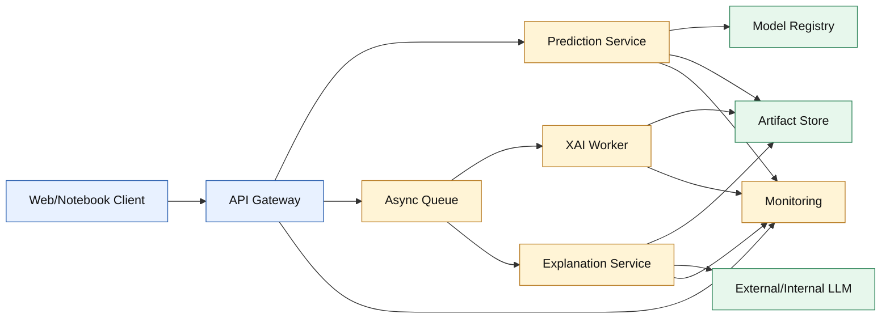

**Hình 7.1. Kiến trúc triển khai đề xuất.**

Prediction Service phục vụ synchronous request; XAI và Agent chạy asynchronous. Model Registry quản lý version/checkpoint; Artifact Store lưu immutable evidence. Monitoring theo dõi latency, error rate, score distribution, missing-image rate và Agent validation warning.

## 7.8. Human Evaluation

Human Evaluation nên có ít nhất 20–30 case cân bằng theo loại và 3 evaluator nếu nguồn lực cho phép. Thiết kế blind comparison giữa template, direct prompting và reasoning-first Agent. Mỗi evaluator chấm:

- score fidelity;
- evidence fidelity;
- clarity;
- usefulness;
- uncertainty disclosure.

Ngoài mean score, báo distribution, inter-rater agreement và qualitative comment. Evaluator kỹ thuật kiểm tra artifact grounding; người dùng không chuyên đánh giá Customer View. Không gộp hai nhóm thành một điểm nếu mục tiêu khác nhau.

## 7.9. Kết luận hướng phát triển

Thứ tự ưu tiên là evidence trước presentation: đóng băng dữ liệu và môi trường; retrain; baseline/multi-seed/locked test; XAI artifact; Agent evaluation; Pha 7–8; deployment. Thứ tự này tránh tình trạng báo cáo đẹp hơn bằng chứng. Khi hoàn tất, đề tài có thể trả lời đầy đủ năm Research Question và chuyển từ prototype kỹ thuật sang một nghiên cứu có thể audit.

---

# TÀI LIỆU THAM KHẢO

[1] Z. Liu, Y. Lin, Y. Cao, H. Hu, Y. Wei, Z. Zhang, S. Lin, và B. Guo, “Swin Transformer: Hierarchical Vision Transformer Using Shifted Windows,” *Proceedings of ICCV*, tr. 10012–10022, 2021.

[2] D. Q. Nguyen và A. T. Nguyen, “PhoBERT: Pre-trained Language Models for Vietnamese,” *Findings of EMNLP*, tr. 1037–1042, 2020. doi: 10.18653/v1/2020.findings-emnlp.92.

[3] T. Zhao, L.-A. Meng, và D. Song, “Multimodal Aspect-Based Sentiment Analysis: A Survey of Tasks, Methods, Challenges and Future Directions,” *Information Fusion*, tập 112, bài số 102552, 2024. doi: 10.1016/j.inffus.2024.102552.

[4] N. Rodis, C. Sardianos, P. Radoglou-Grammatikis, P. Sarigiannidis, I. Varlamis, và G. Th. Papadopoulos, “Multimodal Explainable Artificial Intelligence: A Comprehensive Review of Methodological Advances and Future Research Directions,” arXiv:2306.05731, 2023.

[5] A. Kendall, Y. Gal, và R. Cipolla, “Multi-Task Learning Using Uncertainty to Weigh Losses for Scene Geometry and Semantics,” *Proceedings of CVPR*, 2018; arXiv:1705.07115.

[6] R. R. Selvaraju, M. Cogswell, A. Das, R. Vedantam, D. Parikh, và D. Batra, “Grad-CAM: Visual Explanations From Deep Networks via Gradient-Based Localization,” *Proceedings of ICCV*, tr. 618–626, 2017.

[7] S. M. Lundberg và S.-I. Lee, “A Unified Approach to Interpreting Model Predictions,” *Advances in Neural Information Processing Systems*, tập 30, 2017.

[8] M. T. Ribeiro, S. Singh, và C. Guestrin, “‘Why Should I Trust You?’: Explaining the Predictions of Any Classifier,” *Proceedings of KDD*, tr. 1135–1144, 2016. doi: 10.1145/2939672.2939778.

[9] S. Jain và B. C. Wallace, “Attention Is Not Explanation,” *Proceedings of NAACL-HLT*, tr. 3543–3556, 2019. doi: 10.18653/v1/N19-1357.

[10] Y.-H. H. Tsai, S. Bai, P. P. Liang, J. Z. Kolter, L.-P. Morency, và R. Salakhutdinov, “Multimodal Transformer for Unaligned Multimodal Language Sequences,” *Proceedings of ACL*, tr. 6558–6569, 2019.

[11] J. Arevalo, T. Solorio, M. Montes-y-Gómez, và F. A. González, “Gated Multimodal Units for Information Fusion,” arXiv:1702.01992, 2017.

[12] E. Perez, F. Strub, H. de Vries, V. Dumoulin, và A. Courville, “FiLM: Visual Reasoning with a General Conditioning Layer,” *Proceedings of AAAI*, tập 32, 2018. doi: 10.1609/aaai.v32i1.11671.

[13] Z. Liu, H. Mao, C.-Y. Wu, C. Feichtenhofer, T. Darrell, và S. Xie, “A ConvNet for the 2020s,” *Proceedings of CVPR*, tr. 11976–11986, 2022.

[14] M. Tan và Q. Le, “EfficientNet: Rethinking Model Scaling for Convolutional Neural Networks,” *Proceedings of ICML*, PMLR 97, tr. 6105–6114, 2019.

[15] X. Zhai, B. Mustafa, A. Kolesnikov, và L. Beyer, “Sigmoid Loss for Language Image Pre-Training,” *Proceedings of ICCV*, 2023; arXiv:2303.15343.

[16] A. Conneau, K. Khandelwal, N. Goyal và cộng sự, “Unsupervised Cross-lingual Representation Learning at Scale,” *Proceedings of ACL*, tr. 8440–8451, 2020.

[17] N. Nguyen, T. Phan, D.-V. Nguyen, và K. Nguyen, “ViSoBERT: A Pre-Trained Language Model for Vietnamese Social Media Text Processing,” *Proceedings of EMNLP*, tr. 5191–5207, 2023. doi: 10.18653/v1/2023.emnlp-main.315.

[18] Q.-T. Truong và H. W. Lauw, “VistaNet: Visual Aspect Attention Network for Multimodal Sentiment Analysis,” *Proceedings of AAAI*, tập 33, tr. 305–312, 2019. doi: 10.1609/aaai.v33i01.3301305.

[19] N. Xu, W. Mao, và G. Chen, “Multi-Interactive Memory Network for Aspect Based Multimodal Sentiment Analysis,” *Proceedings of AAAI*, tập 33, số 01, tr. 371–378, 2019. doi: 10.1609/aaai.v33i01.3301371.

[20] T. Peng, Z. Li, P. Wang, L. Zhang, và H. Zhao, “A Novel Energy Based Model Mechanism for Multi-Modal Aspect-Based Sentiment Analysis,” *Proceedings of AAAI*, tập 38, số 17, tr. 18869–18878, 2024. doi: 10.1609/aaai.v38i17.29852.

[21] A. Vaswani, N. Shazeer, N. Parmar và cộng sự, “Attention Is All You Need,” *Advances in Neural Information Processing Systems*, tập 30, 2017.

[22] S. Wiegreffe và Y. Pinter, “Attention Is Not Not Explanation,” *Proceedings of EMNLP-IJCNLP*, tr. 11–20, 2019. doi: 10.18653/v1/D19-1002.

[23] D. Slack, S. Krishna, H. Lakkaraju, và S. Singh, “Explaining Machine Learning Models with Interactive Natural Language Conversations Using TalkToModel,” *Nature Machine Intelligence*, tập 5, tr. 873–883, 2023. doi: 10.1038/s42256-023-00692-8.

[24] Z. Chen, J. Chen, A. Singh, và M. Sra, “XplainLLM: A Knowledge-Augmented Dataset for Reliable Grounded Explanations in LLMs,” *Proceedings of EMNLP*, tr. 7578–7596, 2024. doi: 10.18653/v1/2024.emnlp-main.432.

[25] A. Zytek, S. Pido, S. Alnegheimish, L. Berti-Equille, và K. Veeramachaneni, “Explingo: Explaining AI Predictions Using Large Language Models,” arXiv:2412.05145, 2024.

---

# PHỤ LỤC A. THUẬT NGỮ VÀ KÝ HIỆU

## A.1. Thuật ngữ

Bảng A.1 chuẩn hóa cách sử dụng các thuật ngữ xuyên suốt báo cáo.

**Bảng A.1. Thuật ngữ sử dụng thống nhất trong báo cáo.**

| Thuật ngữ | Ý nghĩa trong đề tài |
|---|---|
| Multimodal Learning | Học từ đồng thời văn bản và hình ảnh |
| Modality | Một nguồn dữ liệu, cụ thể là text hoặc image |
| Text Branch | Encoder và feature extraction cho bình luận |
| Image Branch | Encoder và feature extraction cho ảnh |
| Fusion Mechanism | Cơ chế kết hợp hai modality |
| Prediction Head | Module ánh xạ representation sang năm score |
| Multi-output Regression | Hồi quy đồng thời nhiều biến mục tiêu |
| Controlled Sequential Ablation | Thay một component, giữ các component khác cố định, rồi carry winner |
| Promising Combination Validation | Kiểm tra các tổ hợp có giả thuyết để phát hiện interaction effect |
| Explainable AI | Phương pháp quan sát/diễn giải hành vi mô hình |
| Artifact | File đầu ra có thể audit: metric, prediction, heatmap, JSON, checkpoint |
| Grounding | Ràng buộc diễn giải vào bằng chứng cụ thể |
| Faithfulness | Mức explanation phản ánh đúng hành vi mô hình |
| Plausibility | Mức explanation có vẻ hợp lý với con người |
| Branch collapse | Một modality gần như không đóng góp |
| Text-origin/Image-origin | Segment fused vector khởi phát từ một modality sau cross-modal mixing |
| Locked test | Test set chỉ được dùng sau final selection |

## A.2. Ký hiệu

Bảng A.2 liệt kê các ký hiệu xuất hiện trong công thức.

**Bảng A.2. Ký hiệu toán học.**

| Ký hiệu | Diễn giải |
|---|---|
| \(N\) | Số sample |
| \(K=5\) | Số target |
| \(T\) | Số token văn bản |
| \(P\) | Số image patch |
| \(H\) | Số attention head |
| \(D\) | Hidden dimension |
| \(t_i\) | Text của sample \(i\) |
| \(I_i\) | Tập ảnh của sample \(i\) |
| \(\mathbf{y}_i\) | Ground-truth vector |
| \(\hat{\mathbf{y}}_i\) | Prediction vector |
| \(H^t,H^v\) | Token/patch feature |
| \(\mathbf{z}\) | Fused representation |
| \(\phi_j\) | SHAP value của feature \(j\) |
| \(e_{ik}\) | Prediction error |

# PHỤ LỤC B. DANH MỤC THÍ NGHIỆM

## B.1. Experiment naming convention

ID có dạng `EXP_PPV_description`, trong đó `PP` biểu diễn phase và `V` biểu diễn variant. Tên cần cho biết component chính, Fusion Mechanism và Loss Function. Ví dụ:

```text
EXP_041B_bestimage_besttext_crossattention_mse
```

cho biết đây là Phase 4, variant 1B, dùng image/text winner, Cross-Attention và MSE.

## B.2. Registry

Bảng B.1 là registry rút gọn của các thí nghiệm chính.

**Bảng B.1. Registry thí nghiệm chính.**

| ID | Mục tiêu | Component thay đổi | Trạng thái evidence |
|---|---|---|---|
| EXP_010 | Text-only Baseline | Modality | Có workflow; cần final package |
| EXP_011 | Image-only Baseline | Modality | Có workflow; cần final package |
| EXP_012 | Concat Multimodal Baseline | Modality/Fusion | Có workflow; cần final package |
| EXP_020B | Swin-B | Image Backbone | Có validation metrics |
| EXP_020D | EfficientNet-B3 | Image Backbone | Có validation metrics |
| EXP_020E | SigLIP | Image Backbone | Có validation metrics |
| EXP_030B | PhoBERT | Text Backbone | Có validation metrics |
| EXP_030D | ViSoBERT | Text Backbone | Có validation metrics |
| EXP_040B | GMU | Fusion Mechanism | Có validation metrics |
| EXP_040C | Gated Cross-Modal | Fusion Mechanism | Có validation metrics |
| EXP_041A | FiLM | Fusion Mechanism | Có validation metrics |
| EXP_041B | Cross-Attention | Fusion Mechanism | Có validation metrics lịch sử |
| EXP_050B | Huber | Loss Function | Có validation metrics |
| EXP_050C | Log-Cosh | Loss Function | Có validation metrics lịch sử |
| EXP_051D | Uncertainty weighting | Loss Function | Có validation metrics |
| EXP_060A | Sequential full configuration | Full combination | Cần rerun sau migration |
| EXP_060B–E | Alternative combinations | Interaction/synergy | Cần hoàn thiện |
| EXP_070 | Seed stability | Random seed | Template, chưa có summary |
| EXP_071 | Locked test | Final evaluation | Chưa thực hiện |

## B.3. Minimum experiment README

Mỗi run cần trả lời:

1. Research Question nào được kiểm tra?
2. Component nào thay đổi?
3. Component nào cố định?
4. Data version và split hash?
5. Environment?
6. Reproduction command?
7. Primary metric và selection rule?
8. Kết quả?
9. So sánh với Baseline?
10. Limitation và known issue?

# PHỤ LỤC C. ARTIFACT CONTRACT

## C.1. Training artifact

Bảng C.1 định nghĩa artifact tối thiểu của mỗi training/evaluation run.

**Bảng C.1. Artifact bắt buộc của training/evaluation.**

| Artifact | Trường chính | Mục đích |
|---|---|---|
| `config.yaml` | Model, data, optimizer, seed | Reproduce |
| `environment.txt` | Package/GPU/CUDA | Runtime provenance |
| `train.log` | Epoch, loss, metrics, LR | Audit training |
| Checkpoint | Model/optimizer/scheduler/epoch | Resume/evaluate |
| `metrics.json` | Per-target và aggregate | Leaderboard |
| `predictions.csv` | True/pred/error/sample ID | Statistical/error analysis |
| `resource_usage.json` | Time, memory, parameters | Cost comparison |
| `data_manifest.json` | Split/image hashes | Data provenance |

## C.2. XAI artifact

Bảng C.2 định nghĩa raw output, figure và metadata cần có cho từng XAI method.

**Bảng C.2. Artifact bắt buộc theo XAI method.**

| Method | Raw artifact | Figure | Metadata bắt buộc |
|---|---|---|---|
| Grad-CAM | CAM array/NPZ | Overlay, 5-target grid | Layer, target, image index |
| Self-Attention | Matrix/token weights | Heatmap, word bar | Layer/head aggregation |
| Cross-Attention | \(T\times P\) NPZ | Top-K/overlay/graph | Token list, patch grid |
| SHAP | Per-target SHAP array | Modality bar | Background ID, additivity |
| LIME | Word/superpixel weight | Positive/negative plot | Seed, samples, fidelity |
| Case Study | Manifest/metadata | Combined figure | Case type, selection score |

## C.3. AI Agent output schema

Top-level output cần:

- sample ID và language;
- summary;
- Customer View;
- năm score explanation;
- modality contribution;
- cross-modal insight;
- method agreement;
- evidence completeness;
- agreement matrix;
- reasoning graph;
- limitations;
- recommendation có evidence;
- confidence và confidence reasoning;
- validation warning;
- visual artifact path.

## C.4. Naming và immutability

Stable sample ID dùng `sample_{index:04d}` trong một frozen split. Nếu split thay đổi, index không còn đủ; nên thêm `review_id` hoặc hash. Artifact đã dùng trong report phải immutable. Regeneration tạo version mới thay vì ghi đè không có log.

# PHỤ LỤC D. TEST PLAN VÀ SELF-REVIEW CHECKLIST

## D.1. Unit/integration test

Bảng D.1 chuyển các rủi ro kiến trúc thành test case cụ thể.

**Bảng D.1. Test plan cho các component trọng yếu.**

| Component | Test | Expected |
|---|---|---|
| Dataset | 0/1/4/>4 ảnh | Tensor shape và `num_images` đúng |
| Image failure | URL/file lỗi | Manifest ghi nhận; không crash |
| TextModel | pooled/token mode | Shape `[B,5]`, `[B,T,D]`, mask đúng |
| ImageModel | BCHW/BHWC/BNC | Patch normalize đúng |
| Fusion | 5 mechanism | Output `[B,5]`, gradient tồn tại |
| Cross-Attention | \(T>1,P>1\) | Weight không đồng nhất 1 |
| Loss | FP32/AMP, outlier | Finite loss/gradient |
| Resume | Save/load | Epoch/LR/metric được phục hồi |
| Metrics | Hand-computed toy data | MAE/RMSE/\(R^2\) khớp |
| Grad-CAM | Known target | Non-empty CAM đúng shape |
| SHAP | Additivity | Error dưới tolerance |
| LIME | Fixed seed | Output tái lập trong tolerance |
| Agent | Missing evidence | Không tạo unsupported claim |
| Validator | Invalid JSON/target | Cảnh báo hoặc reject |

## D.2. Academic self-review checklist

Ký hiệu `[x]` xác nhận tiêu chí đã được đáp ứng trong bản báo cáo tiến độ này; `[ ]` biểu thị deliverable thực nghiệm hoặc thông tin hành chính còn phải hoàn tất trước báo cáo cuối kỳ.

### Nội dung

- [x] Research Gap được rút ra từ Related Work, không phải khẳng định không nguồn.
- [x] Mỗi Research Question có method và evidence trong Traceability Matrix.
- [x] Prediction task được gọi đúng là Multi-output Regression.
- [x] Overall Satisfaction weak-label dependency được nêu.
- [x] Không gọi attention là causal explanation.
- [x] Không gọi text-origin/image-origin là modality thuần.
- [x] Không khẳng định final winner khi chưa multi-seed/locked test.
- [x] Result và future plan được tách rõ.

### Thực nghiệm

- [ ] Baseline đủ Text-only, Image-only, Multimodal.
- [ ] Split, image cache và environment được khóa.
- [x] Primary metric được định trước.
- [x] Protocol so sánh dùng per-sample metrics.
- [ ] Multi-seed và Confidence Interval được báo.
- [ ] Test set không tham gia model selection.
- [x] Negative result hiện có được giữ lại và diễn giải thận trọng.

### XAI/Agent

- [ ] Mỗi hình ghi target và sample.
- [ ] Raw artifact đi kèm visualization.
- [ ] SHAP additivity/LIME fidelity được kiểm tra.
- [ ] Explanation stability được đánh giá.
- [ ] Agent output dẫn evidence.
- [x] Missing evidence được công khai.
- [ ] Human Evaluation có rubric và nhiều evaluator.

### Trình bày

- [x] Heading, bảng, hình và công thức được đánh số nhất quán.
- [x] Mọi bảng/hình được dẫn trong nội dung.
- [x] Mermaid đã được kiểm tra cú pháp tĩnh.
- [x] Citation có trong danh mục và ngược lại.
- [x] Thuật ngữ tiếng Anh được dùng nhất quán.
- [x] Raw field name chỉ xuất hiện ở schema/implementation.
- [ ] Thông tin sinh viên được điền trước khi nộp.
