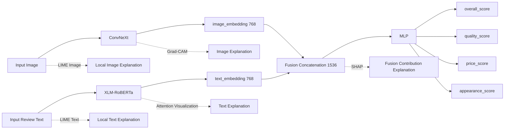
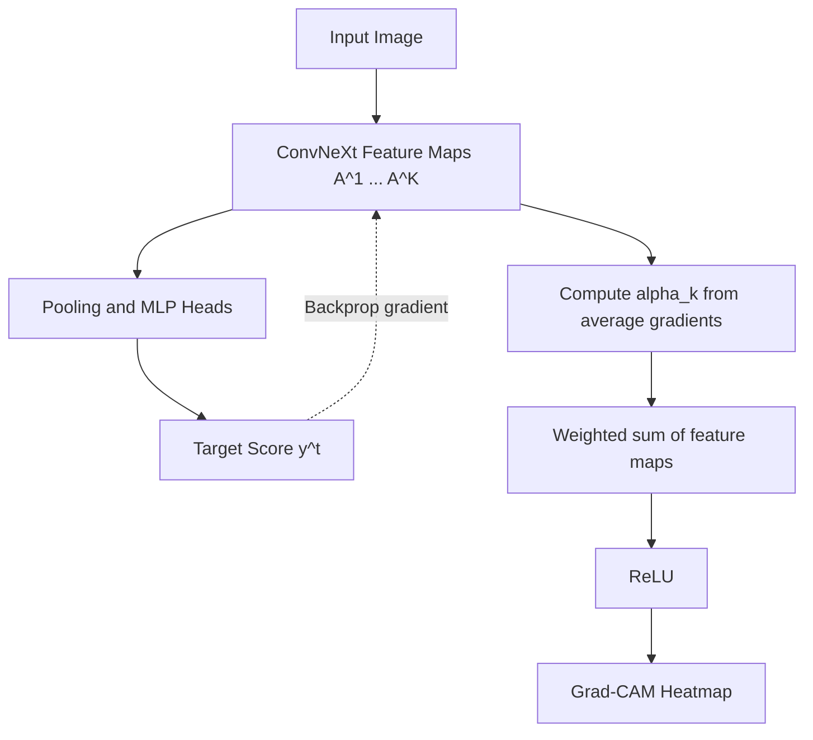
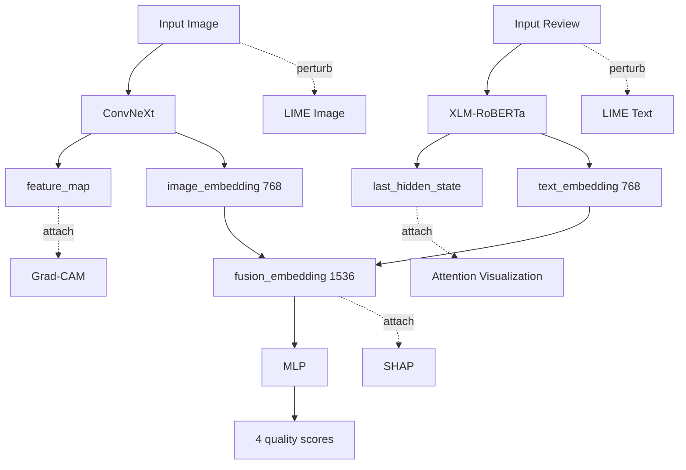
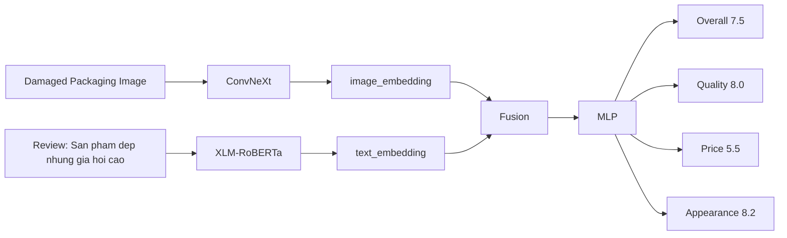

# Explainable AI for Multimodal Product Quality Assessment

Publication-ready handbook for a multimodal deep learning project that uses:

- `ConvNeXt` for the image branch
- `XLM-RoBERTa` for the text branch
- feature concatenation for fusion
- an `MLP` for multi-target quality score prediction

This document is written to help you move from beginner to advanced level while staying anchored to your project:

> An Explainable Multi-modal Deep Learning System for Product Quality Assessment using Image and Text Data

---

# Table of Contents

- [Part 1. Explainability Fundamentals](#part-1-explainability-fundamentals)
- [Part 2. Grad-CAM](#part-2-grad-cam)
- [Part 3. Attention Visualization](#part-3-attention-visualization)
- [Part 4. SHAP](#part-4-shap)
- [Part 5. LIME](#part-5-lime)
- [Part 6. Combining Explainability Methods](#part-6-combining-explainability-methods)
- [Part 7. End-to-End Example](#part-7-end-to-end-example)
- [Part 8. Implementation Roadmap](#part-8-implementation-roadmap)
- [Part 9. Practical PyTorch Implementation](#part-9-practical-pytorch-implementation)
- [Part 10. Thesis Defense Preparation](#part-10-thesis-defense-preparation)
- [References](#references)

---

# Part 1. Explainability Fundamentals

## Concept

### Why it exists

Explainable AI, or `XAI`, exists because powerful models often make accurate predictions without revealing *why* they made them. In your project, the model predicts:

- `overall_score`
- `quality_score`
- `price_score`
- `appearance_score`

but a score alone is not enough for research-quality understanding. You also need evidence such as:

- which image regions drove the quality judgment
- which words in the review affected the score
- whether the decision was driven more by image or text
- whether the fused representation learned meaningful product-quality signals

XAI exists to turn a hidden computation into an interpretable reasoning trace.

### Problem it solves

Modern deep learning is called a black box because the mapping

$$
f(x) \rightarrow y
$$

is learned through millions of parameters. We can observe the input `x` and output `y`, but the internal reasoning is distributed across layers, channels, and nonlinear operations.

In your system, the black-box problem appears in three places:

1. `ConvNeXt` transforms pixels into a `768`-dimensional image embedding.
2. `XLM-RoBERTa` transforms tokens into contextual vectors and a `768`-dimensional text embedding.
3. The fusion `MLP` combines them into final scores.

Without XAI, a thesis examiner can ask:

- Why did the model think this product had poor quality?
- Did it use damaged packaging or irrelevant background?
- Did it focus on the word `đẹp` or only the word `giá`?
- Is the fusion layer dominated by one modality?

XAI solves this by creating *post hoc evidence* or *intrinsic evidence* about the model's decision process.

### Intuition

Think of your multimodal model as a panel of three specialists:

- the image specialist looks at scratches, packaging damage, and color inconsistency
- the text specialist reads opinions such as `đẹp`, `bền`, `đắt`, `cao`
- the fusion specialist combines both opinions into one final judgment

XAI asks each specialist:

- What evidence did you use?
- How strong was each piece of evidence?
- If one piece of evidence were removed, would the decision change?

That is why different XAI tools exist:

- `Grad-CAM` answers spatial image evidence
- `Attention visualization` answers token interaction evidence
- `SHAP` answers feature contribution evidence
- `LIME` answers local perturbation-based evidence

### Mathematics

At the highest level, your model can be written as:

$$
\hat{y} = f_{\text{fusion}}(f_{\text{img}}(I), f_{\text{text}}(T))
$$

where:

- $I$ is the input image
- $T$ is the input text
- $f_{\text{img}}$ is the `ConvNeXt` image encoder
- $f_{\text{text}}$ is the `XLM-RoBERTa` text encoder
- $f_{\text{fusion}}$ is the fusion `MLP`

Let:

$$
e_{\text{img}} \in \mathbb{R}^{768}, \quad e_{\text{text}} \in \mathbb{R}^{768}
$$

Then your baseline fusion is:

$$
e_{\text{fusion}} = [e_{\text{img}} ; e_{\text{text}}] \in \mathbb{R}^{1536}
$$

and the prediction head computes:

$$
\hat{y} = g(e_{\text{fusion}})
$$

XAI techniques try to explain one of three different objects:

1. internal spatial activations in `ConvNeXt`
2. token-to-token interactions in `XLM-RoBERTa`
3. feature contributions inside the fused vector and `MLP`

### Architecture Mapping



### Tensor Shapes

Typical tensors in your pipeline:

| Stage | Tensor | Shape | Meaning |
|---|---|---:|---|
| Input image | `pixel_values` | `[B, 3, H, W]` | RGB image batch |
| ConvNeXt feature map | `feature_map` | `[B, C, Hf, Wf]` | spatial image features before pooling |
| Image embedding | `image_embedding` | `[B, 768]` | pooled image representation |
| Token ids | `input_ids` | `[B, L]` | tokenized review text |
| Attention mask | `attention_mask` | `[B, L]` | valid token mask |
| XLM-R hidden states | `last_hidden_state` | `[B, L, 768]` | contextual token representations |
| Text embedding | `text_embedding` | `[B, 768]` | pooled text representation |
| Fusion embedding | `fusion_embedding` | `[B, 1536]` | concatenated multimodal representation |
| Output scores | `preds` | `[B, 4]` | four regression outputs |

### PyTorch Implementation

The most important implementation idea is to expose intermediate tensors cleanly.

```python
import torch
import torch.nn as nn


class MultiModalQualityModel(nn.Module):
    def __init__(self, image_encoder, text_encoder, fusion_mlp):
        super().__init__()
        self.image_encoder = image_encoder
        self.text_encoder = text_encoder
        self.fusion_mlp = fusion_mlp

    def forward(
        self,
        pixel_values,
        input_ids,
        attention_mask,
        output_attentions=False,
        return_intermediates=False,
    ):
        image_outputs = self.image_encoder(pixel_values, return_feature_map=True)
        text_outputs = self.text_encoder(
            input_ids=input_ids,
            attention_mask=attention_mask,
            output_attentions=output_attentions,
            return_dict=True,
        )

        image_embedding = image_outputs["image_embedding"]          # [B, 768]
        feature_map = image_outputs["feature_map"]                  # [B, C, Hf, Wf]
        last_hidden_state = text_outputs.last_hidden_state          # [B, L, 768]
        text_embedding = last_hidden_state[:, 0, :]                # [B, 768], CLS-style pooling

        fusion_embedding = torch.cat([image_embedding, text_embedding], dim=-1)  # [B, 1536]
        preds = self.fusion_mlp(fusion_embedding)                  # [B, 4]

        output = {"preds": preds}

        if return_intermediates:
            output.update(
                {
                    "feature_map": feature_map,
                    "image_embedding": image_embedding,
                    "last_hidden_state": last_hidden_state,
                    "text_embedding": text_embedding,
                    "fusion_embedding": fusion_embedding,
                }
            )

        if output_attentions:
            output["attentions"] = text_outputs.attentions

        return output
```

### Visualization

Your project needs four complementary explanation views:

| Explanation Type | Question Answered | Best Tool |
|---|---|---|
| Spatial image evidence | Which pixels or regions mattered? | `Grad-CAM` |
| Token evidence | Which words mattered? | `Attention`, optionally `LIME Text` |
| Modality contribution | Was image or text more influential? | `SHAP` |
| Local perturbation sanity check | What happens if parts are removed? | `LIME` |

### Example from My Project

Suppose the product image shows:

- a dented cardboard box
- a scratched bottle surface
- slightly uneven color

and the review says:

`Sản phẩm đẹp nhưng giá hơi cao`

Then a good explainable system should produce a human-readable explanation such as:

- `appearance_score` is high because image regions around the visible product body are clean and visually appealing
- `price_score` is lower because the text branch focuses on the phrase `giá hơi cao`
- `overall_score` is influenced mostly by the image branch, but text moderately decreases it

### Common Mistakes

- Treating attention as guaranteed explanation.
- Using only one XAI tool and claiming complete interpretability.
- Explaining the wrong output head, such as using `overall_score` when analyzing `price_score`.
- Forgetting that regression explanation differs from classification explanation.
- Failing to hold the other modality fixed when explaining one modality.

### Debugging Tips

- Check that explanations are generated for the correct target output index.
- Compare explanations for `overall_score` and `price_score`; they should not always look identical.
- Verify that background, watermark, or padding areas are not dominating `Grad-CAM`.
- For text, inspect actual tokenization because `XLM-RoBERTa` may split Vietnamese words into subwords.

### Thesis Writing Example

Example paragraph:

> To improve model transparency, we integrated multiple explainability mechanisms at different levels of the proposed multimodal architecture. Grad-CAM was applied to the ConvNeXt image branch to localize visually salient regions associated with predicted quality scores. Attention visualization was applied to the XLM-RoBERTa text branch to identify influential textual evidence. SHAP analysis was conducted on the fused embedding to quantify feature-level and modality-level contributions, while LIME was used as a local perturbation-based validation tool. This multi-level design allowed us to explain not only *where* the model looked, but also *which modality* and *which features* drove the final prediction.

### Defense Questions

1. Why is explainability important in your thesis and not just prediction accuracy?
2. Why did you choose multiple XAI methods instead of one?
3. What is the difference between model interpretation and model debugging?

Short model answers:

1. Accuracy shows *how often* the model is correct; explainability shows *why* it is correct or incorrect.
2. Each method explains a different part of the architecture: pixels, tokens, fused features, and perturbation robustness.
3. Interpretation communicates reasoning; debugging uses explanation signals to detect shortcuts, spurious correlations, and branch imbalance.

### Key Takeaways

- XAI is essential because your multimodal model is not interpretable by inspection.
- In your architecture, explainability must be attached to image, text, and fusion stages separately.
- A strong thesis does not ask only whether the model predicts well; it asks whether the model reasons in a believable way.

---

# Part 2. Grad-CAM

## Concept

### Why it exists

`Grad-CAM` was invented to answer a very practical question:

> Which regions of an image caused the network to make a specific prediction?

CNN-style backbones, including `ConvNeXt`, compress an image through many spatial feature maps. By the end of the network, we get a compact embedding, but the spatial reasoning that produced it is hidden. `Grad-CAM` restores a coarse spatial explanation by projecting gradient information back onto the last meaningful convolutional feature maps [1].

### Problem it solves

In your project, the image branch predicts quality-related properties from product photos. Without localization, you cannot tell whether the network:

- correctly focused on damaged packaging
- correctly focused on scratches or dents
- incorrectly focused on the background table
- incorrectly focused on the seller watermark or lighting artifacts

`Grad-CAM` solves the missing spatial evidence problem.

### Intuition

Imagine the last `ConvNeXt` feature map as a stack of image detectors:

- channel 1 responds to edges
- channel 54 responds to glossy reflections
- channel 187 responds to damaged corners
- channel 411 responds to printed packaging regions

Now choose one output, for example `quality_score`. We ask:

- If `quality_score` increases, which channels were most responsible?
- Among those channels, where in the image did they activate?

`Grad-CAM` does exactly this:

1. take the feature maps from a late image layer
2. compute the gradient of the target score with respect to those feature maps
3. use gradients as channel importance weights
4. combine the weighted feature maps into one heatmap

### Mathematics

Let:

- $A^k \in \mathbb{R}^{H \times W}$ be the $k$-th feature map of a chosen convolutional layer
- $y^t$ be the scalar target output you want to explain, such as `appearance_score`

The importance weight for channel $k$ is:

$$
\alpha_k^t = \frac{1}{Z} \sum_i \sum_j \frac{\partial y^t}{\partial A_{ij}^k}
$$

where:

- $A_{ij}^k$ is the activation at spatial position $(i,j)$ in channel $k$
- $Z = H \times W$ is the number of spatial locations

Interpretation:

- the gradient tells us how sensitive the target score is to each activation
- averaging across spatial positions gives a single importance weight per channel

Then the Grad-CAM map is:

$$
L_{\text{Grad-CAM}}^t = \text{ReLU}\left(\sum_k \alpha_k^t A^k \right)
$$

Why `ReLU`?

- positive evidence means regions that support the target
- negative evidence is discarded in standard Grad-CAM because the method aims to highlight supportive regions

#### Intuitive diagram



### Architecture Mapping

For your architecture, `Grad-CAM` should be attached to the **image branch before global pooling**.

Recommended placement:

- use the last spatial stage of `ConvNeXt`
- do **not** use the final `image_embedding` `[B, 768]`, because it has no 2D spatial structure

If your image branch produces:

```python
feature_map  # [B, C, Hf, Wf]
image_embedding  # [B, 768]
```

then `Grad-CAM` uses `feature_map`, not `image_embedding`.

In a multimodal setting, gradients come from a selected output head:

- `overall_score`
- `quality_score`
- `price_score`
- `appearance_score`

This means you can produce different Grad-CAM maps for the same image depending on which score you explain.

#### Grad-CAM vs attention maps

| Aspect | Grad-CAM | Attention Map |
|---|---|---|
| Branch | image | text |
| Signal source | gradients + feature maps | self-attention weights |
| Output type | spatial heatmap over pixels/regions | token-to-token interaction matrix |
| Best question answered | where did the visual encoder look? | which tokens interacted strongly? |
| Resolution | coarse spatial | token-level |
| Causality strength | limited but target-linked | weaker as direct explanation |

In short:

- `Grad-CAM` is output-targeted because it explicitly uses gradients from a selected score
- attention maps reveal internal information flow, but not necessarily final decision importance

### Tensor Shapes

Example image path through the branch:

| Stage | Tensor | Shape |
|---|---|---:|
| Input image | `pixel_values` | `[B, 3, 224, 224]` |
| Late ConvNeXt feature map | `feature_map` | `[B, 768, 7, 7]` |
| Global average pooling | `pooled` | `[B, 768, 1, 1]` |
| Flattened embedding | `image_embedding` | `[B, 768]` |
| Fused embedding | `fusion_embedding` | `[B, 1536]` |
| Output scores | `preds` | `[B, 4]` |

Gradient flow for one scalar output:

$$
\frac{\partial y^t}{\partial A} \in \mathbb{R}^{B \times C \times Hf \times Wf}
$$

For one sample:

$$
\frac{\partial y^t}{\partial A} \in \mathbb{R}^{768 \times 7 \times 7}
$$

Then channel weights:

$$
\alpha^t \in \mathbb{R}^{768}
$$

and final heatmap:

$$
L_{\text{Grad-CAM}}^t \in \mathbb{R}^{7 \times 7}
$$

which is then upsampled to image size, for example `224 x 224`.

### PyTorch Implementation

`pytorch-grad-cam` is the fastest way to implement this reliably. Its documentation and tutorials show the standard workflow of selecting `target_layers`, creating a `GradCAM` object, and overlaying the heatmap on the image [9].

The main design choice in your project is: **what model should Grad-CAM see?**

Best practice:

- explain the *full multimodal output* while keeping text fixed
- pass the selected image through the model
- compute gradients from one chosen score head

```python
import torch
import torch.nn as nn
from pytorch_grad_cam import GradCAM
from pytorch_grad_cam.utils.model_targets import ClassifierOutputTarget
from pytorch_grad_cam.utils.image import show_cam_on_image


class MultiTargetScoreWrapper(nn.Module):
    def __init__(self, multimodal_model, fixed_input_ids, fixed_attention_mask, score_index):
        super().__init__()
        self.multimodal_model = multimodal_model.eval()
        self.fixed_input_ids = fixed_input_ids
        self.fixed_attention_mask = fixed_attention_mask
        self.score_index = score_index

    def forward(self, pixel_values):
        outputs = self.multimodal_model(
            pixel_values=pixel_values,
            input_ids=self.fixed_input_ids,
            attention_mask=self.fixed_attention_mask,
            output_attentions=False,
            return_intermediates=False,
        )
        preds = outputs["preds"]  # [B, 4]
        return preds[:, self.score_index]  # [B]


def generate_gradcam(
    model_wrapper,
    target_layer,
    input_tensor,
    rgb_image_float01,
):
    with GradCAM(model=model_wrapper, target_layers=[target_layer]) as cam:
        grayscale_cam = cam(input_tensor=input_tensor, targets=None)  # [B, Hf, Wf]
        grayscale_cam = grayscale_cam[0]
        overlay = show_cam_on_image(rgb_image_float01, grayscale_cam, use_rgb=True)
    return grayscale_cam, overlay
```

If you use a custom `ConvNeXt` branch, the target layer is usually one of:

- the last block in the last stage
- the last depthwise-convolution-containing block before pooling
- the final spatial normalization layer output if it preserves `[B, C, H, W]`

If you use a Hugging Face `ConvNeXt`, the `pytorch-grad-cam` tutorial demonstrates selecting the final encoder stage and, for some workflows, applying a shape transform suitable for that model family [9].

### Visualization

Pipeline:

```text
Input Image
  ↓
ConvNeXt
  ↓
Late Feature Map
  ↓ + gradients from target score
Grad-CAM
  ↓
Upsampled Heatmap
  ↓
Heatmap Overlay on Original Image
```

Interpretation rules for your project:

- bright red or yellow regions indicate strong positive support for the selected score
- dark blue or no-color regions indicate weak support
- if the map is spread across the whole image, the model may be using global appearance cues
- if the map focuses on defects, the explanation is more semantically convincing

Quality-assessment interpretation examples:

| Visual pattern | Plausible interpretation |
|---|---|
| Damaged corner highlighted | model associates packaging damage with lower quality |
| Scratched surface highlighted | model detects cosmetic defect |
| Uneven color area highlighted | model uses appearance inconsistency |
| Clean product body highlighted for `appearance_score` | model uses positive visual appeal |
| Background highlighted | possible shortcut or failure |

### Example from My Project

Suppose the image shows a dented package and a scratched product cap.

Possible `Grad-CAM` results:

- `quality_score`: heatmap concentrates on the dented box edge and scratch area
- `appearance_score`: heatmap focuses on the visible product body and front-facing aesthetic region
- `price_score`: heatmap is weaker or more diffuse because price is often more text-driven than image-driven

That difference is scientifically useful. It shows that output heads may rely on different evidence.

### Common Mistakes

- Using the pooled embedding instead of the last spatial feature map.
- Explaining the predicted maximum output without specifying the correct regression target.
- Forgetting to set the model to `eval()`.
- Claiming pixel-level precision even though Grad-CAM is coarse and low-resolution.
- Interpreting heatmap intensity as causal proof rather than supportive evidence.

### Debugging Tips

- If the heatmap is almost uniform, choose a later layer or inspect gradient saturation.
- If the heatmap is empty, confirm that the target score has nonzero gradient with respect to the chosen feature map.
- Compare heatmaps across different heads; identical maps may indicate branch collapse or overly shared head behavior.
- Run sanity checks by randomizing weights; explanations should degrade when the model is destroyed.

### Thesis Writing Example

Example method description:

> We applied Gradient-weighted Class Activation Mapping (Grad-CAM) to the final spatial feature maps of the ConvNeXt image encoder to localize regions contributing to each predicted quality score. For a selected target output $y^t$, the gradients with respect to the final feature maps were globally averaged to obtain channel importance weights, and the weighted combination of feature maps was passed through a ReLU operation to generate a class activation map. The resulting heatmap was upsampled and overlaid on the original product image to visualize visually salient regions.

Example result discussion:

> For samples with damaged packaging, Grad-CAM consistently highlighted dented corners and surface scratches, suggesting that the model relied on defect-related visual evidence rather than irrelevant background features. In contrast, some failure cases showed high activation on lighting reflections, indicating sensitivity to imaging artifacts.

Example figure caption:

> **Figure X.** Grad-CAM visualization for the `quality_score` head. Warm colors indicate image regions that positively supported the predicted quality assessment. The model focused primarily on the damaged packaging edge and the scratched cap region.

### Defense Questions

1. Why use Grad-CAM instead of raw feature maps?
2. Why is Grad-CAM appropriate for ConvNeXt?
3. What is the difference between Grad-CAM and attention visualization?
4. What are the limitations of Grad-CAM?

Strong answers:

1. Raw feature maps show activation magnitude, but Grad-CAM ties those maps to a specific target output through gradients.
2. ConvNeXt still produces late spatial feature maps, so Grad-CAM can localize evidence before global pooling.
3. Grad-CAM is gradient-based spatial attribution in the image branch; attention visualization shows token interactions in the text branch.
4. Grad-CAM is low-resolution, not strictly causal, and can be sensitive to target layer choice.

### Key Takeaways

- `Grad-CAM` explains *where* the image branch looked.
- In your architecture, it attaches to the last spatial `ConvNeXt` feature map.
- It is especially useful for showing damaged packaging, scratches, color inconsistency, and other visible defects.

---

# Part 3. Attention Visualization

## Concept

### Why it exists

Transformer attention visualization exists because token embeddings alone do not show how words interact. In review understanding, a word like `cao` does not mean much by itself; its importance depends on context such as `giá hơi cao`.

For your project, attention visualization helps reveal:

- which words influence each prediction
- which tokens attend to each other
- whether the text branch is focusing on quality terms, price terms, or irrelevant filler

### Problem it solves

`XLM-RoBERTa` outputs:

- `text_embedding` of shape `[B, 768]`
- `last_hidden_state` of shape `[B, L, 768]`
- optionally `attentions`

Without attention analysis, the text branch remains opaque. You cannot easily explain why:

- `appearance_score` increased after seeing `đẹp`
- `price_score` decreased after seeing `giá hơi cao`
- the model ignored words that humans consider important

### Intuition

Self-attention answers:

> When encoding token `i`, which other tokens should it look at?

For the sentence:

`Sản phẩm đẹp nhưng giá hơi cao`

intuitively:

- `đẹp` contributes positive appearance sentiment
- `giá` identifies the price aspect
- `cao` tells us the direction of the price judgment

The model can represent this by allocating strong attention among those tokens.

#### Query, Key, Value intuition

Each token produces three vectors:

- `Query (Q)`: what this token is looking for
- `Key (K)`: what this token offers
- `Value (V)`: information passed forward if selected

Human analogy:

- `Query`: "I am looking for words related to price."
- `Key`: "I am the token `giá`, so I match price-related queries."
- `Value`: "Here is the semantic content about price."

### Mathematics

For token matrix:

$$
X \in \mathbb{R}^{L \times d}
$$

we compute:

$$
Q = XW_Q,\quad K = XW_K,\quad V = XW_V
$$

where:

- $L$ is sequence length
- $d$ is hidden size, here often `768`

Self-attention is:

$$
\text{Attention}(Q, K, V) = \text{softmax}\left(\frac{QK^T}{\sqrt{d_k}}\right)V
$$

Interpretation:

- $QK^T$ measures similarity between what one token wants and what another token offers
- division by $\sqrt{d_k}$ stabilizes values
- `softmax` converts scores into attention weights
- multiplication by `V` produces the context-aware representation

In multi-head attention, this is repeated across several heads:

$$
\text{MultiHead}(X) = \text{Concat}(\text{head}_1, \dots, \text{head}_h)W_O
$$

Different heads may learn:

- syntactic relations
- sentiment relations
- aspect-term relations
- long-range contextual relations

### Architecture Mapping

For `XLM-RoBERTa`, request attention tensors by setting:

```python
output_attentions=True
```

The Hugging Face `transformers` API returns attention tensors as a tuple containing one tensor per layer when `output_attentions=True` and `return_dict=True` [10].

Practical mapping in your system:

- use `outputs.attentions` for token interaction evidence
- use `last_hidden_state` for token-level contextual representations
- use `text_embedding` for fusion

Important distinction:

- attention weights show *where tokens attend*
- token importance for the final score is a different question and may require gradients, SHAP, or LIME

### Tensor Shapes

Actual Hugging Face format:

- `outputs.attentions` is a tuple of length `num_layers`
- each element has shape:

```python
[B, num_heads, L, L]
```

If you stack them manually, you can think of it as:

```python
[num_layers, B, num_heads, L, L]
```

Your simplified interpretation:

```python
[layer, head, token, token]
```

for a single sample after removing batch dimension.

Example:

| Object | Shape |
|---|---:|
| `input_ids` | `[1, 10]` |
| `last_hidden_state` | `[1, 10, 768]` |
| one layer attention | `[1, 12, 10, 10]` |
| stacked attention | `[12, 1, 12, 10, 10]` |
| single sample, one layer | `[12, 10, 10]` |

### PyTorch Implementation

The implementation is straightforward with `transformers`. Current Hugging Face documentation supports `output_attentions=True` to obtain attention tensors from model outputs [10].

```python
import torch
from transformers import AutoTokenizer, AutoModel


tokenizer = AutoTokenizer.from_pretrained("xlm-roberta-base")
text_model = AutoModel.from_pretrained("xlm-roberta-base")
text_model.eval()

sentence = "Sản phẩm đẹp nhưng giá hơi cao"
encoded = tokenizer(sentence, return_tensors="pt")

with torch.no_grad():
    outputs = text_model(
        **encoded,
        output_attentions=True,
        return_dict=True,
    )

last_hidden_state = outputs.last_hidden_state      # [1, L, 768]
attentions = outputs.attentions                    # tuple(num_layers), each [1, H, L, L]

tokens = tokenizer.convert_ids_to_tokens(encoded["input_ids"][0])
layer_11 = attentions[11][0]                       # [H, L, L] for sample 0
head_0 = layer_11[0]                               # [L, L]
mean_heads = layer_11.mean(dim=0)                  # [L, L]
```

#### Aggregating multiple heads

Common strategies:

```python
attn_layer = attentions[layer_idx][0]      # [H, L, L]
mean_heads = attn_layer.mean(dim=0)        # [L, L]
max_heads = attn_layer.max(dim=0).values   # [L, L]
```

#### Aggregating multiple layers

```python
stacked = torch.stack([a[0] for a in attentions], dim=0)  # [Layers, H, L, L]
mean_layers_heads = stacked.mean(dim=(0, 1))              # [L, L]
last_layer_mean = stacked[-1].mean(dim=0)                 # [L, L]
```

Advanced option: `attention rollout`, which multiplies attention matrices across layers to approximate global token influence.

#### Aggregation strategies: advantages and disadvantages

| Strategy | Formula idea | Advantage | Disadvantage |
|---|---|---|---|
| One head, one layer | choose `layer l`, `head h` | most faithful to a specific attention pattern | noisy, hard to generalize |
| Mean over heads | average heads in one layer | stable and easy to visualize | may hide specialized heads |
| Mean over last layer | average final layer heads | often most task-relevant | ignores useful mid-layer behavior |
| Mean over last 4 layers | smoother high-level summary | balances stability and semantic richness | still heuristic |
| Max over heads | keep strongest head response | highlights salient relations | can exaggerate noise |
| Attention rollout | compose attention across layers | captures global information flow | more complex and assumption-heavy |

Recommended default for your thesis:

- start with `last-layer mean over heads`
- then compare with `mean over last 4 layers`
- mention rollout as an advanced extension

### Visualization

Three useful visualizations for thesis-quality reporting:

1. token-colored importance bar
2. token-to-token heatmap
3. aggregated attention matrix

Example with your review:

`Sản phẩm đẹp nhưng giá hơi cao`

Expected highlighted words:

- `đẹp`: positive appearance cue
- `giá`: identifies price aspect
- `cao`: negative price evaluation

Why?

- `đẹp` tends to support appearance-related predictions
- `giá` and `cao` together form a negative price phrase
- `nhưng` acts as a discourse contrast marker, showing two opposing sentiments in one sentence

### Example from My Project

Suppose the model predicts:

- `appearance_score = 8.2`
- `price_score = 5.5`

A sensible text explanation is:

- attention linked `đẹp` with the product aspect, supporting a high appearance score
- attention linked `giá` and `cao`, supporting a lower price score
- the conjunction `nhưng` helped the model separate positive appearance sentiment from negative price sentiment

### Common Mistakes

- Treating special tokens like `<s>` and `</s>` as meaningful evidence without inspection.
- Forgetting that `XLM-RoBERTa` may split a Vietnamese word into multiple subword pieces.
- Averaging all layers blindly, which can wash out useful signal.
- Claiming that high attention always means causal importance.

### Debugging Tips

- Visualize tokenization first. If `đẹp` is split, aggregate subwords back to word level before plotting for humans.
- Compare early-layer and late-layer attention. Early layers are often syntactic; late layers are often more task-relevant.
- Inspect attention per output head indirectly by combining attention with gradient-based token attribution if needed.
- If attention maps look noisy, try:
  - last-layer mean over heads
  - mean over last 4 layers
  - attention rollout

### Thesis Writing Example

Example method description:

> To interpret the textual evidence used by the multilingual text encoder, attention weights were extracted from XLM-RoBERTa by enabling `output_attentions=True`. For each input review, we analyzed head-wise and layer-wise attention matrices and aggregated them across heads to produce token-level heatmaps. This enabled qualitative identification of influential terms and their interactions, especially for aspect-bearing words related to product appearance and price.

Example discussion:

> In the review "Sản phẩm đẹp nhưng giá hơi cao", the model assigned stronger attention to the tokens corresponding to `đẹp`, `giá`, and `cao`. This pattern indicates that the text branch captured both positive appearance sentiment and negative price sentiment. However, attention visualization was interpreted cautiously, as attention weights do not always correspond directly to causal importance.

Example figure caption:

> **Figure Y.** Aggregated last-layer attention heatmap from XLM-RoBERTa for the review "Sản phẩm đẹp nhưng giá hơi cao". Darker cells indicate stronger token-to-token attention weights.

### Defense Questions

1. What do Query, Key, and Value mean intuitively?
2. What is the shape of `outputs.attentions`?
3. Why is attention not always explanation?
4. Why use attention visualization anyway?

Strong answers:

1. Query expresses what a token seeks, Key expresses what a token offers, and Value is the information passed if that token is selected.
2. It is a tuple of length `num_layers`; each tensor is `[B, num_heads, L, L]`.
3. Attention shows interaction weights, but not necessarily the full causal contribution to the final prediction [5].
4. It still reveals useful internal structure, especially when combined with other attribution methods and careful qualitative analysis.

### Key Takeaways

- Attention visualization explains *which words interact* inside `XLM-RoBERTa`.
- It is useful for interpreting multilingual review evidence, especially aspect phrases like `giá hơi cao`.
- It should be reported as supportive evidence, not as a perfect causal explanation.

---

# Part 4. SHAP

## Concept

### Why it exists

`SHAP` became popular because researchers needed a principled way to assign contribution scores to features while preserving desirable fairness properties from cooperative game theory [2].

For your project, SHAP is attractive because it answers questions that neither Grad-CAM nor attention can answer well:

- Was the final prediction driven more by image or text?
- Which parts of the `1536`-dimensional fusion vector contributed most?
- Did the text branch raise or lower the score?

### Problem it solves

The fusion `MLP` receives:

```python
fusion_embedding  # [B, 1536]
```

This vector is already highly abstract. It no longer corresponds directly to pixels or words. You need a feature contribution method that can say:

- these image dimensions pushed the score up
- these text dimensions pushed the score down
- overall image contribution was `72%`, text contribution was `28%`

SHAP solves this contribution decomposition problem.

### Intuition

SHAP treats each feature as a player in a cooperative game.

The game:

- players = embedding dimensions
- payoff = predicted score

Question:

> How much credit should each player receive for the final prediction?

The answer is based on **average marginal contribution** across all possible coalitions.

Simple analogy:

- if a student team gets an `A`, SHAP asks how much each student contributed on average over all possible team combinations
- in your model, features from image and text are the students

### Mathematics

Let the feature set be:

$$
F = \{1, 2, \dots, M\}
$$

For feature $i$, the Shapley value is:

$$
\phi_i = \sum_{S \subseteq F \setminus \{i\}} \frac{|S|!(M-|S|-1)!}{M!} \left[f(S \cup \{i\}) - f(S)\right]
$$

Interpretation:

- $S$ is a subset of features already present
- $f(S)$ is the model output using only features in subset $S$
- the bracket term is the extra contribution of feature $i$
- the coefficient averages that contribution fairly across all subset sizes and orders

The explanation obeys the additive property:

$$
f(x) = \phi_0 + \sum_{i=1}^{M} \phi_i
$$

where:

- $\phi_0$ is the base value, usually the expected model output over background data
- $\phi_i$ is how much feature $i$ moves the prediction away from the baseline

#### Modality-level grouping

Your `1536` features can be grouped into:

- image group: dimensions `0:768`
- text group: dimensions `768:1536`

Then a modality contribution can be approximated as:

$$
\Phi_{\text{img}} = \sum_{i=1}^{768} |\phi_i|,\qquad
\Phi_{\text{text}} = \sum_{i=769}^{1536} |\phi_i|
$$

and normalized percentage:

$$
\text{Image\%} = \frac{\Phi_{\text{img}}}{\Phi_{\text{img}} + \Phi_{\text{text}}} \times 100
$$

Absolute sums are useful for contribution magnitude. Signed sums are useful when you want to know whether a modality raised or lowered the prediction.

### Architecture Mapping

The best insertion point for SHAP in your system is the **fusion layer or the prediction head**.

Recommended strategy:

1. explain the `MLP` that maps `fusion_embedding -> scores`
2. optionally explain the full multimodal model if computational budget allows

Why the head is the best starting point:

- input dimensionality is controlled (`1536`)
- feature semantics are stable
- explanations are faster and easier to compare

### Tensor Shapes

For one sample:

| Tensor | Shape |
|---|---:|
| `image_embedding` | `[768]` |
| `text_embedding` | `[768]` |
| `fusion_embedding` | `[1536]` |
| `shap_values` for one target | `[1536]` |

For a batch of `N` samples and one output head:

| Tensor | Shape |
|---|---:|
| fused inputs | `[N, 1536]` |
| predictions | `[N, 1]` or `[N]` |
| SHAP values | `[N, 1536]` |

If you explain all four outputs separately, repeat the process per target or organize outputs accordingly.

### PyTorch Implementation

For a differentiable head, `DeepExplainer` or `GradientExplainer` is usually a good first choice in SHAP documentation, while `KernelExplainer` is a slower model-agnostic fallback [11].

In your project, a practical pattern is:

- extract fused embeddings from the full model
- train or reuse the `MLP` head
- explain the head with SHAP

```python
import torch
import torch.nn as nn
import shap


class FusionHeadWrapper(nn.Module):
    def __init__(self, fusion_mlp, score_index):
        super().__init__()
        self.fusion_mlp = fusion_mlp.eval()
        self.score_index = score_index

    def forward(self, fusion_embedding):
        preds = self.fusion_mlp(fusion_embedding)   # [B, 4]
        return preds[:, self.score_index: self.score_index + 1]  # [B, 1]


def compute_shap_for_fusion_head(fusion_mlp, background_fused, sample_fused, score_index=0):
    wrapper = FusionHeadWrapper(fusion_mlp, score_index)
    explainer = shap.DeepExplainer(wrapper, background_fused)
    shap_values = explainer.shap_values(sample_fused)
    return explainer, shap_values
```

#### Modality contribution from SHAP

```python
import numpy as np


def modality_contribution(shap_vector):
    img_part = shap_vector[:768]
    txt_part = shap_vector[768:]

    img_mag = np.abs(img_part).sum()
    txt_mag = np.abs(txt_part).sum()
    total = img_mag + txt_mag + 1e-8

    return {
        "image_pct": 100.0 * img_mag / total,
        "text_pct": 100.0 * txt_mag / total,
        "image_signed": img_part.sum(),
        "text_signed": txt_part.sum(),
    }
```

If you need model-agnostic behavior, use `KernelExplainer`, but remember it is much slower because it relies on perturbation-based approximation [11].

### Visualization

The most useful SHAP plots for your thesis:

| Plot | Best for | What it shows |
|---|---|---|
| `Summary Plot` | dataset-level analysis | which features matter most overall |
| `Bar Plot` | quick global importance | mean absolute SHAP per feature or group |
| `Waterfall Plot` | one sample | how features move prediction from baseline to final output |
| `Force Plot` | one sample or few samples | signed push-pull explanation around base value |

Interpretation in your system:

- summary plot: global importance across fusion dimensions
- waterfall plot: why one product got a specific `overall_score`
- grouped bar plot: image vs text contribution
- force plot: whether text pushed price down while image pushed appearance up

Example plotting workflow:

```python
import shap
import matplotlib.pyplot as plt


# shap_array: [N, 1536]
# sample_idx = 0

shap.summary_plot(shap_array, sample_fused.cpu().numpy(), show=False)
plt.tight_layout()
plt.savefig("shap_summary.png", dpi=200)

explanation = shap.Explanation(
    values=shap_array[sample_idx],
    base_values=explainer.expected_value,
    data=sample_fused[sample_idx].cpu().numpy(),
)

shap.plots.waterfall(explanation, show=False)
plt.tight_layout()
plt.savefig("shap_waterfall.png", dpi=200)

shap.plots.bar(explanation, show=False)
plt.tight_layout()
plt.savefig("shap_bar.png", dpi=200)
```

### Example from My Project

Suppose for one sample you obtain:

- `Image = 72%`
- `Text = 28%`

Interpretation:

- the model relied mainly on visual evidence
- text still mattered, but less
- if `text_signed` is negative, the review lowered the final score

Suppose further that:

- image dimensions around indices `120`, `211`, `455` are strongly positive
- text dimensions around indices `830`, `914` are strongly negative

Then you can say:

- some visual semantic features strongly supported quality
- a smaller set of text features decreased the score, likely corresponding to price complaint cues

### Common Mistakes

- Explaining the raw image pixels and token ids with standard SHAP when your real question is fusion behavior.
- Ignoring the choice of background samples.
- Reporting only signed sums and hiding magnitude.
- Over-interpreting individual embedding dimensions semantically when no probing is performed.

### Debugging Tips

- Use a representative background set, not random outliers.
- Compare SHAP on the same sample across the four output heads.
- If image dominates every sample, check whether the text branch is undertrained or pooled poorly.
- If SHAP values are unstable, reduce explanation scope to the fusion head first.

### Thesis Writing Example

Example method paragraph:

> SHAP analysis was performed on the fused multimodal representation to quantify feature-level and modality-level contributions to each predicted score. The concatenated embedding of dimension 1536 was treated as the input to the prediction head, where the first 768 dimensions corresponded to image features and the remaining 768 dimensions corresponded to text features. SHAP values were computed for each target score, and modality-level contributions were obtained by aggregating SHAP magnitudes within each modality-specific segment.

Example results paragraph:

> For the analyzed sample, image features accounted for approximately 72% of the total absolute SHAP magnitude, indicating that the prediction was primarily driven by visual evidence. Text features contributed the remaining 28% and had a net negative signed effect, consistent with the review phrase indicating that the price was perceived as relatively high.

Example figure caption:

> **Figure Z.** SHAP waterfall plot for the `overall_score` prediction. Positive contributions increased the predicted score relative to the baseline, while negative contributions decreased it. Grouped analysis showed stronger image contribution than text contribution.

### Defense Questions

1. Why use SHAP at the fusion level?
2. What is the meaning of the SHAP base value?
3. How did you compute modality contribution?
4. Why not use only SHAP and skip the other XAI methods?

Strong answers:

1. The fusion level directly answers multimodal contribution questions that spatial and attention explanations cannot answer.
2. The base value is the expected model output over background data; SHAP explains how features move the prediction away from that baseline.
3. I grouped SHAP values by embedding segment, summing image dimensions and text dimensions separately.
4. SHAP explains contribution magnitude, but it does not localize pixels like Grad-CAM or show token interaction structure like attention.

### Key Takeaways

- `SHAP` is the best tool in your pipeline for modality contribution analysis.
- It naturally fits the `fusion_embedding` and the `MLP` head.
- It helps you answer the thesis-level question: *Was the model more influenced by image or text?*

---

# Part 5. LIME

## Concept

### Why it exists

`LIME` was invented because many strong machine learning models are hard to interpret directly, and practitioners needed a local, model-agnostic explanation method that works even when gradients are unavailable or inconvenient [3].

### Problem it solves

LIME solves a different problem from SHAP:

- SHAP asks for principled additive contributions
- LIME asks for a simple, faithful approximation around *one local example*

In your multimodal project, LIME is useful for:

- checking whether masking image regions changes the prediction as expected
- checking whether removing words changes the prediction as expected
- validating that the model reacts locally to intuitive evidence

### Intuition

Suppose the model predicts:

`overall_score = 7.5`

LIME asks:

> If I make many small perturbations around this sample, can I fit a simple local model that imitates the black box nearby?

For images:

- divide image into superpixels
- turn some superpixels on or off
- observe prediction changes

For text:

- remove or mask words
- observe prediction changes

Then fit a sparse local linear model to estimate which parts mattered most.

### Mathematics

LIME explains an instance $x$ by solving:

$$
\xi(x) = \arg\min_{g \in G} \; \mathcal{L}(f, g, \pi_x) + \Omega(g)
$$

where:

- $f$ is the original black-box model
- $g$ is a simple interpretable model, often linear
- $\pi_x$ measures locality around instance $x$
- $\mathcal{L}$ measures how well $g$ approximates $f$ near $x$
- $\Omega(g)$ penalizes complexity so the explanation remains simple

Interpretation:

- sample neighbors around the original instance
- weight closer neighbors more strongly
- fit an interpretable surrogate
- read the surrogate coefficients as local importance scores

### Architecture Mapping

LIME can be attached in two ways:

1. **Image LIME**
   - perturb image superpixels
   - keep text fixed
   - query the full multimodal model

2. **Text LIME**
   - perturb tokens or words
   - keep image fixed
   - query the full multimodal model

This gives you local explanations conditioned on the other modality remaining unchanged.

### Tensor Shapes

LIME internally works in human-interpretable units, not latent tensors.

Image side:

- input image: `[H, W, 3]`
- superpixel mask: `[H, W]`
- perturbed image batch: `[N, H, W, 3]`

Text side:

- original text: sequence of words or tokens
- perturbations: many binary inclusion masks over words
- model outputs: `[N, 4]` or `[N, 1]`

Unlike Grad-CAM and SHAP, the important objects in LIME are:

- superpixel indicators
- word-presence indicators

### PyTorch Implementation

The official `lime` package provides `lime_image.LimeImageExplainer` and `lime_text.LimeTextExplainer`. A common workflow is to pass a `classifier_fn` that accepts perturbed samples and returns predictions.

#### Image LIME

```python
import numpy as np
import torch
from lime import lime_image


def build_image_predict_fn(multimodal_model, fixed_input_ids, fixed_attention_mask, score_index, device):
    multimodal_model.eval()

    def predict_fn(images_np):
        # images_np: [N, H, W, 3], values usually in [0, 255] or [0, 1]
        images = torch.tensor(images_np).permute(0, 3, 1, 2).float().to(device)
        if images.max() > 1.0:
            images = images / 255.0

        with torch.no_grad():
            outputs = multimodal_model(
                pixel_values=images,
                input_ids=fixed_input_ids.repeat(images.size(0), 1),
                attention_mask=fixed_attention_mask.repeat(images.size(0), 1),
            )["preds"]  # [N, 4]

        score = outputs[:, score_index:score_index + 1]
        # Convert regression score into 2-column pseudo-probability-like output for LIME
        score = torch.sigmoid(score)
        two_col = torch.cat([1 - score, score], dim=1)
        return two_col.cpu().numpy()

    return predict_fn


explainer = lime_image.LimeImageExplainer()
```

#### Text LIME

```python
from lime.lime_text import LimeTextExplainer
from transformers import AutoTokenizer


def build_text_predict_fn(multimodal_model, fixed_image_tensor, tokenizer, score_index, device):
    multimodal_model.eval()

    def predict_fn(text_list):
        enc = tokenizer(
            text_list,
            padding=True,
            truncation=True,
            return_tensors="pt",
        )
        enc = {k: v.to(device) for k, v in enc.items()}
        images = fixed_image_tensor.repeat(len(text_list), 1, 1, 1).to(device)

        with torch.no_grad():
            outputs = multimodal_model(
                pixel_values=images,
                input_ids=enc["input_ids"],
                attention_mask=enc["attention_mask"],
            )["preds"]  # [N, 4]

        score = outputs[:, score_index:score_index + 1]
        score = torch.sigmoid(score)
        two_col = torch.cat([1 - score, score], dim=1)
        return two_col.cpu().numpy()

    return predict_fn


text_explainer = LimeTextExplainer(class_names=["low", "high"])
```

### Visualization

#### Image LIME

Workflow:

```text
Original Image
  ↓
Segment into superpixels
  ↓
Randomly hide subsets of superpixels
  ↓
Run multimodal model with text fixed
  ↓
Fit local linear surrogate
  ↓
Highlight positive / negative superpixels
```

Interpretation:

- positive superpixels increase the selected score
- negative superpixels decrease it
- if defect superpixels are negative for `quality_score`, the explanation is sensible

#### Text LIME

Workflow:

```text
Original Review
  ↓
Remove or keep subsets of words
  ↓
Run multimodal model with image fixed
  ↓
Fit local linear surrogate
  ↓
Highlight important words
```

Interpretation for your sentence:

- `đẹp` should positively support `appearance_score`
- `giá` and `cao` should negatively affect `price_score`

### Example from My Project

Image LIME might highlight:

- damaged top-left packaging corner as negative evidence
- clean product front face as positive evidence for appearance

Text LIME might highlight:

- positive coefficient for `đẹp`
- negative coefficients for `giá` and `cao`

This provides a local perturbation-based confirmation of what Grad-CAM and attention suggested.

#### Advantages

| Advantage | Why it matters in your project |
|---|---|
| model-agnostic | you can explain the full multimodal system without requiring internal gradients |
| human-interpretable units | superpixels and words are easy to present in a thesis |
| local faithfulness | useful for analyzing one important case study or failure case |
| complementary to SHAP | provides perturbation evidence rather than only additive attribution |

#### Computational cost

LIME can be expensive because it requires many forward passes on perturbed samples.

Approximate cost intuition:

- image LIME with `1000` perturbations means roughly `1000` model evaluations for one sample
- text LIME with hundreds or thousands of perturbed sentences also multiplies inference cost
- multimodal models are slower than unimodal models, so cost matters more here

Practical guidance:

- use LIME on representative samples, not the entire dataset
- save perturbation outputs for reproducibility
- reserve LIME for case studies and debugging rather than large-scale benchmarking

### Common Mistakes

- Using too few perturbation samples.
- Forgetting that LIME is local, then over-generalizing results globally.
- Applying LIME directly to regression outputs without adapting the prediction function carefully.
- Treating superpixel boundaries as semantically perfect object boundaries.

### Debugging Tips

- Increase `num_samples` if explanations are unstable.
- Compare multiple random seeds because LIME includes stochastic perturbations.
- Keep the non-explained modality fixed to isolate local effects.
- For text, define whether explanation units are whitespace words or tokenizer subwords; thesis figures are easier to read at the word level.

### Thesis Writing Example

Example method paragraph:

> LIME was used as a local, model-agnostic explanation method to validate the behavior of the multimodal predictor around individual samples. On the image side, the input image was segmented into superpixels and subsets of segments were perturbed while the text input was kept fixed. On the text side, subsets of words were removed while the image was kept fixed. A sparse local surrogate model was then fitted to approximate the model response near the original sample.

Example results paragraph:

> LIME image explanations highlighted damaged packaging regions as locally negative evidence for product quality, while text explanations identified the phrase `giá hơi cao` as locally decreasing the perceived price-related score. These findings were consistent with SHAP-based modality contribution analysis and the qualitative token attention patterns.

### Defense Questions

1. What is the difference between LIME and SHAP?
2. Why use LIME if Grad-CAM already explains images?
3. What does “local explanation” mean?
4. What are LIME's main limitations?

Strong answers:

1. LIME fits a local surrogate around one instance; SHAP computes additive feature contributions with game-theoretic foundations.
2. Grad-CAM is gradient-based and spatial; LIME perturbs human-interpretable regions and tests local response behavior.
3. It means the explanation is valid mainly near the current sample, not necessarily across the whole data distribution.
4. It can be unstable, sensitive to sampling and segmentation, and computationally expensive for many instances.

### Key Takeaways

- `LIME` is a local sanity-check tool for both image and text.
- In your system, it is best used with one modality perturbed and the other fixed.
- It complements SHAP by being model-agnostic and human-interpretable at the superpixel/word level.

### Comparison with SHAP

| Aspect | LIME | SHAP |
|---|---|---|
| Main idea | local surrogate approximation | Shapley-value feature attribution |
| Scope | local | local, with stronger additive grounding |
| Model assumptions | model-agnostic | multiple variants; model-specific and model-agnostic |
| Stability | can be unstable | often more stable, but depends on explainer/background |
| Speed | moderate to slow | can be slow, especially KernelExplainer |
| Human units | superpixels, words | features or grouped features |
| Best use in your project | local image/text sanity checks | fusion-level contribution analysis |
| Main limitation | sampling and segmentation sensitivity | high-dimensional cost and background sensitivity |

---

# Part 6. Combining Explainability Methods

## Concept

### Why it exists

No single explanation method can fully explain a multimodal architecture. Your system contains:

- spatial visual reasoning
- contextual language reasoning
- cross-modal decision fusion

So your explanation framework should also be multi-level.

### Problem it solves

If you use only one method:

- only Grad-CAM: you miss text and modality contribution
- only attention: you miss image evidence and fused feature contribution
- only SHAP: you miss human-readable pixel localization
- only LIME: you miss internal model structure

Combining methods solves the *partial explanation* problem.

### Intuition

Think of your explanation stack as answering four different questions:

1. `Grad-CAM`: Where did the image branch look?
2. `Attention`: Which words interacted strongly?
3. `SHAP`: Which modality and fused features drove the score?
4. `LIME`: If I hide local image/text evidence, does the prediction change as expected?

Together, these produce a coherent scientific story.

### Mathematics

Your multimodal predictor is:

$$
\hat{y} = g([f_{\text{img}}(I); f_{\text{text}}(T)])
$$

Each XAI method explains a different mapping:

1. `Grad-CAM`
$$
I \rightarrow f_{\text{img}}(I) \rightarrow \hat{y}
$$

2. `Attention Visualization`
$$
T \rightarrow f_{\text{text}}(T)
$$

3. `SHAP`
$$
[e_{\text{img}}; e_{\text{text}}] \rightarrow \hat{y}
$$

4. `LIME`
$$
(I, T) \rightarrow \hat{y}
$$
through local perturbation of interpretable units

### Architecture Mapping



### Tensor Shapes

Combined explanation view:

| Method | Input object | Shape |
|---|---|---:|
| Grad-CAM | image feature map | `[B, C, Hf, Wf]` |
| Attention | layer attention tensor | `[B, H, L, L]` |
| SHAP | fusion embedding | `[B, 1536]` |
| LIME Image | image superpixels | interpretable segments |
| LIME Text | word masks | interpretable tokens/words |

### PyTorch Implementation

Implementation pattern:

1. keep one canonical `forward()` for training and inference
2. add optional switches:
   - `return_intermediates=True`
   - `output_attentions=True`
3. create small wrapper classes per explainer
4. avoid changing the trained architecture just for explanation

Recommended explanation API:

```python
class ExplainerSuite:
    def __init__(self, model, tokenizer, device):
        self.model = model
        self.tokenizer = tokenizer
        self.device = device

    def explain_image_gradcam(self, image_tensor, text_inputs, score_index):
        ...

    def explain_text_attention(self, text, aggregate="last_layer_mean"):
        ...

    def explain_fusion_shap(self, fused_background, fused_sample, score_index):
        ...

    def explain_image_lime(self, image_np, text_inputs, score_index):
        ...

    def explain_text_lime(self, image_tensor, text, score_index):
        ...
```

### Visualization

You should present explanations in three aligned panels per sample:

1. image panel
   - original image
   - Grad-CAM overlay
   - LIME superpixel mask

2. text panel
   - attention heatmap
   - word importance highlight

3. fusion panel
   - SHAP grouped bar or waterfall

This is stronger than isolated plots because it tells a cross-modal story.

### Example from My Project

For the same sample, a coherent explanation might be:

- Grad-CAM highlights damaged packaging and product surface
- attention focuses on `đẹp`, `giá`, and `cao`
- SHAP shows `72%` image contribution and `28%` text contribution
- LIME confirms that masking the damaged region raises the predicted quality and removing `cao` raises the predicted price score

### Common Mistakes

- Reporting explanations from different outputs and pretending they are directly comparable.
- Generating image explanations with one text input and text explanations with another.
- Ignoring disagreement across methods.

### Debugging Tips

- If methods disagree, do not hide it; investigate whether one branch is brittle.
- Use disagreement as a research result. For example, attention may emphasize `đẹp` while SHAP shows the text branch still contributed less overall than the image branch.
- Track explanations per target head, not only per sample.

### Thesis Writing Example

Example integration paragraph:

> We designed a multi-level explainability framework aligned with the structure of the proposed multimodal architecture. Grad-CAM was attached to the final spatial stage of the ConvNeXt encoder, attention visualization was attached to XLM-RoBERTa attention matrices, SHAP was applied to the fused embedding and prediction head, and LIME was used as a perturbation-based validation mechanism on both modalities. This combination enabled spatial, lexical, and contribution-based interpretation within a single unified pipeline.

### Defense Questions

1. Why do you need four explanation methods?
2. Which method is most important in your thesis?
3. What if the methods disagree?

Strong answers:

1. Each method explains a different level of the model, so together they form a complete multimodal interpretation strategy.
2. For multimodal contribution, SHAP is central; for visual trust, Grad-CAM is essential; for textual evidence, attention and LIME are very useful.
3. Disagreement is informative. It may reveal branch imbalance, attention ambiguity, or local instability, which are valuable findings rather than errors to hide.

### Key Takeaways

- In multimodal systems, explanation should mirror the architecture.
- Use different tools at different levels rather than forcing one method everywhere.
- The combined explanation story is academically stronger than any single plot.

---

# Part 7. End-to-End Example

## Concept

### Why it exists

A complete worked example is the best way to connect theory, implementation, interpretation, and thesis writing. It shows how all four explanation methods behave on one realistic sample.

### Problem it solves

Students often understand each method separately but struggle to combine them into one scientific narrative. This section solves that integration gap.

### Intuition

We will walk through one product sample:

- image shows damaged packaging
- review says: `Sản phẩm đẹp nhưng giá hơi cao`
- model outputs:
  - `Overall = 7.5`
  - `Quality = 8.0`
  - `Price = 5.5`
  - `Appearance = 8.2`

Then we will explain the sample as if an AI agent were reporting the decision.

### Mathematics

Let the predicted outputs be:

$$
\hat{y} = [7.5, 8.0, 5.5, 8.2]
$$

Suppose SHAP decomposition for `overall_score` is:

$$
7.5 = \phi_0 + \sum_{i=1}^{1536}\phi_i
$$

with grouped magnitude:

$$
\Phi_{\text{img}} = 0.72,\qquad \Phi_{\text{text}} = 0.28
$$

This means image evidence explains most of the departure from baseline, while text evidence contributes less but may still have a strong negative sign on the price dimension.

### Architecture Mapping



### Tensor Shapes

For one sample:

| Tensor | Shape |
|---|---:|
| image | `[1, 3, 224, 224]` |
| feature map | `[1, 768, 7, 7]` |
| image embedding | `[1, 768]` |
| input ids | `[1, L]` |
| hidden states | `[1, L, 768]` |
| text embedding | `[1, 768]` |
| fusion embedding | `[1, 1536]` |
| predictions | `[1, 4]` |

### PyTorch Implementation

Pseudo-inference:

```python
outputs = model(
    pixel_values=image_tensor,
    input_ids=input_ids,
    attention_mask=attention_mask,
    output_attentions=True,
    return_intermediates=True,
)

preds = outputs["preds"][0]
overall, quality, price, appearance = preds.tolist()
```

### Visualization

#### Grad-CAM Result

Interpretation:

- strongest activation around damaged package edge
- secondary activation on scratched visible surface
- weak activation on background

Meaning:

- the image branch used defect evidence, which is desirable

#### Attention Result

Interpretation:

- strong token emphasis on `đẹp`, `giá`, `cao`
- `nhưng` connects contrasting sentiment segments

Meaning:

- the text branch recognized positive appearance evidence and negative price evidence in one sentence

#### SHAP Result

Interpretation:

- image contribution `72%`
- text contribution `28%`
- text has net negative signed contribution for `price_score`

Meaning:

- image dominated the overall decision
- text selectively lowered price-related judgment

#### LIME Result

Interpretation:

- masking damaged superpixels increases predicted quality
- removing the phrase `giá hơi cao` increases predicted price score

Meaning:

- local perturbations confirm the intuition from Grad-CAM, attention, and SHAP

### Example from My Project

#### Final Human Explanation

> The model predicted an overall score of `7.5` because the product appears visually attractive but contains visible packaging damage. The image branch contributed most strongly to the decision by focusing on the dented package corner and scratched surface region, which reduced the quality-related assessment. The text branch contributed less overall, but it identified two important semantic cues: `đẹp`, which increased appearance-related confidence, and `giá hơi cao`, which decreased the price-related score. Taken together, the model judged the product as visually appealing but slightly overpriced and moderately affected by visible physical defects.

### Common Mistakes

- Mixing up `quality_score` and `appearance_score` when interpreting image evidence.
- Assuming that a high `overall_score` means all sub-scores are high.
- Reporting only one explanation method in the worked example.

### Debugging Tips

- Check whether image explanations differ meaningfully between `quality_score` and `appearance_score`.
- Verify that the phrase `giá hơi cao` affects price more than appearance.
- If image and text explanations contradict the final score strongly, inspect fusion weights and training labels.

### Thesis Writing Example

Example case-study paragraph:

> Figure X presents a representative multimodal explanation example. The product image contained visible packaging damage, while the associated review included both positive and negative sentiment cues. Grad-CAM localized the damaged packaging corner and surface scratch as salient visual evidence. Attention and LIME text analysis highlighted `đẹp` as a positive appearance cue and `giá hơi cao` as a negative price cue. SHAP analysis further showed that the final prediction was primarily image-driven, with approximately 72% of the total contribution magnitude attributable to visual features.

### Defense Questions

1. Why is `appearance_score` high even though packaging is damaged?
2. Why is `price_score` lower than the others?
3. Which explanation method gave the most important evidence here?

Strong answers:

1. The model separated product attractiveness from packaging defect severity; the product body appeared visually appealing even though packaging damage reduced overall quality.
2. The review explicitly indicated that the price was somewhat high, so the text branch lowered the price-related score.
3. No single method was sufficient. Grad-CAM showed where the visual evidence was, attention and LIME identified the price phrase, and SHAP quantified modality dominance.

### Key Takeaways

- A full explanation is a narrative composed from multiple XAI views.
- In your example, image evidence dominates, while text refines aspect-specific interpretation.
- This is the kind of case study that strengthens a thesis defense.

---

# Part 8. Implementation Roadmap

## Concept

### Why it exists

A roadmap is necessary because implementing all XAI methods at once can become overwhelming. A phased plan lets you build from a thesis-safe baseline to research-grade analysis.

### Problem it solves

Without staging:

- the project becomes too complex
- debugging becomes difficult
- explanation quality may collapse because too many components change at once

### Intuition

Build explanation in layers:

1. simplest visual + textual evidence
2. add contribution analysis
3. add rigorous multimodal validation and research metrics

### Mathematics

There is no new core formula here; the roadmap organizes which explanation mappings are implemented first:

$$
I \rightarrow \hat{y}, \quad T \rightarrow \hat{y}, \quad [e_{\text{img}}; e_{\text{text}}] \rightarrow \hat{y}
$$

in increasing order of complexity and scientific depth.

### Architecture Mapping

#### Phase 1

- attach `Grad-CAM` to `ConvNeXt`
- attach attention visualization to `XLM-RoBERTa`

#### Phase 2

- add SHAP on `fusion_embedding`
- add grouped modality contribution

#### Phase 3

- add LIME image and text
- add agreement/disagreement analysis across methods
- add faithfulness or sanity-check experiments

### Tensor Shapes

Phase complexity by tensor object:

| Phase | Main explanation tensor/object |
|---|---|
| 1 | `[B, C, Hf, Wf]`, `[B, H, L, L]` |
| 2 | `[B, 1536]` |
| 3 | superpixels, word masks, perturbation batches |

### PyTorch Implementation

#### Phase 1: Undergraduate thesis

Minimum viable setup:

- save intermediate `feature_map`
- enable `output_attentions=True`
- generate one Grad-CAM heatmap per target head
- generate one last-layer mean attention heatmap per review

#### Phase 2: Strong capstone

Add:

- `FusionHeadWrapper`
- SHAP grouped modality analysis
- per-head comparison: `overall`, `quality`, `price`, `appearance`

#### Phase 3: Master's thesis / publication-grade

Add:

- LIME image and text
- attention rollout
- explanation agreement analysis
- failure case taxonomy
- quantitative faithfulness tests such as deletion/insertion or randomization sanity checks

### Visualization

Recommended deliverables by phase:

| Phase | Figures |
|---|---|
| 1 | Grad-CAM overlays, attention heatmaps |
| 2 | SHAP waterfall, bar, summary plots |
| 3 | LIME masks, cross-method comparison panels, failure analysis tables |

### Example from My Project

If your submission deadline is close:

- implement Phase 1 first
- if stable, add Phase 2
- add Phase 3 only after training and evaluation are already reproducible

### Common Mistakes

- Starting with SHAP or LIME before the base model is stable.
- Trying to explain a poorly performing model in great detail.
- Adding explanation code directly into the training loop and making experiments fragile.

### Debugging Tips

- Freeze the model checkpoint before explanation experiments.
- Save intermediate embeddings to disk for SHAP experiments.
- Version your explainability scripts separately from training scripts.

### Thesis Writing Example

Example roadmap paragraph:

> The explainability component was implemented progressively in three phases. First, Grad-CAM and transformer attention visualization were integrated to provide intuitive image and text evidence. Second, SHAP analysis was added at the fusion stage to quantify modality-level and feature-level contributions. Third, LIME-based perturbation analysis and cross-method consistency checks were conducted to support research-grade interpretability and model debugging.

### Defense Questions

1. Why did you implement the methods in phases?
2. Which phase is sufficient for an undergraduate thesis?
3. Which phase is strong enough for publication?

Strong answers:

1. Because explainability adds engineering and evaluation complexity, and a phased approach reduces risk.
2. Phase 1 is sufficient if the visualizations are correct and clearly tied to model outputs.
3. Phase 3 is much stronger because it includes multi-method validation and deeper scientific analysis.

### Key Takeaways

- Phase 1 gives interpretable evidence quickly.
- Phase 2 adds multimodal contribution science.
- Phase 3 turns the project into a serious research artifact.

---

# Part 9. Practical PyTorch Implementation

## Concept

### Why it exists

This section turns the theory into a project-ready implementation strategy. The goal is not just to know the methods, but to wire them cleanly into a `PyTorch` codebase.

### Problem it solves

Many students understand the idea of Grad-CAM, SHAP, attention, and LIME, but struggle with:

- wrapper design
- tensor access
- target score selection
- visualization code organization
- keeping training and explanation code separated

### Intuition

Treat explainability as a thin layer around your trained model:

- do not redesign the network
- expose the necessary intermediate tensors
- create one wrapper per explanation method
- save outputs in a reproducible format

### Mathematics

The mathematical targets are the same as earlier sections, but implementation organizes them around callable functions:

$$
\texttt{explain\_image\_gradcam}(I,T),\;
\texttt{explain\_text\_attention}(T),\;
\texttt{explain\_fusion\_shap}(e),\;
\texttt{explain\_lime}(I,T)
$$

### Architecture Mapping

Recommended project structure:

```text
project/
├─ models/
│  ├─ multimodal_model.py
│  ├─ image_branch.py
│  └─ text_branch.py
├─ explainability/
│  ├─ gradcam_explainer.py
│  ├─ attention_explainer.py
│  ├─ shap_explainer.py
│  ├─ lime_explainer.py
│  └─ visualization.py
├─ scripts/
│  ├─ explain_sample.py
│  └─ explain_dataset.py
└─ outputs/
   ├─ gradcam/
   ├─ attention/
   ├─ shap/
   └─ lime/
```

### Tensor Shapes

You should standardize these returns:

```python
{
    "preds": [B, 4],
    "feature_map": [B, C, Hf, Wf],
    "image_embedding": [B, 768],
    "last_hidden_state": [B, L, 768],
    "text_embedding": [B, 768],
    "fusion_embedding": [B, 1536],
    "attentions": tuple(num_layers) of [B, H, L, L],
}
```

### PyTorch Implementation

#### 1. Grad-CAM on ConvNeXt

Current `pytorch-grad-cam` usage centers on choosing `target_layers`, creating a `GradCAM` object, and generating overlay heatmaps [9].

```python
import cv2
import numpy as np
import torch
from pytorch_grad_cam import GradCAM
from pytorch_grad_cam.utils.image import show_cam_on_image


def explain_convnext_gradcam(multimodal_model, image_tensor, text_inputs, target_layer, score_index):
    wrapper = MultiTargetScoreWrapper(
        multimodal_model=multimodal_model,
        fixed_input_ids=text_inputs["input_ids"],
        fixed_attention_mask=text_inputs["attention_mask"],
        score_index=score_index,
    )

    rgb = image_tensor[0].permute(1, 2, 0).detach().cpu().numpy()
    rgb = np.clip(rgb, 0, 1)

    with GradCAM(model=wrapper, target_layers=[target_layer]) as cam:
        grayscale_cam = cam(input_tensor=image_tensor, targets=None)[0]
        overlay = show_cam_on_image(rgb, grayscale_cam, use_rgb=True)

    return {
        "grayscale_cam": grayscale_cam,
        "overlay": overlay,
    }
```

Implementation notes:

- set `model.eval()`
- keep the text input fixed
- run one target score at a time
- choose a late spatial `ConvNeXt` layer

#### 2. Attention Visualization on XLM-R

Current `transformers` outputs support `output_attentions=True`, returning one attention tensor per layer [10].

```python
import matplotlib.pyplot as plt
import seaborn as sns
import torch


def explain_xlmr_attention(text_model, tokenizer, text):
    enc = tokenizer(text, return_tensors="pt")
    with torch.no_grad():
        outputs = text_model(
            **enc,
            output_attentions=True,
            return_dict=True,
        )

    tokens = tokenizer.convert_ids_to_tokens(enc["input_ids"][0])
    stacked = torch.stack([a[0] for a in outputs.attentions], dim=0)  # [Layers, H, L, L]
    mean_map = stacked[-1].mean(dim=0).cpu().numpy()                  # [L, L]

    fig, ax = plt.subplots(figsize=(8, 6))
    sns.heatmap(mean_map, xticklabels=tokens, yticklabels=tokens, cmap="magma", ax=ax)
    ax.set_title("XLM-RoBERTa Last-Layer Mean Attention")
    plt.xticks(rotation=45, ha="right")
    plt.yticks(rotation=0)
    plt.tight_layout()

    return {
        "tokens": tokens,
        "attention_map": mean_map,
        "figure": fig,
    }
```

Implementation notes:

- start with last-layer mean over heads
- later compare mean over last 4 layers or attention rollout
- aggregate subwords for human-facing reports

#### 3. SHAP on Multimodal Fusion

SHAP documentation supports `DeepExplainer` for differentiable deep models and `KernelExplainer` as a slower model-agnostic alternative [11].

```python
import shap
import numpy as np


def explain_fusion_with_shap(fusion_head, background_fused, sample_fused, score_index):
    wrapper = FusionHeadWrapper(fusion_head, score_index=score_index)
    explainer = shap.DeepExplainer(wrapper, background_fused)
    shap_values = explainer.shap_values(sample_fused)

    # SHAP may return a list depending on output format
    if isinstance(shap_values, list):
        shap_array = shap_values[0]
    else:
        shap_array = shap_values

    return {
        "explainer": explainer,
        "shap_values": shap_array,  # [N, 1536] expected for one target
    }


def grouped_modality_report(shap_vec):
    img = np.abs(shap_vec[:768]).sum()
    txt = np.abs(shap_vec[768:]).sum()
    total = img + txt + 1e-8
    return {
        "image_pct": 100 * img / total,
        "text_pct": 100 * txt / total,
    }
```

Implementation notes:

- begin with the prediction head rather than the full multimodal pipeline
- use a representative background set, for example `50-200` fused training embeddings
- generate per-output explanations

#### 3a. SHAP grouped modality visualization

```python
import matplotlib.pyplot as plt


def plot_modality_contribution(shap_vec, save_path):
    img_mag = np.abs(shap_vec[:768]).sum()
    txt_mag = np.abs(shap_vec[768:]).sum()

    plt.figure(figsize=(5, 4))
    plt.bar(["Image", "Text"], [img_mag, txt_mag], color=["#d95f02", "#1b9e77"])
    plt.ylabel("Sum of absolute SHAP values")
    plt.title("Modality Contribution")
    plt.tight_layout()
    plt.savefig(save_path, dpi=200)
    plt.close()
```

#### 4. LIME on Multimodal Inputs

Use `lime_image` and `lime_text` with prediction functions that query the *full* multimodal model while keeping the other modality fixed.

```python
from lime import lime_image
from lime.lime_text import LimeTextExplainer


def explain_image_with_lime(multimodal_model, image_np, text_inputs, score_index, device):
    predict_fn = build_image_predict_fn(
        multimodal_model=multimodal_model,
        fixed_input_ids=text_inputs["input_ids"].to(device),
        fixed_attention_mask=text_inputs["attention_mask"].to(device),
        score_index=score_index,
        device=device,
    )

    explainer = lime_image.LimeImageExplainer()
    explanation = explainer.explain_instance(
        image_np,
        classifier_fn=predict_fn,
        top_labels=1,
        num_samples=1000,
    )
    return explanation


def explain_text_with_lime(multimodal_model, image_tensor, text, tokenizer, score_index, device):
    predict_fn = build_text_predict_fn(
        multimodal_model=multimodal_model,
        fixed_image_tensor=image_tensor.to(device),
        tokenizer=tokenizer,
        score_index=score_index,
        device=device,
    )

    explainer = LimeTextExplainer(class_names=["low", "high"])
    explanation = explainer.explain_instance(
        text_instance=text,
        classifier_fn=predict_fn,
        num_features=10,
    )
    return explanation
```

Implementation notes:

- LIME expects a classification-like output, so for regression heads you often wrap the target score into a pseudo two-class output or discretize ranges
- keep the fixed modality constant across perturbations
- run several seeds for stability

#### 4a. LIME visualization helpers

```python
from skimage.segmentation import mark_boundaries
import matplotlib.pyplot as plt


def save_lime_image(explanation, positive_only=True, num_features=8, save_path="lime_image.png"):
    image, mask = explanation.get_image_and_mask(
        label=explanation.top_labels[0],
        positive_only=positive_only,
        num_features=num_features,
        hide_rest=False,
    )
    vis = mark_boundaries(image / 255.0 if image.max() > 1 else image, mask)
    plt.figure(figsize=(6, 6))
    plt.imshow(vis)
    plt.axis("off")
    plt.tight_layout()
    plt.savefig(save_path, dpi=200)
    plt.close()


def save_lime_text(explanation, save_path="lime_text.txt"):
    with open(save_path, "w", encoding="utf-8") as f:
        for token, weight in explanation.as_list():
            f.write(f"{token}\t{weight:.6f}\n")
```

### Visualization

Best-practice output set per sample:

| Method | Saved artifact |
|---|---|
| Grad-CAM | overlay image `.png` |
| Attention | token heatmap `.png` and token-score `.csv` |
| SHAP | waterfall `.png`, grouped contribution `.json` |
| LIME | superpixel mask `.png`, text importance `.txt` |

### Example from My Project

For one example sample folder:

```text
outputs/sample_0142/
├─ gradcam_quality.png
├─ gradcam_appearance.png
├─ attention_last_layer.png
├─ shap_overall_waterfall.png
├─ shap_modality.json
├─ lime_image_quality.png
└─ lime_text_price.txt
```

### Common Mistakes

- Writing explanation code that depends on training-time dropout behavior.
- Forgetting to move background tensors to the correct device.
- Failing to align normalization between training images and explanation images.
- Not saving raw numeric explanation outputs alongside figures.

### Debugging Tips

- Always save intermediate tensors and explanation metadata.
- Run one sample end-to-end before scaling to the dataset.
- Compare explanations on correct vs incorrect predictions.
- Add unit checks for tensor shapes after every wrapper.

### Thesis Writing Example

Example implementation paragraph:

> The explainability pipeline was implemented in PyTorch using method-specific wrappers around the trained multimodal network. Grad-CAM was generated using the `pytorch-grad-cam` library on the final spatial ConvNeXt feature maps, transformer attention was extracted from XLM-RoBERTa via `output_attentions=True`, SHAP analysis was performed on the fused embedding and prediction head, and LIME explanations were obtained by perturbing image superpixels and review words while holding the complementary modality fixed.

### Defense Questions

1. Why did you use wrappers instead of modifying the main model heavily?
2. Why is the fusion head a good entry point for SHAP?
3. How do you ensure reproducibility of explanations?

Strong answers:

1. Wrappers preserve training code and isolate explainability logic, which makes the system safer and easier to debug.
2. It directly receives the multimodal representation and has manageable dimensionality.
3. I fixed checkpoints, stored background sets, used deterministic seeds where possible, and saved raw explanation values in addition to figures.

### Key Takeaways

- Clean wrapper design is the difference between a fragile demo and a reusable research pipeline.
- Start with stable intermediate returns and build each explainer around them.
- Save both figures and raw explanation values.

---

# Part 10. Thesis Defense Preparation

## Concept

### Why it exists

A good thesis is not only implemented well; it is also defended well. You need multiple explanation levels:

- simple language
- technical language
- lecturer-facing scientific language
- non-technical language

### Problem it solves

Students often know the code but struggle to explain:

- why the method was chosen
- what it mathematically does
- how it fits the architecture
- what its limitations are

### Intuition

For each technique, prepare four voices:

1. simple classroom explanation
2. technical explanation
3. research defense explanation
4. general public explanation

### Mathematics

Your defense should connect each method to one core mathematical object:

| Method | Core math |
|---|---|
| Grad-CAM | gradients over feature maps |
| Attention | scaled dot-product attention |
| SHAP | Shapley values |
| LIME | local surrogate optimization |

### Architecture Mapping

Defense framing:

- `Grad-CAM` explains the image branch
- `Attention` explains the text branch
- `SHAP` explains the fusion head
- `LIME` validates local multimodal behavior

### Tensor Shapes

Keep one memorable shape summary ready:

- image feature map: `[B, C, H, W]`
- attention tensor: `[B, H, L, L]`
- fusion embedding: `[B, 1536]`

This makes your answers sound concrete and implementation-grounded.

### PyTorch Implementation

What to say if asked about code:

- Grad-CAM used a wrapper that fixed the text input and backpropagated from one score head into the final spatial ConvNeXt layer.
- Attention visualization used `output_attentions=True` in `transformers`.
- SHAP used a head wrapper over the `1536`-dimensional fusion embedding.
- LIME used perturbation-based prediction functions that kept one modality fixed while perturbing the other.

### Visualization

What to show during defense:

1. one architecture diagram
2. one sample with all four explanation outputs
3. one table of method strengths and limitations
4. one failure case

### Example from My Project

#### Explain it in simple language

- `Grad-CAM`: It shows which part of the product image the model looked at.
- `Attention`: It shows which words in the review interacted strongly.
- `SHAP`: It measures how much image and text each contributed to the final score.
- `LIME`: It checks what happens if we hide parts of the image or remove words.

#### Explain it in technical language

- `Grad-CAM` computes gradient-weighted activation maps from the final spatial ConvNeXt feature maps.
- `Attention visualization` inspects the self-attention matrices of XLM-RoBERTa, typically aggregated across heads or layers.
- `SHAP` estimates additive feature contributions relative to a baseline, which in our case is applied to the fused `1536`-dimensional representation.
- `LIME` fits a local surrogate model around a sample using superpixel or word perturbations.

#### Explain it to a lecturer

> We aligned each explainability method with a specific representational level in the architecture. Grad-CAM provides spatial evidence in the vision branch, transformer attention reveals token interaction structure in the language branch, SHAP quantifies multimodal contribution at the fusion stage, and LIME provides local perturbation-based validation. This layered interpretability strategy improves both transparency and debugging value.

#### Explain it to a non-technical audience

> The system does not only give a score. It also shows what parts of the photo mattered, what words in the review mattered, and whether the final decision relied more on the image or the text.

### Common Mistakes

- Memorizing definitions without connecting them to your own architecture.
- Using only abstract math and never mentioning tensor shapes or implementation details.
- Over-claiming that the model is fully transparent.

### Debugging Tips

- Prepare one honest limitation per method.
- Prepare one example where the explanation helped you detect a model issue.
- Practice answering the same question in both short and long forms.

### Thesis Writing Example

Example discussion paragraph:

> During the defense, the explainability component can be summarized as a layered interpretation strategy. Rather than claiming that a single method fully explains the model, the thesis demonstrates that different methods illuminate different representational stages. This design choice is particularly appropriate for multimodal quality assessment, where visual defects, textual sentiment, and fusion-level interactions all influence the final decision.

### Defense Questions

#### Common defense questions

1. Why did you choose ConvNeXt and XLM-RoBERTa?
2. Why is explainability necessary for product quality assessment?
3. Why is attention not always explanation?
4. Why did you apply SHAP to the fusion layer instead of raw inputs?
5. What is the biggest limitation of your explainability pipeline?

#### Strong model answers

1. ConvNeXt provides strong visual representation quality while remaining compatible with feature-map-based explanation. XLM-RoBERTa is appropriate for multilingual and Vietnamese-friendly text understanding.
2. Product quality judgments should be evidence-based, especially when different modalities may disagree or contain noisy signals.
3. Attention shows interaction structure, but not necessarily the final causal importance with respect to the prediction [5].
4. The fusion layer directly represents multimodal combination and is computationally more tractable than explaining raw high-dimensional inputs.
5. No single explanation method is complete; each one is partial and should be interpreted together with quantitative evaluation and failure analysis.

#### Difficult follow-up questions

1. If Grad-CAM and LIME disagree on the same image, which one do you trust?
2. How do you know SHAP values on embedding dimensions correspond to meaningful semantics?
3. Could the model exploit annotation bias even if explanations look reasonable?

#### Strong academic answers

1. I would treat disagreement as diagnostic rather than choose a winner immediately. Grad-CAM reflects gradient-based internal evidence, while LIME measures local perturbation response in human-interpretable regions. Disagreement can reveal explanation instability or branch-specific sensitivity.
2. Individual embedding dimensions are not always directly human-semantic. That is why I report both feature-level and grouped modality-level SHAP, and I interpret single-dimension effects cautiously unless supported by probing or consistent cross-sample patterns.
3. Yes. Plausible explanations do not eliminate dataset bias. Therefore, explanation results should be paired with data auditing, failure case analysis, and sanity checks.

### Key Takeaways

- In defense, clarity matters as much as correctness.
- Connect every method to your architecture, target output, and tensor shapes.
- Honest limitation discussion makes your research stronger, not weaker.

---

# References

1. Selvaraju, R. R., Cogswell, M., Das, A., Vedantam, R., Parikh, D., and Batra, D. (2017). *Grad-CAM: Visual Explanations from Deep Networks via Gradient-based Localization*. ICCV. https://arxiv.org/abs/1610.02391
2. Lundberg, S. M., and Lee, S.-I. (2017). *A Unified Approach to Interpreting Model Predictions*. NeurIPS. https://arxiv.org/abs/1705.07874
3. Ribeiro, M. T., Singh, S., and Guestrin, C. (2016). *"Why Should I Trust You?": Explaining the Predictions of Any Classifier*. KDD. https://arxiv.org/abs/1602.04938
4. Dosovitskiy, A., and Brox, T. (2016). *Inverting Visual Representations with Convolutional Networks*. CVPR Workshops. Useful background on visualization ideas.
5. Jain, S., and Wallace, B. C. (2019). *Attention is not Explanation*. NAACL. https://arxiv.org/abs/1902.10186
6. Wiegreffe, S., and Pinter, Y. (2019). *Attention is not not Explanation*. EMNLP-IJCNLP. https://arxiv.org/abs/1908.04626
7. Liu, Z., Mao, H., Wu, C.-Y., Feichtenhofer, C., Darrell, T., and Xie, S. (2022). *A ConvNet for the 2020s*. CVPR. https://arxiv.org/abs/2201.03545
8. Conneau, A., Khandelwal, K., Goyal, N., et al. (2020). *Unsupervised Cross-lingual Representation Learning at Scale*. ACL. XLM-RoBERTa paper. https://arxiv.org/abs/1911.02116
9. `pytorch-grad-cam` documentation and tutorial examples, including target layer selection and ConvNeXt-specific examples. https://github.com/jacobgil/pytorch-grad-cam
10. Hugging Face `transformers` documentation for model outputs, XLM-RoBERTa, and attention outputs. https://huggingface.co/docs/transformers/
11. `SHAP` documentation for `DeepExplainer`, `GradientExplainer`, `KernelExplainer`, and plotting functions. https://shap.readthedocs.io/
12. `LIME` documentation and source repository for `lime_image` and `lime_text`. https://lime-ml.readthedocs.io/ and https://github.com/marcotcr/lime

---

## Final Notes for Your Thesis

If you want the most defensible and practical explainability stack for your current architecture, the strongest order is:

1. `Grad-CAM` on the last spatial `ConvNeXt` feature map
2. attention visualization from `XLM-RoBERTa`
3. `SHAP` on the `1536`-dimensional fusion embedding and `MLP`
4. `LIME` as a local perturbation-based validation method

This gives you:

- image evidence
- text evidence
- modality contribution
- local robustness checks

That combination is strong enough for a master's-level thesis and can be extended toward publication-quality research with faithfulness metrics, sanity checks, and counterfactual analysis.
