# Multi-modal Deep Learning Handbook for Product Quality Assessment

## Introduction

This document is a teaching guide for the system proposed in `Proposal_Multimodel.md`.

Its goal is not just to define terms, but to help you build a strong mental picture of how the full system works.

You should finish this guide understanding:

* why the project needs both image and text
* how ConvNeXt and XLM-R turn raw inputs into embeddings
* how the fusion module combines those embeddings
* how regression heads produce `0-10` scores
* how explainability tools reveal what the model used as evidence
* why training choices such as `MSE`, `MAE`, and `AdamW` matter

The whole system can be imagined as a team of specialists:

* one visual inspector looks at the product image
* one language inspector reads the review
* one judge combines both opinions
* several explanation tools show why the judge made that decision
* one AI agent turns technical evidence into a human-readable report

That is the big picture. The rest of this document explains each part in a beginner-friendly way.

---

## System Overview

The project solves a practical problem:

> Given a product image and a review written in Vietnamese, English, or mixed language, estimate how good the product is and explain why.

This is harder than standard sentiment analysis because:

* the image may show defects that the text does not mention
* the text may complain about price even when the product looks good
* reviews are noisy, short, multilingual, and code-mixed
* we want not only a prediction, but also an explanation

### High-Level Architecture

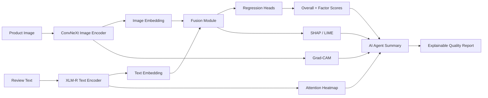

### A Running Example We Will Reuse

Throughout this handbook, we will reuse one example so the data flow stays concrete.

**Input image:** a phone box arrives slightly crushed, but the phone itself looks clean and attractive.

**Input text:**

> `dien thoai dep, good quality, but box bi mop va gia hoi cao`

This review mixes Vietnamese and English. It roughly means:

> The phone looks nice, good quality, but the box is dented and the price is a bit high.

Possible target scores:

* overall quality: `7.4`
* quality: `8.1`
* price: `5.6`
* appearance: `8.3`

Notice the meaning:

* quality is fairly good
* appearance is good
* price is weaker
* overall is good, but not excellent

That single example is enough to explain almost every module in the system.

---

## End-to-End Data Flow

Before diving into the individual concepts, first build a clear pipeline picture.

### End-to-End Story

1. The system receives an image and a review.
2. The image is resized, normalized, and sent into ConvNeXt.
3. ConvNeXt turns the image into a dense vector called an **image embedding**.
4. The text is tokenized into subword pieces and sent into XLM-R.
5. XLM-R turns the text into a dense vector called a **text embedding**.
6. The fusion module combines image and text information.
7. Regression heads convert the fused representation into scores such as `overall`, `quality`, `price`, and `appearance`.
8. Grad-CAM shows which image regions mattered.
9. Attention heatmaps show which words or tokens influenced the text encoder.
10. SHAP or LIME estimate how much each modality or feature contributed to the final prediction.
11. The AI agent turns numbers and evidence into a natural-language explanation.

### End-to-End Pipeline Diagram

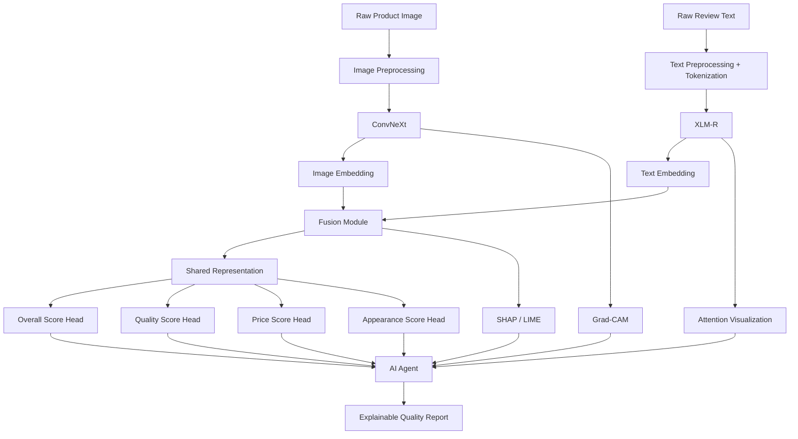

### Vector Flow Mental Model

A neural network does not think in sentences or pictures directly. It converts them into vectors.

You can imagine the system like this:

```text
Image pixels
   -> ConvNeXt
   -> [0.12, -0.40, 1.83, ..., 0.51]  = image embedding

Text tokens
   -> XLM-R
   -> [-0.22, 0.91, 0.07, ..., -1.15] = text embedding

Both embeddings
   -> Fusion
   -> [combined representation]
   -> score heads
   -> 7.4, 8.1, 5.6, 8.3
```

An **embedding** is just a compact numerical summary. It is the model's internal representation of meaning.

### Why This Pipeline Is Better Than Single-Modal Models

If you only use text:

* you miss visible defects not mentioned in the review

If you only use image:

* you miss price complaints or hidden quality issues described in text

If you use both:

* the model can cross-check evidence
* it can handle missing or weak information from one modality
* it can explain whether image and text agree or conflict

---

## 1. ConvNeXt

### Beginner Intuition

ConvNeXt is the image expert of the system.

Its job is to look at a product image and answer questions like:

* Is the packaging damaged?
* Does the product look clean or defective?
* Are there visible signs of low appearance quality?

#### What Problem Does It Solve?

A raw image is just a grid of pixels. The model needs to turn those pixels into useful visual concepts such as edges, corners, dents, scratches, shape, texture, and object layout.

Older CNNs like ResNet were already good at this, but modern image tasks often need stronger representations and better training stability. ConvNeXt keeps the core CNN idea, but modernizes it.

#### Real-World Analogy

Imagine a quality inspector in a warehouse.

* first, they notice simple things: edges, colors, and obvious damage
* then they notice parts: box corners, plastic wrapping, screen area
* finally, they build a global judgment: the product looks premium, damaged, cheap, or clean

ConvNeXt works in a similar layered way.

#### Mental Model

Think of ConvNeXt as a visual funnel:

```text
pixels -> simple patterns -> parts -> whole-object understanding -> image embedding
```

### Internal Architecture

ConvNeXt is still a convolutional neural network, but it uses more modern design choices than older CNNs.

#### Main Flow

```text
Input image
 -> patch-like stem
 -> several feature extraction stages
 -> downsampling between stages
 -> deeper semantic feature maps
 -> global pooling
 -> final image embedding
```

#### ASCII Architecture

```text
[224x224x3 image]
        |
        v
[Stem / early convolution]
        |
        v
[Stage 1: low-level features]
        |
        v
[Stage 2: stronger local patterns]
        |
        v
[Stage 3: object-level structure]
        |
        v
[Stage 4: high-level semantics]
        |
        v
[Global Average Pooling]
        |
        v
[Image Embedding Vector]
```

#### Mermaid View

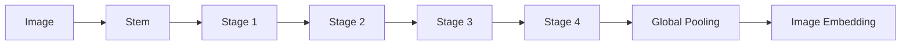

#### What Happens Internally?

At a high level:

1. Early layers detect local patterns such as edges, corners, color changes, and texture.
2. Middle layers detect larger structures such as product parts and packaging shapes.
3. Deep layers detect semantic patterns such as damaged box, glossy finish, missing seal, or appealing appearance.
4. Pooling compresses all of that into one vector.

That vector is the image summary passed to the fusion module.

### Why Older Approaches Were Less Suitable

Traditional image pipelines often used:

* handcrafted features like SIFT or HOG
* plain CNNs with weaker scaling behavior
* models trained only for classification, not rich transfer learning

These approaches are weaker for fine-grained product quality because they may miss subtle cues like:

* bent box corners
* low-quality finishing
* dents or scratches
* inconsistent appearance quality

### Concrete Example

Suppose the input image shows:

* a clean phone surface
* a slightly crushed product box
* otherwise attractive appearance

Internal ConvNeXt behavior might look like this:

1. Early layers detect sharp edges and texture differences around the box.
2. Middle layers notice that one corner of the box is bent inward.
3. Deep layers recognize that the visible defect belongs to the packaging, not necessarily the product body itself.
4. The final embedding encodes both positive and negative signals:
   * positive: sleek appearance
   * negative: packaging damage

So ConvNeXt does not simply say good or bad. It produces a rich vector that can later be combined with the text.

### How ConvNeXt Connects to This Project

In this project, ConvNeXt plays three major roles:

1. It produces the image embedding for fusion.
2. It gives image-only evidence for factor scoring.
3. Its feature maps can be explained with Grad-CAM.

That means ConvNeXt is important both for prediction and for explainability.

### Why ConvNeXt Was Chosen

The proposal replaces ResNet with ConvNeXt because ConvNeXt offers:

* stronger modern visual representations
* better transfer learning behavior
* good efficiency relative to performance
* compatibility with explainability methods like Grad-CAM

### ConvNeXt vs ResNet

| Aspect | ResNet | ConvNeXt | Why It Matters Here |
|---|---|---|---|
| Era | classic CNN design | modernized CNN design | newer design usually transfers better |
| Core strength | stable residual learning | stronger feature quality with updated design | helps detect subtle visual quality cues |
| Fine-grained defects | decent | generally stronger | useful for packaging and appearance defects |
| Training behavior | solid baseline | often better modern scaling | useful for real-world noisy datasets |
| Interpretability | compatible with Grad-CAM | also compatible with Grad-CAM | both workable, ConvNeXt is stronger overall |
| Project fit | good baseline | better final choice | better for nuanced product images |

### Pros and Cons

**Advantages**

* strong image representation
* good for transfer learning
* suitable for subtle visual defects
* still easier to interpret than many pure vision transformers

**Disadvantages**

* heavier than small classical CNNs
* may need substantial GPU memory
* image quality problems can still confuse it if data is noisy

### Simplified Math Intuition

You do not need to know every convolution formula to understand the role.

At a simple level, ConvNeXt learns a function:

$$
f_{image}(x_{image}) = z_{image}
$$

where:

* $x_{image}$ is the input image
* $z_{image}$ is the image embedding vector

This vector might contain hundreds of numbers. Each number is not directly human-readable. Together, they represent visual meaning.

### Mini Summary

ConvNeXt is the visual encoder. It turns raw pixels into a compact semantic vector that captures product appearance and visible defects. In this project, it is chosen because it is stronger than older CNN baselines while still fitting an explainable image pipeline.

---

## 2. XLM-R / XLM-RoBERTa

### Beginner Intuition

XLM-R is the language expert of the system.

Its job is to read messy real-world reviews like:

> `dep, good quality, box bi mop, gia hoi cao`

and understand what the writer means.

#### What Problem Does It Solve?

Regular text models often struggle when text is:

* multilingual
* code-mixed
* informal
* full of spelling variation or slang

This project specifically needs to understand Vietnamese, English, and mixtures of both. That is why a multilingual encoder is important.

#### Real-World Analogy

Imagine a customer support agent who is fluent in many languages and can still understand slang, abbreviations, and mixed-language sentences.

That is what XLM-R is trying to be.

#### Mental Model

Think of XLM-R as a smart multilingual reader:

```text
raw sentence -> broken into subword pieces -> context understanding -> text embedding
```

### Internal Architecture

XLM-R is a multilingual transformer encoder.

#### Main Flow

```text
Review text
 -> tokenizer splits into subwords
 -> token embeddings are created
 -> transformer layers exchange context through attention
 -> contextual token representations are produced
 -> pooled representation becomes the text embedding
```

#### Mermaid View


#### ASCII View

```text
"dien thoai dep, good quality, but box bi mop"
          |
          v
[subword tokens]
          |
          v
[embedding vectors for tokens]
          |
          v
[self-attention layers share context]
          |
          v
[context-aware token meanings]
          |
          v
[single text embedding]
```

### Why Older Approaches Were Less Suitable

Older text systems may use:

* bag-of-words counts
* single-language BERT variants
* manual text cleaning that removes too much meaning

These approaches are weaker for this project because the data includes:

* Vietnamese and English in the same review
* very short text like `ok`, `dep`, `good`
* slang and spelling variation
* emoji and informal expressions

XLM-R handles this better because it was pretrained on many languages and uses subword tokenization.

### What Is Subword Tokenization?

Instead of treating every word as a separate fixed object, XLM-R often splits text into smaller pieces.

Why this helps:

* unknown words become less of a problem
* spelling variation is easier to handle
* multilingual words can still share meaningful parts

For example, a noisy word or mixed phrase can still be broken into understandable pieces rather than being treated as completely unknown.

### Concrete Example

Input text:

> `dien thoai dep, good quality, but box bi mop va gia hoi cao`

Possible internal behavior:

1. The tokenizer splits the text into subword pieces.
2. Early transformer layers learn local relationships.
3. Deeper layers understand that:
   * `dep` and `good quality` are positive
   * `box bi mop` signals packaging damage
   * `gia hoi cao` signals price dissatisfaction
4. The final text embedding contains a structured summary:
   * positive product quality
   * good appearance
   * weaker price perception

### How XLM-R Connects to This Project

In this project, XLM-R does three things:

1. It provides the text embedding for fusion.
2. It helps estimate factor-level scores from review semantics.
3. It supports token-level explanation through attention visualization.

### Why XLM-R Was Chosen

The proposal replaces standard BERT-style thinking with XLM-R because XLM-R is a better match for:

* multilingual reviews
* code-mixed text
* noisy user-generated language
* one unified pipeline instead of separate models per language

### XLM-R vs BERT

| Aspect | BERT | XLM-R | Why It Matters Here |
|---|---|---|---|
| Language coverage | usually one language or limited multilingual capability | strong multilingual pretraining | needed for Vietnamese + English |
| Code-mixed text | weaker | better suited | common in Shopee and Lazada reviews |
| Tokenization robustness | good | good and multilingual | helps with noisy review text |
| Deployment simplicity | may require language-specific handling | one shared multilingual encoder | easier real-world pipeline |
| Project fit | weaker for this use case | strong fit | better for Southeast Asian e-commerce data |

### Gentle Attention Math

The heart of transformers is **attention**. It lets each token look at other tokens.

The standard attention formula is:

$$
\text{Attention}(Q, K, V) = \text{softmax}\left(\frac{QK^T}{\sqrt{d_k}}\right)V
$$

Beginner meaning:

* `Q` asks: what am I looking for?
* `K` asks: what information do other tokens have?
* `V` is the actual information to collect

So if the token `gia` looks at the token `cao`, attention can learn that together they mean price is high.

### Pros and Cons

**Advantages**

* multilingual understanding
* good fit for code-mixed text
* powerful contextual reasoning
* works well with noisy reviews

**Disadvantages**

* computationally heavy
* attention is not a perfect explanation by itself
* very short reviews still give limited information

### Mini Summary

XLM-R is the multilingual text encoder. It reads noisy Vietnamese-English review text, turns it into contextual token representations, and produces a text embedding that captures meaning for the fusion and scoring modules.

---

## 3. Fusion Module

### Beginner Intuition

The fusion module is the part that combines what the image expert saw with what the language expert understood.

If ConvNeXt is one inspector and XLM-R is another inspector, then fusion is the meeting where both inspectors share their findings.

#### What Problem Does It Solve?

If the system keeps image and text separate, it cannot fully reason about agreement or conflict.

Examples:

* the image looks fine, but the review says the product breaks quickly
* the review sounds positive, but the image shows obvious damage
* the text is short, so the image must carry more of the decision

The fusion module solves this by building a joint representation.

#### Mental Model

```text
image opinion + text opinion -> joint opinion
```

### Internal Architecture

There are two common levels described in the proposal.

#### Baseline: Concatenation

This is the simplest approach.

```text
[image embedding] + [text embedding]
        -> join them into one longer vector
        -> feed into fully connected layers
        -> predict scores
```

#### Advanced Extension: Cross-Attention

This is more expressive.

It allows one modality to attend to the other.

Examples:

* text attends to image regions
* image features attend to important text tokens

That means the model can learn relationships like:

* the phrase `box bi mop` should align with damaged packaging regions
* the phrase `gia hoi cao` is related to price score, not appearance score

#### Mermaid Diagram

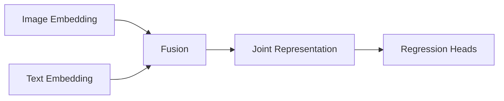

#### Cross-Attention View

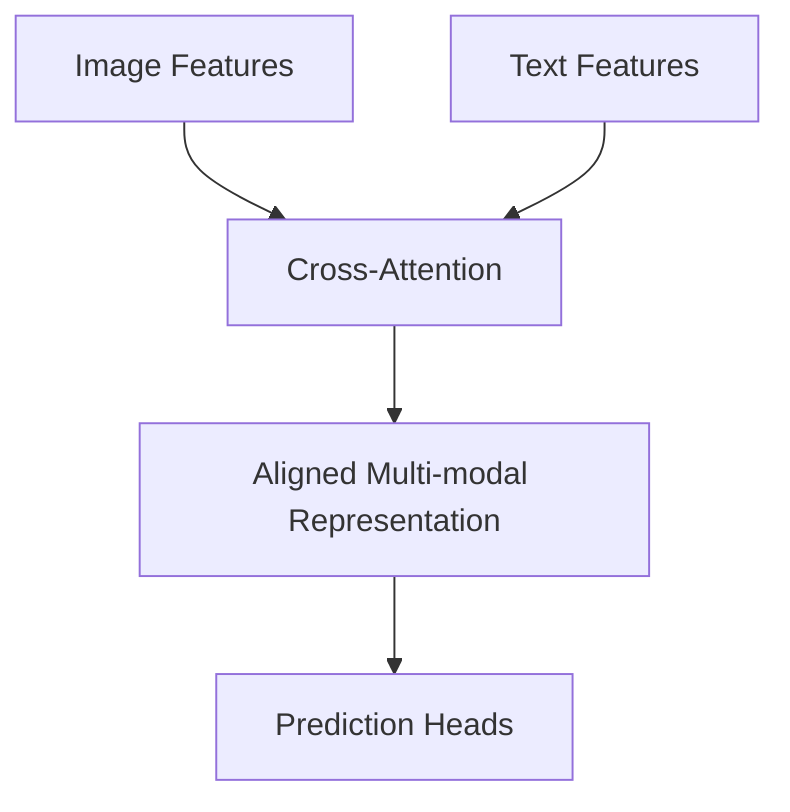

### Concrete Example

Consider the running example.

**Image says:**

* product looks attractive
* packaging corner is crushed

**Text says:**

* good quality
* dented box
* price is a bit high

Fusion combines these signals.

Possible outcome:

* overall score: moderately high
* quality score: high
* appearance score: high but slightly reduced by box damage
* price score: lower

Notice something important:

The final prediction is not just an average. It is a learned combination.

### How Fusion Connects to This Project

Fusion is the center of the whole multi-modal system.

Without fusion:

* the project becomes two separate models
* the system cannot model agreement or contradiction well

With fusion:

* image and text become one shared decision space
* the model can make better overall judgments
* SHAP and LIME can later explain whether image or text had more influence

### Why This Technique Was Chosen

The proposal wisely includes both a simple baseline and a stronger extension.

* **Concatenation** is easy to train, easy to debug, and gives a stable first system.
* **Cross-attention** adds richer inter-modal interaction once the baseline works.

That is good engineering practice.

### Concatenation vs Cross-Attention

| Aspect | Concatenation | Cross-Attention | Practical Meaning |
|---|---|---|---|
| Complexity | low | higher | concatenation is easier for a first version |
| Interpretability | simpler | more complex | easier to debug baseline first |
| Interaction strength | limited | strong | cross-attention can align text with image regions |
| Training stability | usually easier | can be trickier | important when data is limited |
| Best use | strong baseline | later extension | matches the proposal plan |

### Simplified Math Intuition

For simple concatenation:

$$
z_{fusion} = [z_{image}; z_{text}]
$$

This means: put the two vectors end-to-end to create one longer vector.

Then a small neural network learns:

$$
y = g(z_{fusion})
$$

where $y$ contains the predicted scores.

For cross-attention, the math is more advanced, but the intuition is still simple:

* image features ask which text features matter
* text features ask which image features matter
* the model builds a more aligned shared representation

### Pros and Cons

**Advantages**

* combines complementary evidence
* can resolve conflicting signals better than single-modality models
* improves robustness when one modality is weak

**Disadvantages**

* more design complexity
* sensitive to missing or noisy modality pairs
* advanced fusion can overfit on small datasets

### Mini Summary

The fusion module is where image meaning and text meaning are joined. It is the heart of the multi-modal system because it turns separate evidence streams into one shared representation for final scoring.

---

## 4. Weak Supervision

### Beginner Intuition

Weak supervision means training with labels that are useful but not perfectly trustworthy.

#### What Problem Does It Solve?

For this project, fully manual labeling is expensive.

To train a strong system, you may want labels for:

* overall quality
* quality factor
* price factor
* appearance factor

But asking humans to annotate thousands of image-text pairs in detail takes a lot of time and money.

Weak supervision gives a practical shortcut.

#### Real-World Analogy

Imagine you are teaching a student using hints instead of perfect answers.

Some hints are noisy, but if you collect enough of them, the student can still learn useful patterns.

### Internal Architecture

Weak supervision usually works like this:

```text
raw data
 -> weak label sources
 -> noisy labels
 -> optional label aggregation
 -> train model on approximate targets
```

Possible weak label sources in this project:

* star ratings from the platform
* review phrases like `good quality` or `gia hoi cao`
* return or complaint metadata if available
* heuristic rules from keywords or emojis

#### Mermaid Diagram

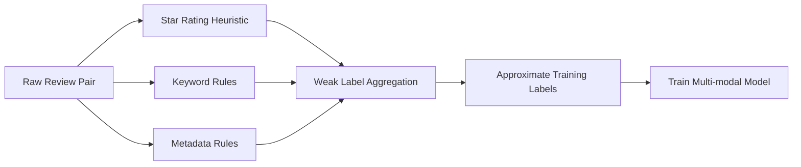

### Concrete Example

Suppose you do not have manual factor labels.

You might use these heuristics:

* if rating is `5`, weakly suggest overall quality is high
* if the text contains `gia hoi cao`, weakly suggest lower price satisfaction
* if image metadata or return notes mention damage, weakly suggest lower appearance or quality

These are not perfect labels.

A five-star review can still hide packaging damage. A phrase like `good` may be vague. But across many samples, these weak signals can still help the model learn.

### How Weak Supervision Connects to This Project

The proposal explicitly mentions weak supervision as part of the annotation strategy when strong labels are missing.

This is important because real-world e-commerce data often has:

* many reviews
* many images
* very few clean factor-level labels

Weak supervision helps bridge that gap.

### Weak Supervision vs Full Manual Labeling

| Aspect | Weak Supervision | Full Manual Labeling | Why It Matters |
|---|---|---|---|
| Cost | low to medium | high | real projects often cannot label everything manually |
| Label quality | noisy | high | manual labels are better, but expensive |
| Scale | high | limited | weak supervision enables larger datasets |
| Speed | fast | slow | useful for bootstrapping the first model |
| Best use | pretraining or bootstrapping | validation and high-quality final datasets | good practical strategy |

### Gentle Math Intuition

Suppose the true score is unknown, but a rule estimates it as `8.0`.

That weak label is not guaranteed to be correct. Still, the model can learn from it as if it were an approximate target.

You can think of it like this:

$$
\text{weak label} = \text{true signal} + \text{noise}
$$

The goal is not to make every weak label perfect. The goal is to make them informative enough that the model learns useful structure.

### Pros and Cons

**Advantages**

* much cheaper than full annotation
* enables scaling to larger real-world datasets
* useful when factor labels are scarce

**Disadvantages**

* labels can be wrong
* noisy rules can bias the model
* evaluation still needs cleaner labels

### Mini Summary

Weak supervision is a practical labeling strategy for real-world data. It lets the project learn from noisy but useful signals when perfect human annotations are too expensive or too slow.

---

## 5. Regression to `0-10` Scores

### Beginner Intuition

Regression means predicting a continuous number instead of a category.

#### What Problem Does It Solve?

This project does not only want labels like `good` or `bad`. It wants scores such as:

* overall quality: `7.4`
* quality: `8.1`
* price: `5.6`
* appearance: `8.3`

That is a regression problem.

#### Real-World Analogy

A movie rating of `8.2/10` is more informative than simply calling a movie `good`.

Similarly, a product quality score of `7.4` tells you more than a binary label.

#### Mental Model

```text
classification -> choose a bucket
regression     -> place a point on a scale
```

### Internal Architecture

After fusion, the system has a joint representation vector. A regression head turns that vector into numbers.

#### Simple Flow

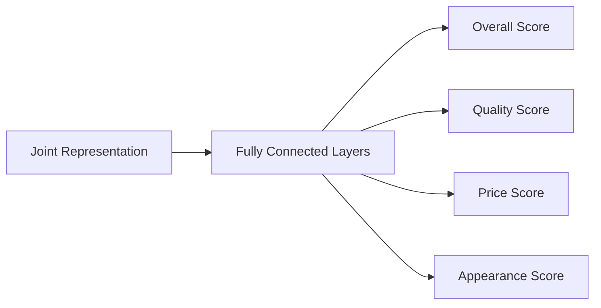

#### Output Design Options

There are several practical ways to produce a `0-10` score:

1. **Direct linear output**, then clip to the valid range.
2. **Sigmoid output multiplied by 10**, which naturally stays in `0-10`.
3. **Separate heads for each factor**, plus one head for the overall score.

### Concrete Example

Suppose the fused representation already captures:

* image: attractive phone, dented packaging
* text: positive quality, negative price

The regression heads may output:

* overall: `7.4`
* quality: `8.1`
* price: `5.6`
* appearance: `8.3`

These numbers are not chosen manually. They are produced by learned weights.

### Why Regression Was Chosen in This Project

Regression is a better fit than simple classification because product quality is naturally graded.

Two products can both be `good`, but one may deserve `6.8` while another deserves `8.7`.

That finer resolution is useful for:

* ranking products
* comparing sellers
* summarizing factor strengths and weaknesses
* generating more nuanced AI explanations

### Regression vs Classification

| Aspect | Classification | Regression | Why Regression Fits Here |
|---|---|---|---|
| Output | discrete class | continuous number | product quality is graded, not binary |
| Precision | lower | higher | `7.4` is more informative than `good` |
| Ranking ability | limited | strong | helpful for analytics and comparisons |
| Project fit | weaker | strong | matches `0-10` scoring design |

### Gentle Math

A regression head learns a function:

$$
\hat{y} = w^T z + b
$$

where:

* $z$ is the fused representation
* $w$ is a learned weight vector
* $b$ is a learned bias
* $\hat{y}$ is the predicted score

Beginner meaning:

* the model takes the fused features
* it gives different importance to different features
* it combines them into one number

### Step-by-Step Example

Suppose the true overall score is `8.0`, but the model predicts `7.4`.

Then the error is:

$$
8.0 - 7.4 = 0.6
$$

Training tries to adjust the weights so future predictions move closer to the target.

### Pros and Cons

**Advantages**

* captures fine-grained quality differences
* supports ranking and analytics
* fits factor scoring naturally

**Disadvantages**

* requires reliable numeric labels
* harder to calibrate than simple classes
* noisy target scores can make training unstable

### Mini Summary

Regression lets the model predict nuanced `0-10` scores instead of rough categories. That makes the system more useful for real product quality assessment, factor analysis, and explanation generation.

---

## 6. Grad-CAM Image Regions

### Beginner Intuition

Grad-CAM is an explanation method for images.

Its job is to answer:

> Which part of the image most influenced the model's prediction?

#### Real-World Analogy

Imagine putting a heat flashlight on an image to show where the model was looking when it made a decision.

Bright areas matter more.

#### What Problem Does It Solve?

Without Grad-CAM, a score like `appearance = 6.9` is hard to trust.

Grad-CAM helps you see whether the model focused on:

* the damaged box corner
* the product surface
* a background artifact
* an irrelevant area

That is extremely useful for debugging and trust.

### Internal Architecture

Grad-CAM uses:

* a target output, such as the overall score or appearance score
* a deep convolutional feature map from ConvNeXt
* gradients that tell us which channels mattered most

#### Step-by-Step Flow

1. Run the image through ConvNeXt.
2. Choose a target prediction to explain.
3. Compute gradients of that prediction with respect to the last feature maps.
4. Average those gradients to get channel importance weights.
5. Combine the feature maps using those weights.
6. Apply `ReLU` to keep positive evidence.
7. Resize the result into a heatmap over the original image.

#### Mermaid Diagram

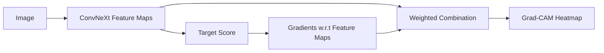

### Gentle Math

For a target score $y^c$ and feature map channel $A^k$, Grad-CAM computes a channel importance weight:

$$
\alpha_k^c = \frac{1}{Z} \sum_i \sum_j \frac{\partial y^c}{\partial A_{ij}^k}
$$

Then it creates the heatmap:

$$
L_{\text{Grad-CAM}}^c = \text{ReLU}\left(\sum_k \alpha_k^c A^k\right)
$$

Beginner interpretation:

* gradients tell us which feature channels mattered for the chosen output
* feature maps tell us where those patterns appeared in the image
* combining them gives a location-based importance map

### Concrete Example

Suppose the model predicts a slightly reduced appearance score because the box is crushed.

A good Grad-CAM heatmap should highlight:

* the dented corner of the packaging
* maybe the wrinkled wrapping

A bad Grad-CAM heatmap might highlight:

* the blank background
* a watermark
* a random shadow unrelated to quality

That tells you whether the model is using sensible evidence.

### How Grad-CAM Connects to This Project

The proposal uses Grad-CAM to explain ConvNeXt's visual decisions.

This is especially important because product quality assessment often depends on localized visual evidence such as:

* cracks
* dents
* packaging damage
* poor finishing

Grad-CAM turns the image encoder from a black box into something more inspectable.

### Grad-CAM Strengths and Limitations

| Aspect | Grad-CAM Strength |
|---|---|
| Human interpretability | easy to visualize on top of the image |
| Local evidence | good for defects and regions |
| Model debugging | helps detect focus on wrong areas |

| Aspect | Grad-CAM Limitation |
|---|---|
| Resolution | heatmaps can be coarse |
| Reliability | not perfect proof of causal reasoning |
| Architecture dependence | best suited to CNN feature maps |

### Pros and Cons

**Advantages**

* intuitive visual explanation
* easy to present to users and researchers
* useful for debugging image decisions

**Disadvantages**

* spatial maps can be blurry
* highlights correlation, not guaranteed causation
* depends on the chosen layer and target output

### Mini Summary

Grad-CAM highlights image regions that most influenced a prediction. In this project, it helps show whether ConvNeXt focused on defects like damaged packaging or appearance cues when producing the score.

---

## 7. Attention Heatmap Text Evidence

### Beginner Intuition

An attention heatmap tries to show which words or tokens were important when the text model processed a review.

#### What Problem Does It Solve?

If the model predicts `price = 5.6`, you want to know whether it reacted to words like:

* `gia`
* `cao`
* `good quality`
* `mop`

Attention visualization gives a window into token relationships inside XLM-R.

#### Real-World Analogy

Imagine reading a sentence with a highlighter in your hand.

You do not highlight every word equally. You spend more attention on the important phrases.

That is the intuition behind an attention heatmap.

### Internal Architecture

Inside XLM-R, each token can attend to other tokens.

For example:

* `gia` may attend to `cao`
* `box` may attend to `mop`
* `good` may attend to `quality`

These relationships are represented through attention weights.

#### Mermaid Diagram

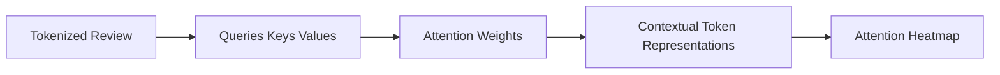

#### Example Token View

```text
Tokens: [dien, thoai, dep, good, quality, box, bi, mop, gia, hoi, cao]

Possible strong attention patterns:
quality <-> good
box     <-> mop
gia     <-> cao
```

### Gentle Math

Attention uses the same core formula shown earlier:

$$
\text{Attention}(Q, K, V) = \text{softmax}\left(\frac{QK^T}{\sqrt{d_k}}\right)V
$$

Beginner meaning:

* compare each token to other tokens
* turn those comparisons into weights
* use those weights to collect useful context

If `mop` strongly affects how `box` is interpreted, their attention relationship may be strong.

### Concrete Example

Review:

> `dien thoai dep, good quality, but box bi mop va gia hoi cao`

Possible interpretation:

* `dep` and `good quality` support high appearance and quality
* `box bi mop` supports lower appearance or lower packaging-related quality
* `gia hoi cao` supports lower price satisfaction

An attention heatmap might show darker emphasis around:

* `good` and `quality`
* `box` and `mop`
* `gia` and `cao`

### Important Caution

Attention heatmaps are useful, but they are not perfect explanations.

Why?

* high attention does not always mean a token caused the final decision
* different heads can focus on different patterns
* deeper model behavior is more complex than one heatmap

So attention is best used as **diagnostic evidence**, not absolute proof.

### How Attention Visualization Connects to This Project

This project uses attention heatmaps to explain XLM-R's textual reasoning.

That is especially valuable for:

* code-mixed reviews
* short noisy reviews
* multilingual evidence inspection

It helps answer whether the model understood the same parts of the review that a human would consider important.

### Attention Heatmap vs Simpler Keyword Highlighting

| Aspect | Keyword Highlighting | Attention Heatmap | Why Attention Helps |
|---|---|---|---|
| Context awareness | low | high | words are interpreted in context |
| Relationship modeling | none | present | can show token-to-token dependency |
| Model faithfulness | external heuristic | internal signal | closer to model behavior |
| Simplicity | very simple | more complex | attention is richer but harder to interpret |

### Pros and Cons

**Advantages**

* shows internal token relationships
* useful for multilingual review analysis
* helps diagnose whether the text encoder is focusing sensibly

**Disadvantages**

* not a complete causal explanation
* can be hard to interpret across many heads and layers
* short noisy text can still produce unstable patterns

### Mini Summary

Attention heatmaps visualize which tokens influenced or interacted strongly inside XLM-R. In this project, they provide evidence for why the text encoder supported or lowered certain factor scores.

---

## 8. SHAP / LIME Multi-modal Contribution

### Beginner Intuition

SHAP and LIME are explanation methods that try to answer:

> How much did each input feature contribute to this specific prediction?

In this project, that question becomes:

* how much did the image matter?
* how much did the text matter?
* which image regions mattered?
* which tokens mattered?

#### Real-World Analogy

Imagine a panel discussion after a decision:

* one expert says the image reduced the score because of visible damage
* another says the text raised the score because of positive wording
* a third says price complaints pushed the score down

SHAP and LIME try to estimate those contributions.

### Internal Architecture

SHAP and LIME are usually **post-hoc** explainers. That means they are applied after the model is trained.

They often work by perturbing inputs and observing how the prediction changes.

#### Basic Flow

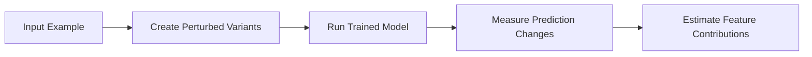

#### Multi-modal Use in This Project

Possible feature groups:

* image modality as a whole
* text modality as a whole
* image patches or regions
* text tokens or phrases
* fused features at a higher representation level

### LIME Intuition

LIME builds a simple local model around one example.

Idea:

* slightly modify the input many times
* see how predictions change
* fit a simple interpretable model nearby

That simple local model explains the decision around one example.

### SHAP Intuition

SHAP is based on Shapley values from game theory.

Imagine each feature is a player in a team. SHAP estimates how much each player contributed to the final score.

If the image and text are both important, SHAP tries to assign fair credit.

### Concrete Example

Suppose the final overall score is `7.4`.

A plausible explanation might be:

* image appearance contributes `+1.2`
* text phrase `good quality` contributes `+0.9`
* text phrase `gia hoi cao` contributes `-0.8`
* damaged packaging region contributes `-0.6`

These numbers are illustrative, but that is the kind of explanation SHAP or LIME can produce.

### How SHAP / LIME Connect to This Project

Grad-CAM explains image regions.
Attention heatmaps explain token focus.
SHAP and LIME explain broader contribution patterns across the entire multi-modal decision.

This makes them especially useful when image and text disagree.

Example:

* image looks attractive
* text complains about price

SHAP or LIME can show that the final score stayed moderately high because appearance and quality evidence outweighed the price complaint.

### SHAP vs LIME

| Aspect | SHAP | LIME | Practical Meaning |
|---|---|---|---|
| Main idea | fair contribution allocation | local surrogate model | both explain single predictions |
| Theoretical grounding | stronger | lighter-weight, more heuristic | SHAP is often more principled |
| Computation cost | often heavier | often lighter | LIME can be easier to run |
| Stability | can be more stable | may vary more with sampling | SHAP often preferred for careful analysis |
| Ease of use | moderate to hard | easier to start with | LIME is good for prototypes |

### Gentle Math Intuition

For SHAP, the exact formulas can be complex, but the intuition is simple:

$$
\text{prediction} = \text{baseline} + \sum \text{feature contributions}
$$

If the baseline score is `6.5` and the contributions are:

* `+0.9` from positive text
* `+0.8` from attractive appearance
* `-0.8` from high price complaint

then the final score becomes:

$$
6.5 + 0.9 + 0.8 - 0.8 = 7.4
$$

That is a very intuitive way to read an explanation.

### Pros and Cons

**Advantages**

* can explain cross-modal contribution
* useful for conflicting evidence
* helpful for debugging and trust

**Disadvantages**

* can be computationally expensive
* explanations depend on perturbation design and feature grouping
* still approximate, especially in complex multi-modal systems

### Mini Summary

SHAP and LIME estimate how much each feature or modality contributed to a prediction. In this project, they help explain whether the model relied more on image evidence, text evidence, or their interaction.

---

## 9. MSE vs MAE

### Beginner Intuition

MSE and MAE are loss functions for regression.

A **loss function** tells the model how wrong it is.

#### What Problem Do They Solve?

If the model predicts `7.4` when the true score is `8.0`, training needs a way to measure that mistake.

That measurement is the loss.

### MAE Intuition

MAE stands for **Mean Absolute Error**.

It measures average absolute difference.

$$
\text{MAE} = \frac{1}{n}\sum_{i=1}^{n} |y_i - \hat{y}_i|
$$

Beginner meaning:

* compute how far each prediction is from the truth
* ignore direction
* average the distances

### MSE Intuition

MSE stands for **Mean Squared Error**.

It squares the error before averaging.

$$
\text{MSE} = \frac{1}{n}\sum_{i=1}^{n} (y_i - \hat{y}_i)^2
$$

Beginner meaning:

* small mistakes stay small
* large mistakes become much larger

So MSE punishes big errors more heavily than MAE.

#### Real-World Analogy

Imagine two students taking a target-throwing test.

* MAE cares about average distance from the bullseye.
* MSE punishes throws that land very far away much more strongly.

### Step-by-Step Example

Suppose true scores are:

* `8.0`
* `6.0`
* `9.0`

Suppose predictions are:

* `7.5`
* `5.0`
* `6.0`

Errors are:

* `0.5`
* `1.0`
* `3.0`

#### MAE Calculation

$$
\text{MAE} = \frac{0.5 + 1.0 + 3.0}{3} = 1.5
$$

#### MSE Calculation

$$
\text{MSE} = \frac{0.5^2 + 1.0^2 + 3.0^2}{3} = \frac{0.25 + 1 + 9}{3} = 3.42
$$

Notice how the large `3.0` error dominates MSE much more strongly.

### Why This Matters in the Project

If your labels are relatively clean and you want to strongly penalize large mistakes, MSE is attractive.

If your labels are noisy, MAE can be more robust because it does not explode large errors as much.

That is highly relevant here because e-commerce labels can be noisy, especially if weak supervision is involved.

### MSE vs MAE Table

| Aspect | MAE | MSE | Practical Meaning |
|---|---|---|---|
| Formula | average absolute error | average squared error | both measure regression quality |
| Sensitivity to outliers | lower | higher | MSE punishes big misses more |
| Robustness to noisy labels | better | weaker | useful when labels are imperfect |
| Gradient behavior | constant magnitude style | larger for larger errors | MSE pushes harder on big mistakes |
| Interpretability | very intuitive | also intuitive, but less direct | MAE is often easier to explain |

### Which One Should This Project Use?

A practical answer is:

* start with `MAE` if labels are noisy or weakly supervised
* use `MSE` if large misses are especially harmful and labels are more reliable
* compare both on validation data

That matches strong experimental practice.

### Pros and Cons

**MAE Advantages**

* robust to outliers
* easy to interpret

**MAE Disadvantages**

* may respond less aggressively to large errors

**MSE Advantages**

* strongly punishes large mistakes
* often smooth and convenient for optimization

**MSE Disadvantages**

* sensitive to outliers and noisy labels

### Mini Summary

MSE and MAE are two ways to measure regression error. MSE punishes large mistakes more strongly, while MAE is more robust to noisy labels. The best choice depends on the quality and behavior of the training targets.

---

## 10. AdamW

### Beginner Intuition

AdamW is the optimizer. It updates the model's weights during training.

#### What Problem Does It Solve?

The model starts with imperfect parameters. Training must gradually change them so predictions improve.

The optimizer decides:

* how big each update should be
* which direction the update should move
* how to keep training stable

#### Real-World Analogy

Imagine hiking down a mountain in fog.

* the loss function tells you how high you are
* the gradient tells you which direction slopes downward
* the optimizer decides how to step safely and efficiently

AdamW is a smart stepping strategy.

### Why Not Just Use Plain SGD?

Plain gradient descent or plain SGD can work, but modern transformer and CNN fine-tuning often benefits from adaptive optimizers.

AdamW is widely used because it:

* adapts learning rates per parameter
* handles complex large models well
* works reliably for pretrained transformer and CNN fine-tuning
* separates weight decay from the core Adam update

### Internal Architecture

AdamW keeps track of two moving averages:

* first moment: running average of gradients
* second moment: running average of squared gradients

These help it adapt step sizes.

#### Core Update Intuition

1. Compute the gradient of the loss.
2. Update the running average of gradients.
3. Update the running average of squared gradients.
4. Normalize the step using those statistics.
5. Apply decoupled weight decay.
6. Update the parameters.

#### Mermaid Diagram

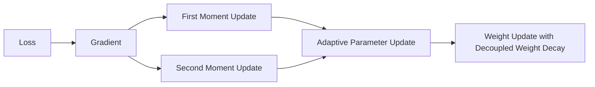

### Gentle Math

The Adam-style moving averages are:

$$
m_t = \beta_1 m_{t-1} + (1-\beta_1) g_t
$$

$$
v_t = \beta_2 v_{t-1} + (1-\beta_2) g_t^2
$$

where:

* $g_t$ is the gradient at step $t$
* $m_t$ tracks average gradient direction
* $v_t$ tracks average gradient size

The parameter update is roughly:

$$
\theta_t = \theta_{t-1} - \eta \frac{m_t}{\sqrt{v_t} + \epsilon} - \eta \lambda \theta_{t-1}
$$

Beginner interpretation:

* move parameters in a direction that lowers the loss
* scale steps carefully using past information
* also shrink weights a little through weight decay to reduce overfitting

### Why the `W` in AdamW Matters

The `W` refers to **decoupled weight decay**.

This is important because classic Adam with naive regularization does not behave the same way as true weight decay.

AdamW cleanly separates:

* optimization step
* regularization step

That is one reason it became a standard choice for transformer training.

### Concrete Example

Suppose the model is overreacting to certain noisy review tokens and starts to overfit.

AdamW helps by:

* adapting update size per parameter
* keeping training stable
* using weight decay to discourage overly large weights

This is especially useful when fine-tuning large pretrained models like ConvNeXt and XLM-R on smaller task-specific datasets.

### How AdamW Connects to This Project

The proposal explicitly chooses AdamW for fine-tuning the transformer-CNN system.

That is a strong practical choice because the project uses:

* pretrained ConvNeXt
* pretrained XLM-R
* a fusion head
* regression objectives

AdamW is well suited to exactly this kind of setup.

### AdamW vs Plain SGD

| Aspect | Plain SGD | AdamW | Why AdamW Fits Here |
|---|---|---|---|
| Per-parameter adaptation | no | yes | helps large pretrained models |
| Fine-tuning transformers | less convenient | strong standard choice | especially useful for XLM-R |
| Stability on mixed modules | moderate | generally strong | useful for CNN + transformer + fusion |
| Weight decay handling | simpler but less specialized | decoupled and well-behaved | better regularization control |

### Pros and Cons

**Advantages**

* strong default optimizer for modern deep learning
* works well for pretrained transformers
* adaptive updates improve stability
* decoupled weight decay helps regularization

**Disadvantages**

* can still require careful learning-rate tuning
* adaptive methods are not magic; bad data still gives bad training
* may use more memory than simpler optimizers

### Mini Summary

AdamW is the optimizer that updates model weights during training. It is a strong fit for this project because it handles large pretrained modules well and includes decoupled weight decay for better regularization.

---

## How All Concepts Work Together in One Example

Now connect everything into one story.

### Input Example

**Image:** attractive phone, slightly crushed box corner

**Text:**

> `dien thoai dep, good quality, but box bi mop va gia hoi cao`

### Full Internal Walkthrough

1. **ConvNeXt reads the image.**
   It detects attractive appearance plus visible packaging damage and outputs an image embedding.

2. **XLM-R reads the text.**
   It understands mixed-language phrases and outputs a text embedding that includes positive quality signals and negative price signals.

3. **Fusion combines both embeddings.**
   The model learns that the image and text agree on good product quality but also agree on packaging issues and price weakness.

4. **Regression heads predict scores.**
   The fused representation produces:
   * overall: `7.4`
   * quality: `8.1`
   * price: `5.6`
   * appearance: `8.3`

5. **Grad-CAM explains image evidence.**
   The heatmap highlights the crushed box corner.

6. **Attention heatmap explains text evidence.**
   The model emphasizes `good quality`, `box ... mop`, and `gia ... cao`.

7. **SHAP or LIME estimate contribution.**
   They show that attractive appearance and positive quality text increased the score, while price complaint and packaging damage lowered it.

8. **The AI agent writes the final explanation.**
   Example:

   > The product appears visually attractive and the review describes it as good quality, but both the image and the text indicate packaging damage, and the review also suggests the price feels high. As a result, the product receives a good but not excellent overall score.

### Unified Mermaid Diagram

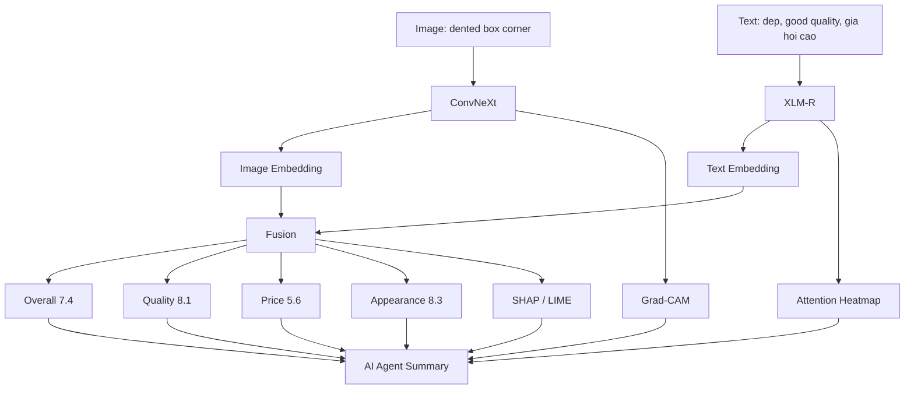

---

## Final Summary

This project is best understood as an explainable decision pipeline built from specialized components.

* **ConvNeXt** turns images into visual meaning.
* **XLM-R** turns multilingual reviews into textual meaning.
* **Fusion** combines both meanings into one shared representation.
* **Regression heads** convert that shared representation into nuanced `0-10` scores.
* **Weak supervision** helps create training data when perfect labels are not available.
* **MSE and MAE** tell the model how wrong its predictions are.
* **AdamW** updates the weights so the model improves during training.
* **Grad-CAM**, **attention heatmaps**, and **SHAP/LIME** explain what the model used as evidence.

The result is not just a prediction engine. It is a system that can say:

* what score it predicted
* what image regions mattered
* what text evidence mattered
* how image and text interacted
* why the final judgment makes sense

That is exactly what makes the proposed system stronger than a simple sentiment classifier or a single-modality model.

---

## Key Takeaways

1. Multi-modal learning matters because product quality is visible in both images and text.
2. ConvNeXt is used because it gives strong modern visual features for fine-grained quality cues.
3. XLM-R is used because the data is multilingual and code-mixed.
4. Fusion is the core decision layer because it combines evidence from both modalities.
5. Regression is better than simple classification when you want nuanced `0-10` scores.
6. Weak supervision is practical when factor labels are scarce.
7. MSE and MAE are not just formulas; they define how the model experiences error.
8. AdamW is a strong optimizer for fine-tuning pretrained CNN and transformer models.
9. Grad-CAM explains image regions, attention heatmaps explain token focus, and SHAP/LIME explain contribution patterns.
10. The full system is valuable because it predicts and explains at the same time.

---

## Suggested Reading Strategy for Beginners

If this still feels heavy, read it in this order:

1. `End-to-End Data Flow`
2. `ConvNeXt`
3. `XLM-R / XLM-RoBERTa`
4. `Fusion Module`
5. `Regression to 0-10 Scores`
6. `Grad-CAM`, `Attention Heatmap`, `SHAP / LIME`
7. `MSE vs MAE`
8. `AdamW`

That order follows the same direction as the real system pipeline.