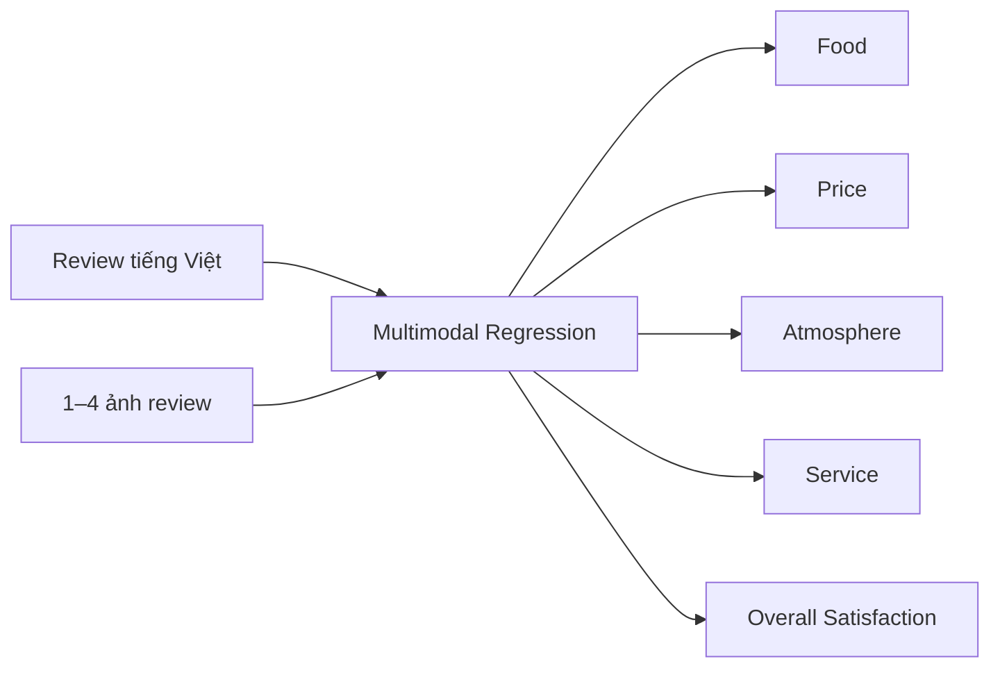
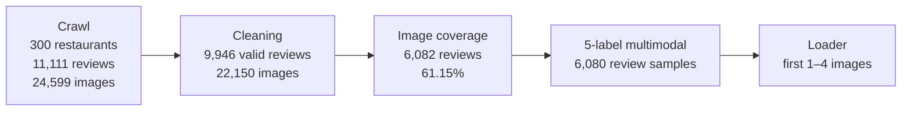
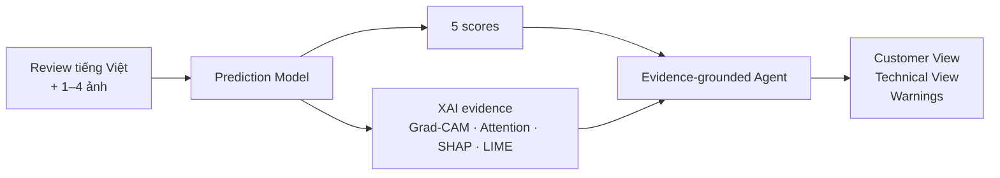
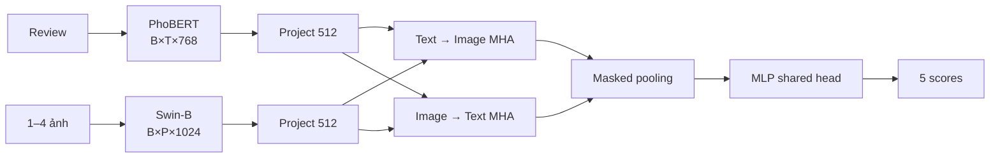

# Final Presentation Proposal

## 1. Presentation Overview

### Mục tiêu trình bày

Trình bày dự án như một hệ thống nghiên cứu hoàn chỉnh theo chuỗi **dữ liệu → nhãn → mô hình → thực nghiệm → XAI → AI Agent**, đồng thời phân biệt rõ ba mức bằng chứng:

1. **Đã có artifact trực tiếp:** dữ liệu, rule analysis, mã nguồn và 12 tệp metrics validation.
2. **Đã triển khai nhưng chưa có output runtime trong repo:** token–patch Cross-Attention hiện hành, XAI, AI Agent và notebook end-to-end.
3. **Chưa đủ bằng chứng để kết luận:** so sánh đồng bộ text-only/image-only/multimodal, multi-seed, locked test và kết quả của kiến trúc token–patch sau migration.

### Đối tượng nghe

- Giảng viên và sinh viên môn học.
- Người nghe có nền tảng Machine Learning/Deep Learning nhưng không cần biết chi tiết codebase.
- Trọng tâm đánh giá dự kiến: đóng góp có số liệu, logic thí nghiệm, tính trung thực khoa học và khả năng trình diễn end-to-end.

### Thời lượng và số slide đề xuất

- **Số slide khuyến nghị:** 18 slide.
- **Thời lượng:** 16–18 phút, cộng 3–5 phút hỏi đáp.
- Phân bổ gợi ý: 2 phút bài toán; 4 phút dữ liệu/đóng góp; 7 phút thực nghiệm; 3 phút XAI/Agent; 2 phút giới hạn và hướng phát triển.

### Narrative arc

1. Một review nhà hàng tiếng Việt và ảnh đi kèm tạo ra năm điểm như thế nào?
2. Nhóm đã xây dựng dữ liệu và weak label có khả năng truy vết ra sao?
3. Thiết kế Controlled Sequential Ablation trả lời được điều gì?
4. Các kết quả validation nào đã được xác nhận, và điều gì chưa được phép khẳng định?
5. XAI và AI Agent biến prediction thành evidence và lời giải thích như thế nào?
6. Những bước nào sẽ chuyển hệ thống từ “implementation-complete” sang “evidence-complete”?

### Key defense message

> Dự án đóng góp một pipeline nghiên cứu đa phương thức có khả năng truy vết cho tiếng Việt: 9.946 review hợp lệ, 22.150 ảnh/cặp review–ảnh, 14 nhóm luật tạo Overall Satisfaction, 12 artifact metrics validation và một kiến trúc giải thích nhiều tầng; kết quả tốt nhất đã quan sát là Mean MAE 1.107882 trên validation lịch sử, nhưng nhóm chủ động không gán số này cho locked test hay cho bản token–patch sau migration khi chưa có artifact tương ứng.

### Quy ước số liệu bắt buộc trên deck

- Thang nhãn đúng theo dữ liệu: **0–10**, không phải 1–10.
- Mọi số trong 12 tệp `metrics_*.json` phải ghi nhãn **Validation**.
- `EXP_041B`, `EXP_050B`, `EXP_050C`, `EXP_051D` được chạy trước refactor token–patch ngày 27/06/2026; phải ghi **pre-migration pooled-vector Cross-Attention**.
- Không dùng từ “final test”, “SOTA”, “statistically significant” hoặc “multimodal tốt hơn unimodal” nếu chưa bổ sung artifact còn thiếu.
- Ký hiệu `[NEEDS_CONFIRMATION]` trong proposal là chỉ dẫn cho nhóm/AI tạo slide, không nên để nguyên trên slide trình chiếu cuối; trước khi bỏ ký hiệu phải có artifact xác nhận.

---

## 2. Data and Artifact Sources Used

| Nguồn | Thông tin trích xuất | Mức tin cậy | Ghi chú sử dụng |
|---|---|---|---|
| `data_raw/cleaning_report.json` | 300 nhà hàng; 11.111 raw review; 24.599 raw image; 9.946 review hợp lệ; 22.150 ảnh sau lọc; 6.082 review có ảnh; 61,15% coverage | High | Artifact tổng kết cleaning trực tiếp; các cờ spam/too-short/emoji có thể chồng lấp, không cộng cơ học. |
| `data_raw/restaurants_clean.csv` | 300 nhà hàng sau technical cleaning | High | Đối chiếu trực tiếp số dòng. |
| `data_raw/text_only_reviews.csv` | 9.946 review hợp lệ | High | Một dòng/review; dùng cho thống kê text-level. |
| `data_raw/review_images_clean.csv` | 22.150 ảnh hợp lệ | High | Một dòng/ảnh. |
| `data_raw/multimodal_reviews.csv` | 22.150 cặp review–ảnh; 6.082 review có ảnh; 268 nhà hàng; phân phối 1–10 ảnh/review | High | Đã tái tính trực tiếp từ CSV. |
| `data_processed/reviews_clean_enhanced.csv` | 9.946 review, năm target, adjustment/evidence; 298 nhà hàng; 3 dòng thiếu bốn aspect | High | Nguồn nhãn trực tiếp. |
| `data_processed/overall_satisfaction_rules.json` | 14 nhóm luật: 8 dương, 6 âm; pattern, score và mô tả | High | Cấu hình luật trực tiếp. |
| `data_processed/overall_satisfaction_rule_analysis.md` | Công thức nhãn; 3.263 review được điều chỉnh; 2.058 dương; 1.205 âm; clipping; coverage từng luật; giới hạn rule engine | High | Báo cáo được sinh từ notebook và khớp CSV. |
| `notebook/01_generate_overall_satisfaction.ipynb` | Quy trình normalization → rule matching → adjustment → evidence → clipping; quality checks | High | Notebook có 47 code cell đã chạy và 61 output, không có error. |
| `notebook/crawl_data_from_foody.ipynb` | Crawler 300 nhà hàng; checkpoint mỗi 10 nhà hàng; resume; schema/export | Medium | Mã nguồn hiện diện nhưng notebook không có output đã chạy; số liệu cuối lấy từ cleaning artifact. |
| `notebook/clean_foody_dataset.ipynb` | Ngưỡng 15 ký tự/3 từ; lọc spam, nội dung ngắn, rating ngoài [0,10] | Medium | Mã nguồn hiện diện nhưng output notebook bị strip; kết quả lấy từ `cleaning_report.json`. |
| `preprocess_data.py` | Merge theo `review_id`, drop missing, group ảnh, seed 42, split 80/10/10 | High | Logic hiện hành tạo kỳ vọng 4.864/608/608 trên 6.080 review đủ năm nhãn; split CSV chưa commit. |
| `src/dataset.py` | Input tối đa bốn ảnh; padding ảnh đen; `num_images`; target order | High | Mã runtime hiện hành; raw data có thể có đến 10 ảnh nhưng loader chỉ dùng bốn ảnh đầu. |
| `Models/*.py`, `main.py`, `Trainer.py`, `test.py` | Text/Image branch, 5 fusion, 5 lựa chọn loss, model selection theo Mean MAE, metric/export contract | High | Nguồn triển khai hiện hành. |
| 12 tệp `metrics_*.json` ở thư mục gốc | Validation MAE/RMSE/R² cho 12 cấu hình ablation | High cho giá trị số; Medium cho khả năng gán vào kiến trúc hiện hành | Không chứa split hash/config; bốn run Cross-Attention/loss dùng semantics trước migration. |
| `notebook/EXP_010_text_only_xlmr_mse.ipynb` | Text-only validation: Mean MAE 1.2434, Overall MAE 1.0880 | Medium | Output trực tiếp nhưng `metrics.json`, predictions và split snapshot không commit. |
| `notebook/EXP_011_image_only_convnext_mse.ipynb` | Thiết kế image-only baseline | Needs confirmation | Không có output/metrics trong notebook hay repo. |
| `notebook/EXP_012_multimodal_convnext_xlmr_concat_mse.ipynb` | Thiết kế multimodal concat baseline | Needs confirmation | Không có output/metrics trong notebook hay repo. |
| `phase_selections.md` | Logic chọn Swin-B, PhoBERT, Cross-Attention, Log-Cosh | Medium | Diễn giải thứ cấp; một số ngôn từ cũ overclaim, chỉ dùng khi khớp JSON. |
| `Nhom24_Progress_Report.md` | Bảng 12 validation run; threat to validity; migration warning; trạng thái XAI/Agent | Medium–High | Báo cáo tổng hợp mới hơn README; dùng để định khung khoa học, số liệu vẫn ưu tiên JSON/CSV. |
| Git history của `Models/CrossAttentionFusion.py` và metrics | Metrics commit 24/06; token–patch refactor commit 27/06 | High | Bằng chứng trực tiếp rằng metrics Cross-Attention hiện có là pre-migration. |
| `xai/*.py` | Grad-CAM, PhoBERT Attention, bidirectional Cross-Attention, SHAP, LIME, case-study orchestration | High cho implementation | Không có thư mục output XAI trong repo; chưa có finding định tính đã nghiệm thu. |
| `Success_End_to_End_XAI_AI_Agent_Sample_0000_Improved_CrossAttention.ipynb` | Thiết kế demo sample index 0; đường dẫn và tên artifact; hai visual Cross-Attention cải tiến | High cho thiết kế; Needs confirmation cho output | Notebook có 0 executed cell/0 output; chính cell cuối yêu cầu chạy tuần tự trên Colab. |
| `agent/*.py`, `AI_agent_IMPLEMENTATION_NOTES.md` | Evidence loader/builder, reasoning graph, GPT-4o verbalization, validator, Customer/Technical View | High cho implementation | Không có report JSON/Markdown runtime trong repo; vision mode chưa triển khai. |
| `Figures/*.png`, `Figures/*.mmd`, `Figures/Figure_Manifest.md` | 16 sơ đồ có sẵn: data, system, Cross-Attention, training, XAI, Agent, future deployment | High | File PNG tồn tại; dùng trực tiếp hoặc dựng lại theo MMD. |
| `README.md`, `report.md`, `presentation_proposal.md`, `CODEBASE_OVERVIEW.md` | Bối cảnh và metric lịch sử | Needs confirmation | Có nội dung cũ/xung đột: score range 1–10, tên ConvNeXt/EfficientNet, split 5.000/6.000, trạng thái XAI. Không dùng làm nguồn số chính. |
| Các notebook Kaggle lịch sử | Một số test metrics 5-target và 4-target | Medium–Low | Protocol/tên backbone không đồng nhất; chỉ đưa vào bảng phụ, không trộn với 12 validation run. |

### Các xung đột đã phát hiện và quyết định sử dụng

1. **Split hiện hành vs split lịch sử**
   - `preprocess_data.py` hiện hành: 6.080 mẫu → 4.864/608/608.
   - Changelog/notebook lịch sử: 6.000 mẫu → 4.800/600/600; một số tài liệu cũ còn ghi 5.000 hoặc 5.500 mẫu.
   - Quyết định: slide dữ liệu ghi **“logic hiện hành: 4.864/608/608; split artifact của metrics: `[NEEDS_CONFIRMATION]`”**.

2. **Score range**
   - CSV và rule engine: 0–10.
   - `xai/config.py` và một số README cũ: 1–10.
   - Quyết định: dùng **0–10**; ghi score-range mismatch ở slide limitations.

3. **Tên backbone lịch sử**
   - README gọi run 1.2 là “ViSoBERT + ConvNeXt”, nhưng notebook thực chạy `efficientnet_b3`.
   - Quyết định: không dùng tên/claim README trong main deck; nếu đưa bảng phụ phải ghi “ViSoBERT + EfficientNet-B3 theo command notebook”.

4. **Cross-Attention metrics vs kiến trúc hiện hành**
   - Metrics 24/06: Cross-Attention trên một vector pooled mỗi modality.
   - Code từ 27/06: bidirectional token–patch Cross-Attention.
   - Quyết định: kết quả fusion/loss ghi **pre-migration**; kiến trúc slide 8 ghi **current implementation**; không gắn metrics cũ cho kiến trúc mới.

5. **Tên notebook “Success” vs trạng thái output**
   - Notebook end-to-end có tên “Success” nhưng không có execution/output và không có artifact trong repo.
   - Quyết định: trình bày là **demo notebook đã thiết kế**, chỉ dùng screenshot thật sau khi nhóm chạy và xác nhận output.

---

## 3. Final Slide-by-Slide Proposal

## Slide 1 — Explainable Multimodal Deep Learning for Vietnamese Restaurant Review Quality Assessment

### Mục tiêu của slide

Định vị đề tài như một hệ thống nghiên cứu end-to-end, không chỉ là một model dự đoán điểm.

### Thông điệp chính

Từ một review tiếng Việt và ảnh đi kèm, hệ thống tạo năm điểm, nhiều tầng evidence và một lời giải thích có kiểm soát.

### Nội dung trên slide

- Tên đề tài tiếng Anh như tiêu đề chính.
- Phụ đề: **Dataset → Prediction → XAI → Evidence-grounded AI Agent**.
- Nhóm 24, môn học, giảng viên, thành viên, ngày trình bày.
- Dòng nhỏ: **5-target multimodal regression, thang 0–10**.

### Visual / Layout đề xuất

- Layout 16:9, nền sáng, một đường pipeline ngang ở 1/3 dưới.
- Dùng `Figures/Figure_1_1_Research_Value_Chain.png`; crop sát khoảng trắng, giữ chiều rộng toàn slide.
- Màu xuyên suốt deck: text xanh lá, image cam, fusion tím, output xanh dương, cảnh báo xám/đỏ nhạt.
- Không dùng ảnh stock nhà hàng không có nguồn; title slide chỉ cần pipeline và typography mạnh.

### Dữ liệu / số liệu cần đưa vào

- `5 targets` từ `src/dataset.py` và `xai/config.py`.
- `0–10` từ `data_processed/reviews_clean_enhanced.csv` và rule analysis.
- Artifact: `Figures/Figure_1_1_Research_Value_Chain.png` — đã tồn tại, 2352×321.

### Gợi ý trình bày khi thuyết trình

“Chúng em không dừng ở câu hỏi model dự đoán bao nhiêu điểm. Mục tiêu là tạo một chuỗi có thể truy vết từ dữ liệu, thí nghiệm đến evidence và lời giải thích cho người dùng.”

### Lưu ý tránh sai

- Không gọi hệ thống là sản phẩm production-ready.
- Không ghi “SOTA”.
- Không dùng thang 1–10.

---

## Slide 2 — Problem Definition: Một review + 1–4 ảnh → năm điểm

### Mục tiêu của slide

Đáp ứng trực tiếp yêu cầu của giảng viên về input/output và giúp người nghe hiểu bài toán trong 20 giây.

### Thông điệp chính

Đây là hồi quy đa mục tiêu: cùng một trải nghiệm có thể tốt về món ăn nhưng kém về giá hoặc dịch vụ.

### Nội dung trên slide

- **Input:** một bình luận tiếng Việt + 1–4 ảnh review.
- **Output:** Food, Price, Atmosphere, Service, Overall Satisfaction.
- **Task:** multi-output regression, mỗi điểm trong **[0,10]**.
- Một dòng ví dụ ngắn: “Món ngon, phục vụ chậm, giá hơi cao.”

### Visual / Layout đề xuất

- Trái 40%: card input gồm một đoạn review 1–2 dòng và grid 2×2 ảnh placeholder có nhãn “review images”.
- Giữa: mũi tên/khối “Multimodal Model”.
- Phải 40%: năm thanh score dọc hoặc năm gauge đồng nhất, không dùng pie chart.
- Mermaid cho slide creator:



### Dữ liệu / số liệu cần đưa vào

- Target order chính xác: `food_score`, `price_score`, `atmosphere_score`, `service_score`, `overall_satisfaction`.
- Nguồn: `src/dataset.py:75–82`, `xai/config.py`.
- `max_images=4` từ `src/dataset.py`.
- Không dùng prediction cụ thể của sample_0000 vì notebook chưa chạy.

### Gợi ý trình bày khi thuyết trình

“Năm output tách biệt cho phép mô hình giữ lại trade-off giữa các khía cạnh thay vì ép toàn bộ trải nghiệm vào một nhãn cảm xúc duy nhất.”

### Lưu ý tránh sai

- Không nói ảnh luôn có 1–4 tệp trong dữ liệu gốc; raw data có 1–10 ảnh/review, loader chỉ lấy tối đa bốn.
- Không thêm `position_score`; target này được giữ trong dữ liệu nhưng không được dự đoán.

---

## Slide 3 — Dataset Construction: từ Foody crawl đến 6.080 mẫu đủ nhãn

### Mục tiêu của slide

Chứng minh dataset là một đóng góp kỹ thuật có quy trình và có số liệu ở từng bước.

### Thông điệp chính

Pipeline biến dữ liệu Foody theo hàng ảnh thành mẫu review-level, ngăn cùng một review nhiều ảnh bị xem như nhiều mẫu độc lập.

### Nội dung trên slide

- Crawl: **300 nhà hàng · 11.111 review · 24.599 ảnh**.
- Sau content/ML cleaning: **9.946 review hợp lệ · 22.150 ảnh**.
- Có ảnh: **6.082 review (61,15%)**.
- Đủ năm nhãn để train: **6.080 review-level samples**.
- Model sử dụng tối đa **4 ảnh/review**.

### Visual / Layout đề xuất

- Dùng funnel hoặc Sankey bốn tầng; mỗi tầng chỉ hiện một số headline.
- Bên dưới là mini-diagram “image rows → group by review_id → review-level sample”.
- Có thể dùng `Figures/Figure_3_1_Dataset_Pipeline.png` ở nửa dưới, nhưng nên dựng lại vì hình gốc rất rộng (2352×207).
- Mermaid:



### Dữ liệu / số liệu cần đưa vào

- Raw/clean counts: `data_raw/cleaning_report.json`.
- 6.082, 268 restaurants, image count distribution: `data_raw/multimodal_reviews.csv`.
- 6.080 đủ nhãn: merge logic trong `preprocess_data.py`, tái tính từ CSV.
- Split logic hiện hành: 4.864/608/608; **không đặt lên funnel chính**, chỉ ghi ở footer với `[NEEDS_CONFIRMATION] split artifact not committed`.
- 1.736 review có hơn bốn ảnh và 6.730 ảnh nằm ngoài bốn vị trí đầu; để dành cho limitations hoặc speaker note.

### Gợi ý trình bày khi thuyết trình

“Điểm quan trọng là đơn vị học là một review, không phải một cặp review–ảnh. Chúng em gom toàn bộ URL ảnh theo `review_id` trước khi chia tập để tránh rò rỉ trực tiếp cùng một text qua nhiều split.”

### Lưu ý tránh sai

- Không gọi 22.150 là 22.150 review-image “unique semantic pairs”; đây là 22.150 hàng ảnh/URL duy nhất sau cleaning.
- Không nói 11.111 − 9.946 bằng tổng các cờ spam/short/emoji; các cờ có thể overlap.
- Không trình bày 4.864/608/608 như split dùng cho 12 metrics nếu chưa có snapshot/hash.

---

## Slide 4 — Label Engineering: Overall Satisfaction có evidence tiếng Việt

### Mục tiêu của slide

Giải thích vì sao Overall Satisfaction không sao chép mù quáng rating trung bình và cách nhãn vẫn có thể audit.

### Thông điệp chính

Overall Satisfaction kết hợp trung bình bốn aspect với tín hiệu hài lòng toàn cục trong ngôn ngữ Việt, đồng thời lưu rule và evidence cho từng điều chỉnh.

### Nội dung trên slide

- Base: mean(Food, Price, Atmosphere, Service); loại `position_score`.
- **14 nhóm luật:** 8 dương, 6 âm.
- **3.263/9.946 review (32,81%)** có adjustment khác 0.
- 2.058 net positive · 1.205 net negative.
- Formula lớn ở trung tâm:

```text
overall_satisfaction = clip(avg_rating + overall_adjustment, 0, 10)
```

### Visual / Layout đề xuất

- Nửa trái: formula + pipeline normalize → match rules → sum distinct scores → clip.
- Nửa phải: hai cột evidence dương/âm với ví dụ phrase ngắn:
  - Dương: “sẽ quay lại”, “rất hài lòng”, “đáng đồng tiền”.
  - Âm: “không quay lại”, “thất vọng”, “chờ quá lâu”.
- Footer mini-bar: 66,79% no-rule; 20,26% positive-only; 11,03% negative-only; 1,92% mixed.

### Dữ liệu / số liệu cần đưa vào

- `data_processed/overall_satisfaction_rules.json`.
- `data_processed/overall_satisfaction_rule_analysis.md`:
  - 14 categories; 8 positive; 6 negative.
  - 3.263 adjusted; 2.058 dương; 1.205 âm.
  - adjustment min −1,50, max +2,00.
  - 432 clipped to 10; 26 clipped to 0.
  - mean Overall Satisfaction 6,7133; std 2,6165.
- Có thể chọn top rule coverage: strong satisfaction 669; strong dissatisfaction 666; revisit intention 552; recommendation 523.

### Gợi ý trình bày khi thuyết trình

“Weak label này không phải human gold label. Giá trị của nó là minh bạch: với mỗi review, ta biết rule nào kích hoạt, evidence phrase nào khớp và bao nhiêu điểm được cộng hoặc trừ.”

### Lưu ý tránh sai

- Không gọi label này là ground truth khách quan.
- Không nói rule engine hiểu cú pháp/ngữ cảnh đầy đủ; nó là regex có negation guard.
- Không nói mọi review đều bị điều chỉnh; 66,79% không kích hoạt rule.

---

## Slide 5 — Contribution Summary I: Dataset + Traceable Label Pipeline

### Mục tiêu của slide

Tạo một contribution dashboard định lượng, thay cho danh sách bullet chung chung.

### Thông điệp chính

Đóng góp dữ liệu nằm ở cả quy mô, bản chất multimodal tiếng Việt và khả năng truy vết từ raw crawl đến từng weak-label adjustment.

### Nội dung trên slide

- **300** nhà hàng Foody.
- **9.946** review hợp lệ tiếng Việt.
- **22.150** ảnh · **6.082** review có ảnh.
- **6.080** mẫu multimodal đủ năm nhãn.
- **14** nhóm luật · **3.263** review được điều chỉnh có evidence.

### Visual / Layout đề xuất

- Dashboard 2×3 card, mỗi card có một số lớn và nhãn tối đa hai dòng.
- Card cuối thay số bằng “0→10 · 5 targets · 1–4 images”.
- Dải nhỏ dưới cùng: `crawl checkpoint → clean flags → review_id grouping → rule evidence → split logic`.
- Tránh dùng bảng; đây phải là slide “đập vào mắt” trong 5 giây.

### Dữ liệu / số liệu cần đưa vào

| Card | Giá trị | Nguồn |
|---|---:|---|
| Restaurants crawled | 300 | `cleaning_report.json`, `restaurants_clean.csv` |
| Valid Vietnamese reviews | 9.946 | `text_only_reviews.csv`, enhanced CSV |
| Valid image rows | 22.150 | `review_images_clean.csv` |
| Reviews with images | 6.082 (61,15%) | `cleaning_report.json`, multimodal CSV |
| Fully labeled multimodal samples | 6.080 | merge audit + `preprocess_data.py` |
| Rule-engine reach | 14 rules; 3.263 adjusted | rule JSON + analysis MD |

### Gợi ý trình bày khi thuyết trình

“Đây không chỉ là một file CSV. Dataset đi kèm crawler có checkpoint, cleaning report, evidence cho nhãn và logic gom nhiều ảnh ở cấp review.”

### Lưu ý tránh sai

- Không dùng cụm “bộ dữ liệu công khai” nếu chưa có giấy phép/phát hành chính thức.
- Không nói 6.080 là tổng review đã clean; đó là subset multimodal đủ năm nhãn.
- Không ẩn việc split artifact chưa commit; ghi footnote nhỏ “current split logic only”.

---

## Slide 6 — Contribution Summary II: Model + Experiments + XAI + Agent

### Mục tiêu của slide

Cho thấy dự án không chạy một model đơn lẻ mà xây một không gian thí nghiệm và một lớp giải thích end-to-end.

### Thông điệp chính

Đóng góp kỹ thuật gồm 12 validation artifacts có kiểm soát, năm fusion implementation, năm phương pháp XAI và AI Agent có reasoning/validation tách khỏi prediction.

### Nội dung trên slide

- **12** tệp metrics validation đã commit.
- So sánh: **3 image encoders · 3 text settings · 5 fusion strategies · 4 losses**.
- **5 outputs** trong một shared regression head.
- **5 XAI methods:** Grad-CAM, Self-Attention, Cross-Attention, SHAP, LIME.
- Agent: **Reasoning Graph + Customer View + Technical View + warnings**.

### Visual / Layout đề xuất

- Bốn cột đóng góp:
  1. **Model:** Text/Image + 5 fusion.
  2. **Experiments:** 12 validation JSON.
  3. **XAI:** 5 complementary questions.
  4. **Agent:** evidence → reasoning → two reports.
- Gắn badge trạng thái dưới mỗi cột:
  - Model code: **Implemented**.
  - Validation ablation: **12 artifacts**.
  - XAI output: **Not committed**.
  - Agent output: **Not committed**.
- Có một “scientific honesty ribbon”: **Validation ≠ Test; implementation ≠ empirical finding**.

### Dữ liệu / số liệu cần đưa vào

- 12 JSON ở root; experiment groups từ `experiment_plan.md` và `phase_selections.md`.
- 5 fusion class: `Models/FusionModel.py`, `Models/GMUFusion.py`, `Models/GatedCrossModalFusion.py`, `Models/FiLMFusion.py`, `Models/CrossAttentionFusion.py`.
- 4 loss có metric: MSE, Huber, Log-Cosh, uncertainty weighting.
- 5 XAI module từ `xai/`.
- Agent components từ `agent/__init__.py`, `agent/reasoning.py`, `agent/validator.py`, `agent/report_generator.py`.

### Gợi ý trình bày khi thuyết trình

“Số 12 không phải 12 ý tưởng trên giấy; đó là 12 JSON validation có per-target MAE, RMSE và R². Tuy nhiên, chúng em cũng chỉ rõ XAI/Agent hiện được xác nhận ở mức implementation vì output runtime chưa nằm trong repository.”

### Lưu ý tránh sai

- Không nói 20 planned runs đều đã hoàn thành; `experiment_plan.md` là roadmap.
- Không nói năm loss đều đã so sánh; SmoothL1 có trong CLI nhưng không có metric artifact.
- Không gọi AI Agent là predictor hoặc model ensemble.

---

## Slide 7 — Overall System Pipeline: Prediction → XAI → Explanation

### Mục tiêu của slide

Kết nối các phần dữ liệu, model, XAI và AI Agent thành một kiến trúc có vai trò tách biệt.

### Thông điệp chính

Prediction Model tạo năm điểm; XAI trích evidence; AI Agent chỉ cấu trúc và diễn đạt evidence sau dự đoán.

### Nội dung trên slide

- Data/label pipeline tạo review-level sample.
- Multimodal model tạo năm score cố định.
- XAI quan sát image, text, cross-modal và local behavior.
- Agent tạo Customer View/Technical View và validation warnings.

### Visual / Layout đề xuất

- Dùng một pipeline ngang ba tầng, không dùng sơ đồ source-code quá chi tiết.
- Có thể dùng `Figures/Figure_4_1_System_Architecture.png`, crop vào bốn subgraph chính.
- Mermaid gọn hơn cho slide:



### Dữ liệu / số liệu cần đưa vào

- Artifact có sẵn: `Figures/Figure_4_1_System_Architecture.png` (2352×1632) hoặc `Figures/Figure_4_9_Review_To_Report_Workflow.png` (2352×1458).
- Prediction/XAI/Agent sequence: `Figures/Figure_4_10_Prediction_XAI_AI_Agent_Sequence.png`.
- Không cần metric trên slide này.

### Gợi ý trình bày khi thuyết trình

“Ranh giới quan trọng nhất là Agent nằm sau Prediction. Dù Agent có lỗi diễn đạt, năm score của model không thay đổi; dù thiếu API key, prediction và XAI vẫn có thể chạy độc lập.”

### Lưu ý tránh sai

- Không vẽ mũi tên từ Agent quay lại sửa prediction.
- Không nói AI Agent trực tiếp nhìn ảnh trong implementation hiện tại; mode dùng trong demo là `text_only` và vision mode chưa triển khai.

---

## Slide 8 — Proposed Architecture: PhoBERT × Swin-B với Bidirectional Token–Patch Cross-Attention

### Mục tiêu của slide

Giải thích kiến trúc hiện hành vừa đủ để người nghe hiểu nguồn gốc của prediction và hai hướng Cross-Attention.

### Thông điệp chính

PhoBERT giữ token features, Swin-B giữ patch features; hai hướng attention trao đổi context trước khi pooling và shared head dự đoán năm điểm.

### Nội dung trên slide

- PhoBERT-base-v2: token sequence, hidden size 768.
- Swin-B: patch feature map, feature dim 1024.
- Projection chung 512 chiều.
- Text→Image và Image→Text là hai MHA độc lập.
- Masked mean → fused vector 1024 → MLP → 5 outputs.

### Visual / Layout đề xuất

- Dùng `Figures/Figure_4_2_Cross_Attention.png`; hình đã đúng tensor flow hiện hành.
- Hai nhánh song song ở trái, khối bidirectional attention ở giữa, prediction head ở phải.
- Không đưa toàn bộ class names hay code lên slide.
- Mermaid:



### Dữ liệu / số liệu cần đưa vào

- `Models/CrossAttentionFusion.py`: hidden 512, `num_heads=8`, two `nn.MultiheadAttention`, fused dim 1024.
- `Models/TextModel.py`, `Models/ImageModel.py`.
- `xai/config.py`: PhoBERT 768, Swin-B 1024, fused 1024.
- `Figures/Figure_4_2_Cross_Attention.png` (2352×420) — đã tồn tại.

### Gợi ý trình bày khi thuyết trình

“Text→Image hỏi: với một token, vùng ảnh nào cung cấp context? Image→Text hỏi ngược lại: với một patch, token nào liên quan? Sau đó mỗi hướng được pooling để tạo hai nửa của fused representation.”

### Lưu ý tránh sai

- Không nói metrics 1.107882 ở slide kết quả là của kiến trúc token–patch này; metrics đó có trước migration.
- Không nói từng patch thuộc riêng một ảnh khi có nhiều ảnh: `ImageModel.forward_features` mean-pool patch cùng vị trí qua các ảnh thật trước attention.
- Không gọi attention là causal explanation.

---

## Slide 9 — Experimental Setup: Controlled Sequential Ablation với ranh giới bằng chứng rõ ràng

### Mục tiêu của slide

Cho người nghe biết cái gì được giữ cố định, tiêu chí chọn winner và vì sao kết quả được chia theo phase.

### Thông điệp chính

Mỗi phase thay một nhóm thành phần, dùng validation Mean MAE để carry forward; nhưng split snapshot, multi-seed và locked test vẫn còn thiếu.

### Nội dung trên slide

- Phase 1: modality baselines.
- Phase 2–5: image → text → fusion → loss.
- Selection metric: **Mean MAE trên 5 targets**.
- Metrics phụ: per-target MAE, RMSE, R².
- Seed quan sát: **42**; 12 validation JSON.

### Visual / Layout đề xuất

- Dùng `Figures/Figure_5_1_Controlled_Sequential_Ablation_Phases.png` làm timeline ngang.
- Bên phải một “Evidence Boundary” card:
  - Validation artifacts: 12/12 ablation rows.
  - Locked test: missing.
  - Multi-seed: missing.
  - Frozen split/hash: missing.
- Không để hyperparameter table chiếm quá 1/3 slide.

### Dữ liệu / số liệu cần đưa vào

- Typical fusion setting trong notebook Phase 4: 15 epochs, batch 16, LR 1e-5, gradient accumulation 2, patience 5, unfreeze một layer/block, AMP, seed 42.
- Best checkpoint được chọn theo `mean_mae` trong `Trainer.py`.
- Metrics là sample-wise trên toàn validation array trong `Trainer.validate()`.
- Split:
  - Current code expectation: 4.864/608/608.
  - Historical experiment split: `[NEEDS_CONFIRMATION]`; likely 4.800/600/600 theo data package/notebook logs nhưng không có CSV/hash trong repo.
- Source: `experiment_plan.md`, `Trainer.py`, experiment notebooks, `Nhom24_Progress_Report.md`.

### Gợi ý trình bày khi thuyết trình

“Sequential ablation giúp giảm chi phí và giữ được logic quy kết theo phase. Tuy nhiên, vì chưa có frozen split hash và nhiều seed, các chênh lệch rất nhỏ chỉ là observation, không phải significance claim.”

### Lưu ý tránh sai

- Không nói tất cả planned Phase 6/7 đã chạy.
- Không nói mọi run dùng cùng checkpoint semantics sau refactor.
- Không trộn test metrics lịch sử từ notebook Kaggle vào bảng validation chính.

---

## Slide 10 — Result I: Modality Comparison chưa đủ artifact để kết luận

### Mục tiêu của slide

Đáp ứng yêu cầu so sánh text/image/multimodal nhưng giữ đúng scientific boundary thay vì điền số giả hoặc lấy run không đồng bộ.

### Thông điệp chính

Text-only đã có một output validation; image-only và early multimodal baseline có code nhưng thiếu metrics đồng bộ, nên chưa thể khẳng định giá trị bổ sung của ảnh.

### Nội dung trên slide

- Text-only XLM-R: **Mean MAE 1.2434 · Overall MAE 1.0880** (validation notebook output).
- Image-only ConvNeXt: **metric artifact missing**.
- Multimodal ConvNeXt + XLM-R + Concat: **metric artifact missing**.
- RQ “multimodal > unimodal?”: **Open**.

### Visual / Layout đề xuất

- Không dùng bar chart với hai cột trống.
- Dùng evidence matrix ba hàng:

| Baseline | Code/notebook | Metrics | Có thể so sánh? |
|---|---|---|---|
| Text-only | ✓ | ✓ | Chưa, thiếu hai đối chứng |
| Image-only | ✓ | — | Không |
| Multimodal concat | ✓ | — | Không |

- Cột metric text-only có mini-bar năm target; hai hàng còn lại dùng biểu tượng “artifact required”, không ước lượng.
- Nếu nhóm bổ sung đủ metrics trước ngày trình bày, thay slide này bằng grouped bar chart Mean MAE/per-target MAE trên cùng frozen split.

### Dữ liệu / số liệu cần đưa vào

- Text-only validation từ `notebook/EXP_010_text_only_xlmr_mse.ipynb`:
  - Food 1.2717
  - Price 1.2928
  - Atmosphere 1.2510
  - Service 1.3135
  - Overall 1.0880
  - Mean MAE 1.2434
  - Aspect MAE 1.2823
- Missing: `EXP_011` và `EXP_012` metrics/predictions.
- Legacy Kaggle test metrics chỉ để ở metric appendix của proposal, không điền vào slide vì protocol/model khác.

### Gợi ý trình bày khi thuyết trình

“Đây là một negative result về evidence package, không phải về model. Code cho ba baseline đã có, nhưng chỉ một baseline có output trong repo. Vì vậy chúng em không dùng run khác protocol để tạo một so sánh giả.”

### Lưu ý tránh sai

- Không dùng câu “multimodal improves over single modality”.
- Không coi `EXP_020B` là early multimodal baseline thay cho `EXP_012`; backbone và training path khác.
- Không trình bày text-only value như test metric.

---

## Slide 11 — Result II: Image Backbone — Swin-B đứng đầu ba run validation đã lưu

### Mục tiêu của slide

Cho thấy kết quả controlled comparison đầu tiên có đủ ba artifact và một winner rõ theo validation Mean MAE.

### Thông điệp chính

Trong context XLM-R + Concatenation + MSE đã khảo sát, Swin-B có Mean MAE thấp nhất; kết luận không mở rộng ngoài protocol này.

### Nội dung trên slide

- Swin-B: **1.216909**.
- SigLIP: **1.229648**.
- EfficientNet-B3: **1.279986**.
- Swin-B tốt hơn EfficientNet-B3 **4,93% relative Mean MAE**.

### Visual / Layout đề xuất

- Chart type: ranked horizontal bar chart.
- Y-axis: Swin-B, SigLIP, EfficientNet-B3, sort Mean MAE tăng dần.
- X-axis: Validation Mean MAE; bắt đầu từ 0 để tránh phóng đại chênh lệch.
- Label trên bar: bốn chữ số thập phân; tooltip/data table giữ sáu chữ số.
- Legend: không cần; ba màu xám, winner xanh đậm.
- Card phụ bên phải:
  - Overall MAE: 1.066694 / 1.070335 / 1.129577.
  - Overall R²: 0.487443 / 0.471523 / 0.423582.
- Key highlight: Swin-B; không dùng crown/“absolute winner”.

### Dữ liệu / số liệu cần đưa vào

| Model | Mean MAE | Overall MAE | Overall RMSE | Overall R² | Source |
|---|---:|---:|---:|---:|---|
| Swin-B | 1.216908717 | 1.066694140 | 1.444654226 | 0.487442791 | `metrics_EXP_020B_swinb_xlmr_concat_mse.json` |
| SigLIP | 1.229648209 | 1.070334673 | 1.466918349 | 0.471522689 | `metrics_EXP_020E_siglip_xlmr_concat_mse.json` |
| EfficientNet-B3 | 1.279985619 | 1.129576564 | 1.532010317 | 0.423581541 | `metrics_EXP_020D_efficientnetb3_xlmr_concat_mse.json` |

Improvement formula dùng trong note:

```text
Improvement = (baseline_MAE - proposed_MAE) / baseline_MAE × 100%
(1.279985619 - 1.216908717) / 1.279985619 × 100% = 4.9279%
```

### Gợi ý trình bày khi thuyết trình

“Khoảng cách Swin–SigLIP chỉ khoảng 0,0127, còn Swin–EfficientNet khoảng 0,0631. Đây là winner trong ba run đã lưu, không phải tuyên bố Swin luôn tốt hơn mọi visual encoder.”

### Lưu ý tránh sai

- Không thêm model size hoặc latency vì repo không có số đo.
- Không nói SigLIP được đánh giá end-to-end với text encoder gốc của nó; đây là visual backbone ghép với XLM-R.
- Luôn ghi Validation.

---

## Slide 12 — Result III: Text Backbone — PhoBERT tạo mức giảm lớn nhất trong chuỗi ablation

### Mục tiêu của slide

Làm nổi bật finding định lượng mạnh nhất của 12 run validation.

### Thông điệp chính

Với Swin-B + Concatenation + MSE, PhoBERT giảm Mean MAE 8,41% so với XLM-R reference; effect này lớn hơn các thay đổi fusion/loss phía sau.

### Nội dung trên slide

- PhoBERT: **1.114530**.
- XLM-R: **1.216909**.
- ViSoBERT: **1.232785**.
- Absolute reduction PhoBERT vs XLM-R: **0.102379**.
- Relative reduction: **8,4130%**.

### Visual / Layout đề xuất

- Chart type: horizontal lollipop hoặc bar chart, sort Mean MAE tăng dần.
- Y-axis: PhoBERT, XLM-R, ViSoBERT.
- X-axis: Validation Mean MAE, bắt đầu từ 0.
- Màu: PhoBERT xanh đậm; hai model khác xám.
- Callout arrow từ XLM-R → PhoBERT ghi “−0.1024 MAE / −8.41%”.
- Mini-table dưới: Overall MAE và Overall R².

### Dữ liệu / số liệu cần đưa vào

| Text encoder | Mean MAE | Overall MAE | Overall RMSE | Overall R² | Source |
|---|---:|---:|---:|---:|---|
| PhoBERT | 1.114530206 | 0.930023313 | 1.240621686 | 0.621998727 | `metrics_EXP_030B_bestimage_phobert_concat_mse.json` |
| XLM-R | 1.216908717 | 1.066694140 | 1.444654226 | 0.487442791 | `metrics_EXP_020B_swinb_xlmr_concat_mse.json` |
| ViSoBERT | 1.232785296 | 1.092310190 | 1.484327793 | 0.458904207 | `metrics_EXP_030D_bestimage_visobert_concat_mse.json` |

```text
(1.216908717 - 1.114530206) / 1.216908717 × 100% = 8.4130%
```

### Gợi ý trình bày khi thuyết trình

“Trong chuỗi đã chạy, thay text backbone tạo effect lớn nhất. Kết quả ủng hộ lợi ích của pretraining đơn ngữ tiếng Việt trong context này, nhưng không đủ để nói PhoBERT luôn vượt ViSoBERT trên mọi setup.”

### Lưu ý tránh sai

- Không dùng từ “hủy diệt” hoặc “vượt trội tuyệt đối”.
- Không gán nguyên nhân chắc chắn cho tokenizer/pretraining nếu chưa có ablation riêng.
- Không trộn text-only PhoBERT với multimodal PhoBERT; đây là multimodal Swin-B + Concat run.

---

## Slide 13 — Result IV: Fusion — hai cấu hình dẫn đầu gần như hòa nhau

### Mục tiêu của slide

So sánh có kiểm soát năm chiến lược fusion và đồng thời công bố đúng phạm vi của run Cross-Attention đã lưu.

### Thông điệp chính

Gated Cross-Modal Fusion và Cross-Attention cho Mean MAE tốt nhất trong nhóm, nhưng chênh lệch rất nhỏ; fusion cải thiện ít hơn nhiều so với lựa chọn text backbone.

### Nội dung trên slide

- Cross-Attention: **1.107882** Mean MAE.
- Gated Cross-Modal: **1.108215** — chênh chỉ **0.000334**.
- Concatenation reference: **1.114530**.
- Cross-Attention giảm **0.5965%** so với Concatenation.
- Cảnh báo bắt buộc: metric Cross-Attention này thuộc phiên bản **pooled-vector trước refactor token–patch**.

### Visual / Layout đề xuất

- Chart type: ranked horizontal dot plot.
- Y-axis: Cross-Attention (pre-refactor), Gated Cross-Modal, Concatenation, GMU, FiLM; sort Mean MAE tăng dần.
- X-axis: Validation Mean MAE; nên zoom hợp lý vào 1.105–1.122 và ghi rõ “truncated axis” để không phóng đại khác biệt.
- Dot màu xanh đậm: hai cấu hình dẫn đầu; Concat màu xanh nhạt làm reference; còn lại màu xám.
- Gắn bracket Cross-Attention ↔ Concat: “−0.006649 / −0.5965%”.
- Footer đỏ nhạt: “Measured Cross-Attention = pooled-vector implementation, not current token–patch implementation”.
- Legend: Validation; lower is better.

### Dữ liệu / số liệu cần đưa vào

| Fusion | Mean MAE | Overall MAE | Overall RMSE | Overall R² | Source |
|---|---:|---:|---:|---:|---|
| Cross-Attention, pre-refactor | 1.107881653 | 0.914252698 | 1.221524477 | 0.633546531 | `metrics_EXP_041B_bestimage_besttext_crossattention_mse.json` |
| Gated Cross-Modal | 1.108215332 | 0.919808745 | 1.225934744 | 0.630895615 | `metrics_EXP_040C_bestimage_besttext_gatedcrossmodal_mse.json` |
| Concatenation | 1.114530206 | 0.930023313 | 1.240621686 | 0.621998727 | `metrics_EXP_030B_bestimage_phobert_concat_mse.json` |
| GMU | 1.116048729 | 0.928881347 | 1.236399174 | 0.624567509 | `metrics_EXP_040B_bestimage_besttext_gmu_mse.json` |
| FiLM | 1.119533467 | 0.927769780 | 1.241488099 | 0.621470571 | `metrics_EXP_041A_bestimage_besttext_film_mse.json` |

```text
(1.114530206 - 1.107881653) / 1.114530206 × 100% = 0.5965%
1.108215332 - 1.107881653 = 0.000333679
```

Đối chiếu implementation:

- Metric commit trước refactor: lịch sử Git của `metrics_EXP_041B_bestimage_besttext_crossattention_mse.json`, 24/06/2026.
- Implementation hiện tại: `Models/CrossAttentionFusion.py`, refactor token–patch, 27/06/2026.
- Notebook chạy lại dự kiến: `notebook/EXP_050C_truecrossattn_logcosh.ipynb`; hiện 0 output và chưa có metric.

### Gợi ý trình bày khi thuyết trình

“Fusion có đóng góp, nhưng mức giảm so với concat là dưới 0,6%, còn hai fusion tốt nhất gần như hòa. Quan trọng hơn, run được đo dùng phiên bản cũ; vì vậy chúng tôi không gán con số này cho kiến trúc token–patch hiện tại.”

### Lưu ý tránh sai

- Không gọi 1.107882 là kết quả của “true token–patch Cross-Attention”.
- Không suy ra khác biệt có ý nghĩa thống kê khi chỉ có một seed và không có confidence interval.
- Không vẽ trục zoom mà thiếu cảnh báo truncated axis.
- Không nói fusion là nguồn cải thiện lớn nhất; text backbone có effect lớn hơn rõ rệt trong các run đã lưu.

---

## Slide 14 — Result V: Loss, best measured run và hành vi theo target

### Mục tiêu của slide

Chốt chuỗi ablation loss, xác định best measured validation run một cách có điều kiện, và cho thấy target nào khó/dễ hơn trong cấu hình được chọn để minh họa.

### Thông điệp chính

Bốn loss gần như ngang nhau: MSE thắng rất nhẹ về Mean MAE, Log-Cosh thắng rất nhẹ ở Overall MAE; kiến trúc và encoder quan trọng hơn lựa chọn loss trong các run này.

### Nội dung trên slide

- Best measured aggregate: **MSE — 1.107882 Mean MAE**.
- Best measured Overall target: **Log-Cosh — 0.913047 MAE**.
- Khoảng Mean MAE của bốn loss chỉ **0.000658**.
- Với Log-Cosh: Overall dễ nhất (**0.9130**); Service khó nhất (**1.1770**).
- Trạng thái: **validation, single seed, pre-refactor; chưa phải final test result**.

### Visual / Layout đề xuất

- Bố cục 55/45.
- Trái: compact table bốn loss; heatmap nhẹ trên Mean MAE và Overall MAE; crown nhỏ riêng cho từng cột, không có một “absolute winner”.
- Phải: vertical bar chart per-target của Log-Cosh.
  - X-axis: Food, Price, Atmosphere, Service, Overall.
  - Y-axis: Validation MAE, bắt đầu từ 0.
  - Values: 1.106628, 1.169404, 1.173853, 1.177024, 0.913047.
  - Overall màu xanh đậm; Service màu cam nhạt.
- Footer: “Current token–patch rerun + locked test evaluation: `[NEEDS_CONFIRMATION]`”.

### Dữ liệu / số liệu cần đưa vào

| Loss | Mean MAE | Overall MAE | Overall RMSE | Overall R² | Source |
|---|---:|---:|---:|---:|---|
| MSE | **1.107881653** | 0.914252698 | 1.221524477 | 0.633546531 | `metrics_EXP_041B_bestimage_besttext_crossattention_mse.json` |
| Huber | 1.108539987 | 0.913147569 | 1.226139069 | 0.630772591 | `metrics_EXP_050B_bestfusion_huber.json` |
| Log-Cosh | 1.107991326 | **0.913047493** | 1.225379825 | 0.631229699 | `metrics_EXP_050C_bestfusion_logcosh.json` |
| Uncertainty weighting | 1.108019960 | 0.914356887 | **1.221317530** | **0.633670688** | `metrics_EXP_051D_bestfusion_uncertaintyweighted.json` |

Per-target MAE của Log-Cosh:

| Target | MAE |
|---|---:|
| Food | 1.106628418 |
| Price | 1.169404268 |
| Atmosphere | 1.173852563 |
| Service | 1.177023888 |
| Overall satisfaction | 0.913047493 |

```text
Mean-MAE range = 1.108539987 - 1.107881653 = 0.000658334
Log-Cosh “improvement” over MSE on Mean MAE
= (1.107881653 - 1.107991326) / 1.107881653 × 100%
= -0.0099%  → không phải cải thiện

Log-Cosh improvement over MSE on Overall MAE
= (0.914252698 - 0.913047493) / 0.914252698 × 100%
= 0.1318%
```

### Gợi ý trình bày khi thuyết trình

“Loss không làm thay đổi kết luận chính: khoảng cách chỉ ở chữ số thập phân thứ tư. Nếu tối ưu Mean MAE thì MSE đang dẫn; nếu ưu tiên riêng Overall thì Log-Cosh tốt hơn rất nhẹ. Chúng tôi xem đây là tie thực dụng, chưa phải bằng chứng thống kê.”

### Lưu ý tránh sai

- Không gọi Log-Cosh là best overall model nếu tiêu chí chọn là Mean MAE.
- Không gọi MSE là final model của implementation token–patch hiện tại.
- Không trình bày metric này như test metric.
- Không làm tròn còn hai chữ số vì sẽ che mất bản chất “gần như hòa”.

---

## Slide 15 — XAI Demonstration: từ vùng ảnh đến tương tác token–patch

### Mục tiêu của slide

Cho thấy thiết kế giải thích đa tầng và định nghĩa rõ một visual XAI hợp lệ cho bản demo cuối.

### Thông điệp chính

Hệ thống giải thích nhiều góc nhìn bổ sung nhau — vùng ảnh, từ khóa, liên kết token–patch và đóng góp cục bộ — nhưng không phương pháp nào tự nó chứng minh quan hệ nhân quả.

### Nội dung trên slide

- Grad-CAM: vùng ảnh kích hoạt visual encoder.
- PhoBERT Attention: token nổi bật trong review.
- Bidirectional Cross-Attention: Text → Image và Image → Text.
- SHAP: đóng góp feature theo nguồn text-origin/image-origin.
- LIME: độ nhạy cục bộ khi perturb text hoặc image.

### Visual / Layout đề xuất

- Dùng panel 2 × 3, ưu tiên ảnh thật sau khi notebook đã chạy:
  1. Original + Grad-CAM overlay.
  2. PhoBERT token importance bar.
  3. `top_tokens_patch_overlay_grid.png` — từ khóa → patch ảnh.
  4. `top_patches_token_rankings.png` — patch ảnh → từ khóa.
  5. SHAP modality contribution.
  6. LIME four-panel sensitivity.
- Cross-Attention: không dùng raw attention matrix làm hình chính.
- Nếu deck được tạo trước khi có artifact runtime, dùng khung placeholder có nhãn “Artifact not committed — must run demo notebook”; tuyệt đối không dựng heatmap giả.
- Crop:
  - bỏ notebook chrome/empty margins;
  - giữ token label và color scale;
  - với overlay grid, phóng vùng patch và từ khóa đồng thời;
  - với LIME/SHAP, giữ legend và predicted target.
- Footer: “Association / local approximation ≠ causal proof”.

### Dữ liệu / số liệu cần đưa vào

Notebook orchestration dự kiến:

- `Success_End_to_End_XAI_AI_Agent_Sample_0000_Improved_CrossAttention.ipynb`.
- Trạng thái audit: 42 cells, 22 code cells, **0 executed outputs**.
- Intended sample: `sample_0000` / test index 0 / review “bánh canh cua”; chưa xác minh được vì `data/text/test.csv` không có trong repo: `[NEEDS_CONFIRMATION]`.

Artifact dự kiến trong Google Drive:

| XAI method | Preferred artifact | Expected location/status |
|---|---|---|
| Prediction | `sample_0000_prediction.png` | `.../xai/demo/sample_0000/`; chưa commit |
| Grad-CAM | `sample_0000_gradcam_3panel.png` | `.../xai/demo/sample_0000/`; chưa commit |
| PhoBERT Attention | `cls_importance_word_bar.png` | `.../xai/attention/sample_0000/`; chưa commit |
| Cross-Attention T→I | `top_tokens_patch_overlay_grid.png` | `.../xai/cross_attention/sample_0000/`; chưa commit |
| Cross-Attention I→T | `top_patches_token_rankings.png` | `.../xai/cross_attention/sample_0000/`; chưa commit |
| SHAP | `sample_0000_shap_analysis.png`; `shap_modality_contribution.json` | `.../xai/demo/sample_0000/`; chưa commit |
| LIME | `sample_0000_lime_4panel.png` | `.../xai/demo/sample_0000/`; chưa commit |

Implementation support:

- `xai/gradcam_explainer.py`, `xai/attention_explainer.py`, `xai/shap_explainer.py`, `xai/lime_explainer.py`, `xai/case_study.py`.
- `Models/CrossAttentionFusion.py` cho tensor token–patch hiện tại.

### Gợi ý trình bày khi thuyết trình

“Mỗi XAI trả lời một câu hỏi khác nhau. Grad-CAM hỏi vùng ảnh nào kích hoạt; self-attention hỏi token nào nổi bật; cross-attention hỏi token và patch liên kết ra sao; SHAP/LIME kiểm tra đóng góp và độ nhạy cục bộ. Chúng tôi dùng chúng để tạo bằng chứng bổ sung, không xem attention là causal explanation.”

### Lưu ý tránh sai

- Không ghi “đã tạo artifact” cho đến khi file tồn tại và được mở kiểm tra.
- Patch feature hiện được mean-pool theo vị trí không gian giữa các ảnh hợp lệ; không khẳng định một patch thuộc duy nhất một ảnh cụ thể.
- Sau Cross-Attention, “text-origin” và “image-origin” đều đã chứa thông tin trộn; không gọi chúng là modality thuần.
- Không dùng raw matrix khó đọc hoặc suy diễn attention weight thành độ tin cậy xác suất.

---

## Slide 16 — AI Agent: chuyển evidence thành hai lớp giải thích có kiểm soát

### Mục tiêu của slide

Chứng minh thiết kế end-to-end applied pipeline và khoanh đúng vai trò của AI Agent.

### Thông điệp chính

AI Agent là lớp diễn giải hậu nghiệm: nó không dự đoán và không sửa score, mà chỉ verbalize evidence đã có thành Customer View, Technical View và cảnh báo kiểm định.

### Nội dung trên slide

- Input: prediction + XAI artifacts + metadata.
- Evidence package → reasoning graph → grounded prompt.
- Output 1: Customer View ngắn, tiếng Việt dễ hiểu.
- Output 2: Technical View có evidence, agreement/conflict, limitation.
- Validator thêm `validation_warnings`; model scores giữ nguyên.

### Visual / Layout đề xuất

- Bố cục 45/55.
- Trái: crop `Figures/Figure_4_7_Evidence_Based_AI_Agent_Pipeline.png` hoặc render lại từ `Figures/Figure_4_7_Evidence_Based_AI_Agent_Pipeline.mmd`.
- Phải: mock frame chỉ dùng **schema**, không điền nội dung giả:
  - Customer View;
  - Technical View;
  - Evidence completeness;
  - Validation warnings.
- Khi report runtime có thật, thay mock frame bằng crop từ `sample_0000_report_vi.md`; giữ 3 đoạn ngắn, highlight câu có evidence reference và warning.
- Badge trên đầu: “Post-hoc explanation layer — no score generation”.

### Dữ liệu / số liệu cần đưa vào

Implementation:

- `agent/evidence_loader.py`: nạp prediction/XAI evidence.
- `agent/evidence_builder.py`: chuẩn hóa evidence package.
- `agent/reasoning.py`: agreement/conflict graph.
- `agent/prompt_builder.py`, `agent/openai_client.py`: tạo grounded prompt và gọi model.
- `agent/output_schema.py`, `agent/validator.py`: cấu trúc output và validation warnings.
- `agent/report_generator.py`: xuất JSON/Markdown.

Output dự kiến:

- `.../xai/demo/sample_0000/agent_reports/sample_0000_report.json`.
- `.../xai/demo/sample_0000/agent_reports/sample_0000_report_vi.md`.
- Audit status: **không có report runtime được commit**.
- Demo mode trong notebook: `text_only`; vision ingestion chưa được implement trong client path hiện tại.
- `gpt-4o` xuất hiện như default/configured model trong agent code; không claim một call thành công nếu không có log/output.

### Gợi ý trình bày khi thuyết trình

“Ranh giới trách nhiệm rất rõ: neural model sinh năm score; XAI sinh evidence; Agent chỉ tổ chức và diễn đạt evidence đó. Validator không làm lời giải thích tự động trở thành ground truth — nó chỉ giúp phát hiện thiếu evidence hoặc phát biểu không hợp lệ trước human review.”

### Lưu ý tránh sai

- Không nói Agent “reasoning để dự đoán score” hoặc “cải thiện accuracy”.
- Không cho rằng Agent nhìn trực tiếp ảnh trong `text_only` mode.
- Không trình bày mock schema như output đã chạy.
- Không nói validation loại bỏ hoàn toàn hallucination; human review vẫn cần thiết.

---

## Slide 17 — Limitations: ranh giới hiện tại và cách kiểm soát rủi ro

### Mục tiêu của slide

Thể hiện scientific honesty mà không làm suy yếu đóng góp: mỗi hạn chế đi kèm impact và biện pháp kiểm soát.

### Thông điệp chính

Hệ thống đã có nền tảng dữ liệu–mô hình–giải thích hoàn chỉnh, nhưng cần đóng băng artifact và xác thực lại trên cùng split trước khi đưa ra claim cuối cùng.

### Nội dung trên slide

- Data: một nền tảng; weak labels và text–image có thể lệch nhau.
- Experiment: split/checkpoint/test artifact chưa được commit; run hiện chủ yếu single-seed.
- Architecture: metric Cross-Attention cũ chưa xác nhận cho token–patch model mới.
- XAI: attention không nhân quả; SHAP/LIME là xấp xỉ cục bộ.
- Agent: output cần validator + human review; vision mode chưa hoàn tất.

### Visual / Layout đề xuất

- Risk-control matrix 5 hàng × 3 cột: Limitation / Impact / Control-next step.
- Dùng icon nhỏ: dataset, label, experiment, XAI, Agent.
- Màu amber cho limitation; xanh cho mitigation; tránh màu đỏ toàn slide.
- Highlight hàng “artifact consistency” vì đây là blocker gần nhất cho defense claim.

### Dữ liệu / số liệu cần đưa vào

| Limitation | Evidence/impact | Control / framing |
|---|---|---|
| Một nguồn Foody.vn | Domain/city/platform bias; khó suy rộng | Mở rộng platform và city; external validation |
| Weak/rule-based target | 32.81% review được chỉnh; rule không thay thế human annotation | Human audit theo strata; inter-annotator agreement |
| Ảnh–text không luôn đồng nhất | Loader chỉ dùng tối đa 4 ảnh; 1,736 review có >4 ảnh | Conflict detector; smarter image selection |
| Artifact chưa đóng băng | Không có committed split/checkpoint/test predictions; historical split 4,800/600/600 khác code hiện tại 4,864/608/608 | Freeze IDs, hashes, config, checkpoint, locked test |
| Cross-Attention migration | Metric 24/06 trước refactor 27/06 | Rerun current token–patch model trên split cố định |
| XAI approximation | Attention association; SHAP/LIME local approximation | Multi-method triangulation + faithfulness tests |
| Agent hallucination risk | Chưa có runtime report; mode `text_only` | Schema validator, evidence citation, human evaluation |

### Gợi ý trình bày khi thuyết trình

“Các hạn chế không phủ nhận kết quả validation đã đo; chúng xác định chính xác phạm vi của kết luận. Ưu tiên trước defense là artifact consistency và rerun token–patch, sau đó mới mở rộng dữ liệu và đánh giá explanation với con người.”

### Lưu ý tránh sai

- Không gom mọi vấn đề thành “future work” chung chung; chỉ rõ blocker nào ảnh hưởng claim hiện tại.
- Không nói labels là ground truth tuyệt đối.
- Không ngụ ý multi-method XAI tự động bảo đảm faithfulness.
- Không che giấu split conflict hoặc migration timeline.

---

## Slide 18 — Future Work & Closing: từ validation prototype đến reproducible research system

### Mục tiêu của slide

Kết thúc bằng roadmap cụ thể, ưu tiên theo thời gian và gắn trực tiếp với các hạn chế vừa nêu.

### Thông điệp chính

Bước tiếp theo không chỉ là “mô hình lớn hơn”, mà là đóng băng bằng chứng, đánh giá đúng kiến trúc hiện tại, rồi mở rộng chất lượng dữ liệu và độ tin cậy của explanation.

### Nội dung trên slide

- **P0 — trước defense:** freeze split/config/checkpoint; rerun token–patch; locked test.
- **P1 — nghiên cứu gần:** multi-seed, human label/XAI evaluation, conflict + uncertainty.
- **P2 — mở rộng:** multi-platform, target-conditioned fusion, stronger vision–language pretraining.
- **Ứng dụng:** latency optimization và web demo có evidence trace.
- Closing: dataset → controlled experiments → multi-layer XAI → grounded Agent.

### Visual / Layout đề xuất

- Roadmap ba horizon theo chiều ngang:
  - Now / P0 (0–2 tuần): màu xanh đậm.
  - Next / P1 (1–2 tháng): màu xanh vừa.
  - Scale / P2 (học kỳ tiếp theo): màu xám xanh.
- Mỗi horizon tối đa ba card, mỗi card một deliverable đo được.
- Bottom ribbon: “A complete research direction, with claims bounded by committed evidence”.
- Không thêm slide “Thank you” riêng; có thể đặt QR/code repo và Q&A nhỏ ở góc nếu được phép.

### Dữ liệu / số liệu cần đưa vào

| Priority | Deliverable cụ thể | Tiêu chí hoàn tất |
|---|---|---|
| P0.1 | Freeze data split | CSV/ID list + seed + checksum + 4,864/608/608 hoặc split đã xác nhận |
| P0.2 | Rerun baselines + current token–patch | Cùng split, cùng metric aggregation, ≥3 seeds nếu compute cho phép |
| P0.3 | Locked test evaluation | `test_metrics.json`, predictions, checkpoint/config provenance |
| P0.4 | Execute E2E sample | XAI figures + Agent JSON/Markdown tồn tại và được kiểm tra thủ công |
| P1.1 | Human label audit | Stratified annotation + agreement statistic |
| P1.2 | Explanation evaluation | Faithfulness/stability + Customer/Technical View human rating |
| P1.3 | Conflict/uncertainty | Detect image–text disagreement; calibrated uncertainty |
| P2.1 | Data expansion | Nhiều city, restaurant type và platform |
| P2.2 | Modeling | Target-conditioned cross-attention; stronger vision–language pretraining |
| P2.3 | Deployment | Small web demo; latency/memory benchmark; evidence trace |

### Gợi ý trình bày khi thuyết trình

“Đóng góp hiện tại là một pipeline nghiên cứu đầy đủ và kiểm chứng được ở mức validation artifact đã lưu. Roadmap ưu tiên reproducibility và test integrity trước, rồi mới nâng mô hình. Điều này giúp mọi cải thiện sau đó có thể được bảo vệ bằng bằng chứng nhất quán.”

### Lưu ý tránh sai

- Không hứa chắc target-conditioned attention hay VLM pretraining sẽ cải thiện metric.
- Không gọi web app là đã triển khai; `Figures/Figure_7_1_Proposed_Deployment_Architecture.png` chỉ là kiến trúc đề xuất.
- Nếu chưa rerun trước ngày thuyết trình, giữ toàn bộ nhãn “validation/pre-refactor” trên slide kết quả.

---

## 4. Recommended Visual Asset Checklist

Không tạo các asset mới trong bước proposal này. Cột “Must be generated” nghĩa là AI tạo slide cần dựng chart từ số liệu đã chỉ định; “Must be produced by execution” nghĩa là phải chạy pipeline/notebook thật, không được mô phỏng output.

| Asset name | Slide | Source path | Expected purpose / crop | Status |
|---|---:|---|---|---|
| Title background / system strip | 1 | `Figures/Figure_1_1_Research_Value_Chain.png` | Crop pipeline ngang, giảm opacity làm nền; giữ title là trọng tâm | Existing |
| Input → five-output diagram | 2 | `Figures/Figure_4_4_Inference_Pipeline.png` hoặc Mermaid của Slide 2 | Cho audience hiểu I/O trong 10 giây | Existing; may be re-rendered |
| Dataset funnel | 3 | `data_raw/cleaning_report.json`, `data_raw/*.csv` recount | Funnel 11,111 → 9,946 → 6,082 → 6,080; side card 24,599 → 22,150 | Must be generated from data |
| Image-count distribution inset | 3 | Recount từ `data_raw/multimodal_reviews.csv` | Bar 1,2,3,4,5–9,10; note max 4 consumed | Must be generated from data |
| Label-engineering flow | 4 | `notebook/01_generate_overall_satisfaction.ipynb`, `data_processed/overall_satisfaction_rule_analysis.md` | Rating average + Vietnamese evidence → clipped target | Must be generated from evidence |
| Label-adjustment dashboard | 4/5 | `data_processed/reviews_clean_enhanced.csv`, `data_processed/overall_satisfaction_rule_analysis.md` | Donut adjusted/unchanged + diverging positive/negative bars | Must be generated from data |
| Contribution dashboard — data | 5 | Slide 5 values + `Figures/Figure_3_1_Dataset_Pipeline.png` | Six number cards + traceability ribbon | Existing pipeline + generated cards |
| Contribution dashboard — research system | 6 | 12 `metrics_*.json`, `xai/`, `agent/` | 4-column evidence dashboard; clearly distinguish measured vs implemented | Must be generated |
| End-to-end system pipeline | 7 | `Figures/Figure_4_10_Prediction_XAI_AI_Agent_Sequence.png`, Mermaid Slide 7 | Prediction → XAI → evidence → Customer/Technical View | Existing; may be re-rendered |
| Proposed token–patch architecture | 8 | `Figures/Figure_4_1_System_Architecture.png`, `Figures/Figure_4_2_Cross_Attention.png`, `Models/CrossAttentionFusion.py` | Show T tokens, P patches, bidirectional exchange, 5 heads | Existing; must annotate as current implementation |
| Experiment evidence ladder | 9 | 12 `metrics_*.json`, notebook audit | Sequential experiment chain + evidence badges | Must be generated |
| Modality evidence matrix | 10 | `notebook/EXP_010_text_only_xlmr_mse.ipynb`, `notebook/EXP_011_image_only_convnext_mse.ipynb`, `notebook/EXP_012_multimodal_convnext_xlmr_concat_mse.ipynb` | Show text-only measured; two missing comparable artifacts | Must be generated; no invented bars |
| Image-backbone ranked chart | 11 | EXP_020B/020D/020E metric JSONs | Horizontal bars sorted Mean MAE; Swin highlight | Must be generated from metrics |
| Text-backbone ranked chart | 12 | EXP_020B/030B/030D metric JSONs | Horizontal lollipop + −8.4130% callout | Must be generated from metrics |
| Fusion ranked dot plot | 13 | EXP_030B/040B/040C/041A/041B metric JSONs | Zoomed dot plot with truncated-axis and pre-refactor warning | Must be generated from metrics |
| Loss comparison table | 14 | EXP_041B/050B/050C/051D metric JSONs | Heatmap table; separate winners by criterion | Must be generated from metrics |
| Per-target MAE bars | 14 | `metrics_EXP_050C_bestfusion_logcosh.json` | Five bars; Overall easiest, Service hardest | Must be generated from metrics |
| Prediction card | 15 | Expected `.../xai/demo/sample_0000/sample_0000_prediction.png` | Show predicted five scores for the real sample | Must be produced by execution; absent |
| Grad-CAM three-panel | 15 | Expected `.../xai/demo/sample_0000/sample_0000_gradcam_3panel.png` | Original / heatmap / overlay; crop notebook chrome | Must be produced by execution; absent |
| PhoBERT token bar | 15 | Expected `.../xai/attention/sample_0000/cls_importance_word_bar.png` | Keep top tokens and attention scale legible | Must be produced by execution; absent |
| Text → Image overlay grid | 15 | Expected `.../xai/cross_attention/sample_0000/top_tokens_patch_overlay_grid.png` | Preferred cross-attention figure; word-to-region reading | Must be produced by execution; absent |
| Image → Text token rankings | 15 | Expected `.../xai/cross_attention/sample_0000/top_patches_token_rankings.png` | Preferred reverse-direction figure | Must be produced by execution; absent |
| SHAP modality figure | 15 | Expected `.../xai/demo/sample_0000/sample_0000_shap_analysis.png` | Show text-origin/image-origin contribution with mixed-context caveat | Must be produced by execution; absent |
| LIME four-panel | 15 | Expected `.../xai/demo/sample_0000/sample_0000_lime_4panel.png` | Show local perturbation sensitivity | Must be produced by execution; absent |
| AI Agent workflow | 16 | `Figures/Figure_4_7_Evidence_Based_AI_Agent_Pipeline.png` | Left-side pipeline diagram | Existing |
| Customer/Technical report crop | 16 | Expected `.../agent_reports/sample_0000_report_vi.md` | Keep one evidence-backed sentence/view + warnings | Must be produced by execution; absent |
| Limitation–control matrix | 17 | Section 2 conflicts + Slide 17 table | Honest risk/control framing | Must be generated |
| Three-horizon roadmap | 18 | Slide 18 table | P0 reproducibility → P1 evaluation → P2 scale/deploy | Must be generated |

Recommended common chart rules:

- Metric charts must carry the label **Validation Mean MAE — lower is better**.
- Keep 6 decimal places in chart labels when differences are small; tables may retain 9 decimals.
- Use one consistent highlight color for the best measured run and amber for `[NEEDS_CONFIRMATION]`.
- Do not mix legacy test bars with current validation bars in one axis.
- All screenshot assets must be opened and visually inspected before insertion; filenames alone are not proof of valid content.

---

## 5. Metric Table for Slide Creator

### 5.1 Dataset statistics

| Statistic | Exact value | Definition / source | Confidence |
|---|---:|---|---|
| Crawled restaurants | 300 | `data_raw/cleaning_report.json`; recount `data_raw/restaurants_clean.csv` | High |
| Raw reviews | 11,111 | `data_raw/cleaning_report.json` | High |
| Raw review images | 24,599 | `data_raw/cleaning_report.json` | High |
| Valid cleaned reviews | 9,946 | `text_only_reviews.csv`; report | High |
| Valid image rows / unique retained images | 22,150 | `review_images_clean.csv`; `multimodal_reviews.csv` recount | High |
| Reviews with ≥1 retained image | 6,082 | `multimodal_reviews.csv`, unique `review_id` | High |
| Fully labeled multimodal reviews | 6,080 | Recount four aspect labels after grouping | High |
| Reviews with images / valid reviews | 61.15% | 6,082 / 9,946; report | High |
| Restaurants represented in multimodal rows | 268 | `multimodal_reviews.csv` recount | High |
| Prediction targets | 5 | `src/dataset.py`, `Models/FusionModel.py`, `Models/CrossAttentionFusion.py` | High |
| Model images per review | 1–4 real images; padded to 4 | `src/dataset.py`, `max_images=4` | High |
| Reviews with >4 retained images | 1,736 | `multimodal_reviews.csv` recount | High |
| Retained images beyond first 4 | 6,730 | Sum `max(n_images−4,0)` | High |
| Reviews adjusted by label rules | 3,263 / 9,946 = 32.81% | `data_processed/reviews_clean_enhanced.csv`, `data_processed/overall_satisfaction_rule_analysis.md` | High |
| Positive-only / negative-only / both | 2,015 / 1,097 / 191 | Label-rule artifacts | High |
| Net positive / net negative adjustment | 2,058 / 1,205 | Label-rule artifacts | High |
| No rule matched | 6,643 = 66.79% | Label-rule artifacts | High |
| Adjustment range | −1.5 to +2.0 | Label-rule artifacts | High |
| Clipped to 10 / clipped to 0 | 432 / 26 | Label-rule artifacts | High |
| Overall satisfaction mean / SD | 6.7133 / 2.6165 | Enhanced dataset recount | High |

Image count distribution before the loader caps at 4:

| Images/review | 1 | 2 | 3 | 4 | 5 | 6 | 7 | 8 | 9 | 10 |
|---|---:|---:|---:|---:|---:|---:|---:|---:|---:|---:|
| Reviews | 2,046 | 1,012 | 746 | 542 | 358 | 244 | 171 | 149 | 109 | 705 |

### 5.2 Split state — do not silently select one

| Split version | Train | Validation | Test | Evidence | Deck usage |
|---|---:|---:|---:|---|---|
| Reproducible from current code/data | 4,864 | 608 | 608 | `preprocess_data.py`: 80/10/10, seed 42, 6,080 eligible reviews | Recommended only after regenerating and recording IDs/hash |
| Historical notebook/report | 4,800 | 600 | 600 | Several notebook/changelog statements | `[NEEDS_CONFIRMATION]`; do not pair automatically with root metric JSONs |
| Older documentation | ~5,000 or ~5,500 total | — | — | `README.md`, `CODEBASE_OVERVIEW.md`, older proposal/report | Superseded for final deck |

### 5.3 Current root validation metrics — all 12 committed runs

All rows below are **validation** artifacts. Lower MAE/RMSE is better; higher R² is better. The four Cross-Attention/loss rows refer to the **pre-refactor pooled-vector implementation** unless a new rerun artifact replaces them.

| Experiment | Food MAE | Price MAE | Atmos. MAE | Service MAE | Overall MAE | Mean MAE | Overall RMSE | Overall R² |
|---|---:|---:|---:|---:|---:|---:|---:|---:|
| EXP_041B CrossAttn + MSE | 1.102413774 | 1.172810912 | 1.174298525 | 1.175632358 | 0.914252698 | **1.107881653** | 1.221524477 | 0.633546531 |
| EXP_050C CrossAttn + Log-Cosh | 1.106628418 | 1.169404268 | 1.173852563 | 1.177023888 | **0.913047493** | 1.107991326 | 1.225379825 | 0.631229699 |
| EXP_051D CrossAttn + uncertainty | 1.102424264 | 1.172677398 | 1.174199224 | 1.176442027 | 0.914356887 | 1.108019960 | **1.221317530** | **0.633670688** |
| EXP_040C Gated Cross-Modal + MSE | **1.096297979** | 1.171266317 | 1.176463246 | 1.177240372 | 0.919808745 | 1.108215332 | 1.225934744 | 0.630895615 |
| EXP_050B CrossAttn + Huber | 1.109742045 | **1.168522120** | **1.173417926** | 1.177870274 | 0.913147569 | 1.108539987 | 1.226139069 | 0.630772591 |
| EXP_030B Swin-B + PhoBERT + Concat | 1.113434196 | 1.171147466 | 1.176678061 | 1.181367993 | 0.930023313 | 1.114530206 | 1.240621686 | 0.621998727 |
| EXP_040B GMU + MSE | 1.113632798 | 1.175618529 | 1.181298852 | 1.180812120 | 0.928881347 | 1.116048729 | 1.236399174 | 0.624567509 |
| EXP_041A FiLM + MSE | 1.123794794 | 1.178261757 | 1.178878546 | 1.188962460 | 0.927769780 | 1.119533467 | 1.241488099 | 0.621470571 |
| EXP_020B Swin-B + XLM-R + Concat | 1.237072706 | 1.263877749 | 1.224870563 | 1.292028427 | 1.066694140 | 1.216908717 | 1.444654226 | 0.487442792 |
| EXP_020E SigLIP + XLM-R + Concat | 1.252199531 | 1.280439496 | 1.235742211 | 1.309525132 | 1.070334673 | 1.229648209 | 1.466918349 | 0.471522689 |
| EXP_030D Swin-B + ViSoBERT + Concat | 1.257565975 | 1.273634434 | 1.245865941 | 1.294549942 | 1.092310190 | 1.232785296 | 1.484327793 | 0.458904207 |
| EXP_020D EfficientNet-B3 + XLM-R + Concat | 1.317366481 | 1.335582733 | 1.270475268 | 1.346927047 | 1.129576564 | 1.279985619 | 1.532010317 | 0.423581541 |

Metric source mapping:

- `metrics_EXP_020B_swinb_xlmr_concat_mse.json`
- `metrics_EXP_020D_efficientnetb3_xlmr_concat_mse.json`
- `metrics_EXP_020E_siglip_xlmr_concat_mse.json`
- `metrics_EXP_030B_bestimage_phobert_concat_mse.json`
- `metrics_EXP_030D_bestimage_visobert_concat_mse.json`
- `metrics_EXP_040B_bestimage_besttext_gmu_mse.json`
- `metrics_EXP_040C_bestimage_besttext_gatedcrossmodal_mse.json`
- `metrics_EXP_041A_bestimage_besttext_film_mse.json`
- `metrics_EXP_041B_bestimage_besttext_crossattention_mse.json`
- `metrics_EXP_050B_bestfusion_huber.json`
- `metrics_EXP_050C_bestfusion_logcosh.json`
- `metrics_EXP_051D_bestfusion_uncertaintyweighted.json`

### 5.4 Modality comparison evidence

| Modality | Run | Validation MAEs: Food / Price / Atmos. / Service / Overall | Mean MAE | Evidence status |
|---|---|---|---:|---|
| Text only | EXP_010 XLM-R + MSE | 1.2717 / 1.2928 / 1.2510 / 1.3135 / 1.0880 | 1.2434 | Notebook output exists; no committed metric JSON/predictions/split |
| Image only | EXP_011 ConvNeXt + MSE | — | — | Notebook exists; no output/metric artifact |
| Early multimodal | EXP_012 XLM-R + ConvNeXt + Concat + MSE | — | — | Notebook exists; no output/metric artifact |

Conclusion allowed now: “Text-only validation result is recorded in notebook output; image-only and early multimodal comparable results still need artifacts.”

Conclusion **not** allowed now: “Multimodal improves over both unimodal baselines.”

### 5.5 Historical test outputs — contextual only, not comparable to current validation chain

These values come from older Kaggle notebook outputs. They may use different splits, code revisions and even target counts. Keep them out of Slides 11–14 unless provenance is reconstructed.

| Historical notebook/run label | Encoder pair actually evidenced | Test MAEs: Food / Price / Atmos. / Service / Overall | Mean of five MAEs | Reliability note |
|---|---|---|---:|---|
| RoBERTa + CLIP | RoBERTa + CLIP | 1.4866 / 1.4212 / 1.3496 / 1.4606 / 1.2671 | 1.39702 | Notebook output; legacy split |
| ViSoBERT + EfficientNet-B3 | ViSoBERT + EfficientNet-B3 | 1.2212 / 1.2009 / 1.2452 / 1.2290 / 1.0103 | 1.18132 | README calls it ConvNeXt; command/code indicates EfficientNet-B3 |
| DeBERTa + SigLIP | DeBERTa + SigLIP | 1.3944 / 1.3070 / 1.2949 / 1.3430 / 1.1653 | 1.30092 | Notebook output; legacy split |
| “kaggle_2.1_visobert_convnext_huber” | Commands use EfficientNet-B3 | 1.2683 / 1.2590 / 1.2685 / 1.2540 / 1.0517 | 1.22030 | Folder/name conflict; `[NEEDS_CONFIRMATION]` |

Older XLM-R+ConvNeXt and mDeBERTa+SigLIP outputs with only four targets must not be combined with the five-target table.

### 5.6 Final model status table

| Claim candidate | What is supported | What is missing | Presentation label |
|---|---|---|---|
| Best measured aggregate run | EXP_041B, Mean MAE 1.107881653 on validation | Split snapshot, checkpoint/config provenance, repeated seeds | “Best committed validation Mean MAE, pre-refactor” |
| Best measured Overall MAE | EXP_050C, Overall MAE 0.913047493 on validation | Same provenance gaps | “Best committed validation Overall MAE, pre-refactor” |
| Current proposed architecture | PhoBERT tokens ↔ Swin patch features, bidirectional 8-head attention, 512 projection | No committed metric after refactor | “Current implementation; evaluation pending” |
| Final test model | Intended EXP_060A/best sequential configuration | No `test_metrics.json`, predictions or checkpoint | `[NEEDS_CONFIRMATION]`; do not show as completed |

### 5.7 XAI artifact registry

| Method | Implementation | Preferred runtime artifact | Current status | Scientific caveat |
|---|---|---|---|---|
| Grad-CAM | `xai/gradcam_explainer.py` | `sample_0000_gradcam_3panel.png` | Not committed | Activation localization, not causal attribution |
| PhoBERT Attention | `xai/attention_explainer.py` | `cls_importance_word_bar.png` | Not committed | Attention weight is association |
| Bidirectional Cross-Attention | `xai/attention_explainer.py` | `top_tokens_patch_overlay_grid.png`; `top_patches_token_rankings.png` | Not committed | Token–patch relation; patches aggregate spatial positions across images |
| SHAP | `xai/shap_explainer.py` | `sample_0000_shap_analysis.png`; `shap_modality_contribution.json` | Not committed | Feature-origin groups are mixed after cross-attention |
| LIME | `xai/lime_explainer.py` | `sample_0000_lime_4panel.png` | Not committed | Local perturbation approximation |

### 5.8 AI Agent output registry

| Output / component | Expected evidence | Current status | Allowed claim |
|---|---|---|---|
| Evidence package | Prediction + XAI JSON/paths + metadata | Builder/loader implemented | “Pipeline can structure evidence” |
| Reasoning graph | Agreement/conflict matrix | Code implemented | “Designed to map evidence agreement/conflict” |
| Customer View | `sample_0000_report_vi.md` | Runtime output absent | Do not quote a generated explanation yet |
| Technical View | `sample_0000_report.json`/Markdown | Runtime output absent | Do not claim successful Agent call yet |
| Validation warnings | Schema + validator fields | Code implemented | “Validator can flag issues”; not “hallucination eliminated” |
| Vision-aware Agent | Direct image ingestion | Not implemented in current `text_only` demo path | Do not claim Agent sees images |

---

## 6. Speaker Narrative

### Opening — Slide 1

Mở bằng câu hỏi: “Một review nói món ngon nhưng ảnh lại cho thấy trải nghiệm khác — hệ thống nên chấm thế nào, và giải thích ra sao?” Định vị đây là bài toán quality assessment năm chiều, không phải sentiment classification đơn giản.

### Problem — Slides 2–4

Giải thích I/O trước, sau đó đi ngược về nguồn dữ liệu và target. Nhấn mạnh 1–4 ảnh là input thực tế của loader, và `overall_satisfaction` là target được hiệu chỉnh có kiểm soát bởi evidence tiếng Việt, không chỉ copy một rating sẵn có.

### Contributions — Slides 5–6

Dừng lâu hơn ở hai slide này. Slide 5 dùng số liệu để chứng minh đóng góp dữ liệu/label; Slide 6 chứng minh breadth của nghiên cứu: 12 run validation, năm fusion, bốn loss, năm XAI và một Agent layer. Luôn phân biệt “measured”, “implemented” và “planned”.

### System and method — Slides 7–9

Đi qua pipeline end-to-end rồi zoom vào token–patch architecture. Trước khi vào kết quả, thiết lập luật đọc chart: tất cả là validation; lower MAE is better; current token–patch metric và locked test chưa có artifact.

### Experiments — Slides 10–14

Kể theo câu hỏi nghiên cứu, không đọc bảng:

1. Modality comparison còn thiếu hai artifact nên chưa kết luận.
2. Swin-B đứng đầu ba visual backbones đã lưu.
3. PhoBERT tạo effect lớn nhất: giảm 8.4130% so với XLM-R cùng setup.
4. Fusion chỉ cải thiện khoảng 0.5965%; Gated và Cross-Attention gần hòa.
5. Bốn loss gần như tie; MSE thắng Mean MAE, Log-Cosh thắng Overall MAE rất nhẹ.

Kết thúc section bằng câu chuyển: “Accuracy chỉ là một nửa yêu cầu; nửa còn lại là evidence có thể kiểm tra.”

### Explanation and demo — Slides 15–16

Đi từ model evidence đến ngôn ngữ con người. Nêu câu hỏi riêng của từng XAI; sau đó chỉ rõ Agent không dự đoán, không sửa score. Nếu runtime figures/report chưa tồn tại trước defense, trình bày architecture/status thay vì output giả.

### Limitations — Slide 17

Không xin lỗi dài. Trình bày limitation → impact → control. Ưu tiên artifact consistency, split provenance và Cross-Attention migration vì chúng trực tiếp giới hạn claim kết quả.

### Future work — Slide 18

Kết thúc bằng P0/P1/P2: reproducibility trước, research evaluation sau, scale/deploy cuối. Closing line đề xuất:

> “Dự án kết nối dữ liệu tiếng Việt, thử nghiệm đa phương thức có kiểm soát, XAI nhiều tầng và diễn giải có grounding — đồng thời giữ mọi kết luận trong ranh giới của artifact đã kiểm chứng.”

---

## 7. Validation Checklist

### Coverage and storytelling

- [x] Có một slide riêng cho problem input/output: Slide 2.
- [x] Có hai slide contribution với thống kê/method/artifact cụ thể: Slides 5–6.
- [x] Có năm slide result-focused: Slides 10–14.
- [x] Có slide limitation: Slide 17.
- [x] Có slide future work cụ thể: Slide 18.
- [x] Narrative đi theo dataset → label → contributions → model → experiments → XAI → Agent → limitations → roadmap.
- [x] Mỗi slide có một thông điệp chính và một visual chủ đạo.

### Metric and data integrity

- [x] Mỗi metric chính có source path.
- [x] Root experiment metrics được gắn nhãn validation, không phải test.
- [x] Legacy test outputs được tách khỏi current validation chain.
- [x] Improvement percentages có công thức và số gốc.
- [x] Không có số image-only/early-multimodal giả.
- [x] Split conflict 4,864/608/608 vs 4,800/600/600 được công bố.
- [x] Score range conflict 0–10 vs `xai/config.py`/README 1–10 được công bố.
- [x] Model-name conflict ConvNeXt vs EfficientNet-B3 được công bố.
- [x] Cross-Attention metric/implementation migration được công bố.

### XAI and Agent integrity

- [x] Attention được mô tả là association, không phải causal proof.
- [x] SHAP/LIME được mô tả là approximation/local sensitivity.
- [x] Preferred improved Cross-Attention visuals được chỉ định thay cho raw matrix.
- [x] XAI runtime files vắng mặt được ghi rõ; không dùng placeholder giả làm result.
- [x] Agent được mô tả là post-hoc explanation layer, không dự đoán/không sửa output.
- [x] Customer View, Technical View và validation warnings đều được bao phủ.
- [x] Vision mode chưa có và human review requirement được ghi rõ.

### Slide-generation readiness

- [x] Mỗi slide có đủ: mục tiêu, thông điệp, nội dung, visual/layout, dữ liệu, speaker note, lưu ý tránh sai.
- [x] Chart có type, axis, legend/label, exact values, sorting/highlight và source.
- [x] Screenshot có filename/location, crop/arrangement và điều audience cần chú ý.
- [x] Asset checklist phân biệt existing / generated from data / produced by execution.
- [x] Contribution và experiment không bị dồn vào một slide đông chữ.
- [x] Proposal không yêu cầu AI tạo slide tự đoán metric hoặc trạng thái artifact.

### Items that remain `[NEEDS_CONFIRMATION]` before final defense

- [ ] Freeze exact train/validation/test IDs, counts and checksums used by the 12 root metric files.
- [ ] Commit or otherwise archive experiment configs, checkpoints and predictions for the selected run.
- [ ] Rerun text-only, image-only and early multimodal baselines on the same frozen split.
- [ ] Rerun the current token–patch Cross-Attention implementation and replace pre-refactor claims where appropriate.
- [ ] Run a locked final test evaluation; label it test only after `test_metrics.json` and provenance exist.
- [ ] Execute and inspect the improved end-to-end notebook for a verified test sample.
- [ ] Generate/verify XAI PNG/JSON artifacts and Agent JSON/Markdown reports.
- [ ] Normalize project-wide score range documentation to the data/model contract of 0–10.

Until those boxes are resolved, the deck remains scientifically valid by preserving the labels **validation**, **pre-refactor**, **implemented**, and **pending execution** exactly as specified above.
