## Slide 1 — Từ năm điểm dự đoán đến lời giải thích có evidence

### Thông điệp chính

Hệ thống không chỉ dự đoán chất lượng trải nghiệm nhà hàng mà còn cho phép kiểm tra evidence ở nhiều tầng và chuyển evidence đó thành lời giải thích dễ hiểu.

### Nội dung trên slide

- **Input:** một review tiếng Việt + 1–4 ảnh review.
- **Output:** Food, Price, Atmosphere, Service và Overall Satisfaction trên thang 1–10.
- **XAI:** giải thích image region, token, token–patch interaction, fused attribution và local sensitivity.
- **AI Agent:** tổng hợp evidence thành Customer View và Technical View.

---

## Slide 2 — Bức tranh toàn hệ thống: Prediction → XAI → Explanation

### Thông điệp chính

Toàn bộ hệ thống gồm ba tầng có vai trò tách biệt: Prediction Model tạo điểm số, XAI tạo evidence, AI Agent diễn đạt evidence cho con người.

### Nội dung trên slide

- **Tầng 1 — Prediction:** xử lý text và image để dự đoán năm score.
- **Tầng 2 — XAI:** quan sát mô hình ở image branch, text branch và fusion layer.
- **Tầng 3 — AI Agent:** tổ chức, kiểm tra và diễn đạt evidence.
- AI Agent không nằm trong đường suy luận tạo prediction.

### Sơ đồ

Cần Mermaid.

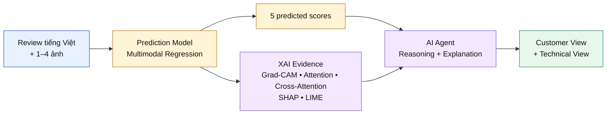

---

## Slide 3 — Multimodal Architecture tạo năm score như thế nào?

### Thông điệp chính

PhoBERT và Swin-B giữ lại cấu trúc token và patch, sau đó Bidirectional Cross-Attention kết nối hai modality trước khi Shared Head dự đoán năm score.

### Nội dung trên slide

- PhoBERT mã hóa review thành token features.
- Swin-B mã hóa ảnh thành patch features.
- Bidirectional Cross-Attention cho phép text và image trao đổi context.
- Hai hướng được pooling, fusion và đưa qua Shared Head.
- Một forward pass tạo đồng thời năm Regression outputs.

### Sơ đồ

Cần Mermaid. Giữ sơ đồ đơn giản, không đưa tensor shape lên slide.

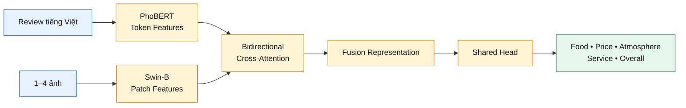

---

## Slide 4 — Vì sao cần nhiều phương pháp XAI?

### Thông điệp chính

Không có một phương pháp XAI duy nhất trả lời được mọi câu hỏi; mỗi phương pháp quan sát một tầng và một loại evidence khác nhau.

### Nội dung trên slide

| Câu hỏi của giảng viên                                     | Phương pháp phù hợp    |
| ---------------------------------------------------------- | ---------------------- |
| Mô hình nhìn vào đâu trong ảnh?                            | Grad-CAM               |
| Khi đọc review, mô hình chú ý token nào?                   | PhoBERT Self-Attention |
| Token nào liên kết với patch nào?                          | Cross-Attention        |
| Text-origin hay image-origin đóng góp nhiều hơn?           | SHAP                   |
| Prediction thay đổi thế nào khi local evidence bị perturb? | LIME                   |

- Agreement tạo converging evidence.
- Disagreement là tín hiệu cần điều tra, không phải lỗi phải che giấu.

---

## Slide 5 — Grad-CAM: Mô hình nhìn vào đâu trong ảnh?

### Thông điệp chính

Grad-CAM tạo target-specific heatmap để chỉ ra image region liên quan đến một score được chọn.

### Nội dung trên slide

- Chọn một target: Food, Price, Atmosphere, Service hoặc Overall.
- Truy gradient từ target về spatial feature map cuối của Swin-B.
- Tạo heatmap riêng cho từng ảnh thật trong review.
- Giữ nguyên text và toàn bộ multimodal context.
- Artifact chính: overlay và five-target comparison.

### Sơ đồ

Cần Mermaid.

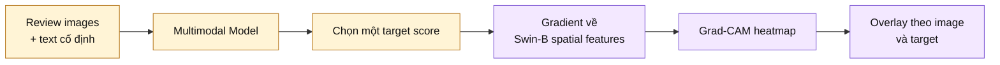

---

## Slide 6 — PhoBERT Self-Attention: Khi đọc review, mô hình chú ý từ nào?

### Thông điệp chính

Self-Attention cho thấy information flow bên trong PhoBERT và giúp nhận diện các token được encoder nhấn mạnh.

### Nội dung trên slide

- Trích xuất Self-Attention từ 12 layers × 12 heads.
- Tổng hợp layer cuối và bốn layer cuối.
- Dùng first-token attention để xếp hạng content tokens.
- Loại padding/special tokens và merge subword.
- Artifact chính: word-importance bar và attention heatmap.

### Sơ đồ

Cần Mermaid.

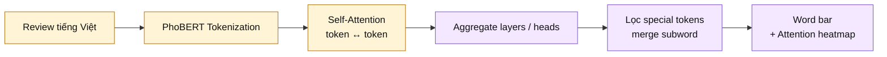

---

## Slide 7 — Cross-Attention I: Khi mô hình đọc token này, nó nhìn đâu trong ảnh?

### Thông điệp chính

Hướng Text → Image trả lời một câu hỏi trực quan: với một token trong review, patch nào trên ảnh nhận attention mạnh nhất?

### Nội dung trên slide

- Token đóng vai trò Query.
- Image patches đóng vai trò Key và Value.
- Mỗi token tạo một phân bố attention trên patch grid.
- Top-K lưu token, patch coordinate và attention score.
- Artifact chính: token-to-patch overlay và Top-K heatmap.

### Sơ đồ

Cần Mermaid.

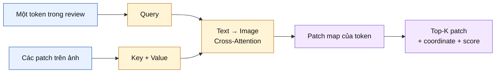

---

## Slide 8 — Cross-Attention II: Khi mô hình nhìn vùng ảnh này, từ nào hỗ trợ nó?

### Thông điệp chính

Hướng Image → Text đảo chiều câu hỏi: một image patch đang tìm context từ những token nào trong review?

### Nội dung trên slide

- Image patch đóng vai trò Query.
- Text tokens đóng vai trò Key và Value.
- Mỗi patch tạo một phân bố attention trên các token thật.
- Hai hướng Cross-Attention là hai module độc lập, không phải phép transpose.
- Đọc hai hướng cùng nhau để kiểm tra cross-modal alignment.

### Sơ đồ

Cần Mermaid.

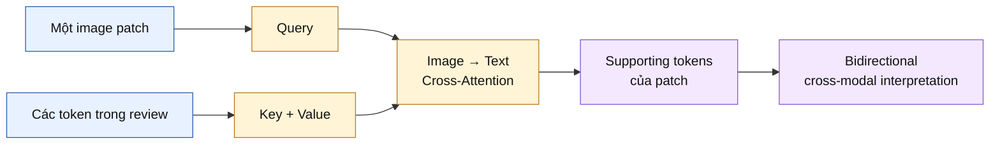

---

## Slide 9 — SHAP: Text-origin hay Image-origin đóng góp nhiều hơn?

### Thông điệp chính

SHAP đo Attribution của hai origin channels trong fused embedding đối với từng target score.

### Nội dung trên slide

- Giải thích riêng từng target trong năm outputs.
- Dùng SHAP DeepExplainer trên fused embedding.
- Nhóm attribution thành text-origin và image-origin.
- Absolute SHAP biểu diễn contribution magnitude.
- Signed SHAP biểu diễn direction so với Background.
- Có additivity check để kiểm tra consistency.

### Sơ đồ

Cần Mermaid.

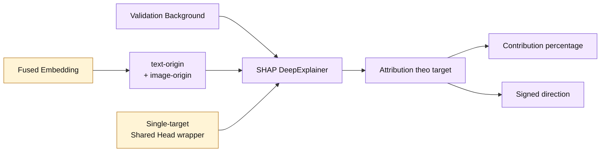

---

## Slide 10 — LIME: Điều gì xảy ra khi local evidence thay đổi?

### Thông điệp chính

LIME perturb một modality, giữ modality còn lại cố định và đo local sensitivity của một target score.

### Nội dung trên slide

- **LIME Text:** bỏ từng đơn vị từ; images giữ nguyên.
- **LIME Image:** che superpixels của ảnh đầu tiên; text và các image slot khác giữ nguyên.
- Mỗi lần chỉ giải thích một target.
- Kết quả: positive/negative word weights và superpixel weights.
- Đây là Local explanation, không phải global model behavior.

### Sơ đồ

Cần Mermaid.

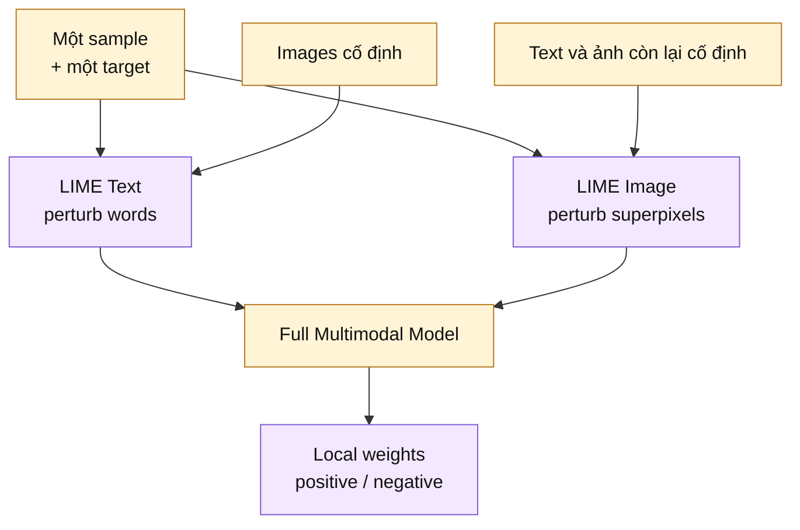

---

## Slide 11 — End-to-End Case Study: Từ một review đến lời giải thích hoàn chỉnh

### Thông điệp chính

Một Case Study mạnh phải kết nối prediction, năm loại XAI evidence và AI Agent thành một câu chuyện duy nhất có thể truy vết.

### Nội dung trên slide

- Dùng **một review thật** và cùng một target xuyên suốt mọi panel.
- Đọc evidence theo năm câu hỏi: **ở đâu → token nào → liên kết nào → origin nào → thay đổi gì**.
- AI Agent tổng hợp support, conflict, missing evidence, limitation và Confidence thành final explanation.

### Sơ đồ

Cần Mermaid.

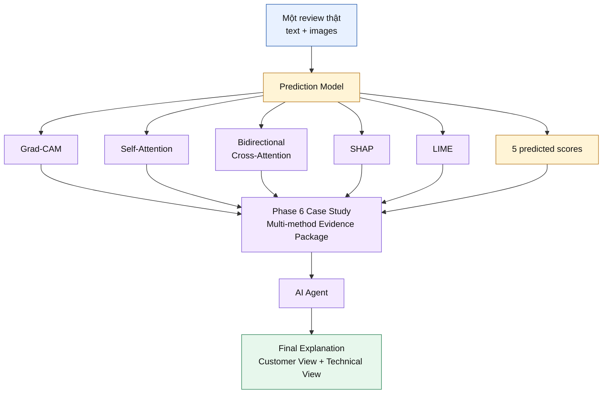

---

## Slide 12 — AI Agent: GPT-4o chỉ diễn đạt evidence, không tạo prediction

### Thông điệp chính

GPT-4o là lớp verbalization sau Prediction và XAI; nó không có quyền dự đoán, sửa score hoặc tạo evidence mới.

### Nội dung trên slide

- **GPT-4o không thực hiện Prediction.**
- **GPT-4o không thay đổi năm model outputs.**
- **GPT-4o không được phép tạo evidence ngoài input.**
- Deterministic components load, compress và structure evidence trước.
- Reasoning Graph xác định support, conflict, missing evidence và strength theo target.
- GPT-4o chỉ chuyển structured evidence thành human-readable explanation.

### Sơ đồ

Cần Mermaid.

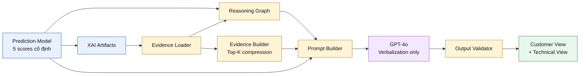

---

## Slide 13 — Hallucination Control và hai lớp báo cáo

### Thông điệp chính

Hệ thống dùng nhiều lớp grounding và validation để giảm Hallucination, đồng thời trình bày cùng một evidence theo hai mức độ kỹ thuật khác nhau.

### Nội dung trên slide

- Chỉ load file thực sự tồn tại; method thiếu được ghi rõ.
- Prompt cấm unsupported claim, causal wording và recommendation không có evidence.
- Structured JSON bắt buộc đủ năm target.
- Output Validator kiểm tra schema, score level, agreement matrix và SHAP grounding.
- Warning không bị ẩn; human review vẫn bắt buộc.
- Customer View đơn giản; Technical View giữ đầy đủ provenance và limitation.

### Sơ đồ

Cần Mermaid.

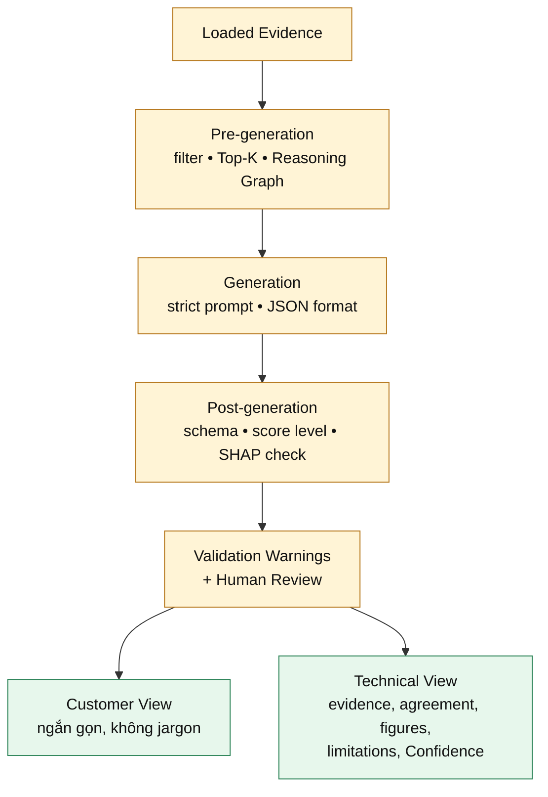

---

## Slide 14 — Research Contributions và thông điệp bảo vệ

### Thông điệp chính

Đóng góp của đề tài không phải một hình XAI đơn lẻ, mà là một hệ thống giải thích đa tầng, có structured reasoning và có thể truy vết từ report về evidence.

### Nội dung trên slide

- **Architecture-aligned XAI:** mỗi phương pháp gắn đúng image, text hoặc fusion layer.
- **Bidirectional Cross-Attention Visualization:** giải thích Token → Patch và Patch → Token.
- **Complementary Multi-method Explanation:** kết hợp spatial, lexical, cross-modal, Attribution và Perturbation evidence.
- **End-to-End Case Study:** liên kết input, prediction, artifacts và final explanation trên cùng sample.
- **Evidence-grounded AI Agent:** Reasoning Graph được xây dựng trước GPT-4o.
- **Dual-audience Reporting:** Customer View và Technical View cùng validation warnings.
