# Đề xuất nội dung trình bày XAI + AI Agent

## Định hướng chung

- **Đối tượng:** giảng viên, hội đồng phản biện và người nghe có nền tảng kỹ thuật.
- **Số lượng:** 14 slide.
- **Mạch kể chuyện:** bài toán tổng thể → Multimodal Architecture → các câu hỏi XAI → End-to-End Case Study → AI Agent → Research Contributions.
- **Cấu hình tham chiếu:** PhoBERT (`vinai/phobert-base-v2`) + Swin-B (`swin_base_patch4_window7_224`) + Bidirectional Token–Patch Cross-Attention + Shared Head dự đoán năm điểm Regression.
- **Nguyên tắc thuật ngữ:** giữ nguyên các thuật ngữ chuyên môn bằng English; đặc biệt dùng **text-origin** và **image-origin**, không dùng “pure text” hoặc “pure image”.
- **Nguyên tắc diễn giải:** XAI cung cấp evidence về hành vi mô hình; không phương pháp nào trong hệ thống chứng minh causality.
- **Nguyên tắc hình ảnh:** chỉ sử dụng Mermaid diagram và artifact thật do hệ thống tạo ra. Không dùng hình trang trí hoặc minh họa không liên quan.
- **Nguyên tắc Case Study:** ưu tiên dùng cùng một sample đại diện xuyên suốt các slide XAI để người nghe không phải liên tục đổi ngữ cảnh.

---

## Slide 1 — Từ năm điểm dự đoán đến lời giải thích có evidence

### Thông điệp chính

Hệ thống không chỉ dự đoán chất lượng trải nghiệm nhà hàng mà còn cho phép kiểm tra evidence ở nhiều tầng và chuyển evidence đó thành lời giải thích dễ hiểu.

### Nội dung trên slide

- **Input:** một review tiếng Việt + 1–4 ảnh review.
- **Output:** Food, Price, Atmosphere, Service và Overall Satisfaction trên thang 1–10.
- **XAI:** giải thích image region, token, token–patch interaction, fused attribution và local sensitivity.
- **AI Agent:** tổng hợp evidence thành Customer View và Technical View.

### Sơ đồ

Không cần Mermaid. Dùng title slide tối giản với tiêu đề phụ:

> Explainable Multimodal Deep Learning cho đánh giá chất lượng review nhà hàng tiếng Việt

### Ghi chú thuyết trình

Mở đầu bằng khoảng cách giữa “mô hình cho ra năm con số” và “con người hiểu được mô hình đang sử dụng evidence nào”. Bài trình bày tập trung vào XAI Phase 1–6 và AI Agent đã triển khai. Phase 7 và Phase 8 là phần phát triển tiếp theo trong quá trình hoàn thiện luận văn.

### Kết luận trọng tâm

Đóng góp của hệ thống nằm ở cả Prediction, Explainability và Evidence-grounded Communication.

---

## Slide 2 — Bức tranh toàn hệ thống: Prediction → XAI → Explanation

### Thông điệp chính

Toàn bộ hệ thống gồm ba tầng có vai trò tách biệt: Prediction Model tạo điểm số, XAI tạo evidence, AI Agent diễn đạt evidence cho con người.

### Nội dung trên slide

- **Tầng 1 — Prediction:** xử lý text và image để dự đoán năm score.
- **Tầng 2 — XAI:** quan sát mô hình ở image branch, text branch và fusion layer.
- **Tầng 3 — AI Agent:** tổ chức, kiểm tra và diễn đạt evidence.
- AI Agent không nằm trong đường suy luận tạo prediction.

### Sơ đồ

Cần Mermaid.

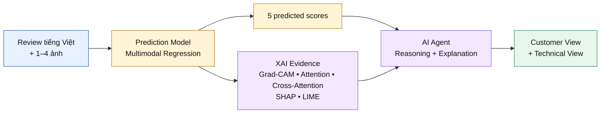

### Ghi chú thuyết trình

Slide này là “bản đồ” cho toàn bộ bài nói. Nhấn mạnh rằng ba tầng không thay thế lẫn nhau: XAI không tạo score mới; AI Agent không sửa prediction; report cuối cùng phải truy ngược được về artifact thật. Từ slide tiếp theo, bài trình bày sẽ lần lượt zoom vào Prediction Model, từng phương pháp XAI, rồi quay lại luồng End-to-End.

### Kết luận trọng tâm

Prediction tạo kết quả; XAI tạo evidence; AI Agent tạo cách diễn đạt.

---

## Slide 3 — Multimodal Architecture tạo năm score như thế nào?

### Thông điệp chính

PhoBERT và Swin-B giữ lại cấu trúc token và patch, sau đó Bidirectional Cross-Attention kết nối hai modality trước khi Shared Head dự đoán năm score.

### Nội dung trên slide

- PhoBERT mã hóa review thành token features.
- Swin-B mã hóa ảnh thành patch features.
- Bidirectional Cross-Attention cho phép text và image trao đổi context.
- Hai hướng được pooling, fusion và đưa qua Shared Head.
- Một forward pass tạo đồng thời năm Regression outputs.

### Sơ đồ

Cần Mermaid. Giữ sơ đồ đơn giản, không đưa tensor shape lên slide.

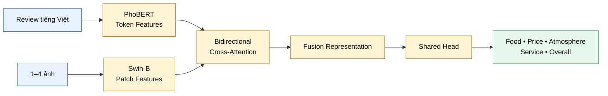

### Ghi chú thuyết trình

Thông tin kỹ thuật chỉ nói bằng lời khi cần: PhoBERT tạo `[B,T,768]`, Swin-B tạo `[B,P,1024]`; hai nhánh được Projection về 512; hệ thống dùng hai `MultiheadAttention` độc lập với 8 heads; output mỗi hướng được masked-mean pooling rồi concatenate thành fused embedding 1.024 chiều. Với nhiều ảnh, patch ở cùng vị trí được average trên các ảnh thật; padded image bị loại bằng `num_images`. “Sequential” trong tên experiment mô tả quy trình lựa chọn cấu hình, không phải một fusion block bổ sung trong runtime Architecture.

### Kết luận trọng tâm

XAI phải bám đúng ba vùng của Architecture: image, text và cross-modal fusion.

---

## Slide 4 — Vì sao cần nhiều phương pháp XAI?

### Thông điệp chính

Không có một phương pháp XAI duy nhất trả lời được mọi câu hỏi; mỗi phương pháp quan sát một tầng và một loại evidence khác nhau.

### Nội dung trên slide

| Câu hỏi của giảng viên | Phương pháp phù hợp |
|---|---|
| Mô hình nhìn vào đâu trong ảnh? | Grad-CAM |
| Khi đọc review, mô hình chú ý token nào? | PhoBERT Self-Attention |
| Token nào liên kết với patch nào? | Cross-Attention |
| Text-origin hay image-origin đóng góp nhiều hơn? | SHAP |
| Prediction thay đổi thế nào khi local evidence bị perturb? | LIME |

- Agreement tạo converging evidence.
- Disagreement là tín hiệu cần điều tra, không phải lỗi phải che giấu.

### Sơ đồ

Không cần Mermaid. Dùng bảng so sánh trên làm visual chính.

### Ghi chú thuyết trình

Trả lời trực tiếp câu hỏi “Tại sao không chỉ dùng Grad-CAM?”: Grad-CAM chỉ localize image region; nó không giải thích token, token–patch interaction, fused attribution hoặc local text sensitivity. Tương tự, SHAP không localize pixel và Self-Attention không cho target-specific perturbation effect. Multi-method không có nghĩa là “nhiều hình hơn”, mà là “nhiều câu hỏi khác nhau được trả lời đúng công cụ”.

### Kết luận trọng tâm

Các phương pháp bổ sung cho nhau vì chúng giải thích những câu hỏi khác nhau.

---

## Slide 5 — Grad-CAM: Mô hình nhìn vào đâu trong ảnh?

### Thông điệp chính

Grad-CAM tạo target-specific heatmap để chỉ ra image region liên quan đến một score được chọn.

### Nội dung trên slide

- Chọn một target: Food, Price, Atmosphere, Service hoặc Overall.
- Truy gradient từ target về spatial feature map cuối của Swin-B.
- Tạo heatmap riêng cho từng ảnh thật trong review.
- Giữ nguyên text và toàn bộ multimodal context.
- Artifact chính: overlay và five-target comparison.

### Sơ đồ

Cần Mermaid.

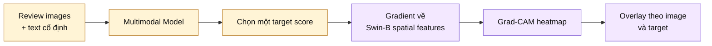

### Ghi chú thuyết trình

Dùng artifact thật `gradcam_img0_food.png` hoặc `gradcam_5target_comparison.png`. Trong code, target layer ưu tiên là `image_model.encoder.norm` và được kiểm tra có spatial output trước khi sử dụng. Forward hook lấy activation, backward hook lấy gradient; channel weight được tính bằng global-average gradient, sau đó áp dụng weighted sum + ReLU + normalization. Nếu heatmap giữa các target giống nhau, có thể do Shared Head hoặc gradient similarity; implementation có diagnostic cho hiện tượng này.

Không nói “vùng đỏ gây ra score”. Cách diễn đạt đúng là “vùng có target-linked spatial evidence mạnh hơn”.

### Kết luận trọng tâm

Grad-CAM trả lời tốt câu hỏi “ở đâu”, nhưng không chứng minh causality.

---

## Slide 6 — PhoBERT Self-Attention: Khi đọc review, mô hình chú ý từ nào?

### Thông điệp chính

Self-Attention cho thấy information flow bên trong PhoBERT và giúp nhận diện các token được encoder nhấn mạnh.

### Nội dung trên slide

- Trích xuất Self-Attention từ 12 layers × 12 heads.
- Tổng hợp layer cuối và bốn layer cuối.
- Dùng first-token attention để xếp hạng content tokens.
- Loại padding/special tokens và merge subword.
- Artifact chính: word-importance bar và attention heatmap.

### Sơ đồ

Cần Mermaid.

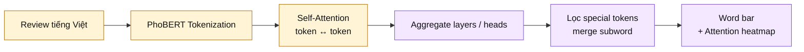

### Ghi chú thuyết trình

Dùng `cls_importance_word_bar.png` làm artifact chính và `attention_layer11_mean_heatmap.png` làm artifact phụ. Hệ thống chuyển attention backend sang eager để lấy weight nhưng không thay đổi model weight.

Điểm cần bảo vệ trước hội đồng: Self-Attention được tính trước Shared Head nên là evidence dùng chung cho năm target, không phải target-specific explanation. High attention thể hiện internal focus hoặc interaction; nó không chứng minh rằng xóa token sẽ làm score thay đổi. LIME Text sẽ kiểm tra góc nhìn perturbation đó.

### Kết luận trọng tâm

Attention cho biết mô hình “đang chú ý”, không tự động đồng nghĩa với “đang dựa vào để quyết định”.

---

## Slide 7 — Cross-Attention I: Khi mô hình đọc token này, nó nhìn đâu trong ảnh?

### Thông điệp chính

Hướng Text → Image trả lời một câu hỏi trực quan: với một token trong review, patch nào trên ảnh nhận attention mạnh nhất?

### Nội dung trên slide

- Token đóng vai trò Query.
- Image patches đóng vai trò Key và Value.
- Mỗi token tạo một phân bố attention trên patch grid.
- Top-K lưu token, patch coordinate và attention score.
- Artifact chính: token-to-patch overlay và Top-K heatmap.

### Sơ đồ

Cần Mermaid.

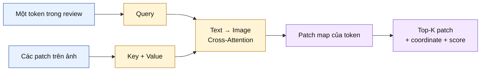

### Ghi chú thuyết trình

Đặt câu hỏi trước, giải thích kỹ thuật sau: “Khi đọc token này, mô hình liên kết nó với vùng nào trên ảnh?”. Dùng `top_tokens_patch_overlay_grid.png` hoặc `topk_token_patch_heatmap.png`, và thay “token này” bằng token thật của Case Study.

Trong implementation, token và patch được Projection về 512 chiều; `cross_attn_t2i` dùng 8 heads và lưu weight đã average qua heads thành ma trận \(T×P\). Padding patch được mask. Khi diễn giải, chỉ gọi tên đối tượng trong patch nếu overlay thật sự cho thấy đối tượng đó. Cross-Attention thể hiện learned association, không phải causality và không phải target-specific evidence.

### Kết luận trọng tâm

Text → Image Cross-Attention nối một từ cụ thể với những vùng ảnh mà nó quan sát.

---

## Slide 8 — Cross-Attention II: Khi mô hình nhìn vùng ảnh này, từ nào hỗ trợ nó?

### Thông điệp chính

Hướng Image → Text đảo chiều câu hỏi: một image patch đang tìm context từ những token nào trong review?

### Nội dung trên slide

- Image patch đóng vai trò Query.
- Text tokens đóng vai trò Key và Value.
- Mỗi patch tạo một phân bố attention trên các token thật.
- Hai hướng Cross-Attention là hai module độc lập, không phải phép transpose.
- Đọc hai hướng cùng nhau để kiểm tra cross-modal alignment.

### Sơ đồ

Cần Mermaid.

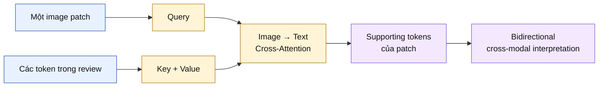

### Ghi chú thuyết trình

Giải thích sự bất đối xứng bằng ngôn ngữ tự nhiên:

- Text → Image: “Token này nhìn vùng nào?”
- Image → Text: “Vùng này tìm context ở từ nào?”

Implementation trả về ma trận \(P×T\) sau khi average qua heads và loại padding token. `cross_attn_t2i` và `cross_attn_i2t` có parameter riêng nên hai ma trận không phải transpose.

Lưu ý kỹ thuật khi bị hỏi sâu: artifact `patch_importance.png` hiện cộng attention theo từng row Image → Text; do mỗi row đã normalized, aggregate này có thể ít phân biệt. Vì vậy, ưu tiên Top-K Token → Patch và patch-to-token panels khi chọn ví dụ thuyết trình.

### Kết luận trọng tâm

Bidirectional Cross-Attention cho thấy hai modality trao đổi context theo hai câu hỏi khác nhau.

---

## Slide 9 — SHAP: Text-origin hay Image-origin đóng góp nhiều hơn?

### Thông điệp chính

SHAP đo Attribution của hai origin channels trong fused embedding đối với từng target score.

### Nội dung trên slide

- Giải thích riêng từng target trong năm outputs.
- Dùng SHAP DeepExplainer trên fused embedding.
- Nhóm attribution thành text-origin và image-origin.
- Absolute SHAP biểu diễn contribution magnitude.
- Signed SHAP biểu diễn direction so với Background.
- Có additivity check để kiểm tra consistency.

### Sơ đồ

Cần Mermaid.

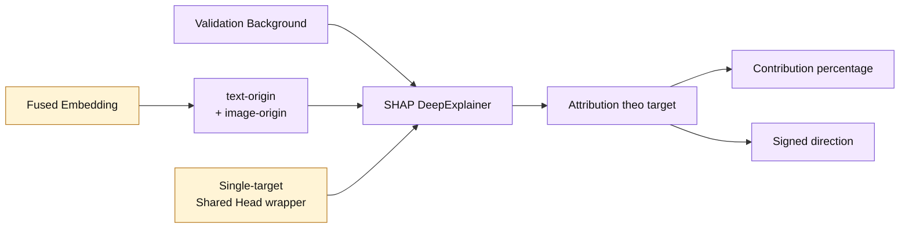

### Ghi chú thuyết trình

Dùng `shap_modality_contribution.png`. Fused embedding có 1.024 chiều: 512 chiều đầu là text-origin từ text queries đã attend sang image; 512 chiều sau là image-origin từ image queries đã attend sang text. Vì vậy, hai nhóm đều đã chứa cross-modal information. Không gọi chúng là “pure text” hoặc “pure image”.

Notebook chọn 100 validation fused embeddings làm Background theo seed cố định. `FusionHeadWrapper` giải thích một scalar output mỗi lần. Additivity check so sánh prediction với base value + tổng SHAP values.

### Kết luận trọng tâm

SHAP trả lời “origin channel nào đóng góp nhiều hơn cho target này”, không trả lời “pixel hay từ cụ thể nào quan trọng”.

---

## Slide 10 — LIME: Điều gì xảy ra khi local evidence thay đổi?

### Thông điệp chính

LIME perturb một modality, giữ modality còn lại cố định và đo local sensitivity của một target score.

### Nội dung trên slide

- **LIME Text:** bỏ từng đơn vị từ; images giữ nguyên.
- **LIME Image:** che superpixels của ảnh đầu tiên; text và các image slot khác giữ nguyên.
- Mỗi lần chỉ giải thích một target.
- Kết quả: positive/negative word weights và superpixel weights.
- Đây là Local explanation, không phải global model behavior.

### Sơ đồ

Cần Mermaid.

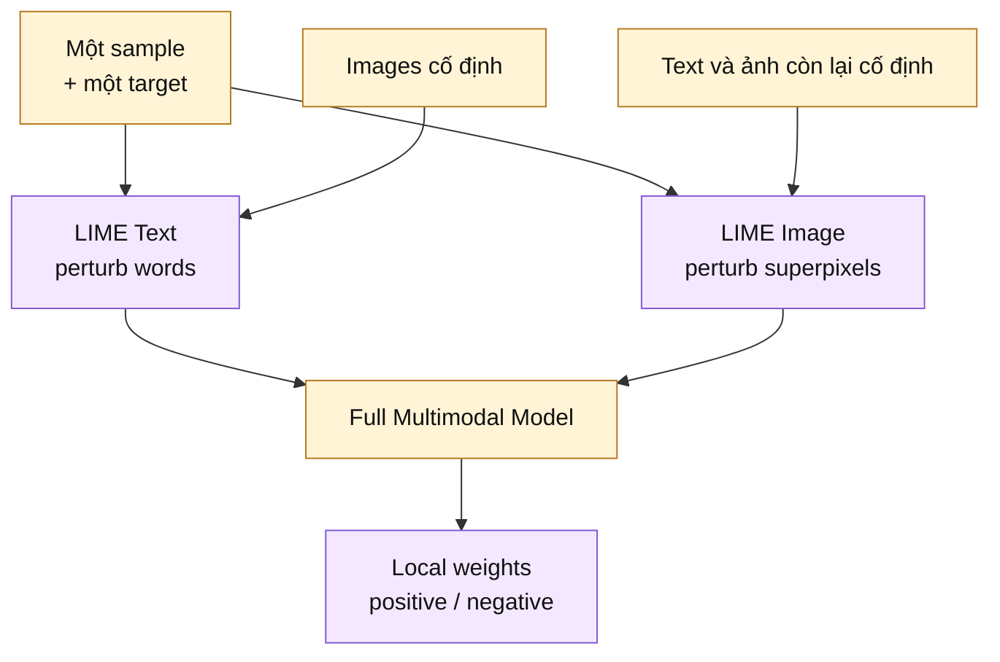

### Ghi chú thuyết trình

Dùng cùng một target để đặt cạnh `*_lime_text_*_bar.png` và `*_lime_image_*_positive.png`. Mặc định implementation dùng 500 Text Perturbations và 1.000 Image Perturbations; XAI Orchestrator dùng 300 và 500 khi tạo artifact on-demand. Vì LIME library yêu cầu classifier-style output, target Regression score được chuyển qua sigmoid thành `[low, high]`.

LIME có thể thay đổi theo seed, segmentation và số Perturbations. Vì vậy, dùng nó như local perturbation check bổ sung cho Attention hoặc Grad-CAM, không xem nó là ground truth.

### Kết luận trọng tâm

LIME kiểm tra prediction có nhạy với local words hoặc superpixels hay không.

---

## Slide 11 — End-to-End Case Study: Từ một review đến lời giải thích hoàn chỉnh

### Thông điệp chính

Một Case Study mạnh phải kết nối prediction, năm loại XAI evidence và AI Agent thành một câu chuyện duy nhất có thể truy vết.

### Nội dung trên slide

- Dùng **một review thật** và cùng một target xuyên suốt mọi panel.
- Đọc evidence theo năm câu hỏi: **ở đâu → token nào → liên kết nào → origin nào → thay đổi gì**.
- AI Agent tổng hợp support, conflict, missing evidence, limitation và Confidence thành final explanation.

### Sơ đồ

Cần Mermaid.

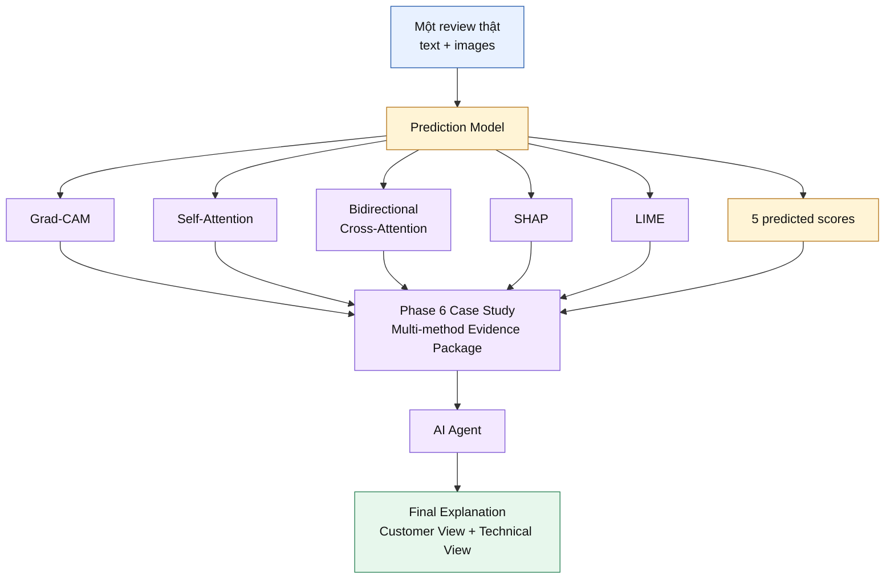

### Ghi chú thuyết trình

Đây nên là slide trung tâm của bài trình bày. Dùng một sample đã được Phase 6 chọn và hiển thị theo ba vùng:

1. **Input + Prediction:** review, ảnh và năm score.
2. **Evidence Mosaic:** trích đúng artifact từ `combined_figure_target{idx}_{factor}.png` và `combined_cross_attention_figure.png`.
3. **Final Explanation:** một câu Customer View và một đoạn Technical View ngắn.

Không tạo score, token, patch coordinate hoặc phần trăm SHAP giả. Slide-generation AI phải lấy số liệu và label trực tiếp từ artifact/metadata của Case Study được chọn. Phase 6 hỗ trợ bảy loại case: conflict, high_error, text_dominant, image_dominant, difficult, agreement và correct.

Các phương pháp XAI không chạy tuần tự phụ thuộc nhau; chúng tạo các evidence views song song, sau đó Phase 6 và AI Agent mới tổng hợp.

### Kết luận trọng tâm

Giá trị thực sự xuất hiện khi nhiều evidence views cùng giải thích một prediction cụ thể.

---

## Slide 12 — AI Agent: GPT-4o chỉ diễn đạt evidence, không tạo prediction

### Thông điệp chính

GPT-4o là lớp verbalization sau Prediction và XAI; nó không có quyền dự đoán, sửa score hoặc tạo evidence mới.

### Nội dung trên slide

- **GPT-4o không thực hiện Prediction.**
- **GPT-4o không thay đổi năm model outputs.**
- **GPT-4o không được phép tạo evidence ngoài input.**
- Deterministic components load, compress và structure evidence trước.
- Reasoning Graph xác định support, conflict, missing evidence và strength theo target.
- GPT-4o chỉ chuyển structured evidence thành human-readable explanation.

### Sơ đồ

Cần Mermaid.

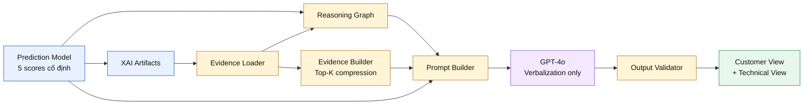

### Ghi chú thuyết trình

Thứ tự runtime chính xác trong `ExplanationAgent.explain_sample()` là:

1. `EvidenceLoader` đọc artifact thật và ghi nhận method bị thiếu.
2. `build_reasoning_graph()` tạo reasoning theo năm target.
3. `EvidenceBuilder` nén evidence thành Top-K.
4. `PromptBuilder` kết hợp prediction, evidence và Reasoning Graph.
5. `OpenAIClient` gọi model mặc định `gpt-4o` với JSON response format.
6. Hệ thống sanitize null, ghi đè evidence completeness bằng file existence, rồi inject artifact paths, Reasoning Graph và agreement matrix.
7. `OutputValidator` tạo warnings; `ReportGenerator` xuất JSON/Markdown.

Các câu “không dự đoán, không sửa score, không tạo evidence” là role contract được enforcement bằng data flow và prompt. Chúng không nên được trình bày như một bảo đảm toán học rằng LLM không bao giờ có lỗi.

Runtime hiện tại gửi compressed text evidence đến GPT-4o; image pixels không được gửi vào API. PNG paths được gắn vào output/report để người đọc kiểm tra.

### Kết luận trọng tâm

Reasoning được structure trước; GPT-4o chỉ chịu trách nhiệm diễn đạt sau cùng.

---

## Slide 13 — Hallucination Control và hai lớp báo cáo

### Thông điệp chính

Hệ thống dùng nhiều lớp grounding và validation để giảm Hallucination, đồng thời trình bày cùng một evidence theo hai mức độ kỹ thuật khác nhau.

### Nội dung trên slide

- Chỉ load file thực sự tồn tại; method thiếu được ghi rõ.
- Prompt cấm unsupported claim, causal wording và recommendation không có evidence.
- Structured JSON bắt buộc đủ năm target.
- Output Validator kiểm tra schema, score level, agreement matrix và SHAP grounding.
- Warning không bị ẩn; human review vẫn bắt buộc.
- Customer View đơn giản; Technical View giữ đầy đủ provenance và limitation.

### Sơ đồ

Cần Mermaid.

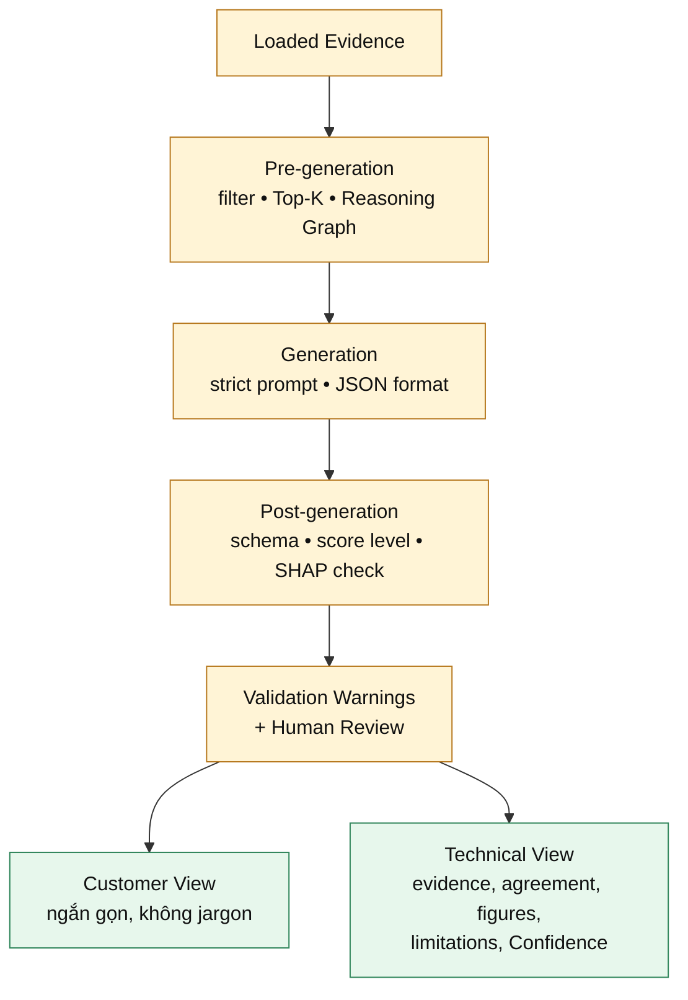

### Ghi chú thuyết trình

Phân biệt rõ “Hallucination Control” và “Hallucination Elimination”. Validator hiện trả warnings thay vì chặn hoặc tự động regenerate. Numerical grounding check hiện đối chiếu overall SHAP text-origin percentage với artifact trong tolerance; nó chưa xác minh mọi câu free-text. Schema correctness cũng không đồng nghĩa với semantic faithfulness.

Customer View gồm summary, highlights và recommendations bằng ngôn ngữ đơn giản. Technical View gồm review, prediction, optional ground truth, năm score explanations, evidence completeness, SHAP, Cross-Attention, method agreement, agreement matrix, visual artifact paths, limitations, recommendations, Confidence và validation warnings.

Lưu ý implementation hiện tại nếu hội đồng hỏi sâu: LIME text artifact ghi dữ liệu dưới key `word_weights`, trong khi Evidence Builder/Reasoning Graph hiện tìm `weights` hoặc `features`. File availability vẫn được nhận diện, nhưng LIME word content có thể chưa được nén đúng cho Agent cho đến khi adapter key được đồng bộ.

### Kết luận trọng tâm

Agent được thiết kế để có thể audit; validation làm giảm rủi ro nhưng không thay thế human review.

---

## Slide 14 — Research Contributions và thông điệp bảo vệ

### Thông điệp chính

Đóng góp của đề tài không phải một hình XAI đơn lẻ, mà là một hệ thống giải thích đa tầng, có structured reasoning và có thể truy vết từ report về evidence.

### Nội dung trên slide

- **Architecture-aligned XAI:** mỗi phương pháp gắn đúng image, text hoặc fusion layer.
- **Bidirectional Cross-Attention Visualization:** giải thích Token → Patch và Patch → Token.
- **Complementary Multi-method Explanation:** kết hợp spatial, lexical, cross-modal, Attribution và Perturbation evidence.
- **End-to-End Case Study:** liên kết input, prediction, artifacts và final explanation trên cùng sample.
- **Evidence-grounded AI Agent:** Reasoning Graph được xây dựng trước GPT-4o.
- **Dual-audience Reporting:** Customer View và Technical View cùng validation warnings.

### Sơ đồ

Không cần Mermaid. Dùng bố cục 2×3, mỗi ô là một Research Contribution ở trên. Không thêm hình minh họa trang trí.

### Ghi chú thuyết trình

Không gọi tất cả component là “thuật toán mới”. Cách trình bày phù hợp là “các đóng góp tích hợp và phương pháp luận của đề tài”:

- XAI được thiết kế theo Architecture thay vì chọn phương pháp rời rạc.
- Cross-Attention sau migration từ single-vector sang Token–Patch tạo ra một lớp cross-modal evidence thực sự có thể visualize.
- Case Study và Reasoning Graph biến artifact rời rạc thành quy trình phân tích nhất quán.
- AI Agent có role boundary rõ ràng và giữ lại limitation/warning.

Thông điệp kết thúc đề xuất:

> “Đề tài không tuyên bố XAI chứng minh nguyên nhân mô hình ra quyết định. Đề tài cung cấp architecture-aligned, target-aware và multi-method evidence; sau đó dùng Evidence-grounded AI Agent để diễn đạt cả kết quả lẫn giới hạn của evidence đó.”

Nếu bị hỏi về target specificity: Grad-CAM, SHAP và LIME là target-specific; PhoBERT Self-Attention và Cross-Attention là shared internal evidence trước Shared Head.

### Kết luận trọng tâm

Tuyên bố có thể bảo vệ là: hệ thống tăng khả năng inspect, compare và communicate multimodal model behavior—không tuyên bố complete transparency hay causal certainty.
