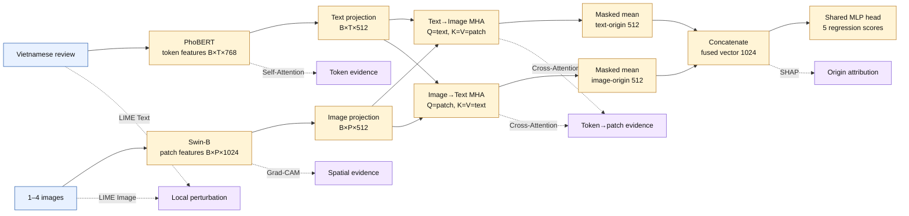
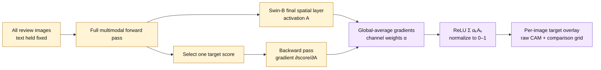
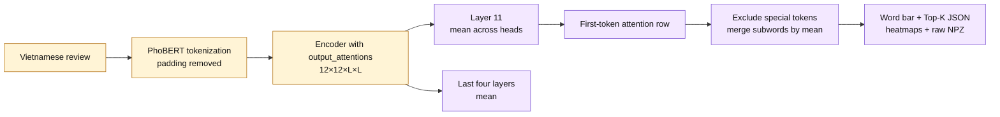
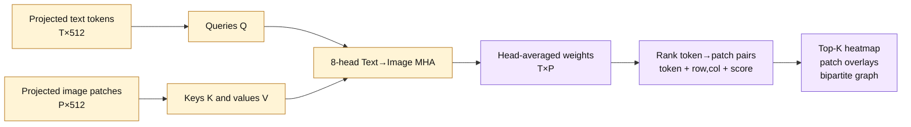
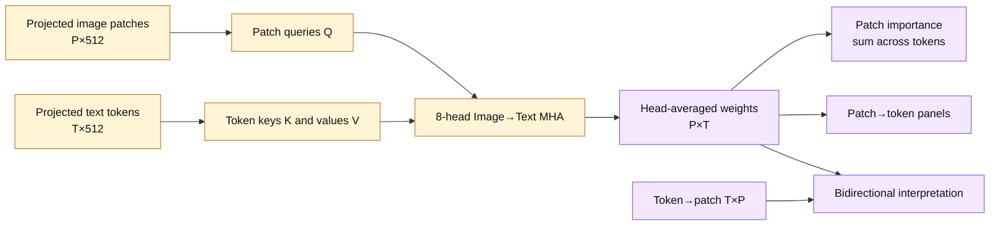
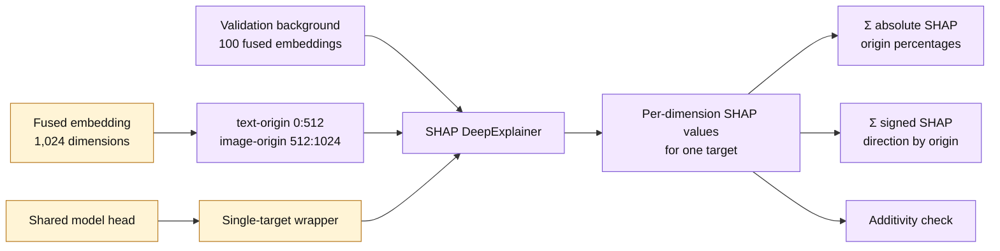
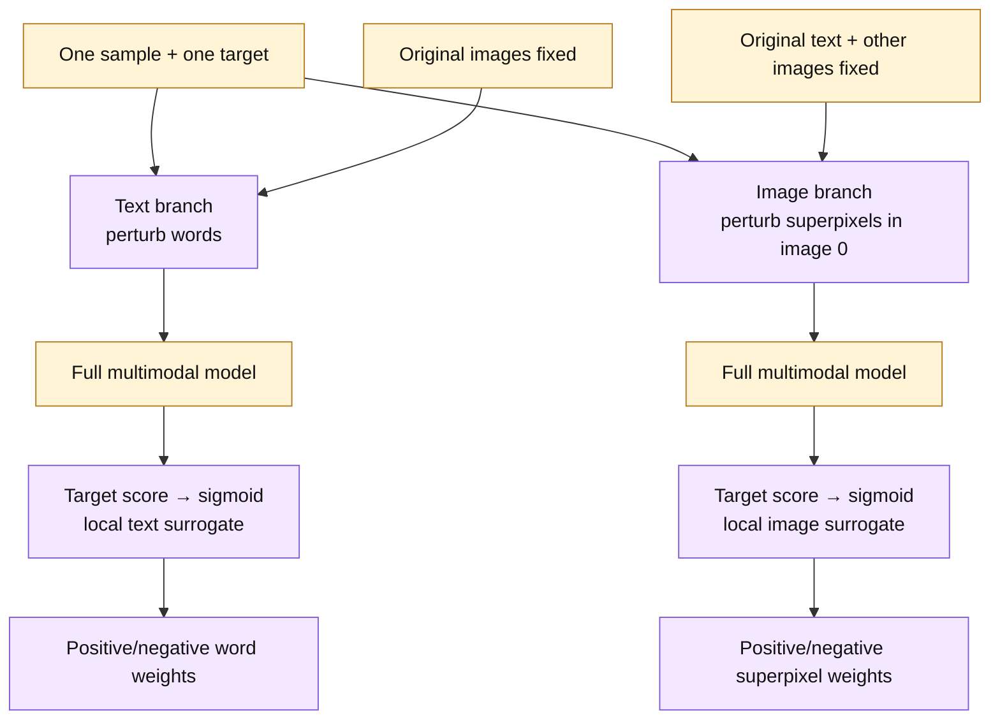
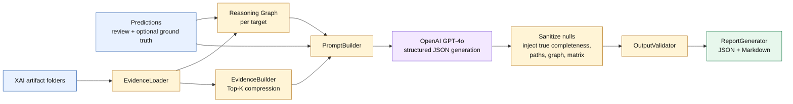
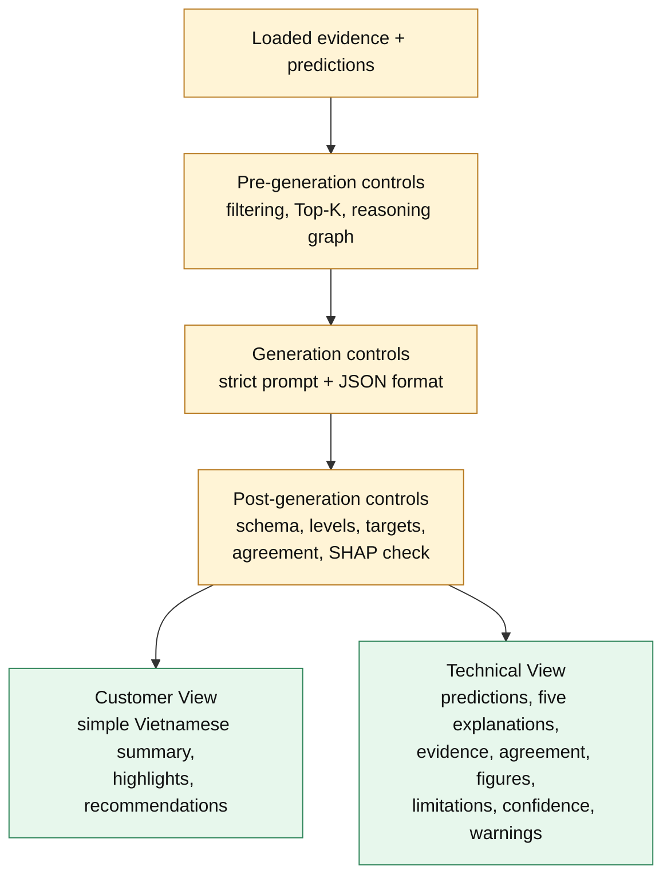

# XAI + AI Agent Presentation Proposal

## Deck-Wide Direction

- **Audience:** thesis lecturers, examiners, and technical reviewers.
- **Length:** 14 slides.
- **Core story:** prediction alone is insufficient; architecture-aligned XAI produces complementary evidence; the AI Agent structures and verbalizes that evidence for two audiences.
- **Reference implementation:** PhoBERT (`vinai/phobert-base-v2`) + Swin-B (`swin_base_patch4_window7_224`) + bidirectional token–patch `CrossAttentionFusion` + one shared MLP producing five regression scores.
- **Terminology:** use **text-origin** and **image-origin** for the two halves of the fused vector because both have already passed through cross-attention.
- **Claim discipline:** use “focus,” “association,” “attribution,” or “local sensitivity”; never state that an XAI artifact proves causality.
- **Visual policy:** use only the Mermaid diagrams below and actual XAI/report artifacts generated by the project. Do not add decorative or unrelated imagery.
- **Artifact policy:** when a slide calls for an artifact, use one representative Phase 6 case and keep the same sample across slides where possible.

---

## Slide 1 — From Prediction to Evidence-Grounded Explanation

### Main Message

The system predicts five restaurant-review quality scores and adds two interpretability layers: XAI evidence and an AI Agent that converts evidence into audience-specific reports.

### Key Points

- Input: one Vietnamese review + 1–4 review images.
- Output: Food, Price, Atmosphere, Service, and Overall Satisfaction.
- XAI inspects image regions, text focus, token–patch alignment, fused attribution, and local perturbation response.
- The AI Agent verbalizes existing evidence; it does not change the prediction.

### Diagram

Needed: No. Use a clean title slide with the subtitle:

> Explainable Multimodal Deep Learning for Vietnamese Restaurant Review Quality Assessment

### Speaker Notes

Open with the gap between a numeric prediction and an explanation that a lecturer or customer can inspect. The presentation covers the implemented XAI Phases 1–6 and the implemented AI Agent. Phases 7 and 8 remain future thesis-writing and visualization work.

### Takeaway

This project explains a multimodal prediction at several architectural levels, then communicates the evidence without replacing it.

---

## Slide 2 — Why XAI Is Necessary

### Main Message

A good score is not enough: a multimodal, multi-output model can be accurate for the wrong reason, rely on one modality, or use different evidence for different targets.

### Key Points

- Five outputs may respond to different evidence.
- Images may contain shortcuts, backgrounds, or irrelevant regions.
- Text attention can emphasize tokens without proving prediction importance.
- Fusion may over-rely on one origin channel.
- Agreement strengthens confidence; disagreement is diagnostic.
- XAI provides evidence about model behavior—not proof of causality.

### Diagram

Needed: No. Use a compact question strip:

`Where in the image?` → `Which tokens?` → `Which token–patch links?` → `Which origin dominates?` → `What changes under perturbation?`

### Speaker Notes

Frame XAI as model inspection rather than decoration. Grad-CAM and LIME Image can reveal spatial shortcuts; self-attention describes internal text information flow; cross-attention exposes learned cross-modal alignment; SHAP summarizes attribution in the fused space; LIME tests local sensitivity in human-readable input units. No single method answers all questions.

### Takeaway

The explanation must match both the architecture and the question being asked.

---

## Slide 3 — Where Each XAI Method Attaches

### Main Message

Each method is attached to a different, code-defined point in the reference `CrossAttentionFusion` model.

### Key Points

- PhoBERT returns token features; Swin-B returns patch features.
- Both are projected to 512 dimensions.
- Bidirectional cross-attention is masked, pooled, and concatenated into a 1,024-dimensional fused vector.
- One shared MLP produces all five regression scores.
- “Sequential” describes the experimental selection process, not an extra runtime fusion block.

### Diagram

Needed: Yes.

### Speaker Notes

For multiple images, `ImageModel.forward_features()` averages matching patch positions across real images and excludes padded image slots using `num_images`. With Swin-B at 224×224, the final grid is typically 7×7, so \(P=49\). The two cross-attended sequences are masked-mean pooled before concatenation.

### Takeaway

The XAI design is architecture-aligned: spatial, lexical, cross-modal, fused, and perturbation evidence come from distinct attachment points.

---

## Slide 4 — Grad-CAM: Which Image Regions Support a Target?

### Main Message

Grad-CAM traces one selected score back to the final spatial feature map of the image encoder.

### Key Points

- Default target layer: verified `image_model.encoder.norm` for Swin-B.
- Forward and backward hooks capture activations and target gradients.
- Computed separately for every real image and each of the five targets.
- Full multimodal context is preserved while one image’s map is extracted.
- Outputs: normalized CAMs, overlays, five-target comparison, raw NPZ, metadata.

### Diagram

Needed: Yes.

### Speaker Notes

Show an actual `gradcam_img0_food.png` or `gradcam_5target_comparison.png`. Explain that the heatmap is low-resolution target-linked spatial evidence. Similar maps across targets can result from the shared prediction head; the implementation includes gradient-similarity diagnostics. Do not describe red regions as causes.

### Takeaway

Grad-CAM localizes target-linked visual support, but it does not establish causal image importance.

---

## Slide 5 — PhoBERT Self-Attention: What Did the Text Encoder Focus On?

### Main Message

PhoBERT self-attention reveals token-to-token information flow inside the text branch, not target-specific causal importance.

### Key Points

- Extracts all 12 layers × 12 heads with eager attention enabled.
- Primary view: mean of layer 11; secondary view: mean of the last four layers.
- Uses the first-token row to rank content-token attention.
- Removes padding/special tokens and merges subwords into readable words.
- Outputs: heatmaps, subword/word bars, Top-K JSON, raw attention, sink ratio.

### Diagram

Needed: Yes.

### Speaker Notes

Use `cls_importance_word_bar.png` as the primary artifact and the layer-11 heatmap as supporting evidence. The encoder runs before the shared output head, so the self-attention matrix is shared across all five targets. High attention means strong internal interaction or focus—not that removing the token would change a particular score. LIME Text supplies that target-specific local sensitivity view.

### Takeaway

Self-attention is valuable internal-processing evidence, but attention alone is insufficient as an explanation.

---

## Slide 6 — Cross-Attention: Token → Patch Alignment

### Main Message

Text-to-image cross-attention shows which image patches each review token attends to inside the fusion module.

### Key Points

- Text queries attend to image patch keys/values.
- Eight-head `MultiheadAttention` produces head-averaged \(T×P\) weights for saved visualizations.
- Padding keys are masked; only real text tokens are retained.
- Top pairs retain token, patch index, grid coordinate, and attention value.
- Outputs: raw matrices, heatmap, Top-K pairs, overlay grid, bipartite graph.

### Diagram

Needed: Yes.

### Speaker Notes

Show `top_tokens_patch_overlay_grid.png` or `topk_token_patch_heatmap.png`. Give one concrete reading pattern: “token X has a strong learned link to Patch(r,c) with attention value y.” Do not assign a semantic object to the patch unless the actual overlay visibly supports it. These weights are learned alignment evidence and are not specific to one of the five output scores.

### Takeaway

Token→patch visualization exposes cross-modal alignment that text-only or image-only XAI cannot show.

---

## Slide 7 — Patch → Token and Bidirectional Interpretation

### Main Message

The reverse attention direction complements token→patch analysis by showing which text tokens each image patch attends to.

### Key Points

- Image patches query text-token keys/values.
- The saved matrix is \(P×T\), after head averaging and padding removal.
- Patch importance is aggregated over its attention to text tokens.
- Use both directions to inspect reciprocal alignment, not to claim semantic equivalence.
- Entropy summarizes whether a token’s patch attention is concentrated or diffuse.

### Diagram

Needed: Yes.

### Speaker Notes

Explain the asymmetry: token→patch asks where a token looks; patch→token asks which tokens a patch looks toward. The matrices are produced by two separate `MultiheadAttention` modules, so they are not transposes of each other. The Phase 3 and Phase 6 artifacts include patch overlays, patch→token views, Top-K heatmaps, and a bipartite graph. The implemented patch-importance overlay sums each image→text row; because attention rows are normalized, treat this aggregate cautiously and prefer token→patch Top-K pairs for discriminative examples.

### Takeaway

Bidirectional cross-attention reveals learned interaction structure, while remaining target-agnostic and non-causal.

---

## Slide 8 — SHAP: Attribution in the Fused Embedding

### Main Message

SHAP quantifies how the two origin halves of the fused representation contribute to each target score relative to a background set.

### Key Points

- A pre-hook captures the 1,024-dimensional input to `model.head`.
- `DeepExplainer` wraps one target output at a time.
- Background: 100 randomly selected validation fused embeddings by default.
- Dimensions 0–511: text-origin; 512–1023: image-origin.
- Absolute SHAP gives contribution share; signed SHAP gives direction.
- Additivity checks compare prediction with base value + summed SHAP.

### Diagram

Needed: Yes.

### Speaker Notes

Show `shap_modality_contribution.png`. Emphasize that “text-origin” is not “pure text”: the first half comes from text queries attending to image values. Likewise, the image-origin half has attended to text. SHAP answers a fused attribution question; it does not localize pixels or identify readable words.

### Takeaway

SHAP supplies per-target fused attribution, but its modality labels describe origin channels after cross-modal mixing.

---

## Slide 9 — LIME: Local Sensitivity in Human-Readable Inputs

### Main Message

LIME perturbs one modality while holding the other fixed, then fits a local surrogate for one target.

### Key Points

- Text LIME removes Vietnamese whitespace-delimited units; images remain fixed.
- Image LIME masks superpixels in the first real image; text and other image slots remain fixed.
- Each selected regression score is mapped with sigmoid to `[low, high]` for LIME’s classifier interface.
- Defaults: 500 text perturbations and 1,000 image perturbations.
- Outputs: positive/negative word weights, superpixel overlays, JSON, and text HTML.

### Diagram

Needed: Yes.

### Speaker Notes

Show one text bar and one image positive-region overlay for the same target. LIME is target-specific and model-agnostic, unlike self-attention. Its explanation is only local to the sample and can vary with the perturbation seed, segmentation, and sample count. It is best used as a local check alongside internal gradient or attention evidence.

### Takeaway

LIME tests local prediction sensitivity in words and superpixels; it is not a global description of the model.

---

## Slide 10 — Case Study: Five Complementary Evidence Views

### Main Message

The Phase 6 Case Study aggregates methods because agreement and disagreement are more informative than any isolated visualization.

### Key Points

| Method | Primary question | Scope | Core artifact |
|---|---|---|---|
| Grad-CAM | Where is target-linked visual support? | Target + image | Overlay / five-target grid |
| Self-Attention | What text interactions were emphasized? | Shared text branch | Heatmap / word bar |
| Cross-Attention | Which tokens and patches align? | Shared fusion layer | Pair heatmap / overlays |
| SHAP | How is fused attribution divided by origin? | Target + fused vector | Per-target contribution chart |
| LIME | What changes locally under input perturbation? | Target + modality | Word weights / superpixels |

- Phase 6 selects seven case types and records artifact completeness.
- It creates a core combined figure and a separate cross-attention figure.
- Agreement is converging evidence; disagreement is a prompt for investigation.

### Diagram

Needed: No. Use the comparison table plus one actual Phase 6 combined figure. Do not substitute unrelated imagery.

### Speaker Notes

The implemented case types are conflict, high error, text dominant, image dominant, difficult, agreement, and correct. Selection combines prediction quality, visual richness, text richness, modality balance, and artifact completeness, with a cross-attention availability boost. Phase 6 can consume existing artifacts or generate missing ones on demand.

### Takeaway

Multi-method XAI offers complementary evidence, not multiple copies of the same explanation.

---

## Slide 11 — Why an AI Agent Is Needed After XAI

### Main Message

Raw XAI artifacts are too numerous and technical for direct consumption; the AI Agent organizes them into a traceable explanation without inventing missing evidence.

### Key Points

- Inputs span matrices, Top-K pairs, percentages, weights, PNG paths, predictions, and optional ground truth.
- Different targets may have supporting, conflicting, weak, or missing evidence.
- The Agent compresses evidence and builds a per-target reasoning structure before language generation.
- GPT-4o converts that structure into valid JSON and readable reports.
- The Agent is a post-processing explanation layer—not a second predictor.

### Diagram

Needed: No. Use a simple before/after layout:

- **Before:** raw NPZ/JSON/PNG artifacts per method.
- **After:** structured evidence, five target explanations, confidence, limitations, and two report views.

### Speaker Notes

Stress the division of labor. Deterministic code discovers and structures evidence; GPT-4o verbalizes it. Missing methods are explicitly recorded. The language model is instructed not to fill gaps with plausible restaurant commentary.

### Takeaway

The Agent turns heterogeneous evidence into communication while keeping the original artifacts auditable.

---

## Slide 12 — Implemented AI Agent Reasoning Pipeline

### Main Message

The implemented pipeline loads real artifacts, computes per-target reasoning, calls GPT-4o with structured evidence, then validates and reports the result.

### Key Points

- `EvidenceLoader`: loads defined JSON files, filters noisy tokens, records missing methods, resolves existing artifact paths.
- `ReasoningGraph`: ranks support, detects contradictions, records missing evidence, and builds an agreement matrix.
- `EvidenceBuilder`: compresses Top-K attention, token–patch, SHAP, LIME text files, and Grad-CAM metadata.
- `PromptBuilder`: adds strict grounding, non-causality, five-target, and JSON rules.
- `OpenAIClient`: calls configured GPT-4o with JSON response format, retry, timeout, and usage logging.

### Diagram

Needed: Yes.

### Speaker Notes

This order matches `ExplanationAgent.explain_sample()`: load evidence, build the reasoning graph, compress evidence, build the prompt, call the model, inject deterministic fields, validate, and save. The configured default for batch, report, and vision model names is `gpt-4o`. The current runtime remains text-evidence based: even when the `mode` parameter selects the report model, image pixels are not sent to GPT-4o; PNG paths are attached to the result and report.

### Takeaway

Reasoning is structured before generation, and deterministic post-processing restores fields that should not be left to the LLM.

---

## Slide 13 — Grounding, Validation, and Two Report Views

### Main Message

Hallucination risk is reduced through layered controls, and the same validated output is rendered differently for customers and technical reviewers.

### Key Points

- Prompt rules: no invented evidence, no causal wording, all five targets, explicit missing-evidence text.
- Schema checks: required fields, score levels, customer view, agreement matrix, limitations.
- Grounding check: claimed overall SHAP text-origin percentage is compared with the loaded artifact within tolerance.
- Deterministic evidence completeness and artifact paths override LLM guesses.
- Validation warnings remain visible; human review is still required.

### Diagram

Needed: Yes.

### Speaker Notes

Be precise: the validator returns warnings rather than blocking or regenerating output, and its numerical grounding check currently covers SHAP rather than every free-text claim. Therefore, “hallucination control” is accurate; “hallucination elimination” is not.

Also disclose the current LIME integration caveat if questioned: generated text artifacts store entries under `word_weights`, while the current evidence compression/reasoning code searches `weights` or `features`. File availability is detected, but LIME word content may not be compressed until that adapter key is aligned. This does not invalidate LIME artifacts; it limits their current Agent ingestion.

### Takeaway

The system is evidence-grounded and auditable, but schema validity is not the same as semantic truth.

---

## Slide 14 — Defense Summary: What the System Can and Cannot Claim

### Main Message

The contribution is an architecture-aligned, multi-method explanation stack plus a reasoning-first Agent—not a claim of complete transparency or causality.

### Key Points

- **Implemented:** XAI infrastructure, Grad-CAM, self-/cross-attention, SHAP, LIME, case studies, and AI Agent reporting.
- **Method complementarity:** spatial + lexical + cross-modal + fused attribution + perturbation evidence.
- **Target specificity:** Grad-CAM, SHAP, and LIME are target-specific; self- and cross-attention are shared internal evidence.
- **Agent value:** structures evidence, records gaps/conflicts, generates two views, and surfaces warnings.
- **Limitations:** post-hoc approximation, sensitivity to layer/background/perturbations, target-agnostic attention, and residual LLM risk.
- **Next work:** Phase 7 automated thesis reporting and Phase 8 thesis visualization/evaluation.

### Diagram

Needed: No. Use a three-column closing layout:

1. **Prediction:** five scores.
2. **Evidence:** five complementary XAI views.
3. **Communication:** Customer View + Technical View.

### Speaker Notes

Recommended closing defense statement:

> “We do not claim that XAI proves why the model made a decision. We provide architecture-aligned, target-aware evidence where the method permits it, compare complementary methods, and use an evidence-grounded Agent to communicate both findings and limitations.”

If asked why several methods are needed: each answers a different question and operates at a different level. If asked why attention is included: it exposes internal information flow and cross-modal alignment, while LIME and SHAP provide complementary target-specific evidence. If asked whether the Agent is trustworthy: it uses layered controls and visible warnings, but thesis-grade use still requires human review.

### Takeaway

The defensible claim is increased inspectability through complementary evidence and controlled explanation generation—not causal certainty.
